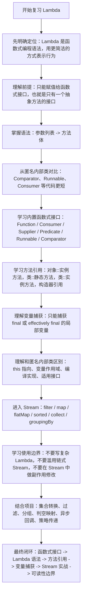
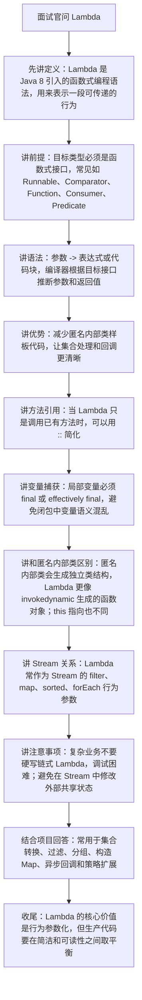

# Lambda 表达式知识总结

## 目录

- [1. 它是什么](#1-它是什么)
- [2. 基本语法](#2-基本语法)
- [3. Lambda 的前提：函数式接口](#3-lambda-的前提函数式接口)
- [4. 常用内置函数式接口](#4-常用内置函数式接口)
  - [4.1 Function](#41-function)
  - [4.2 Consumer](#42-consumer)
  - [4.3 Supplier](#43-supplier)
  - [4.4 Predicate](#44-predicate)
  - [4.5 常见对应关系](#45-常见对应关系)
- [5. 方法引用](#5-方法引用)
  - [5.1 静态方法引用](#51-静态方法引用)
  - [5.2 实例方法引用](#52-实例方法引用)
  - [5.3 对象方法引用](#53-对象方法引用)
  - [5.4 构造方法引用](#54-构造方法引用)
- [6. Lambda 和匿名内部类的区别](#6-lambda-和匿名内部类的区别)
  - [6.1 语法更简洁](#61-语法更简洁)
  - [6.2 this 指向不同](#62-this-指向不同)
  - [6.3 编译实现不同](#63-编译实现不同)
- [7. 变量捕获](#7-变量捕获)
- [8. Lambda 和 Stream](#8-lambda-和-stream)
  - [8.1 遍历](#81-遍历)
  - [8.2 过滤](#82-过滤)
  - [8.3 转换](#83-转换)
  - [8.4 排序](#84-排序)
- [9. 常见使用场景](#9-常见使用场景)
  - [9.1 集合处理](#91-集合处理)
  - [9.2 排序规则](#92-排序规则)
  - [9.3 回调逻辑](#93-回调逻辑)
  - [9.4 条件判断抽象](#94-条件判断抽象)
- [10. 使用注意事项](#10-使用注意事项)
  - [10.1 不要写太复杂的 Lambda](#101-不要写太复杂的-lambda)
  - [10.2 注意副作用](#102-注意副作用)
  - [10.3 注意异常处理](#103-注意异常处理)
  - [10.4 注意可读性](#104-注意可读性)
- [11. 面试常问](#11-面试常问)
  - [11.1 Lambda 表达式是什么？](#111-lambda-表达式是什么)
  - [11.2 什么是函数式接口？](#112-什么是函数式接口)
  - [11.3 Lambda 能不能用于普通接口？](#113-lambda-能不能用于普通接口)
  - [11.4 Lambda 和匿名内部类有什么区别？](#114-lambda-和匿名内部类有什么区别)
  - [11.5 Lambda 为什么只能访问 final 或 effectively final 的局部变量？](#115-lambda-为什么只能访问-final-或-effectively-final-的局部变量)
  - [11.6 方法引用和 Lambda 是什么关系？](#116-方法引用和-lambda-是什么关系)
- [12. 一句话总结](#12-一句话总结)
- [13. 参考来源](#13-参考来源)
- [14. 当前项目使用情况](#14-当前项目使用情况)
  - [14.1 使用分布](#141-使用分布)
  - [14.2 代表代码位置](#142-代表代码位置)
  - [14.3 项目里用到的知识点](#143-项目里用到的知识点)
  - [14.4 复习时结合项目记忆](#144-复习时结合项目记忆)
- [15. 复习与面试讲解流程图](#15-复习与面试讲解流程图)
  - [15.1 复习思路流程图](#151-复习思路流程图)
  - [15.2 面试讲解思路流程图](#152-面试讲解思路流程图)

## 1. 它是什么

`Lambda` 表达式是 Java 8 引入的一种语法，用来把函数行为作为参数传递。

它可以理解为：一种更简洁地实现函数式接口的写法。

匿名内部类写法：

```java
Runnable task = new Runnable() {
    @Override
    public void run() {
        System.out.println("hello");
    }
};
```

Lambda 写法：

```java
Runnable task = () -> System.out.println("hello");
```

Lambda 让 Java 可以更方便地写函数式风格代码，常用于集合遍历、排序、过滤、异步回调、事件处理、Stream 操作等场景。

## 2. 基本语法

Lambda 表达式基本格式：

```java
(参数列表) -> { 方法体 }
```

常见形式：

```java
() -> System.out.println("无参数")

x -> x * 2

(x, y) -> x + y

(String name) -> {
    return "hello " + name;
}
```

简化规则：

- 参数类型可以省略，由编译器推断
- 只有一个参数时，小括号可以省略
- 方法体只有一行时，大括号可以省略
- 方法体只有一行且有返回值时，`return` 可以省略

示例：

```java
Function<Integer, Integer> f1 = (Integer x) -> {
    return x * 2;
};

Function<Integer, Integer> f2 = x -> x * 2;
```

## 3. Lambda 的前提：函数式接口

Lambda 不能脱离类型单独存在。

它必须赋值给一个函数式接口，或者作为函数式接口参数传递。

函数式接口是：只有一个抽象方法的接口。

```java
@FunctionalInterface
public interface Calculator {
    int add(int a, int b);
}
```

使用 Lambda 实现：

```java
Calculator calculator = (a, b) -> a + b;

int result = calculator.add(1, 2);
```

`@FunctionalInterface` 不是必须的，但推荐加上。

它可以让编译器帮你检查这个接口是否真的只有一个抽象方法。

## 4. 常用内置函数式接口

Java 在 `java.util.function` 包中提供了很多常用函数式接口。

### 4.1 Function

有入参，有返回值。

```java
Function<String, Integer> function = s -> s.length();

Integer length = function.apply("java");
```

适合做数据转换。

### 4.2 Consumer

有入参，没有返回值。

```java
Consumer<String> consumer = s -> System.out.println(s);

consumer.accept("hello");
```

适合做消费动作，比如打印、保存、发送消息。

### 4.3 Supplier

没有入参，有返回值。

```java
Supplier<String> supplier = () -> "hello";

String value = supplier.get();
```

适合做对象创建、延迟加载、默认值生成。

### 4.4 Predicate

有入参，返回 boolean。

```java
Predicate<Integer> predicate = x -> x > 10;

boolean result = predicate.test(20);
```

适合做条件判断、过滤。

### 4.5 常见对应关系

```text
Function<T, R>    T -> R
Consumer<T>       T -> void
Supplier<T>       () -> T
Predicate<T>      T -> boolean
BiFunction<T,U,R> (T, U) -> R
```

## 5. 方法引用

方法引用可以看作 Lambda 的进一步简写。

如果 Lambda 只是调用一个已经存在的方法，就可以用方法引用。

### 5.1 静态方法引用

```java
Function<String, Integer> f1 = s -> Integer.parseInt(s);

Function<String, Integer> f2 = Integer::parseInt;
```

### 5.2 实例方法引用

```java
Consumer<String> c1 = s -> System.out.println(s);

Consumer<String> c2 = System.out::println;
```

### 5.3 对象方法引用

```java
Function<String, Integer> f = String::length;
```

等价于：

```java
Function<String, Integer> f = s -> s.length();
```

### 5.4 构造方法引用

```java
Supplier<List<String>> supplier = ArrayList::new;
```

等价于：

```java
Supplier<List<String>> supplier = () -> new ArrayList<>();
```

## 6. Lambda 和匿名内部类的区别

### 6.1 语法更简洁

Lambda 主要用来简化函数式接口的实现。

匿名内部类可以实现普通接口、抽象类，Lambda 只能用于函数式接口。

### 6.2 this 指向不同

匿名内部类中的 `this` 指向匿名内部类对象。

Lambda 中的 `this` 指向外层对象。

```java
public class Demo {
    public void test() {
        Runnable r = () -> {
            System.out.println(this); // 指向 Demo 对象
        };
    }
}
```

### 6.3 编译实现不同

匿名内部类通常会生成额外的内部类。

Lambda 主要通过 `invokedynamic` 和运行时动态生成调用逻辑实现。

面试时知道这个方向即可，一般不要求展开字节码细节。

## 7. 变量捕获

Lambda 可以访问外部局部变量，但这个变量必须是 final 或 effectively final。

`effectively final` 的意思是：虽然没有显式加 `final`，但变量初始化后没有再被修改。

正确示例：

```java
int num = 10;

Function<Integer, Integer> f = x -> x + num;
```

错误示例：

```java
int num = 10;

Function<Integer, Integer> f = x -> x + num;

num = 20; // 编译报错
```

原因是局部变量存放在线程栈中，Lambda 可能在方法结束后才执行。

为了避免变量生命周期和并发修改问题，Java 要求被捕获的局部变量不能再变化。

## 8. Lambda 和 Stream

Lambda 最常见的使用场景之一是 Stream。

### 8.1 遍历

```java
list.forEach(item -> System.out.println(item));
```

方法引用写法：

```java
list.forEach(System.out::println);
```

### 8.2 过滤

```java
List<Integer> result = list.stream()
        .filter(x -> x > 10)
        .collect(Collectors.toList());
```

### 8.3 转换

```java
List<String> names = users.stream()
        .map(user -> user.getName())
        .collect(Collectors.toList());
```

方法引用写法：

```java
List<String> names = users.stream()
        .map(User::getName)
        .collect(Collectors.toList());
```

### 8.4 排序

```java
users.sort((u1, u2) -> u1.getAge() - u2.getAge());
```

更推荐：

```java
users.sort(Comparator.comparing(User::getAge));
```

避免整数相减导致溢出，也更清晰。

## 9. 常见使用场景

### 9.1 集合处理

```java
list.removeIf(x -> x == null);
```

### 9.2 排序规则

```java
users.sort(Comparator.comparing(User::getAge));
```

### 9.3 回调逻辑

```java
public void execute(Runnable task) {
    task.run();
}

execute(() -> System.out.println("执行回调"));
```

### 9.4 条件判断抽象

```java
public List<User> filter(List<User> users, Predicate<User> predicate) {
    return users.stream()
            .filter(predicate)
            .collect(Collectors.toList());
}
```

调用：

```java
filter(users, user -> user.getAge() > 18);
```

## 10. 使用注意事项

### 10.1 不要写太复杂的 Lambda

Lambda 适合表达短小逻辑。

如果逻辑超过几行，建议抽成普通方法，再用方法引用调用。

不推荐：

```java
users.stream()
        .map(user -> {
            // 大量业务逻辑
            // 多层 if else
            // 多个外部调用
            return result;
        });
```

推荐：

```java
users.stream()
        .map(this::convertUser)
        .collect(Collectors.toList());
```

### 10.2 注意副作用

Lambda 中尽量避免修改外部状态。

不推荐：

```java
List<String> result = new ArrayList<>();

users.forEach(user -> result.add(user.getName()));
```

更推荐：

```java
List<String> result = users.stream()
        .map(User::getName)
        .collect(Collectors.toList());
```

### 10.3 注意异常处理

函数式接口的方法签名通常不允许抛出受检异常。

例如：

```java
list.forEach(item -> {
    // 如果这里调用抛受检异常的方法，需要自己处理
});
```

常见处理方式：

- 在 Lambda 内部 try-catch
- 抽成普通方法处理异常
- 自定义支持异常的函数式接口

### 10.4 注意可读性

方法引用虽然简洁，但不是越短越好。

如果方法名不能清楚表达业务含义，普通 Lambda 可能更容易读。

## 11. 面试常问

### 11.1 Lambda 表达式是什么？

Lambda 表达式是 Java 8 引入的语法，用来简洁地实现函数式接口，可以把行为作为参数传递。

它让 Java 支持更方便的函数式编程风格。

### 11.2 什么是函数式接口？

只有一个抽象方法的接口就是函数式接口。

可以使用 `@FunctionalInterface` 标记，让编译器帮助检查。

常见函数式接口有 `Function`、`Consumer`、`Supplier`、`Predicate`、`Runnable`、`Callable`、`Comparator`。

### 11.3 Lambda 能不能用于普通接口？

不能。

Lambda 只能用于函数式接口，也就是只有一个抽象方法的接口。

### 11.4 Lambda 和匿名内部类有什么区别？

Lambda 只能用于函数式接口，写法更简洁。

匿名内部类可以实现普通接口或继承抽象类。

另外，匿名内部类中的 `this` 指向匿名内部类对象，而 Lambda 中的 `this` 指向外层对象。

### 11.5 Lambda 为什么只能访问 final 或 effectively final 的局部变量？

局部变量存放在线程栈中，Lambda 可能延长变量的使用时机。

为了避免生命周期和并发修改问题，Java 要求被 Lambda 捕获的局部变量不能再被修改。

### 11.6 方法引用和 Lambda 是什么关系？

方法引用是 Lambda 的简化写法。

当 Lambda 只是调用一个已有方法时，可以用 `::` 方法引用提升可读性。

例如：

```java
list.forEach(item -> System.out.println(item));

list.forEach(System.out::println);
```

## 12. 一句话总结

Lambda 表达式是 Java 对函数式编程的语法支持，本质上是函数式接口的简洁实现方式；重点掌握语法、函数式接口、方法引用、变量捕获和 Stream 中的常见用法。

## 13. 参考来源

- Oracle Java Tutorial：Lambda Expressions
  - https://docs.oracle.com/javase/tutorial/java/javaOO/lambdaexpressions.html
- Java Language Specification：15.27 Lambda Expressions
  - https://docs.oracle.com/javase/specs/jls/se24/html/jls-15.html#jls-15.27
- Oracle Java API：`java.util.function` 包
  - https://docs.oracle.com/en/java/javase/24/docs/api/java.base/java/util/function/package-summary.html

## 14. 当前项目使用情况

扫描目录：`D:\ai-work-project`。

### 14.1 使用分布

当前项目中 Lambda 和方法引用使用非常广泛，命中文件数量大致如下：

- `ka-order`：约 342 个 Java 文件
- `ka-solution`：约 175 个 Java 文件
- `ka-waybil-router`：约 82 个 Java 文件
- `openapi-adapter`：约 61 个 Java 文件
- `ka-common`、`ka-monitor`：各约 43 个 Java 文件
- 其他项目也有少量使用

这说明 Lambda 已经是当前项目集合处理、异步任务、函数式参数传递的常规写法。

### 14.2 代表代码位置

- `D:\ai-work-project\ka-common\ka-common\src\main\java\com\kyexpress\ka\common\util\PartitionExecutorUtil.java`
  - 使用 `Function<List<T>, ResponseData<List<V>>>` 把业务调用逻辑作为参数传入。
  - 使用 `partitions.stream().map(partition -> ...)` 构建异步任务列表。
  - 使用 `CompletableFuture::join` 方法引用提取异步结果。
  - 使用 `reduce((res1, res2) -> ...)` 合并多个响应结果。

- `D:\ai-work-project\ka-order\ka-order-provider\src\main\java\com\kyexpress\ka\order\provider\util\InvokerUtil.java`
  - 使用 `Supplier<U>` 封装异步执行逻辑。
  - 使用 `Function<V, String>`、`Function<V, U>` 抽象集合转 Map 的 key 和 value 提取逻辑。
  - 使用 `Predicate<OrderInfoItem>` 过滤有效订单项。
  - 使用 `Function.identity()`、`Collectors.toMap`、`Collectors.groupingBy` 等 Stream 常见组合。

- `D:\ai-work-project\ka-solution\ka-solution-provider\src\main\java\com\kyexpress\ka\solution\provider\service\common\ecsign\impl\tencent\TencentRequestHelper.java`
  - 使用 `stream().map(contractInfo -> ...)` 批量构造腾讯电子签请求对象。
  - 使用 `Collectors.toList()` 汇总 DTO。
  - 使用 `Collectors.toMap(..., (v1, v2) -> v2)` 处理重复 key。

- `D:\ai-work-project\openapi-adapter\openapi-adapter-router-core\src\main\java\com\kyexpress\openapi\adapter\router\inside\adapter\DidiAuthInvokerAdapter.java`
  - 使用 `stream().filter(...)`、`sorted(Map.Entry.comparingByKey())`、`map(...)`、`Collectors.joining("&")` 拼接签名字符串。

- `D:\ai-work-project\ka-order\ka-order-provider\src\main\java\com\kyexpress\ka\order\provider\service\common\order\component\address\AddressService.java`
  - 使用 `stream().map(item -> ...)` 批量构建同城校验请求。
  - 使用 `AtomicInteger` 配合 Lambda 生成请求序号。

### 14.3 项目里用到的知识点

- 函数式接口：`Function`、`Predicate`、`Supplier` 在工具类封装中大量出现。
- Stream 转换：`map`、`filter`、`collect` 是最常见用法。
- 方法引用：`CompletableFuture::join`、`Function.identity()`、`ResponseData::isFailure` 等。
- Lambda 作为策略参数：调用方传入 key 提取器、value 提取器、过滤条件、远程调用函数。
- 变量捕获：部分代码用 `AtomicInteger` 在 Lambda 中生成递增序号，这是因为 Lambda 捕获的局部变量必须是 effectively final。

### 14.4 复习时结合项目记忆

项目中的 Lambda 主要服务于四件事：

- 集合转 DTO：批量构造请求对象。
- 集合转 Map：按订单号、运单号、唯一 id 建索引。
- 业务过滤：过滤有效订单、有效配置、有效响应。
- 异步任务构建：把每个分片或远程调用映射成一个 `CompletableFuture`。

复习时不要只背语法，要重点看 `PartitionExecutorUtil` 和 `InvokerUtil`，这两个类体现了 Lambda 在项目中“抽象业务动作”的真实价值。
## 15. 复习与面试讲解流程图

### 15.1 复习思路流程图



### 15.2 面试讲解思路流程图


