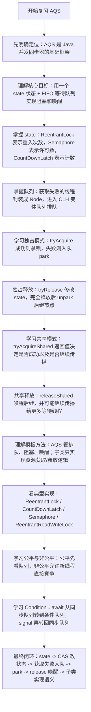
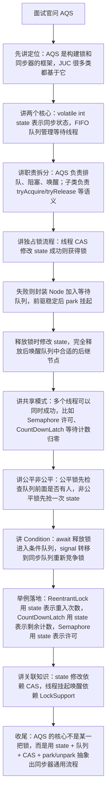

# AQS 知识总结

## 目录

- [1. 它是什么](#1-它是什么)
- [2. AQS 解决什么问题](#2-aqs-解决什么问题)
- [3. 核心结构](#3-核心结构)
  - [3.1 state 同步状态](#31-state-同步状态)
  - [3.2 等待队列](#32-等待队列)
  - [3.3 LockSupport](#33-locksupport)
- [4. 模板方法](#4-模板方法)
- [5. 独占模式](#5-独占模式)
  - [5.1 获取锁流程](#51-获取锁流程)
  - [5.2 释放锁流程](#52-释放锁流程)
- [6. 共享模式](#6-共享模式)
- [7. 公平锁和非公平锁](#7-公平锁和非公平锁)
  - [7.1 非公平锁](#71-非公平锁)
  - [7.2 公平锁](#72-公平锁)
- [8. ReentrantLock 和 AQS 的关系](#8-reentrantlock-和-aqs-的关系)
- [9. CountDownLatch 和 AQS 的关系](#9-countdownlatch-和-aqs-的关系)
- [10. Semaphore 和 AQS 的关系](#10-semaphore-和-aqs-的关系)
- [11. ConditionObject](#11-conditionobject)
- [12. AQS 为什么重要](#12-aqs-为什么重要)
- [13. 面试常问](#13-面试常问)
  - [13.1 AQS 是什么？](#131-aqs-是什么)
  - [13.2 AQS 的核心组成是什么？](#132-aqs-的核心组成是什么)
  - [13.3 AQS 为什么使用双向队列？](#133-aqs-为什么使用双向队列)
  - [13.4 独占模式和共享模式有什么区别？](#134-独占模式和共享模式有什么区别)
  - [13.5 公平锁和非公平锁在 AQS 中如何实现？](#135-公平锁和非公平锁在-aqs-中如何实现)
  - [13.6 ReentrantLock 如何实现可重入？](#136-reentrantlock-如何实现可重入)
  - [13.7 Condition 的 signal 后线程会马上执行吗？](#137-condition-的-signal-后线程会马上执行吗)
- [14. 一句话总结](#14-一句话总结)
- [15. 参考来源](#15-参考来源)
- [16. 当前项目使用情况](#16-当前项目使用情况)
  - [16.1 直接使用情况](#161-直接使用情况)
  - [16.2 间接使用情况](#162-间接使用情况)
  - [16.3 代表代码位置](#163-代表代码位置)
  - [16.4 项目里用到的知识点](#164-项目里用到的知识点)
  - [16.5 复习时结合项目记忆](#165-复习时结合项目记忆)
- [17. 复习与面试讲解流程图](#17-复习与面试讲解流程图)
  - [17.1 复习思路流程图](#171-复习思路流程图)
  - [17.2 面试讲解思路流程图](#172-面试讲解思路流程图)

## 1. 它是什么

`AQS` 全称是 `AbstractQueuedSynchronizer`，位于 `java.util.concurrent.locks` 包下。

它是 JUC 中很多同步器的基础框架，用来实现锁和其他阻塞式同步组件。

常见基于 AQS 实现的组件：

- `ReentrantLock`
- `ReentrantReadWriteLock`
- `Semaphore`
- `CountDownLatch`
- `ThreadPoolExecutor.Worker`

一句话理解：

`AQS` 用一个 `int state` 表示同步状态，用一个 FIFO 等待队列管理抢不到资源的线程，再通过 CAS 和 `LockSupport` 实现线程安全的获取、排队、阻塞和唤醒。

## 2. AQS 解决什么问题

如果自己实现一个锁，需要处理很多细节：

- 如何表示锁是否被占用
- 多线程如何安全修改锁状态
- 抢不到锁的线程放到哪里
- 线程什么时候挂起
- 解锁后唤醒哪个线程
- 如何支持可中断、超时、公平锁、非公平锁
- 如何支持共享锁和独占锁
- 如何支持条件队列

AQS 把这些通用逻辑封装好了。

开发者只需要关心“资源能不能获取”和“资源如何释放”，也就是实现几个模板方法。

## 3. 核心结构

### 3.1 state 同步状态

AQS 内部有一个 `volatile int state`。

不同同步器对 `state` 的含义不同：

- `ReentrantLock`：`state = 0` 表示未加锁，`state > 0` 表示重入次数
- `CountDownLatch`：`state` 表示计数器剩余数量
- `Semaphore`：`state` 表示剩余许可数量
- `ReentrantReadWriteLock`：`state` 同时编码读锁数量和写锁重入次数

AQS 提供了三个核心方法操作状态：

```java
protected final int getState();

protected final void setState(int newState);

protected final boolean compareAndSetState(int expect, int update);
```

其中 `compareAndSetState` 是 CAS 操作，用来保证并发修改 `state` 的原子性。

### 3.2 等待队列

AQS 内部维护一个变体 CLH 队列，本质上是一个 FIFO 双向队列。

抢不到资源的线程会被包装成节点放入队列。

可以简化理解为：

```text
head <-> node1 <-> node2 <-> node3 <-> tail
```

节点中通常会保存：

- 当前线程
- 前驱节点
- 后继节点
- 等待状态
- 独占或共享模式

不同 JDK 版本里节点字段名称有所调整，但整体思想一致：用队列维护等待线程。

### 3.3 LockSupport

AQS 使用 `LockSupport.park()` 挂起线程，使用 `LockSupport.unpark(thread)` 唤醒线程。

线程抢不到资源后，不会一直空转占用 CPU，而是进入等待队列并被挂起。

释放资源时，再唤醒队列中合适的后继节点。

## 4. 模板方法

AQS 本身不关心具体业务语义，它只提供排队、阻塞、唤醒框架。

具体同步器需要重写以下方法：

```java
protected boolean tryAcquire(int arg);

protected boolean tryRelease(int arg);

protected int tryAcquireShared(int arg);

protected boolean tryReleaseShared(int arg);

protected boolean isHeldExclusively();
```

这些方法默认会抛出 `UnsupportedOperationException`。

常见对应关系：

- 独占锁：实现 `tryAcquire`、`tryRelease`
- 共享锁：实现 `tryAcquireShared`、`tryReleaseShared`
- 条件队列：实现 `isHeldExclusively`

## 5. 独占模式

独占模式表示同一时刻只能有一个线程获取同步状态。

典型例子：

- `ReentrantLock`
- `ReentrantReadWriteLock` 的写锁

### 5.1 获取锁流程

以 `acquire` 为例，简化流程如下：

```text
1. 调用 tryAcquire 尝试获取资源
2. 如果成功，直接返回
3. 如果失败，把当前线程加入等待队列
4. 当前线程在队列中等待，并在合适时机 park
5. 前驱节点释放资源后，唤醒当前线程
6. 当前线程再次尝试 tryAcquire
7. 成功后成为新的 head 节点
```

伪代码理解：

```java
while (!tryAcquire(arg)) {
    enqueueIfNeeded(currentThread);
    parkIfNeeded();
}
```

### 5.2 释放锁流程

以 `release` 为例：

```text
1. 调用 tryRelease 尝试释放资源
2. 如果资源完全释放成功
3. 唤醒等待队列中的后继节点
```

伪代码理解：

```java
if (tryRelease(arg)) {
    unparkSuccessor(head);
}
```

## 6. 共享模式

共享模式表示多个线程可以同时获取同步状态。

典型例子：

- `Semaphore`
- `CountDownLatch`
- `ReentrantReadWriteLock` 的读锁

共享模式的核心方法是：

```java
protected int tryAcquireShared(int arg);
```

返回值含义：

- 小于 0：获取失败，需要排队
- 等于 0：获取成功，但后续共享获取不能继续传播
- 大于 0：获取成功，并且后续共享获取可以继续传播

共享释放使用：

```java
protected boolean tryReleaseShared(int arg);
```

如果释放后允许其他线程继续获取资源，就会唤醒后续节点，并可能继续传播唤醒。

## 7. 公平锁和非公平锁

AQS 内部使用 FIFO 队列，但它不强制所有同步器都必须公平。

公平与否主要由子类的 `tryAcquire` 决定。

### 7.1 非公平锁

新线程来获取锁时，可以先直接 CAS 抢锁。

如果抢到了，即使队列里已经有线程在等，它也可以先执行。

优点：

- 吞吐量通常更高
- 减少线程频繁挂起和唤醒

缺点：

- 等待线程可能长期抢不到锁

### 7.2 公平锁

新线程获取锁前，会先判断队列中是否已经有前驱节点。

如果前面有人排队，就不能插队。

常见判断方法：

```java
hasQueuedPredecessors()
```

优点：

- 更符合先来先服务
- 等待时间更可控

缺点：

- 吞吐量通常低于非公平锁

## 8. ReentrantLock 和 AQS 的关系

`ReentrantLock` 内部通过 AQS 实现锁语义。

它有一个内部同步器 `Sync` 继承 AQS。

简化理解：

```java
abstract static class Sync extends AbstractQueuedSynchronizer {
}
```

非公平锁获取逻辑大致是：

```text
1. 如果 state == 0，CAS 把 state 从 0 改为 1
2. 成功后设置当前线程为锁持有者
3. 如果当前线程已经持有锁，state + 1，表示重入
4. 否则获取失败，进入 AQS 队列
```

释放逻辑大致是：

```text
1. 判断当前线程是否是锁持有者
2. state 减去释放次数
3. 如果 state 变为 0，说明完全释放锁
4. 清空锁持有者
5. 唤醒等待队列中的后继线程
```

所以 `ReentrantLock` 的可重入，本质上就是通过 `state` 记录重入次数。

## 9. CountDownLatch 和 AQS 的关系

`CountDownLatch` 使用 AQS 的共享模式。

初始化时：

```text
state = count
```

调用 `await()`：

```text
如果 state == 0，直接通过
如果 state > 0，进入等待队列
```

调用 `countDown()`：

```text
CAS 将 state 减 1
如果 state 变为 0，唤醒所有等待线程
```

所以 `CountDownLatch` 的本质是：用 AQS 的 `state` 表示计数器，用共享模式实现多个线程等待同一个计数归零事件。

## 10. Semaphore 和 AQS 的关系

`Semaphore` 也使用 AQS 的共享模式。

初始化时：

```text
state = permits
```

调用 `acquire()`：

```text
尝试 CAS 减少许可数量
如果剩余许可足够，获取成功
如果许可不足，进入等待队列
```

调用 `release()`：

```text
CAS 增加许可数量
然后唤醒等待队列中的线程
```

所以 `Semaphore` 的本质是：用 AQS 的 `state` 表示许可证数量。

## 11. ConditionObject

AQS 内部还提供了 `ConditionObject`，用于实现类似 `Object.wait()`、`Object.notify()` 的等待通知机制。

`ConditionObject` 维护的是条件队列，不是 AQS 的同步队列。

调用 `await()` 时：

```text
1. 当前线程必须已经持有独占锁
2. 当前线程加入条件队列
3. 释放当前持有的锁
4. 挂起当前线程
```

调用 `signal()` 时：

```text
1. 从条件队列中转移一个节点到 AQS 同步队列
2. 被转移的线程后续重新竞争锁
```

重点：`signal()` 不是让线程立刻继续执行，而是把线程从条件队列转移到同步队列，之后还要重新竞争锁。

## 12. AQS 为什么重要

AQS 是 JUC 并发包的基础设施。

理解 AQS 后，很多并发工具就能串起来：

- `ReentrantLock`：独占锁，`state` 表示重入次数
- `Semaphore`：共享锁，`state` 表示许可数量
- `CountDownLatch`：共享锁，`state` 表示计数器
- `ReentrantReadWriteLock`：读共享、写独占，`state` 同时编码读写状态

面试中问 AQS，通常不是让你背源码细节，而是看你是否理解：

- 状态如何表示
- 抢不到锁如何排队
- 线程如何阻塞和唤醒
- 独占和共享有什么区别
- 公平和非公平在哪里体现
- 常见 JUC 工具如何基于 AQS 实现

## 13. 面试常问

### 13.1 AQS 是什么？

AQS 是一个同步器框架，使用一个原子 `int state` 表示同步状态，使用 FIFO 等待队列管理竞争失败的线程，通过 CAS 修改状态，通过 `LockSupport` 挂起和唤醒线程。

它是 `ReentrantLock`、`Semaphore`、`CountDownLatch` 等并发工具的基础。

### 13.2 AQS 的核心组成是什么？

核心组成包括：

- `state`：同步状态
- FIFO 等待队列：保存获取资源失败的线程
- CAS：保证状态修改的原子性
- `LockSupport`：负责线程阻塞和唤醒
- 模板方法：由子类定义获取和释放资源的语义

### 13.3 AQS 为什么使用双向队列？

等待线程需要知道自己的前驱节点，判断自己是否有资格竞争资源。

释放资源时也需要找到后继节点进行唤醒。

双向队列可以更方便地处理排队、唤醒和取消节点。

### 13.4 独占模式和共享模式有什么区别？

独占模式同一时刻只允许一个线程获取资源，例如 `ReentrantLock`。

共享模式允许多个线程同时获取资源，例如 `Semaphore`、`CountDownLatch`、读锁。

### 13.5 公平锁和非公平锁在 AQS 中如何实现？

区别主要在子类的 `tryAcquire`。

公平锁获取资源前会检查队列中是否已有前驱节点，常用 `hasQueuedPredecessors()`。

非公平锁会先尝试直接 CAS 抢锁，抢不到再入队。

### 13.6 ReentrantLock 如何实现可重入？

`ReentrantLock` 使用 AQS 的 `state` 表示重入次数。

第一次获取锁时，CAS 将 `state` 从 0 改为 1，并记录锁持有线程。

同一线程再次获取锁时，`state + 1`。

释放锁时，`state - 1`，直到 `state` 变为 0，才真正释放锁并唤醒后继线程。

### 13.7 Condition 的 signal 后线程会马上执行吗？

不会。

`signal()` 只是把等待线程从条件队列转移到 AQS 同步队列。

线程还需要重新竞争锁，成功获取锁后才能继续执行。

## 14. 一句话总结

AQS 是 JUC 同步器的底层框架：用 `state` 表示资源状态，用 FIFO 队列保存等待线程，用 CAS 保证并发安全，用 `LockSupport` 完成阻塞和唤醒，子类只需要定义具体的获取和释放规则。

## 15. 参考来源

- Oracle Java API：`AbstractQueuedSynchronizer` 官方文档
  - https://docs.oracle.com/en/java/javase/26/docs/api/java.base/java/util/concurrent/locks/AbstractQueuedSynchronizer.html
- OpenJDK 源码：`AbstractQueuedSynchronizer` 实现
  - https://github.com/openjdk/jdk/blob/master/src/java.base/share/classes/java/util/concurrent/locks/AbstractQueuedSynchronizer.java
- Oracle Java API：Java 8 `AbstractQueuedSynchronizer` 文档
  - https://docs.oracle.com/javase/jp/8/docs/api/java/util/concurrent/locks/AbstractQueuedSynchronizer.html

## 16. 当前项目使用情况

扫描目录：`D:\ai-work-project`。

### 16.1 直接使用情况

当前扫描没有发现项目中直接使用以下 AQS 显式类型：

- `AbstractQueuedSynchronizer`
- `ReentrantLock`
- `ReentrantReadWriteLock`
- `CountDownLatch`
- `Semaphore`
- `LockSupport`

也就是说，当前项目业务代码里暂时没有自己基于 AQS 写同步器，也没有大量直接使用显式锁。

### 16.2 间接使用情况

虽然没有直接使用 AQS，但项目中大量使用了 JUC 上层组件，这些组件背后会涉及 AQS 或类似的并发基础设施：

- `ThreadPoolTaskExecutor` / `ThreadPoolExecutor`
  - 项目中大量线程池配置最终依赖 JDK 并发包的线程调度、阻塞队列和原子状态控制。

- `CompletableFuture`
  - 项目中订单、运单、报价等链路大量使用异步任务编排。

- `AtomicInteger` / `AtomicLong`
  - 项目中使用原子类做批次计数、流水号、序号生成。

### 16.3 代表代码位置

- `D:\ai-work-project\ka-common\ka-common\src\main\java\com\kyexpress\ka\common\util\PartitionExecutorUtil.java`
  - 使用 `CompletableFuture`、`Executor`、`AtomicInteger` 做分片并发执行。
  - 这是项目中最典型的 JUC 上层组合使用点。

- `D:\ai-work-project\ka-common\ka-common\src\main\java\com\kyexpress\ka\common\config\BusinessCommonConfiguration.java`
  - 配置 `ThreadPoolTaskExecutor` 作为公共分片调用线程池。

- `D:\ai-work-project\ka-order\ka-order-provider\src\main\java\com\kyexpress\ka\order\provider\config\OrderConfiguration.java`
  - 配置多个业务隔离线程池，例如康展、华羿、PDD 分单、缓存发送等。

- `D:\ai-work-project\ka-solution\ka-solution-provider\src\main\java\com\kyexpress\ka\solution\provider\config\SolutionConfiguration.java`
  - 配置电子签、回单查询、批量取消、批量更新、文件导入等线程池。

### 16.4 项目里用到的知识点

- 当前项目不是直接操作 AQS，而是通过线程池、异步任务、原子类使用 JUC 能力。
- 复习 AQS 时，可以把它理解为学习 `ReentrantLock`、`Semaphore`、`CountDownLatch` 的底层准备。
- 在当前项目里，AQS 更偏“底层原理知识”，线程池、`CompletableFuture`、`AtomicInteger` 才是直接业务落点。

### 16.5 复习时结合项目记忆

如果面试问“项目里哪里用到了 AQS”，更稳妥的回答是：

当前业务代码没有直接继承或使用 `AbstractQueuedSynchronizer`，也没有直接使用 `ReentrantLock`、`Semaphore`、`CountDownLatch`。但项目大量使用 JUC 上层并发组件，例如线程池、`CompletableFuture`、原子类。AQS 是理解这些并发工具底层设计的重要基础，但不是当前项目中的直接业务 API。
## 17. 复习与面试讲解流程图

### 17.1 复习思路流程图



### 17.2 面试讲解思路流程图


