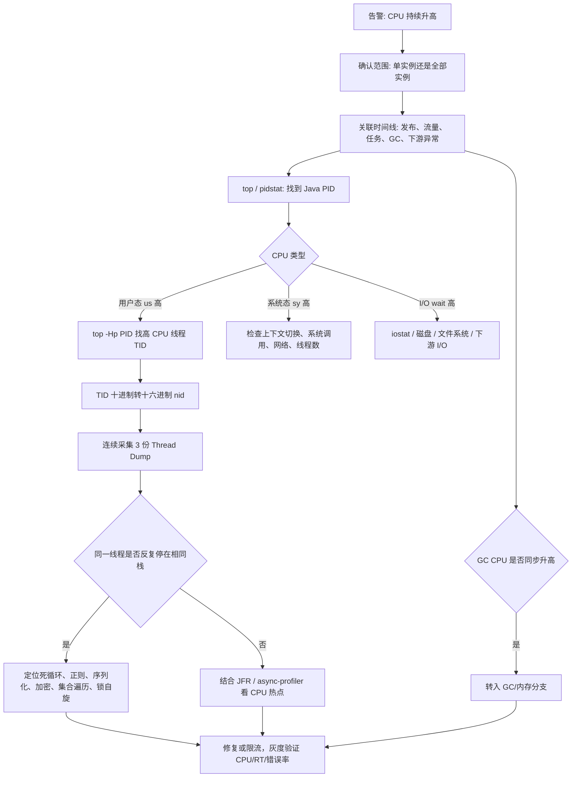
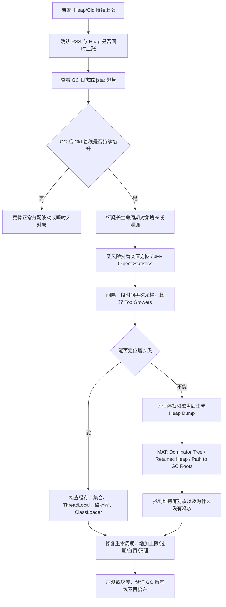
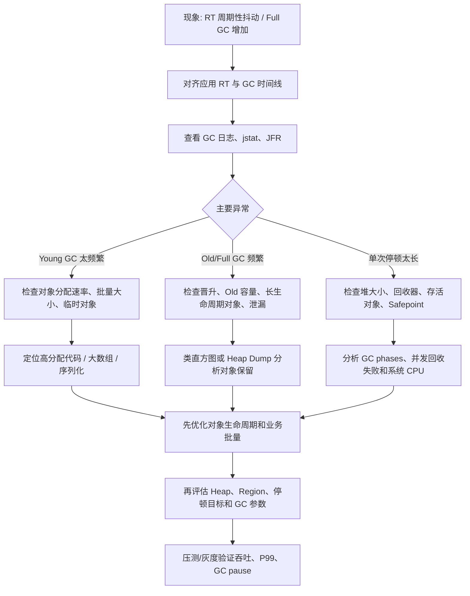
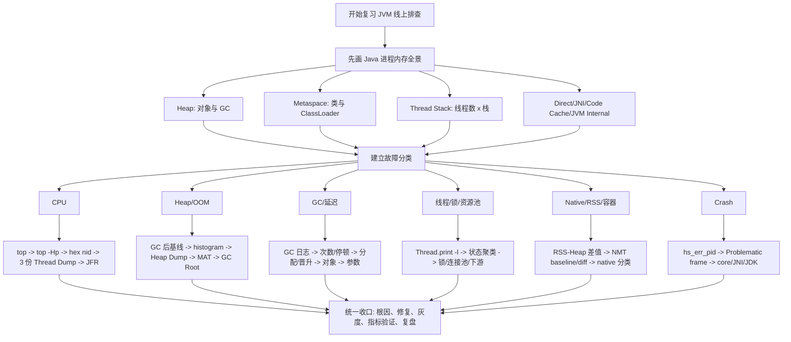
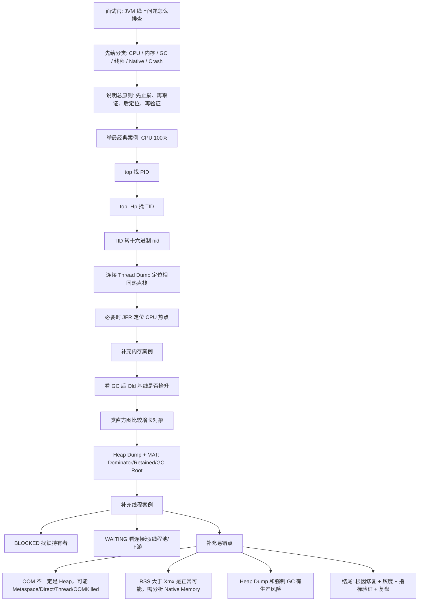

# JVM 线上问题排查思路

## 目录

- [1. 核心结论](#1-核心结论)
- [2. 先建立 JVM 运行时全景](#2-先建立-jvm-运行时全景)
- [3. 常见线上问题总表](#3-常见线上问题总表)
- [4. 排查总原则：先止损，再取证](#4-排查总原则先止损再取证)
  - [4.1 第一步不是立刻重启](#41-第一步不是立刻重启)
  - [4.2 不要用单个瞬时值下结论](#42-不要用单个瞬时值下结论)
- [5. 常用工具与风险等级](#5-常用工具与风险等级)
  - [5.1 操作系统工具](#51-操作系统工具)
  - [5.2 JDK 诊断工具](#52-jdk-诊断工具)
  - [5.3 命令影响等级](#53-命令影响等级)
- [6. CPU 飙高排查](#6-cpu-飙高排查)
  - [6.1 完整排查链](#61-完整排查链)
  - [6.2 经典命令链](#62-经典命令链)
  - [6.3 为什么要连续采集多份 Thread Dump](#63-为什么要连续采集多份-thread-dump)
  - [6.4 CPU 高的常见根因](#64-cpu-高的常见根因)
- [7. Heap 持续上涨与内存泄漏排查](#7-heap-持续上涨与内存泄漏排查)
  - [7.1 先区分“正常锯齿”与“基线抬升”](#71-先区分正常锯齿与基线抬升)
  - [7.2 完整排查链](#72-完整排查链)
  - [7.3 常用命令](#73-常用命令)
  - [7.4 MAT 中最重要的概念](#74-mat-中最重要的概念)
  - [7.5 常见泄漏来源](#75-常见泄漏来源)
- [8. OOM 分类排查](#8-oom-分类排查)
  - [8.1 `Java heap space`](#81-java-heap-space)
  - [8.2 `GC overhead limit exceeded`](#82-gc-overhead-limit-exceeded)
  - [8.3 `Metaspace` / `Compressed class space`](#83-metaspace-compressed-class-space)
  - [8.4 `Direct buffer memory`](#84-direct-buffer-memory)
  - [8.5 `unable to create new native thread`](#85-unable-to-create-new-native-thread)
  - [8.6 容器 `OOMKilled`](#86-容器-oomkilled)
- [9. Full GC 频繁与 GC 停顿过长](#9-full-gc-频繁与-gc-停顿过长)
  - [9.1 先分清两个问题](#91-先分清两个问题)
  - [9.2 完整排查链](#92-完整排查链)
  - [9.3 为什么不能一上来就调 GC 参数](#93-为什么不能一上来就调-gc-参数)
  - [9.4 GC 日志配置思路](#94-gc-日志配置思路)
- [10. 线程卡顿、死锁与资源池耗尽](#10-线程卡顿死锁与资源池耗尽)
  - [10.1 线程状态不能机械判断](#101-线程状态不能机械判断)
  - [10.2 死锁](#102-死锁)
  - [10.3 大量 BLOCKED](#103-大量-blocked)
  - [10.4 连接池或线程池耗尽](#104-连接池或线程池耗尽)
- [11. Native Memory 与 RSS 异常](#11-native-memory-与-rss-异常)
  - [11.1 典型现象](#111-典型现象)
  - [11.2 NMT 使用流程](#112-nmt-使用流程)
  - [11.3 如果没有提前开启 NMT](#113-如果没有提前开启-nmt)
- [12. JVM Crash 排查](#12-jvm-crash-排查)
- [13. 一套可执行的线上诊断清单](#13-一套可执行的线上诊断清单)
  - [13.1 接到告警后](#131-接到告警后)
  - [13.2 低风险现场信息](#132-低风险现场信息)
  - [13.3 高影响操作前](#133-高影响操作前)
  - [13.4 修复后验证](#134-修复后验证)
- [14. 复习的思路](#14-复习的思路)
  - [14.1 第一层：先背一个总框架](#141-第一层先背一个总框架)
  - [14.2 详细复习流程图](#142-详细复习流程图)
  - [14.3 第二层：每个分支都用五问复习](#143-第二层每个分支都用五问复习)
  - [14.4 第三层：对照记忆工具](#144-第三层对照记忆工具)
  - [14.5 最后复习生产风险](#145-最后复习生产风险)
- [15. 面试讲解思路](#15-面试讲解思路)
  - [15.1 推荐开场](#151-推荐开场)
  - [15.2 完整面试讲解流程图](#152-完整面试讲解流程图)
  - [15.3 CPU 高案例的标准讲法](#153-cpu-高案例的标准讲法)
  - [15.4 内存泄漏案例的标准讲法](#154-内存泄漏案例的标准讲法)
  - [15.5 线程卡顿案例的标准讲法](#155-线程卡顿案例的标准讲法)
  - [15.6 追问：为什么不能只看 `-Xmx`](#156-追问为什么不能只看-xmx)
  - [15.7 追问：内存泄漏和 OOM 的区别](#157-追问内存泄漏和-oom-的区别)
  - [15.8 追问：为什么要三份 Thread Dump](#158-追问为什么要三份-thread-dump)
  - [15.9 面试结尾](#159-面试结尾)
- [16. 五套必须熟练的组合链](#16-五套必须熟练的组合链)
- [17. 一句话总结](#17-一句话总结)
- [18. 参考资料](#18-参考资料)

## 1. 核心结论

JVM 线上问题不能只靠背命令。真正稳定的排查方式是：

```text
确认影响范围
  -> 先止损
  -> 保存现场证据
  -> 判断是系统资源、JVM 还是外部依赖
  -> 按 CPU / 内存 / GC / 线程 / Native Memory 分支定位
  -> 找到代码或配置根因
  -> 小范围验证
  -> 发布、观察、复盘
```

可以先记住一句总纲：

> CPU 问题追到线程栈；堆内存问题追到对象和 GC Root；线程问题追到状态和等待资源；进程内存与堆对不上时追 Native Memory；所有结论都要用时间线和多份证据互相验证。

排查时最重要的不是“命令越多越专业”，而是回答下面五个问题：

```text
1. 什么时候开始异常？
2. 影响哪些实例、接口和用户？
3. 哪个资源先异常：CPU、内存、GC、线程、磁盘、网络还是下游？
4. 异常指标对应到哪个线程、对象、锁、连接池或代码位置？
5. 修复后，原来的异常指标是否真正恢复？
```

---

## 2. 先建立 JVM 运行时全景

一个 Java 进程占用的内存不只有 `-Xmx` 指定的 Java Heap：

```text
Java Process RSS
|
+-- Java Heap
|   +-- Young Generation / G1 Young Regions
|   +-- Old Generation / G1 Old Regions
|   `-- Java 对象、数组、缓存、集合
|
+-- Metaspace / Compressed Class Space
|   `-- 类元数据、动态代理类、ClassLoader 关联数据
|
+-- Thread Stack
|   `-- 线程数 x 每线程栈大小（受 -Xss 等影响）
|
+-- Direct / Native Buffer
|   `-- NIO、Netty、DirectByteBuffer、MappedByteBuffer
|
+-- Code Cache
|   `-- JIT 编译后的机器码
|
+-- GC / JVM Internal
|   `-- GC 数据结构、符号表、编译器、JVM 内部内存
|
`-- JNI / 第三方 native 库 / mmap
```

因此：

```text
-Xmx = 4G
```

不等于：

```text
Java 进程最多只使用 4G
```

线上必须同时观察：

| 层次 | 重点指标 | 主要回答什么 |
|---|---|---|
| 容器/主机 | CPU、RSS、内存限制、Load、I/O、网络 | 机器或容器是否已经到资源上限 |
| Java 进程 | PID、线程数、打开文件数、RSS | 是不是 Java 进程导致资源异常 |
| JVM | Heap、Old、GC 次数与停顿、类数量 | JVM 内部哪个区域或机制异常 |
| 应用 | RT、QPS、错误率、线程池、连接池 | 哪条业务链路受到影响 |
| 外部依赖 | DB、Redis、MQ、RPC、磁盘 | 是否是下游变慢导致线程堆积 |

---

## 3. 常见线上问题总表

| 问题 | 典型表现 | 关键证据 | 常见根因 |
|---|---|---|---|
| CPU 飙高 | CPU 长时间 90% 以上、RT 上升 | `top -Hp`、连续线程转储、JFR | 死循环、热点计算、正则、序列化、锁自旋、GC |
| Load 高但 CPU 不高 | 服务慢、I/O wait 高 | `vmstat`、`iostat`、线程栈 | 磁盘慢、网络阻塞、下游超时、大量 D 状态进程 |
| Heap 持续上涨 | Old 使用率不断抬高 | GC 日志、类直方图、Heap Dump | 缓存无上限、集合未清理、监听器未注销、ClassLoader 泄漏 |
| Heap 突然打满 | 短时间 OOM | 分配速率、Heap Dump、业务日志 | 大查询、大文件、批量过大、瞬时大对象 |
| Full GC 频繁 | RT 周期性抖动、吞吐下降 | GC 日志、`jstat`、JFR | 晋升过快、老年代不足、内存泄漏、Humongous 对象 |
| GC 停顿过长 | 请求周期性暂停 | GC pause、Safepoint、JFR | 堆过大、回收器不适配、对象存活率高、并发回收失败 |
| 死锁 | 请求永久卡住 | `Thread.print -l`、deadlock 信息 | 加锁顺序不一致、锁升级、嵌套锁 |
| 大量 BLOCKED | 吞吐骤降 | 多份线程转储、同一 monitor | 大锁包住 DB/RPC、锁粒度过粗 |
| 大量 WAITING | 请求堆积但 CPU 不高 | 线程栈、线程池/连接池指标 | 连接池耗尽、队列等待、下游长期不返回 |
| 线程数暴涨 | native thread OOM、RSS 上升 | `ps -eLf`、线程转储 | 无界线程池、反复建池、线程泄漏 |
| Metaspace OOM | 类加载数上涨、热部署后异常 | `VM.classloader_stats`、Heap Dump | 动态生成类、ClassLoader 无法卸载 |
| Direct Memory OOM | Heap 正常但进程 RSS 很高 | NMT、进程内存、Netty 指标 | DirectByteBuffer 泄漏、native 缓冲未释放 |
| 容器 OOMKilled | Java 日志可能没有 OOM | 容器事件、内核日志、内存 limit | Heap + Native 超过容器限制、突发内存、系统杀进程 |
| JVM Crash | 进程突然退出、产生 `hs_err_pid` | fatal error log、core dump | JVM/JNI/native 库、硬件、JDK 缺陷 |

---

## 4. 排查总原则：先止损，再取证

### 4.1 第一步不是立刻重启

接到告警后先判断：

```text
是否还在扩大影响？
  |
  +-- 是
  |   -> 限流 / 熔断 / 摘除异常实例 / 扩容 / 降级
  |   -> 在可承受时间内快速保存关键证据
  |   `-> 必要时重启恢复服务
  |
  `-- 否
      -> 保持现场
      -> 分层收集指标和诊断数据
      `-> 逐步定位
```

重启可以恢复服务，但会丢失：

- 高 CPU 线程现场；
- 死锁和锁竞争关系；
- Heap 中的泄漏对象；
- 线程池、连接池等待状态；
- JVM Crash 前的上下文。

所以常见的折中做法是：

```text
摘流量
  -> 采集 3 份线程转储（间隔数秒）
  -> 保存 GC 日志、应用日志、监控截图
  -> 视磁盘和停顿风险决定是否 Heap Dump / JFR dump
  -> 再重启或替换实例
```

### 4.2 不要用单个瞬时值下结论

例如：

- 一次 Old 90% 不等于内存泄漏；
- 大量 `WAITING` 可能只是正常的空闲线程池；
- CPU 高可能是应用代码，也可能是 GC 或内核态开销；
- RSS 高于 Heap 很正常，关键是 Heap、线程、Direct Memory 等各占多少；
- 一份线程转储只能说明一个瞬间，连续多份相同栈才更能说明问题。

判断应该基于：

```text
趋势 + 时间线 + 多份快照 + 业务现象 + 发布变更
```

---

## 5. 常用工具与风险等级

### 5.1 操作系统工具

| 命令 | 用途 | 关注点 |
|---|---|---|
| `top` | 查看进程 CPU、内存、Load | Java PID、`us`、`sy`、`wa` |
| `top -Hp <pid>` | 查看进程内各线程 CPU | 找到高 CPU 的 LWP/TID |
| `pidstat -p <pid> 1` | 持续采样进程 CPU、上下文切换 | 用户态、内核态、切换频率 |
| `vmstat 1` | CPU、运行队列、内存、I/O 概览 | `r`、`si/so`、`us/sy/wa` |
| `free -h` | 主机内存概览 | available、swap，不只看 free |
| `ps -eLf` | 查看线程数量 | LWP 数、线程暴涨 |
| `iostat -x 1` | 磁盘延迟和利用率 | await、util、队列长度 |
| `ss -antp` | 网络连接状态 | ESTABLISHED、TIME_WAIT、连接积压 |
| `dmesg` / `journalctl` | 内核和系统事件 | OOM killer、磁盘、网络异常 |

容器环境还要看：

```bash
kubectl top pod <pod-name>
kubectl describe pod <pod-name>
kubectl logs <pod-name> --previous
```

重点确认：

```text
container memory limit
当前 working set / RSS
restartCount
Last State = OOMKilled ?
```

### 5.2 JDK 诊断工具

现代 HotSpot 更推荐把 `jcmd` 作为综合诊断入口：

```bash
jcmd -l
jcmd <pid> VM.version
jcmd <pid> VM.command_line
jcmd <pid> VM.flags
jcmd <pid> VM.uptime
jcmd <pid> GC.heap_info
jcmd <pid> Thread.print -l
jcmd <pid> GC.class_histogram
jcmd <pid> GC.heap_dump /safe/path/heap.hprof
```

不同 JDK 和 JVM 支持的命令可能不同，先查询：

```bash
jcmd <pid> help
jcmd <pid> help Thread.print
jcmd <pid> help GC.heap_dump
```

`jcmd` 通常需要与目标 JVM 位于同一台机器，并使用与目标进程相同的有效用户；JDK 工具版本也应尽量与目标 JVM 匹配。容器存在独立 PID 命名空间时，宿主机上的 `jcmd -l` 可能看不到目标进程，需要进入对应容器或使用经过授权的诊断容器执行。

常见工具定位：

| 工具 | 主要用途 | 备注 |
|---|---|---|
| `jcmd` | 综合诊断、线程、堆、NMT、JFR | 当前首选入口 |
| `jstat` | 按间隔观察 GC、容量和类加载统计 | 输出格式可能随版本变化，不宜硬编码解析 |
| `jstack` | 线程转储 | 老版本常用，可优先改用 `jcmd Thread.print` |
| `jmap` | 堆直方图、Heap Dump | 老版本常用，可优先改用 `jcmd` |
| JFR/JMC | 低开销持续观测 CPU、分配、锁、I/O、GC | 适合“偶发、无法现场复现”的问题 |
| MAT | 离线分析 Heap Dump | 看 Dominator Tree、Retained Heap、GC Roots |

### 5.3 命令影响等级

| 操作 | 一般影响 | 使用建议 |
|---|---|---|
| `VM.flags`、`VM.uptime`、`GC.heap_info` | 低 | 可优先执行 |
| `Thread.print` | 中低到中 | 线程很多时输出和停顿会增加，建议采集多份但控制频率 |
| `GC.class_histogram` | 中 | 对象多时成本上升；先确认命令帮助和影响说明 |
| `GC.heap_dump` | 高 | 可能触发明显停顿并产生超大文件，先检查磁盘和实例余量 |
| `jmap -histo:live` | 高 | `live` 语义可能触发 Full GC，不要在线上随意执行 |
| 强制 `GC.run` / `System.gc()` | 高 | 会影响延迟，不能拿来当常规排查动作 |
| NMT detail | 有持续开销 | 必须在 JVM 启动时开启，按需要选择 summary/detail |

Heap Dump 往往包含业务数据、Token、手机号、地址等敏感信息，必须按生产数据管理要求存储、传输和销毁。

---

## 6. CPU 飙高排查

### 6.1 完整排查链



### 6.2 经典命令链

```bash
top
top -Hp <java-pid>
printf '%x\n' <thread-id>
jcmd <java-pid> Thread.print -l
```

在线程转储里搜索：

```text
nid=0x<hex-thread-id>
```

例如：

```text
线程十进制 ID = 12567
printf '%x\n' 12567
结果 = 3117
在线程转储中搜索 nid=0x3117
```

### 6.3 为什么要连续采集多份 Thread Dump

```text
第 1 份: 线程在 JsonSerializer.serialize()
第 2 份: 线程仍在 JsonSerializer.serialize()
第 3 份: 线程仍在同一循环位置
```

这种证据比单份快照可靠。若三份栈不断变化，则线程可能只是正常执行中的瞬时热点，需要采样 profiler 或 JFR 统计总体热点。

### 6.4 CPU 高的常见根因

- `while(true)`、递归终止条件错误；
- 正则灾难性回溯；
- 大 JSON/XML 序列化、反序列化；
- 大集合排序、嵌套循环；
- 加密、压缩、图片或文件处理；
- CAS 失败重试或锁自旋；
- 日志格式化或异常堆栈高频输出；
- GC 线程消耗大量 CPU；
- 流量突增，程序没有缺陷但容量不足。

---

## 7. Heap 持续上涨与内存泄漏排查

### 7.1 先区分“正常锯齿”与“基线抬升”

正常堆使用通常呈锯齿状：

```text
分配对象 -> Heap 上升 -> GC -> Heap 下降 -> 再上升
```

真正可疑的是：

```text
每次 GC 后最低点都比上一次更高
  -> Old 区基线持续抬升
  -> 长时间无法回落
  -> 最终接近上限
```

这可能是泄漏，也可能是缓存正在预热或业务数据自然增长，所以还要结合业务容量和对象来源判断。

### 7.2 完整排查链



### 7.3 常用命令

观察趋势：

```bash
jstat -gcutil -t <pid> 1000 60
jcmd <pid> GC.heap_info
```

`jstat -gcutil` 中的代际字段更适合辅助观察传统分代回收器和 G1 的趋势。若应用使用 ZGC、Shenandoah 等回收器，不要机械套用 `Old/FGC` 判断，应以该回收器的 GC 日志、JFR 事件和官方指标语义为准。

类直方图：

```bash
jcmd <pid> GC.class_histogram
```

生成 Heap Dump：

```bash
jcmd <pid> GC.heap_dump /data/dump/heap-<pid>.hprof
```

启动参数预防性配置：

```bash
-XX:+HeapDumpOnOutOfMemoryError
-XX:HeapDumpPath=/data/dump
```

### 7.4 MAT 中最重要的概念

| 概念 | 含义 | 怎么用 |
|---|---|---|
| Shallow Heap | 对象自身占用 | 只能说明对象本体大小 |
| Retained Heap | 如果对象被回收，连带可释放的总内存 | 更适合找真正的大持有者 |
| Dominator Tree | 哪些对象支配并保留大量对象 | 先看 Retained Heap 最大节点 |
| Path to GC Roots | 对象为什么仍然可达 | 找 `static`、线程、ClassLoader、JNI 等持有链 |
| Leak Suspects | MAT 的泄漏候选分析 | 是线索，不是自动给出的最终结论 |

典型持有链：

```text
GC Root
  -> static ConcurrentHashMap
  -> cache entries
  -> User / Order / byte[]
```

真正需要修复的是：

```text
谁把对象放进去
  +
为什么没有淘汰、清理或解除引用
```

### 7.5 常见泄漏来源

- 无上限的本地缓存、Map、List；
- `ThreadLocal` 使用后未 `remove()`，且线程池线程长期存活；
- 监听器、回调、观察者只注册不注销；
- 定时任务、线程池、ClassLoader 重复创建；
- HTTP 响应、文件、流一次性读入巨大 `byte[]`；
- 大分页或全表加载；
- 动态代理、脚本、热部署造成 ClassLoader 泄漏；
- Netty ByteBuf、DirectByteBuffer 未正确释放。

---

## 8. OOM 分类排查

看到 `OutOfMemoryError` 时，不能只说“堆不够”，必须先看完整错误信息。

### 8.1 `Java heap space`

可能原因：

```text
内存泄漏
  或
瞬时数据量超过 Heap
  或
Heap 配置与业务容量不匹配
```

判断方法：

- GC 后 Old 基线持续上升：更偏向泄漏或长期持有；
- 某一时刻分配大量 `byte[]`、List：更偏向瞬时大对象；
- 对象数量正常但业务容量长期增长：可能是容量配置问题。

### 8.2 `GC overhead limit exceeded`

含义可以理解为：

```text
JVM 大部分时间都在 GC
  -> 每次只能回收很少内存
  -> 应用几乎无法继续有效工作
  -> 最终抛出 OOM
```

它通常是堆接近耗尽的结果，不是独立根因。仍要通过 GC 日志和 Heap Dump 找对象为什么无法释放。

### 8.3 `Metaspace` / `Compressed class space`

排查：

```bash
jcmd <pid> VM.classloader_stats
jcmd <pid> VM.classloaders
jcmd <pid> VM.metaspace
```

重点关注：

- Loaded Class 数是否持续上涨；
- 同类型 ClassLoader 是否不断增加；
- 动态代理、CGLIB、ByteBuddy、Groovy、脚本引擎是否持续生成类；
- 热部署后旧 ClassLoader 是否仍被线程、ThreadLocal、静态变量持有。

### 8.4 `Direct buffer memory`

表现：

```text
Heap 使用率不高
但进程 RSS 很高
并出现 Direct buffer memory OOM
```

重点看 NIO、Netty、DirectByteBuffer、MappedByteBuffer 和 direct memory 上限。若已经在启动时开启 NMT：

```bash
jcmd <pid> VM.native_memory summary
jcmd <pid> VM.native_memory baseline
jcmd <pid> VM.native_memory summary.diff
```

注意：NMT 追踪的是 HotSpot/JVM 内部 native 分配，不覆盖所有第三方 native 代码分配。

### 8.5 `unable to create new native thread`

它通常意味着操作系统无法继续创建线程，常见原因：

- 线程数量过多；
- 进程/用户线程数限制；
- Native Memory 不足；
- 每线程栈过大；
- 容器内存限制太小。

排查：

```bash
ps -eLf | grep java | wc -l
ulimit -u
jcmd <pid> Thread.print
```

代码侧重点：

```text
是否反复 new Thread
是否反复创建 ThreadPoolExecutor
是否使用无界扩张线程池
线程任务是否因下游阻塞而长期不退出
```

### 8.6 容器 `OOMKilled`

容器被内核杀掉时，Java 进程可能来不及抛出 Java OOM，也不一定生成 Heap Dump。

排查链：

```text
Pod 重启
  -> describe 查看 Last State / Reason
  -> 确认 memory limit 与峰值
  -> 对比 Heap 最大值和 RSS
  -> 拆解 Heap、线程栈、Direct、Metaspace、Code Cache
  -> 检查突发流量和大对象
  -> 调整 JVM 容器参数或业务内存使用
```

不能只通过增大 `-Xmx` 解决。若容器 limit 不变，增大 Heap 反而可能压缩 Native Memory 的空间，让 OOMKilled 更快发生。

---

## 9. Full GC 频繁与 GC 停顿过长

### 9.1 先分清两个问题

```text
GC 频繁
  -> 单次可能不长，但总吞吐损失大

GC 停顿长
  -> 次数可能不多，但 P99/P999 延迟明显抖动
```

要同时看：

- Young GC / Old GC / Full GC 次数；
- 总停顿、最大停顿、P99 停顿；
- GC 前后 Heap 变化；
- 对象分配速率、晋升速率；
- Old 区回收后是否能明显下降；
- 是否出现 concurrent mode failure、to-space exhausted、evacuation failure 等异常事件；
- 接口 RT 抖动时间是否与 GC pause 对齐。

### 9.2 完整排查链



### 9.3 为什么不能一上来就调 GC 参数

如果根因是：

```java
List<Order> all = queryAllOrders();
```

或者：

```java
static Map<String, Object> CACHE = new ConcurrentHashMap<>();
```

那么调整回收器和停顿目标只能缓解，不能消除根因。

推荐顺序：

```text
先确认对象分配和存活原因
  -> 优化代码、数据批量和生命周期
  -> 再根据吞吐/延迟目标调整 Heap 与 GC
```

### 9.4 GC 日志配置思路

JDK 9+ 常用统一日志：

```bash
-Xlog:gc*,safepoint:file=/data/logs/gc.log:time,uptime,level,tags:filecount=10,filesize=100M
```

JDK 8 常见参数：

```bash
-XX:+PrintGCDetails
-XX:+PrintGCDateStamps
-Xloggc:/data/logs/gc.log
-XX:+UseGCLogFileRotation
-XX:NumberOfGCLogFiles=10
-XX:GCLogFileSize=100M
```

具体参数要以实际 JDK 版本和回收器为准。

---

## 10. 线程卡顿、死锁与资源池耗尽

### 10.1 线程状态不能机械判断

| 状态 | 可能是正常情况 | 可疑情况 |
|---|---|---|
| `RUNNABLE` | 正常执行、网络 I/O 的某些阶段 | 多份栈停在同一计算循环 |
| `BLOCKED` | 短暂竞争 `synchronized` | 大量线程长期等待同一 monitor |
| `WAITING` | 线程池空闲线程等待任务 | 大量请求线程等待连接池、Future、锁 |
| `TIMED_WAITING` | 定时任务、正常 sleep | 大量业务线程在超时等待同一下游 |
| `TERMINATED` | 线程正常结束 | 通常不是现场重点 |

线程转储真正要回答：

```text
哪些线程属于业务请求？
它们在等什么？
是否大量线程停在相同调用栈？
谁持有它们需要的锁或资源？
这种等待是正常空闲还是请求堆积？
```

### 10.2 死锁

```text
Thread A: 持有 Lock1，等待 Lock2
Thread B: 持有 Lock2，等待 Lock1
```

执行：

```bash
jcmd <pid> Thread.print -l
```

关注：

```text
Found one Java-level deadlock
waiting to lock
locked
```

修复通常包括：

- 所有代码统一加锁顺序；
- 减少嵌套锁；
- 缩小临界区；
- 避免持锁执行 DB、RPC、文件 I/O；
- 评估 `tryLock(timeout)`，让等待可超时退出。

### 10.3 大量 BLOCKED

它不一定构成环形死锁，但会让服务近似不可用：

```text
1 个线程持有大锁并调用慢 RPC
  -> 99 个请求线程 BLOCKED
  -> Web 线程池耗尽
  -> 新请求排队或被拒绝
```

要从等待线程找到 monitor，再找到持锁线程的栈，确认锁内是否执行了慢操作。

### 10.4 连接池或线程池耗尽

典型栈：

```text
HikariPool.getConnection()
GenericObjectPool.borrowObject()
FutureTask.get()
CompletableFuture.join()
SocketInputStream.read()
```

完整判断：

```text
大量线程在同一等待点
  +
连接池 active 达上限 / pending 上升
  +
下游 RT 或错误率异常
  =
资源池耗尽或下游阻塞的强证据
```

不要只增大线程池或连接池。若下游处理能力没变，更大的池子可能让请求堆积得更多。

---

## 11. Native Memory 与 RSS 异常

### 11.1 典型现象

```text
容器内存 / RSS 持续上涨
但 Java Heap 使用率和 GC 都正常
```

此时重点怀疑：

- 线程栈；
- Direct Buffer；
- Metaspace；
- Code Cache；
- GC/JVM 内部结构；
- JNI 或第三方 native 库；
- mmap 文件。

### 11.2 NMT 使用流程

NMT 需要在 JVM 启动时开启：

```bash
-XX:NativeMemoryTracking=summary
```

运行后：

```bash
jcmd <pid> VM.native_memory summary
jcmd <pid> VM.native_memory baseline
jcmd <pid> VM.native_memory summary.diff
```

详细模式：

```bash
-XX:NativeMemoryTracking=detail
jcmd <pid> VM.native_memory detail.diff
```

阅读时区分：

```text
reserved  = JVM 保留的地址空间
committed = 已承诺、实际可使用的内存
```

通常更关注持续增长的 `committed`。NMT 本身有额外性能和内存成本，生产开启级别要经过评估。

### 11.3 如果没有提前开启 NMT

仍可以结合：

```text
进程 RSS
- Heap committed/used
- Metaspace
- 线程数 x 栈空间
- Direct Buffer 指标
- mmap / native 工具
```

进行估算，但精度会低于提前准备好的 NMT/JFR/监控体系。

---

## 12. JVM Crash 排查

JVM Crash 与 Java OOM 不同，常见表现是进程直接退出并产生：

```text
hs_err_pid<pid>.log
```

排查顺序：

```text
确认退出时间和信号
  -> 保存 hs_err_pid 日志
  -> 查看 Problematic frame
  -> 判断 Java VM / JIT / JNI / 第三方 native 库
  -> 保存 core dump（若已配置）
  -> 对照 JDK 版本、已知缺陷、系统日志
  -> 尝试在同流量或同输入下复现
```

重点字段：

- signal / exception；
- Problematic frame；
- Current thread；
- Native frames / Java frames；
- JVM flags；
- Dynamic libraries；
- Heap、线程和系统信息。

如果 `Problematic frame` 指向第三方 `.so`/`.dll`，优先检查 JNI 或 native 依赖；若指向 JVM 内部，则保留完整日志、core dump 和最小复现条件，再评估升级 JDK 或提交缺陷。

---

## 13. 一套可执行的线上诊断清单

### 13.1 接到告警后

```text
[ ] 告警开始时间、持续时间、是否仍在扩大
[ ] 单实例还是所有实例
[ ] QPS、RT、P99、错误率、超时率
[ ] 最近发布、配置变更、任务、流量变化
[ ] CPU、RSS、Heap、GC、线程数、Load、I/O
[ ] DB、Redis、MQ、RPC 是否同步异常
```

### 13.2 低风险现场信息

```bash
jcmd -l
jcmd <pid> VM.version
jcmd <pid> VM.command_line
jcmd <pid> VM.flags
jcmd <pid> VM.uptime
jcmd <pid> GC.heap_info
```

根据问题再选择：

```bash
jcmd <pid> Thread.print -l
jcmd <pid> GC.class_histogram
jstat -gcutil -t <pid> 1000 60
jcmd <pid> JFR.start name=incident settings=profile duration=120s filename=/data/jfr/incident.jfr
```

JFR 命令和参数以当前 JDK 的 `jcmd <pid> help JFR.start` 为准。

### 13.3 高影响操作前

```text
[ ] 是否已摘除或降低该实例流量
[ ] 磁盘是否足够容纳 Heap Dump/JFR
[ ] 是否允许产生 STW 或额外负载
[ ] 数据是否包含敏感信息
[ ] 是否有相同实例可以保障服务
[ ] 操作时间、执行人、文件位置是否记录
```

### 13.4 修复后验证

```text
[ ] CPU / RSS / Heap 恢复且趋势稳定
[ ] GC 次数、停顿、分配速率恢复
[ ] 线程池、连接池 pending 降低
[ ] P99、错误率、超时率恢复
[ ] 相同业务输入不再复现
[ ] 连续观察一个完整业务高峰或任务周期
[ ] 补监控、阈值、Runbook 和容量基线
```

---

## 14. 复习的思路

### 14.1 第一层：先背一个总框架

```text
现象
  -> 资源
  -> JVM
  -> 线程/对象/GC
  -> 代码或配置根因
  -> 验证
```

复习时不要按工具名记，而要按问题分支记：

```text
CPU 高      -> 进程 -> 线程 -> nid -> 多份线程栈 -> 热点代码
Heap 高     -> GC 后基线 -> 对象增长 -> Heap Dump -> GC Root
GC 异常     -> 次数/停顿 -> 分配/晋升/存活 -> 代码 -> 参数
线程卡住    -> 状态 -> 相同等待点 -> 锁/池/下游 -> 持有者
RSS 高      -> Heap 是否正常 -> NMT -> Thread/Direct/Class/native
进程退出    -> Java OOM / OOMKilled / JVM Crash -> 对应证据
```

### 14.2 详细复习流程图



### 14.3 第二层：每个分支都用五问复习

以 CPU 高为例：

```text
现象是什么？
  -> CPU 持续高、RT 上升

先看什么指标？
  -> 进程 CPU、us/sy/wa、GC CPU

怎么取证？
  -> 高 CPU TID、连续线程转储、JFR

怎么落到代码？
  -> nid 对应栈、反复出现的热点方法

怎么证明修好了？
  -> 同流量下 CPU、P99、错误率恢复且热点消失
```

其他分支也按完全相同的五问复习。这样不容易只记住命令，却忘记命令之后该看什么。

### 14.4 第三层：对照记忆工具

```text
jcmd   -> 综合诊断入口
jstat  -> JVM/GC 趋势采样
JFR    -> 一段时间内的 CPU、分配、锁、I/O、GC 事件
MAT    -> Heap Dump 中的对象支配关系和 GC Root
top    -> 哪个进程/线程消耗 CPU
NMT    -> HotSpot native memory 分类与增长差异
```

### 14.5 最后复习生产风险

```text
Thread Dump 不是完全零开销
Heap Dump 可能长时间停顿并打满磁盘
histo:live 可能触发 Full GC
NMT 需要提前开启且有额外开销
Dump 文件可能包含敏感数据
重启前要尽量保留现场
```

---

## 15. 面试讲解思路

### 15.1 推荐开场

面试时可以先用 20 秒给出框架：

> JVM 线上问题我通常分为 CPU、Heap/OOM、GC、线程与锁、Native Memory 和 JVM Crash 六类。处理时先确认影响并止损，再保存线程栈、GC 日志、Heap 或 JFR 等现场证据，然后从系统资源下钻到 JVM，再落到线程、对象、锁或代码，最后通过灰度和同口径指标验证。Java 服务慢不一定是 JVM，也会同步检查数据库、Redis、MQ、磁盘和下游 RPC。

这段话先体现三个能力：

```text
有分类
有生产止损意识
不把所有问题都归因于 JVM
```

### 15.2 完整面试讲解流程图



### 15.3 CPU 高案例的标准讲法

> 如果 CPU 100%，我先确认是单实例还是集群性问题，并对齐发布、流量和 GC 时间线。然后通过 `top` 找 Java PID，用 `top -Hp` 找高 CPU 的线程 ID，把十进制线程 ID 转成十六进制，在连续多份 `jcmd <pid> Thread.print` 中查找对应 `nid`。如果多次都停在同一方法，就定位死循环、正则、序列化或热点计算；如果栈变化较快，就用 JFR 做一段时间采样。同时确认是不是 GC 消耗了 CPU。修复后在相同流量下验证 CPU、P99 和错误率。

### 15.4 内存泄漏案例的标准讲法

> 如果内存持续上涨，我先区分进程 RSS 和 Java Heap。如果 Heap 每次 GC 后的最低基线持续抬升，才重点怀疑长生命周期对象或泄漏。先比较两次类直方图或 JFR 的对象增长情况；仍不能定位时，在评估 STW、磁盘和敏感数据风险后生成 Heap Dump。用 MAT 看 Dominator Tree、Retained Heap 和 Path to GC Roots，最终找到对象被哪个静态集合、ThreadLocal、监听器或 ClassLoader 持有。修复后验证 GC 后基线不再抬升。

### 15.5 线程卡顿案例的标准讲法

> 如果接口大量超时但 CPU 不高，我会采集多份线程转储并按栈聚类。大量 `BLOCKED` 要找等待的 monitor 和持锁线程；大量 `WAITING` 不能直接判断异常，要看是否集中在 Hikari 连接池、Redis 连接池、Future 或 Socket 读取。如果大量请求都等待同一下游，还要结合连接池 active、pending 和下游 RT 判断。此时盲目扩大线程池往往会加重堆积。

### 15.6 追问：为什么不能只看 `-Xmx`

回答链：

```text
-Xmx 只限制 Java Heap
  -> 进程还包含 Metaspace、Thread Stack、Direct、Code Cache、GC、JNI
  -> RSS 可以明显高于 Xmx
  -> 容器可能在 Heap 未满时 OOMKilled
  -> 需要结合 NMT、线程数和容器事件拆解
```

### 15.7 追问：内存泄漏和 OOM 的区别

```text
内存泄漏
  = 无用对象仍被 GC Root 引用，无法回收

OOM
  = JVM 或操作系统无法满足新的内存申请

泄漏可能导致 OOM
但 OOM 也可能由瞬时大对象、容量不足、线程过多、Direct Memory 等造成
```

### 15.8 追问：为什么要三份 Thread Dump

单份线程栈可能只是瞬时状态。多份间隔采样可以判断：

```text
同一线程持续停在同一栈
  -> 更像死循环、锁等待或稳定阻塞点

栈持续变化
  -> 更像正常执行中的计算热点
  -> 使用 JFR/profile 统计更合适
```

### 15.9 面试结尾

> 我认为线上 JVM 排查的关键不是会多少命令，而是建立证据链：监控告诉我何时、哪个实例异常；系统指标告诉我哪个资源先出问题；线程栈、GC 日志、JFR、Heap Dump 或 NMT 把问题落到线程、对象或 Native Memory；最后用代码、配置和业务时间线解释根因，并通过同口径指标证明修复有效。

---

## 16. 五套必须熟练的组合链

```text
1. CPU 高
top
  -> top -Hp
  -> TID 转 nid
  -> 连续 Thread Dump
  -> JFR/profile
  -> 热点代码

2. Heap 泄漏
GC 趋势
  -> GC 后基线
  -> class histogram 对比
  -> Heap Dump
  -> MAT Dominator / Retained Heap / GC Root
  -> 生命周期修复

3. GC 异常
应用 RT 时间线
  -> GC 日志/JFR
  -> 次数、停顿、分配、晋升
  -> 高分配或高存活对象
  -> 先代码后参数

4. 线程卡顿
多份 Thread Dump
  -> 状态和栈聚类
  -> 锁持有者 / 连接池 / Future / Socket
  -> 下游指标
  -> 超时、隔离、池化和代码修复

5. RSS 高但 Heap 正常
容器/进程 RSS
  -> Heap、Metaspace、线程数
  -> NMT baseline/diff
  -> Direct/Thread/Class/Code/native
  -> 容器容量与释放问题
```

---

## 17. 一句话总结

```text
先确认影响并止损
  -> 保存多维现场
  -> 系统资源分层
  -> JVM 指标分支
  -> CPU 找线程
  -> Heap 找对象和 GC Root
  -> GC 找分配、晋升和存活
  -> 线程找锁、池和下游
  -> RSS 找 Native Memory
  -> Crash 找 hs_err 与 native frame
  -> 修复后用同口径指标验证并复盘
```

真正值得形成肌肉记忆的是：

> 不凭单个指标猜根因，不在没有评估风险时执行 Heap Dump 或强制 GC，不把 Java 服务慢简单等同于 JVM 故障，并且在重启前尽可能保存能落到线程、对象、锁和代码的证据。

---

## 18. 参考资料

- [Oracle JDK 21 Troubleshooting Guide - Diagnostic Tools](https://docs.oracle.com/en/java/javase/21/troubleshoot/diagnostic-tools.html)
- [Oracle JDK 21 Troubleshooting Guide - Memory Leaks](https://docs.oracle.com/en/java/javase/21/troubleshoot/troubleshooting-memory-leaks.html)
- [Oracle JDK 21 `jcmd` Command](https://docs.oracle.com/en/java/javase/21/docs/specs/man/jcmd.html)
- [Oracle JDK 21 `jstat` Command](https://docs.oracle.com/en/java/javase/21/docs/specs/man/jstat.html)
- [Oracle JDK 21 Tool Specifications](https://docs.oracle.com/en/java/javase/21/docs/specs/man/index.html)
