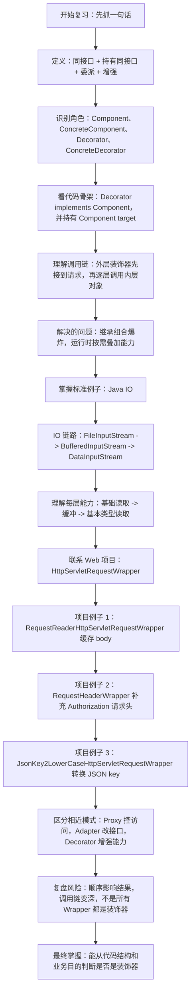
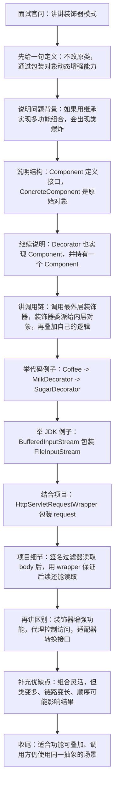

# Java 装饰器模式知识总结

## 目录

- [1. 它是什么](#1-它是什么)
- [2. 标准角色](#2-标准角色)
- [3. 基础代码示例](#3-基础代码示例)
- [4. 为什么不用继承](#4-为什么不用继承)
- [5. 对象装饰器和类装饰器](#5-对象装饰器和类装饰器)
- [6. JDK 中的典型例子](#6-jdk-中的典型例子)
- [7. Servlet 请求包装器也是典型落点](#7-servlet-请求包装器也是典型落点)
- [8. 和代理、适配器的区别](#8-和代理适配器的区别)
- [9. 优缺点](#9-优缺点)
- [10. 当前项目中的使用匹配](#10-当前项目中的使用匹配)
  - [10.1 gateway-server：请求体可重复读取](#101-gateway-server请求体可重复读取)
  - [10.2 gateway-server：请求头增强](#102-gateway-server请求头增强)
  - [10.3 ka-solution：历史接口 JSON key 统一小写](#103-ka-solution历史接口-json-key-统一小写)
  - [10.4 openapi-router：Token 请求头包装](#104-openapi-routertoken-请求头包装)
  - [10.5 项目里的 Java IO 装饰器](#105-项目里的-java-io-装饰器)
  - [10.6 JDK 集合包装器](#106-jdk-集合包装器)
  - [10.7 不是所有 Wrapper 都是装饰器](#107-不是所有-wrapper-都是装饰器)
- [11. 实际工作总结](#11-实际工作总结)
- [12. 复习的思路](#12-复习的思路)
- [13. 面试讲解思路](#13-面试讲解思路)
- [14. 面试常见追问](#14-面试常见追问)
  - [14.1 装饰器和代理为什么容易混淆？](#141-装饰器和代理为什么容易混淆)
  - [14.2 Java IO 为什么是装饰器？](#142-java-io-为什么是装饰器)
  - [14.3 RequestWrapper 为什么适合在 Filter 中使用？](#143-requestwrapper-为什么适合在-filter-中使用)
  - [14.4 装饰器有什么风险？](#144-装饰器有什么风险)
- [15. 来源和参考](#15-来源和参考)

## 1. 它是什么

装饰器模式的核心是：

> 在不修改原对象代码、不靠大量继承组合类的情况下，通过一层一层包装对象，动态地给对象增加能力。

最容易记的一句话：

```text
装饰器模式 = 实现同一抽象 + 内部持有同一抽象 + 委派原对象 + 叠加新功能
```

例如：

```text
SimpleCoffee
  -> MilkDecorator
  -> SugarDecorator
  -> FoamDecorator
```

调用方看到的仍然是 `Coffee`，但实际执行时会从最外层装饰器一层一层调用到原始对象，再逐层叠加功能。

## 2. 标准角色

| 角色 | 含义 | 示例 |
|---|---|---|
| Component | 统一抽象接口 | `Coffee` / `InputStream` / `HttpServletRequest` |
| ConcreteComponent | 原始对象 | `SimpleCoffee` / `FileInputStream` / 原始 `HttpServletRequest` |
| Decorator | 抽象装饰器，持有 Component | `CoffeeDecorator` / `FilterInputStream` / `HttpServletRequestWrapper` |
| ConcreteDecorator | 具体增强类 | `MilkDecorator` / `BufferedInputStream` / 自定义 RequestWrapper |

识别装饰器最关键的结构：

```java
public abstract class CoffeeDecorator implements Coffee {

    protected final Coffee coffee;

    protected CoffeeDecorator(Coffee coffee) {
        this.coffee = coffee;
    }
}
```

也就是：

```text
Decorator 本身是 Component
Decorator 内部又持有 Component
```

## 3. 基础代码示例

组件接口：

```java
public interface Coffee {

    String getDescription();

    double getPrice();
}
```

原始对象：

```java
public class SimpleCoffee implements Coffee {

    @Override
    public String getDescription() {
        return "普通咖啡";
    }

    @Override
    public double getPrice() {
        return 10;
    }
}
```

抽象装饰器：

```java
public abstract class CoffeeDecorator implements Coffee {

    protected final Coffee coffee;

    protected CoffeeDecorator(Coffee coffee) {
        this.coffee = coffee;
    }

    @Override
    public String getDescription() {
        return coffee.getDescription();
    }

    @Override
    public double getPrice() {
        return coffee.getPrice();
    }
}
```

具体装饰器：

```java
public class MilkDecorator extends CoffeeDecorator {

    public MilkDecorator(Coffee coffee) {
        super(coffee);
    }

    @Override
    public String getDescription() {
        return coffee.getDescription() + " + 牛奶";
    }

    @Override
    public double getPrice() {
        return coffee.getPrice() + 2;
    }
}
```

组合使用：

```java
Coffee coffee = new SimpleCoffee();
coffee = new MilkDecorator(coffee);
coffee = new SugarDecorator(coffee);

System.out.println(coffee.getDescription());
System.out.println(coffee.getPrice());
```

真实调用链：

```text
SugarDecorator.getPrice()
  -> MilkDecorator.getPrice()
      -> SimpleCoffee.getPrice()
      <- 10
  <- 10 + 2
<- 12 + 1
= 13
```

## 4. 为什么不用继承

如果用继承给咖啡加料：

```text
Coffee
  -> MilkCoffee
  -> SugarCoffee
  -> FoamCoffee
  -> MilkSugarCoffee
  -> MilkFoamCoffee
  -> SugarFoamCoffee
  -> MilkSugarFoamCoffee
```

功能越多，组合类越多，容易出现类爆炸。

装饰器改成运行时组合：

```text
SimpleCoffee
  -> MilkDecorator
  -> SugarDecorator
  -> FoamDecorator
```

每新增一种能力，只需要新增一个装饰器类，不需要把所有组合都提前写出来。

## 5. 对象装饰器和类装饰器

Java 实际开发更常见的是对象装饰器：

```java
public class Decorator implements Component {

    private final Component target;

    public Decorator(Component target) {
        this.target = target;
    }
}
```

这种方式使用组合，灵活度高。

类装饰器依赖继承：

```java
public class Decorator extends ConcreteComponent {
}
```

Java 只有单继承，继承方式也更容易和父类实现强耦合，所以实际项目里优先使用组合。

## 6. JDK 中的典型例子

Java IO 是装饰器模式最经典的例子。

```java
InputStream inputStream =
        new BufferedInputStream(
                new FileInputStream("test.txt")
        );
```

含义是：

```text
FileInputStream
  -> 提供基础文件字节读取能力

BufferedInputStream
  -> 包装 InputStream
  -> 增加缓冲能力
```

还可以继续叠加：

```java
DataInputStream inputStream =
        new DataInputStream(
                new BufferedInputStream(
                        new FileInputStream("test.txt")
                )
        );
```

调用链：

```text
调用方
  -> DataInputStream
      -> BufferedInputStream
          -> FileInputStream
              -> 文件
```

每一层仍然是 `InputStream` 或基于同一 IO 抽象工作，但每一层都增加了不同能力。

## 7. Servlet 请求包装器也是典型落点

Web 项目里常见的 `HttpServletRequestWrapper` 也很接近装饰器思想。

基础关系：

```text
原始 HttpServletRequest
  -> HttpServletRequestWrapper
      -> 自定义 RequestWrapper
          -> FilterChain / Controller
```

自定义包装器通常会：

```text
保留 HttpServletRequest 接口
  -> 默认方法委派给原始 request
  -> 只覆盖少数方法
      -> getHeader()
      -> getInputStream()
      -> getReader()
      -> getParameter()
```

这样调用方仍然拿到 `HttpServletRequest`，但读取请求头、请求体、参数时，行为已经被增强或改写。

## 8. 和代理、适配器的区别

| 模式 | 核心目的 | 接口是否变化 | 常见例子 |
|---|---|---|---|
| 装饰器 Decorator | 动态增强功能，强调层层叠加 | 通常不变 | Java IO、RequestWrapper |
| 代理 Proxy | 控制访问过程，增加事务、权限、远程调用等控制 | 通常不变 | Spring AOP、RPC 代理 |
| 适配器 Adapter | 把不兼容接口转换成目标接口 | 通常变化 | 第三方 SDK 接入、旧接口改造 |

简单记：

```text
Decorator
  -> 增强能力

Proxy
  -> 控制访问

Adapter
  -> 转换接口
```

注意：不是所有类名带 `Wrapper` 的类都是装饰器。判断标准要看它是否“实现或继承同一抽象，并持有原对象进行委派和增强”。

## 9. 优缺点

优点：

| 优点 | 说明 |
|---|---|
| 不修改原类 | 对原对象代码侵入小 |
| 替代大量继承 | 通过组合解决功能组合问题 |
| 运行时灵活组合 | 不同装饰器可以按需组合 |
| 符合开闭原则 | 新增功能通常新增装饰器即可 |

缺点：

| 缺点 | 说明 |
|---|---|
| 类数量增加 | 每个增强点可能都要一个装饰器 |
| 调用链变长 | 调试时要看清楚外层到内层的顺序 |
| 顺序可能影响结果 | 先压缩再加密、先加密再压缩，结果可能完全不同 |
| 容易和代理混淆 | 代码结构像，设计目的不同 |

使用装饰器时要特别关注：

```text
1. 装饰顺序是否影响业务语义
2. 是否真的需要动态组合
3. 是否会导致调用链过深
4. 是否保留原接口契约
5. 是否正确委派未增强的方法
```

## 10. 当前项目中的使用匹配

### 10.1 gateway-server：请求体可重复读取

位置：

```text
D:\ai-work-project\gateway-server\src\main\java\com\kyexpress\platform\edge\utils\RequestReaderHttpServletRequestWrapper.java
D:\ai-work-project\gateway-server\src\main\java\com\kyexpress\platform\edge\filter\SignFilter.java
```

匹配点：

```java
public class RequestReaderHttpServletRequestWrapper extends HttpServletRequestWrapper
```

它在构造方法中读取原始 request body：

```java
body = StreamUtils.copyToByteArray(request.getInputStream());
```

然后覆盖：

```java
getInputStream()
getReader()
```

实际工作作用：

```text
HTTP 请求进入 SignFilter
  -> 包装成 RequestReaderHttpServletRequestWrapper
  -> SignFilter 读取 body 计算签名
  -> 继续把 wrapper 传给 filterChain
  -> 后续 Controller / Filter 仍然可以读取 body
```

这是非常标准的 Web 场景装饰器：原始 `HttpServletRequest` 的接口没变，但“请求体只能读一次”的行为被包装器增强成“可重复读取”。

### 10.2 gateway-server：请求头增强

位置：

```text
D:\ai-work-project\gateway-server\src\main\java\com\kyexpress\platform\edge\utils\RequestHeaderWrapper.java
D:\ai-work-project\gateway-server\src\main\java\com\kyexpress\platform\edge\filter\TokenTypeFilter.java
```

匹配点：

```java
public class RequestHeaderWrapper extends HttpServletRequestWrapper
```

它内部维护：

```java
private final Map<String, String> customHeaders;
```

并覆盖：

```java
getHeader()
getHeaders()
getHeaderNames()
```

实际工作作用：

```text
TokenTypeFilter 判断请求只有旧 token
  -> 创建 RequestHeaderWrapper
  -> putHeader("Authorization", "Bearer " + token)
  -> 继续 doFilter(wrapper, response)
  -> 后续链路按标准 Authorization 读取
```

这解决的是历史兼容问题：旧请求没有标准 `Authorization`，过滤器不改后续认证逻辑，而是在请求外面包一层，让后续组件看到标准请求头。

### 10.3 ka-solution：历史接口 JSON key 统一小写

位置：

```text
D:\ai-work-project\ka-solution\ka-solution-provider\src\main\java\com\kyexpress\ka\solution\provider\filter\JsonKey2LowerCaseHttpServletRequestWrapper.java
D:\ai-work-project\ka-solution\ka-solution-provider\src\main\java\com\kyexpress\ka\solution\provider\filter\JsonKey2LowerCaseFilter.java
```

匹配点：

```java
public class JsonKey2LowerCaseHttpServletRequestWrapper extends HttpServletRequestWrapper
```

它读取请求体 JSON，对 `.asmx/` 历史接口做 key 小写转换，然后覆盖：

```java
getInputStream()
getReader()
```

实际工作作用：

```text
请求进入 JsonKey2LowerCaseFilter
  -> 判断 content-type 是 JSON 且 method 是 POST
  -> 包装成 JsonKey2LowerCaseHttpServletRequestWrapper
  -> wrapper 内部转换 JSON key
  -> 后续 Controller 仍然按普通 request 读取 body
```

这不是简单工具类转换，而是在 Servlet 请求对象这一层做透明增强。后续业务代码不用感知外部历史接口的字段大小写差异。

### 10.4 openapi-router：Token 请求头包装

位置：

```text
D:\ai-work-project\openapi-router\openapi-router-provider\src\main\java\com\kyexpress\openapi\router\provider\filter\TokenFilter.java
```

匹配点：

```java
public static class HttpTokenRequestWrapper extends HttpServletRequestWrapper
```

它在内部保存：

```java
headerMap
parameterMap
```

并覆盖：

```java
getHeader()
getParameter()
```

实际工作作用：

```text
TokenFilter 完成 token 校验
  -> 构造 HttpTokenRequestWrapper(request, jwt)
  -> wrapper 覆盖部分 header / parameter 获取逻辑
  -> 传入 filterChain
```

这类代码体现了装饰器思想：请求对象的整体身份不变，局部读取行为被增强。

### 10.5 项目里的 Java IO 装饰器

位置示例：

```text
D:\ai-work-project\ka-solution\ka-solution-provider\src\main\java\com\kyexpress\ka\solution\provider\service\customized\leqee\LeqeeService.java
D:\ai-work-project\ka-order\ka-order-provider\src\main\java\com\kyexpress\ka\order\provider\service\customeize\leqee\LeQeeSaveOrderProcessorSupport.java
```

典型代码：

```java
zipInputStream = new ZipInputStream(
        new BufferedInputStream(connection.getInputStream())
);
```

调用含义：

```text
connection.getInputStream()
  -> 网络字节流
  -> BufferedInputStream 增加缓冲能力
  -> ZipInputStream 增加 ZIP 解压读取能力
```

项目里还大量出现：

```java
new BufferedReader(new InputStreamReader(inputStream, StandardCharsets.UTF_8))
new BufferedOutputStream(...)
new DataInputStream(...)
new OutputStreamWriter(...)
```

这些都是 IO 装饰器思想的实际使用：底层流负责原始读写，外层流逐步增加字符转换、缓冲、数据类型读取、压缩解压等能力。

### 10.6 JDK 集合包装器

位置示例：

```text
D:\ai-work-project\gateway-server\src\main\java\com\kyexpress\platform\edge\constants\Constants.java
D:\ai-work-project\ka-common\ka-common\src\main\java\com\kyexpress\ka\common\util\PartitionExecutorUtil.java
D:\ai-work-project\ka-solution\ka-solution-provider\src\main\java\com\kyexpress\ka\solution\provider\service\customized\jdindustrial\JdIndustrialService.java
```

典型代码：

```java
Collections.unmodifiableList(...)
Collections.synchronizedList(...)
```

这些属于 JDK 的包装器写法，也有装饰器思想：

```text
原始 List
  -> unmodifiableList 增加只读约束

原始 List
  -> synchronizedList 增加同步访问控制
```

注意它们是“装饰器风格”的 JDK 包装器，但面试时最稳的标准案例仍然是 Java IO。

### 10.7 不是所有 Wrapper 都是装饰器

项目里也能看到一些 `Wrapper` 命名的类，例如参数包装、DTO 包装、结果包装等。它们不一定是装饰器。

判断标准：

```text
如果只是保存一组字段
  -> 更像 DTO / 参数对象

如果没有实现或继承同一个接口
  -> 通常不是标准装饰器

如果包装原对象，并把大部分行为委派给原对象，只覆盖少量行为
  -> 很可能是装饰器
```

所以 `HttpServletRequestWrapper` 这一类是非常明确的装饰器落点，而普通 `DataWrapper`、`ParameterWrapper` 要结合结构判断。

## 11. 实际工作总结

在当前项目中，装饰器模式主要解决这些实际问题：

```text
1. 请求体重复读取
   -> 签名校验先读 body
   -> 后续业务还要读 body
   -> 使用 RequestReaderHttpServletRequestWrapper 缓存 body

2. 历史 token 兼容
   -> 老请求传 token
   -> 新链路希望读取 Authorization
   -> 使用 RequestHeaderWrapper 透明补充请求头

3. 历史接口字段兼容
   -> 外部接口 JSON key 大小写不统一
   -> 内部业务希望字段格式统一
   -> 使用 JsonKey2LowerCaseHttpServletRequestWrapper 转换请求体

4. IO 能力叠加
   -> 网络流 / 文件流
   -> 字符转换 / 缓冲 / ZIP 解压 / 数据类型读取
   -> 使用 InputStream、Reader、Writer 体系装饰器

5. 集合行为约束
   -> 原始集合
   -> 增加只读或同步能力
   -> 使用 Collections.unmodifiableList / synchronizedList
```

最值得记住的项目级经验：

> 当你不想改后续业务代码，又希望让后续链路看到“增强后的同一个对象”时，装饰器非常合适。

## 12. 复习的思路



复习时不要只背概念，建议按这个顺序走：

```text
概念
  -> 角色
  -> 代码结构
  -> 调用链
  -> 解决继承爆炸
  -> JDK IO
  -> 项目 RequestWrapper
  -> 和代理、适配器区分
  -> 使用风险
```

## 13. 面试讲解思路



可以这样回答：

```text
装饰器模式是一种结构型模式，它通过包装原对象，在保持接口不变的情况下动态增强对象能力。

它的核心结构是装饰器和原对象实现同一个接口，并且装饰器内部持有这个接口类型的对象。调用时先进入最外层装饰器，再逐层委派到内层对象，每一层都可以在调用前后叠加自己的功能。

它主要解决继承组合爆炸的问题。比如咖啡加牛奶、加糖、加奶泡，如果用继承会产生大量组合类，而装饰器只需要把这些功能做成独立装饰器，运行时按需组合。

Java 里最典型的例子是 IO 流，比如 BufferedInputStream 包装 FileInputStream，DataInputStream 再包装 BufferedInputStream。项目里也能看到 HttpServletRequestWrapper，例如签名过滤器读取请求体后，用 RequestReaderHttpServletRequestWrapper 缓存 body，保证后续链路还能继续读取请求体。

它和代理模式的区别是：代理更强调控制访问，比如事务、权限、RPC；装饰器更强调功能增强和层层叠加。和适配器的区别是：适配器主要改变接口，装饰器通常保持接口不变。
```

## 14. 面试常见追问

### 14.1 装饰器和代理为什么容易混淆？

因为代码结构很像：

```java
class XxxWrapper implements Xxx {

    private Xxx target;
}
```

但目的不同：

```text
装饰器
  -> 让对象能力更丰富
  -> 常见多层叠加

代理
  -> 控制目标对象访问过程
  -> 事务、权限、远程调用、懒加载
```

### 14.2 Java IO 为什么是装饰器？

因为 IO 流统一基于 `InputStream`、`OutputStream`、`Reader`、`Writer` 等抽象，不同外层流持有内层流，并在读写时增加能力。

例如：

```text
FileInputStream
  -> 读文件字节

BufferedInputStream
  -> 增加缓冲

ZipInputStream
  -> 增加 ZIP 解压读取
```

### 14.3 RequestWrapper 为什么适合在 Filter 中使用？

因为 Servlet 过滤器链后续组件仍然接收 `ServletRequest` / `HttpServletRequest`。包装器可以保持接口不变，只改写局部行为。

典型场景：

```text
读取 body 做签名
  -> 原 request body 会被消费
  -> 后续 Controller 可能读不到
  -> wrapper 缓存 body 并重写 getInputStream()
  -> 后续链路无感知
```

### 14.4 装饰器有什么风险？

主要是：

```text
1. 包装层数多，调试复杂
2. 装饰顺序可能影响结果
3. 对象身份和 equals/hashCode 可能有额外影响
4. 如果只是简单参数对象，不应该强行叫装饰器
5. 未覆盖的方法必须正确委派给原对象
```

## 15. 来源和参考

- JavaGuide：设计模式总结，装饰器、代理、适配器等模式的基础定义和 Java 场景归纳。https://interview.javaguide.cn/system-design/design-pattern.html
- JavaGuide：Spring 中使用到的设计模式。https://javaguide.cn/system-design/framework/spring/spring-design-patterns-summary.html
- Oracle JDK 文档：`FilterInputStream` 是 Java IO 装饰器体系的重要基础类。https://docs.oracle.com/en/java/javase/26/docs/api/java.base/java/io/FilterInputStream.html
- Oracle JDK 文档：`BufferedInputStream` 为输入流增加缓冲能力。https://docs.oracle.com/en/java/javase/26/docs/api/java.base/java/io/BufferedInputStream.html
- Oracle Java EE 文档：`HttpServletRequestWrapper` 为自定义 request 包装器提供基础委派能力。https://docs.oracle.com/javaee/7/api/javax/servlet/http/HttpServletRequestWrapper.html
- Oracle JDK 文档：`Collections.unmodifiableList`、`Collections.synchronizedList` 等集合包装器。https://docs.oracle.com/en/java/javase/26/docs/api/java.base/java/util/Collections.html
- 项目匹配来源：本地代码检索 `D:\ai-work-project` 下的 `gateway-server`、`ka-solution`、`openapi-router`、`ka-order`、`ka-common`、`openapi-adapter` 等项目。
