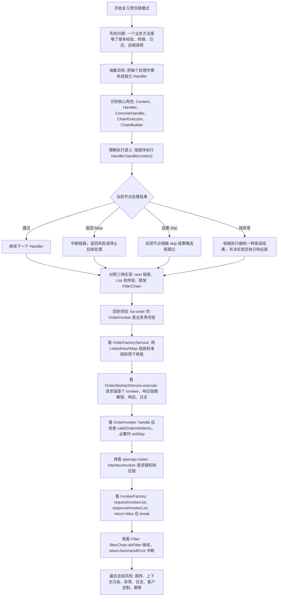
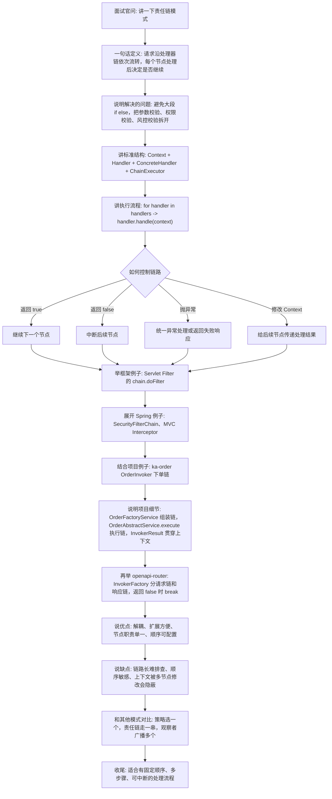

# Java 责任链模式知识总结

## 目录

- [1. 它是什么](#1-它是什么)
- [2. 标准角色](#2-标准角色)
- [3. 基础代码模型](#3-基础代码模型)
- [4. 三种常见实现方式](#4-三种常见实现方式)
  - [4.1 链表式责任链](#41-链表式责任链)
  - [4.2 有序列表式责任链](#42-有序列表式责任链)
  - [4.3 框架内置链](#43-框架内置链)
- [5. 和其他模式的区别](#5-和其他模式的区别)
- [6. 生产使用注意事项](#6-生产使用注意事项)
- [7. 项目中哪里使用到了](#7-项目中哪里使用到了)
  - [7.1 `ka-order` 的 `OrderInvoker` 下单责任链](#71-ka-order-的-orderinvoker-下单责任链)
  - [7.2 `openapi-router` 的 `InterfaceInvoker` 路由责任链](#72-openapi-router-的-interfaceinvoker-路由责任链)
  - [7.3 `gateway-server` 的 Spring Security / Servlet Filter 链](#73-gateway-server-的-spring-security-servlet-filter-链)
  - [7.4 `openapi-router` 的 `TokenFilter`](#74-openapi-router-的-tokenfilter)
  - [7.5 `ka-solution` 的 `JsonKey2LowerCaseFilter`](#75-ka-solution-的-jsonkey2lowercasefilter)
- [8. 项目实践总结](#8-项目实践总结)
- [9. 复习的思路](#9-复习的思路)
- [10. 面试讲解思路](#10-面试讲解思路)
- [11. 一句话总结](#11-一句话总结)
- [12. 参考资料](#12-参考资料)

## 1. 它是什么

责任链模式的核心是：

> 把多个处理器串成一条链，请求沿着链路依次流转，每个处理器只处理自己负责的逻辑，并决定是否继续传递。

Java 后端里可以换成更工程化的表达：

```text
责任链模式 = 请求上下文 + 有序处理器列表 + 逐个执行 + 可继续/可中断
```

典型场景：

```text
订单创建
  -> 参数校验
  -> 用户校验
  -> 库存校验
  -> 风控校验
  -> 优惠券校验
  -> 创建订单

网关请求
  -> CORS
  -> Token解析
  -> 签名校验
  -> 白名单校验
  -> 权限校验
  -> 转发到业务服务
```

它最适合解决的问题不是“代码更高级”，而是：

```text
原来一个大方法里堆了很多 if / check / convert / log
        ↓
拆成多个独立 Handler
        ↓
按顺序组合
        ↓
新增、删除、调整某个节点时更清晰
```

## 2. 标准角色

| 角色 | 说明 | Java 项目里的常见形态 |
|---|---|---|
| Request / Context | 请求对象或上下文，贯穿整条链 | `OrderRequest`、`InvokerResult`、`RouterInfo`、`HttpServletRequest` |
| Handler | 抽象处理器，定义统一处理方法 | `OrderInvoker`、`InterfaceInvoker`、`Filter` |
| ConcreteHandler | 具体处理节点 | 参数校验、签名校验、报文转换、日志记录 |
| Chain / Executor | 链路执行器，负责按顺序调用 Handler | `FilterChain`、`InvokerFactory`、`OrderAbstractService` |
| Builder / Factory | 组装链路顺序 | `OrderFactoryService`、Spring Security 配置类 |

核心关系：

```text
Client
  -> ChainExecutor
  -> Handler1.handle(context)
  -> Handler2.handle(context)
  -> Handler3.handle(context)
  -> Result
```

每个 Handler 一般只关心三件事：

```text
1. 当前上下文是否满足我的处理条件
2. 我处理完成后是否修改上下文
3. 后续链路是继续、跳过，还是中断
```

## 3. 基础代码模型

实际项目里更常见的是 `List<Handler>` 顺序执行，而不是手写 `next` 指针：

```java
public interface OrderCheckHandler {

    int order();

    boolean handle(OrderContext context);
}
```

```java
public class OrderCheckChain {

    private final List<OrderCheckHandler> handlers;

    public OrderCheckChain(List<OrderCheckHandler> handlers) {
        this.handlers = handlers.stream()
                .sorted(Comparator.comparingInt(OrderCheckHandler::order))
                .collect(Collectors.toList());
    }

    public boolean execute(OrderContext context) {
        for (OrderCheckHandler handler : handlers) {
            boolean next = handler.handle(context);

            if (!next) {
                return false;
            }
        }

        return true;
    }
}
```

调用链：

```text
OrderService.createOrder()
        ↓
OrderCheckChain.execute(context)
        ↓
ParamCheckHandler.handle(context)
        ↓
UserCheckHandler.handle(context)
        ↓
StockCheckHandler.handle(context)
        ↓
RiskCheckHandler.handle(context)
        ↓
全部通过后创建订单
```

其中：

```text
return true   -> 当前节点通过，继续后续节点
return false  -> 当前节点失败，中断后续节点
throw error   -> 由链路执行器统一转失败结果或异常响应
```

## 4. 三种常见实现方式

### 4.1 链表式责任链

每个 Handler 持有 `next`：

```text
Handler1
  -> next = Handler2
      -> next = Handler3
```

优点是符合经典模式定义，缺点是链路顺序在代码里不够直观，动态调整也不方便。

### 4.2 有序列表式责任链

Spring 项目里更常见：

```text
List<Handler>
  -> sort by order
  -> for each handler
  -> handle(context)
  -> false / skip / exception 决定后续流程
```

优点是顺序直观，适合和 Spring Bean 自动注入结合。

### 4.3 框架内置链

常见框架基本都能看到责任链思想：

```text
Servlet Filter
  -> filter.doFilter(request, response, chain)
  -> chain.doFilter(request, response)

Spring MVC Interceptor
  -> preHandle()
  -> Controller
  -> postHandle()
  -> afterCompletion()

Spring Security
  -> SecurityFilterChain
  -> 多个安全过滤器顺序执行
```

根据 Jakarta Servlet 文档，`FilterChain` 是 Servlet 容器提供给开发者的对象，用来调用过滤链里的下一个资源；Spring MVC 文档也把拦截器放在 `HandlerMapping` 相关链路中，用于请求处理前后拦截；Spring Security 的 Servlet 架构核心也是 `DelegatingFilterProxy -> FilterChainProxy -> SecurityFilterChain -> Security Filters`。

## 5. 和其他模式的区别

| 模式 | 核心问题 | 执行关系 | 典型例子 |
|---|---|---|---|
| 责任链 | 多个节点按顺序处理请求 | 一次请求可能经过多个节点，也可能中断 | Filter、Interceptor、订单校验链 |
| 策略模式 | 多个算法中选择一个 | 通常只执行一个策略 | 支付方式、计价方式 |
| 观察者模式 | 一个事件通知多个订阅者 | 通常广播给多个监听器 | 支付成功后发短信、加积分 |
| 模板方法 | 父类固定流程，子类改部分步骤 | 流程固定，步骤由继承扩展 | 导入流程、订单处理骨架 |
| 装饰器 | 层层包装增加功能 | 多层包装同一接口对象 | Java IO |

一句话区分：

```text
策略模式 = 选一个处理
责任链模式 = 一串处理
观察者模式 = 广播多个处理
模板方法 = 父类固定流程
装饰器 = 层层增强对象
```

## 6. 生产使用注意事项

责任链模式真正落地时，重点不是“写几个 Handler”，而是链路治理：

| 注意点 | 说明 |
|---|---|
| 顺序必须明确 | 参数校验应该在远程调用、库存校验、持久化之前 |
| 中断语义要统一 | 使用 `boolean`、`skip`、异常，团队要统一约定 |
| 上下文修改要克制 | Handler 都能改 Context，容易产生隐式依赖 |
| 日志要能定位节点 | 链路长时必须知道卡在哪个 Handler |
| 异常处理要集中 | 避免某个节点异常后响应链、解锁、日志节点不执行 |
| 不要滥用 | 只有两三个简单校验时，直接方法调用可能更清楚 |
| 幂等性要考虑 | 重试或重复执行时，某些节点不能重复扣减、重复推送 |
| 扩展点要收敛 | 允许客户定制链时，要控制能替换哪些节点 |

## 7. 项目中哪里使用到了

本次在 `D:\ai-work-project` 下主要按这些关键词搜索：

```text
implements Filter
extends OncePerRequestFilter
FilterChain
chain.doFilter
HandlerInterceptor
GlobalFilter
Chain
HandlerChain
Invoker
setNext
next.handle
```

整体结论：

```text
项目里没有大量教科书式 setNext 责任链
        ↓
更多是业务型 Invoker 链 + Servlet/Spring Security Filter 链
        ↓
其中 ka-order 和 openapi-router 是最值得重点看的真实业务责任链
```

### 7.1 `ka-order` 的 `OrderInvoker` 下单责任链

这是最典型、最贴近业务的责任链实现。

关键文件：

```text
D:\ai-work-project\ka-order\ka-order-provider\src\main\java\com\kyexpress\ka\order\provider\service\common\order\invoker\OrderInvoker.java
D:\ai-work-project\ka-order\ka-order-provider\src\main\java\com\kyexpress\ka\order\provider\service\common\order\OrderAbstractService.java
D:\ai-work-project\ka-order\ka-order-provider\src\main\java\com\kyexpress\ka\order\provider\service\common\order\OrderFactoryService.java
```

角色对应：

| 责任链角色 | 项目实现 |
|---|---|
| Context | `InvokerResult` |
| Handler | `OrderInvoker` |
| ConcreteHandler | `CustomizedParamterInvoker`、`RedisLockInvoker`、`CheckCustomersInvoker`、`AcquireWaybillNumberInvoker`、`NotifyInvoker` 等 |
| Chain Executor | `OrderAbstractService#execute` |
| Chain Builder | `OrderFactoryService#getStandardInvokers`、`getPlanOrderInvokers` |

关键代码点：

```text
OrderInvoker.java:24
  -> 定义 OrderInvoker 接口

OrderInvoker.java:26
  -> default invoker(result)
  -> 统一执行 handle(result)、checkNeedSuspend(result)、afterBizHandle(result)

OrderInvoker.java:85
  -> checkNeedSuspend(result)
  -> 如果 validOrderInfoItems 为空，则 result.setSkip(true)

OrderAbstractService.java:59
  -> 获取 request invoker list

OrderAbstractService.java:69
  -> 获取 response invoker list

OrderAbstractService.java:93
  -> for 循环执行请求链

OrderAbstractService.java:100
  -> ExecutionDecision.shouldSkip 判断某个节点是否跳过

OrderAbstractService.java:104
  -> handler.invoker(result)

OrderAbstractService.java:114
  -> for 循环执行响应链

OrderAbstractService.java:117
  -> handler.handle(result)

OrderFactoryService.java:187
  -> getPlanOrderInvokers 组装预下单链

OrderFactoryService.java:241
  -> getStandardInvokers 组装标准下单链

OrderFactoryService.java:193-223
  -> 预下单链节点顺序

OrderFactoryService.java:247-277
  -> 标准下单链节点顺序
```

标准下单链大致流程：

```text
客户下单请求
  -> OrderFactoryService.supportPartBatchOrder / noSupportPartBatchOrder
  -> 构造 InvokerResult
  -> 根据 platformFlag 找到客户对应的 OrderAbstractService
  -> OrderAbstractService.execute(result)
  -> CustomizedParamterInvoker
  -> SetUniqueIdInvoker
  -> RedisLockInvoker
  -> SupportPartCheckBasicParameterInvoker
  -> CheckCustomerBillSourceInvoker
  -> CheckExistsWaybillOrderInvoker
  -> CheckExistsOrderNumberInvoker
  -> CheckCustomersInvoker
  -> CheckLimitCityFenDanInvoker
  -> CheckGoodsTimeInvoker
  -> CheckElectronicReceiptInvoker
  -> SupportPartCheckServiceModeInvoker
  -> SupportPartCheckMapLimitInvoker
  -> CheckBatchGoodsMatchInvoker
  -> CheckExpandParamterInvoker
  -> AcquireWaybillNumberInvoker
  -> WaybillEncryptInvoker
  -> CheckAdjustPriceInvoker
  -> SupportPartBuildWaybillBaseInfoInvoker
  -> PostProcessorInvoker
  -> BuildExtraInfoAndAdditionalInvoker
  -> SupportPartAdjustPriceInvoker
  -> SupportPartWarehouseInvoker
  -> PersistenceSyncOrderNotifyInvoker
  -> RouteSubscribeInvoker
  -> PictureSubscribeInvoker
  -> NotifyInvoker
  -> RedisUnLockResponseInvoker
  -> SupportPartResponseInvoker / CustomizedResponseInvoker
  -> LogResponseInvoker
  -> ElectronicReceiptRecordResponseInvoker
  -> 返回 SharedOrderResultDTO
```

这条链的几个工程特征：

```text
1. LinkedHashMap 保存节点，靠插入顺序保证执行顺序
2. RequestOrderInvoker 和 ResponseOrderInvoker 被拆成请求链、响应链
3. 请求链异常后会进入 error(result, e)，再继续执行响应链
4. 响应链适合做解锁、响应转换、日志、电子回单记录等收尾动作
5. result.setSkip(true) 可以让后续节点不再执行业务处理
6. ExecutionDecision 可以按节点名跳过非 EssentialInvoker 节点
```

实际工作里的理解：

```text
新增一个下单校验
  -> 先判断它属于请求前置校验、业务组装、后置响应，还是日志收尾
  -> 新增一个 OrderInvoker 实现类
  -> 如果它必须执行，考虑是否需要 @EssentialInvoker
  -> 在 OrderFactoryService 的标准链或预下单链中放到正确位置
  -> 如果是某个客户专属逻辑，优先看客户 Service 的 getInvokerConfig / setInvokers 定制
  -> 注意 InvokerResult 中 validOrderInfoItems、errorResult、skip 的变化
  -> 验证异常时 Redis 解锁、响应转换、日志节点仍能执行
```

项目里还看到多个客户服务会定制链路，例如替换参数处理、响应处理、附加信息处理等节点：

```text
ZteService
ZjsService
XingDongLiService
XiandaService
CainiaoguoguoService
```

这说明 `ka-order` 的责任链不是单纯技术练习，而是用于支撑不同客户下单流程差异化。

### 7.2 `openapi-router` 的 `InterfaceInvoker` 路由责任链

关键文件：

```text
D:\ai-work-project\openapi-router\openapi-router-provider\src\main\java\com\kyexpress\openapi\router\provider\invoker\InterfaceInvoker.java
D:\ai-work-project\openapi-router\openapi-router-provider\src\main\java\com\kyexpress\openapi\router\provider\invoker\AbstractInvoker.java
D:\ai-work-project\openapi-router\openapi-router-provider\src\main\java\com\kyexpress\openapi\router\provider\invoker\InvokerFactory.java
```

角色对应：

| 责任链角色 | 项目实现 |
|---|---|
| Context | `RouterInfo` + `HttpServletRequest` + `HttpServletResponse` |
| Handler | `InterfaceInvoker` |
| Abstract Handler | `AbstractInvoker` |
| Chain Executor / Builder | `InvokerFactory` |
| 中断条件 | `invoke(...)` 返回 `false` |
| 条件跳过 | `routerInfo.isSkip2Adapter()` + `interfaceInvoker.skip2adapter()` |

关键代码点：

```text
InterfaceInvoker.java:8
  -> 定义统一 Invoker 接口

InterfaceInvoker.java:10
  -> boolean invoke(routerInfo, request, response)

InterfaceInvoker.java:12
  -> boolean skip2adapter()

AbstractInvoker.java:27
  -> 组合调用 invoke(routerInfo)、invoke(routerInfo, request)、invoke(routerInfo, response)

AbstractInvoker.java:47
  -> skip2adapter 默认返回 true

InvokerFactory.java:82
  -> requestInvokerList

InvokerFactory.java:84
  -> responseInvokerList

InvokerFactory.java:86
  -> @PostConstruct 初始化链路顺序

InvokerFactory.java:140
  -> 循环执行 requestInvokerList

InvokerFactory.java:144
  -> skip2adapter 条件跳过节点

InvokerFactory.java:155
  -> 请求链返回 false 时 break

InvokerFactory.java:159
  -> 循环执行 responseInvokerList

InvokerFactory.java:174
  -> 响应链返回 false 时 break
```

请求链顺序：

```text
InitRequestDataInvoker
  -> CheckRequestHeaderArgsInvoker
  -> LoadUserInfoInvoker
  -> CheckSignInvoker
  -> CheckInterfaceDataInvoker
  -> InitInterfaceByThirdAppInfoInvoker
  -> CheckRequestTypeBySubscribeInvoker
  -> TransformRequestData2JsonInvoker
  -> TransformUserDefinedRequestArgsInvoker
  -> CheckRequestDataInvoker
  -> RequestRemoteAddressInvoker
  -> RequestRemoteAfterInvoker
  -> TransformRemoteData2JSONInvoker
```

响应链顺序：

```text
InitResponseDataInvoker
  -> TransformUserDefinedResponseArgsInvoker
  -> FormatResponseDataInvoker
  -> WriteResponseDataInvoker
  -> SaveResponseLogInvoker
```

实际工作里的理解：

```text
开放平台一次接口调用
  -> 初始化请求数据
  -> 校验请求头
  -> 加载用户信息
  -> 校验签名
  -> 查找接口配置
  -> 判断订阅接口类型
  -> 请求报文转 JSON
  -> 用户自定义入参转换
  -> 请求参数校验
  -> 调用远端地址
  -> 远端响应后置处理
  -> 响应数据转 JSON
  -> 初始化响应对象
  -> 自定义出参转换
  -> 格式化响应
  -> 写响应
  -> 保存响应日志
```

如果后续要新增一个路由处理节点：

```text
1. 判断它是请求链节点还是响应链节点
2. 实现 InterfaceInvoker 或继承 AbstractInvoker
3. 在 InvokerFactory.init() 中放到正确顺序
4. 需要中断后续流程时返回 false
5. 只想跳过某些 adapter 场景时实现 skip2adapter 语义
6. 注意 RouterInfo 被多个节点共享，字段修改要可追踪
```

### 7.3 `gateway-server` 的 Spring Security / Servlet Filter 链

关键文件：

```text
D:\ai-work-project\gateway-server\src\main\java\com\kyexpress\platform\edge\config\SecurityConfiguration.java
D:\ai-work-project\gateway-server\src\main\java\com\kyexpress\platform\edge\filter\TokenTypeFilter.java
D:\ai-work-project\gateway-server\src\main\java\com\kyexpress\platform\edge\filter\IPWhiteListFilter.java
D:\ai-work-project\gateway-server\src\main\java\com\kyexpress\platform\edge\filter\SignFilter.java
D:\ai-work-project\gateway-server\src\main\java\com\kyexpress\platform\edge\filter\OAuth2OldAccessFilter.java
D:\ai-work-project\gateway-server\src\main\java\com\kyexpress\platform\edge\filter\CasAccessFilter.java
```

关键代码点：

```text
SecurityConfiguration.java:135-141
  -> 使用 addFilterAfter 添加多个自定义 Filter

TokenTypeFilter.java:20
  -> extends OncePerRequestFilter

TokenTypeFilter.java:25
  -> doFilterInternal

TokenTypeFilter.java:51
  -> 包装请求头后 filterChain.doFilter

TokenTypeFilter.java:67
  -> 普通场景继续 filterChain.doFilter

IPWhiteListFilter.java:23
  -> extends OncePerRequestFilter

IPWhiteListFilter.java:34
  -> 无 appkey 时继续链路

IPWhiteListFilter.java:64
  -> 白名单通过时继续链路

IPWhiteListFilter.java:67
  -> 白名单不通过时 sendError 并中断
```

实际链路可以这样理解：

```text
HTTP 请求进入 gateway-server
  -> Spring Security FilterChain
  -> AbstractPreAuthenticatedProcessingFilter
  -> SignFilter
  -> ShareUrlPreAuthenticationFilter
  -> TokenTypeFilter
  -> OAuth2OldAccessFilter
  -> CasAccessFilter
  -> OAuth2AuthenticationProcessingFilter
  -> IPWhiteListFilter
  -> 后续网关转发或业务处理
```

这里是框架型责任链：

```text
filterChain.doFilter(request, response)
  -> 继续后续 Filter / Servlet

response.sendError(...) + return
  -> 当前 Filter 拦截请求，中断后续链路
```

### 7.4 `openapi-router` 的 `TokenFilter`

关键文件：

```text
D:\ai-work-project\openapi-router\openapi-router-provider\src\main\java\com\kyexpress\openapi\router\provider\config\RouterConfiguare.java
D:\ai-work-project\openapi-router\openapi-router-provider\src\main\java\com\kyexpress\openapi\router\provider\filter\TokenFilter.java
```

关键代码点：

```text
RouterConfiguare.java:25
  -> 创建 FilterRegistrationBean

RouterConfiguare.java:29
  -> 只对 Constants.ROUTER_REST_URL、Constants.ROUTER_V2_REST_URL 生效

RouterConfiguare.java:30
  -> setOrder(Integer.MIN_VALUE)，让 TokenFilter 优先执行

TokenFilter.java:34
  -> extends OncePerRequestFilter

TokenFilter.java:39
  -> doFilterInternal

TokenFilter.java:42
  -> 来自 zuul 的请求直接 filterChain.doFilter

TokenFilter.java:56/62/71/76/82
  -> Token、权限、白名单不通过时 returnJson 并中断

TokenFilter.java:100
  -> 校验通过后包装请求并 filterChain.doFilter
```

实际链路：

```text
REST 请求进入 openapi-router
  -> TokenFilter
  -> 判断是否来自 zuul
  -> 非 zuul 请求执行 token / scope / IP / appkey 校验
  -> 校验失败：写 JSON 响应并 return
  -> 校验成功：包装 HttpServletRequest
  -> filterChain.doFilter
  -> 进入后续路由处理链
  -> finally 清理上下文
```

### 7.5 `ka-solution` 的 `JsonKey2LowerCaseFilter`

关键文件：

```text
D:\ai-work-project\ka-solution\ka-solution-provider\src\main\java\com\kyexpress\ka\solution\provider\config\WebFilterConfig.java
D:\ai-work-project\ka-solution\ka-solution-provider\src\main\java\com\kyexpress\ka\solution\provider\config\JsonKey2LowerCaseFilter.java
```

关键代码点：

```text
WebFilterConfig.java:24
  -> 注册 FilterRegistrationBean

WebFilterConfig.java:28
  -> 只匹配 asmx 历史接口 URL

WebFilterConfig.java:29
  -> setOrder(0)

JsonKey2LowerCaseFilter.java
  -> 判断 JSON + POST
  -> 包装 request，将 JSON key 转小写
  -> chain.doFilter(wrapper, response)
  -> 其他请求直接 chain.doFilter(request, response)
```

实际链路：

```text
历史 asmx 请求
  -> JsonKey2LowerCaseFilter
  -> 判断 Content-Type 和 Method
  -> JSON POST：包装请求体，统一 key 大小写
  -> 非 JSON POST：不改请求
  -> chain.doFilter
  -> 后续 Controller / Servlet 继续处理
```

## 8. 项目实践总结

当前项目中的责任链主要分为三类：

```text
第一类：业务流程责任链
  -> ka-order 的 OrderInvoker
  -> 解决不同客户、不同下单模式、不同校验和响应处理的扩展问题

第二类：开放平台路由责任链
  -> openapi-router 的 InterfaceInvoker
  -> 解决接口调用过程中请求校验、报文转换、远程调用、响应格式化的顺序处理问题

第三类：Web 安全过滤责任链
  -> gateway-server / openapi-router / ka-solution 的 Filter
  -> 解决 HTTP 请求进入业务前的鉴权、转换、拦截问题
```

如果要在项目中改责任链，优先问这几个问题：

```text
1. 我要加的是前置校验、核心业务、远程调用，还是响应收尾？
2. 这个节点是所有客户通用，还是某个客户专属？
3. 它应该放在哪个已有节点之前或之后？
4. 失败时是中断链路、跳过后续节点，还是只记录异常继续？
5. 它是否修改共享上下文？
6. 异常时解锁、日志、响应构建是否仍能执行？
```

## 9. 复习的思路

复习时不要先背定义，可以按照“为什么需要 -> 怎么抽象 -> 怎么执行 -> 项目怎么落地 -> 容易踩坑”的顺序。



具体记忆链：

```text
责任链模式
  -> 解决复杂流程拆分
  -> Handler 只做一个节点的事
  -> Chain 按顺序调 Handler
  -> Context 在节点间传递
  -> Handler 可以继续、中断、跳过、抛异常
  -> 项目里对应 OrderInvoker / InterfaceInvoker / Filter
  -> 真正要注意的是顺序、异常、上下文和响应收尾
```

## 10. 面试讲解思路

面试时建议按照“定义 -> 场景 -> 结构 -> 代码 -> 框架例子 -> 项目例子 -> 优缺点 -> 对比”的顺序讲。



可以直接这样组织回答：

```text
责任链模式是一种行为型设计模式。
它把多个处理器串成一条链，请求来了以后沿着链依次处理。
每个处理器只负责自己的逻辑，并通过返回值、异常或上下文状态决定是否继续。

比如订单创建前需要参数校验、用户校验、库存校验、风控校验。
如果都写在一个方法里，会变成很长的 if else。
使用责任链后，每个校验就是一个 Handler，ChainExecutor 按顺序执行。

Java Web 里最典型的是 Servlet Filter。
Filter 调用 chain.doFilter 表示继续往下走，不调用或直接写响应就表示中断。
Spring Security 的 SecurityFilterChain 也是这个思想。

我们项目里 ka-order 的 OrderInvoker 就是业务责任链。
OrderFactoryService 负责组装标准下单链和预下单链，
OrderAbstractService.execute 负责遍历执行，
InvokerResult 作为上下文在每个 Invoker 之间传递。
openapi-router 里 InterfaceInvoker / InvokerFactory 也是类似，
请求链负责校验、转换、远程调用，响应链负责格式化和日志。

它的优点是节点职责清晰、扩展方便、减少大方法耦合。
缺点是链路顺序敏感、节点多了不好排查、共享上下文容易产生隐式依赖。
```

## 11. 一句话总结

```text
责任链模式 = 一个请求 + 一组有序处理器 + 共享上下文 + 每个节点决定继续还是中断。
```

在当前项目里，最值得重点掌握的是：

```text
ka-order
  -> OrderInvoker 下单业务链

openapi-router
  -> InterfaceInvoker 接口路由链

gateway-server / openapi-router / ka-solution
  -> Servlet Filter / Spring Security Filter 链
```

## 12. 参考资料

- JavaGuide 设计模式：<https://interview.javaguide.cn/system-design/design-pattern.html>
- Jakarta Servlet `FilterChain`：<https://jakarta.ee/specifications/servlet/6.0/apidocs/jakarta.servlet/jakarta/servlet/filterchain>
- Jakarta Servlet `Filter`：<https://jakarta.ee/specifications/servlet/5.0/apidocs/jakarta/servlet/filter>
- Spring MVC Interceptors：<https://docs.spring.io/spring-framework/reference/web/webmvc/mvc-servlet/handlermapping-interceptor.html>
- Spring Security Servlet Architecture：<https://docs.spring.io/spring-security/reference/servlet/architecture.html>
- Spring Security Java Configuration：<https://docs.spring.io/spring-security/reference/servlet/configuration/java.html>
