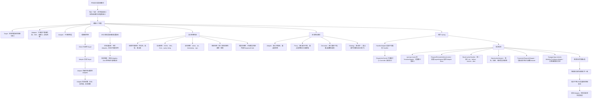
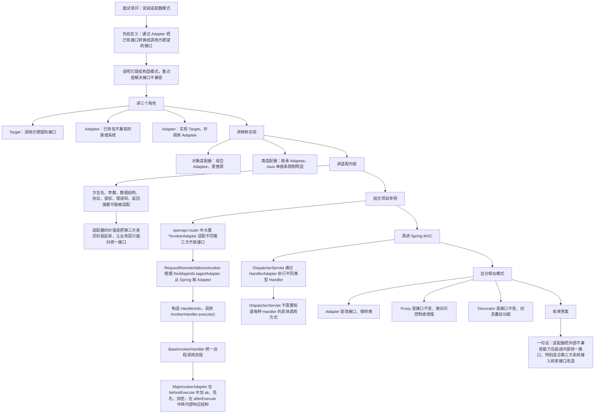

# Java 适配器模式知识总结

## 目录

- [1. 它是什么](#1-它是什么)
- [2. 一个简单例子](#2-一个简单例子)
- [3. 对象适配器和类适配器](#3-对象适配器和类适配器)
- [4. Adapter 到底转换什么](#4-adapter-到底转换什么)
  - [4.1 参数转换](#41-参数转换)
  - [4.2 协议转换](#42-协议转换)
  - [4.3 鉴权转换](#43-鉴权转换)
  - [4.4 响应转换](#44-响应转换)
  - [4.5 异常和错误码转换](#45-异常和错误码转换)
- [5. 适配器、代理、装饰器区别](#5-适配器代理装饰器区别)
- [6. Spring 中的适配器思想](#6-spring-中的适配器思想)
- [7. 当前项目中哪里使用到了](#7-当前项目中哪里使用到了)
  - [7.1 `openapi-router` 的 `*InvokerAdapter`](#71-openapi-router-的-invokeradapter)
  - [7.2 `RequestRemoteAddressInvoker`：根据配置选择 Adapter](#72-requestremoteaddressinvoker根据配置选择-adapter)
  - [7.3 `BaseInvokerHandler` 和 `AbstractInvokerHandler`：适配器模板](#73-baseinvokerhandler-和-abstractinvokerhandler适配器模板)
  - [7.4 `MapInvokerAdapter`：参数、签名、响应错误码适配](#74-mapinvokeradapter参数签名响应错误码适配)
  - [7.5 `ParameterRequestWrapper`：请求参数包装与转换](#75-parameterrequestwrapper请求参数包装与转换)
  - [7.6 `WebMvcConfigurerAdapter`：框架适配器类](#76-webmvcconfigureradapter框架适配器类)
- [8. 实际工作中的使用建议](#8-实际工作中的使用建议)
- [9. 复习的思路](#9-复习的思路)
- [10. 面试讲解思路](#10-面试讲解思路)
- [11. 面试时可以这样说](#11-面试时可以这样说)
- [12. 参考来源](#12-参考来源)

## 1. 它是什么
适配器模式的核心是：

> 在调用方和已有能力之间增加一个 Adapter，把已有类、第三方系统、旧接口、不同数据结构转换成调用方期望的统一接口。

标准角色：

| 角色 | 含义 | 例子 |
|---|---|---|
| Target | 调用方期望的接口 | `Payment.pay()` / `InvokerHandler.execute()` |
| Adaptee | 已有但不兼容的对象或系统 | 第三方 SDK、旧接口、远程服务 |
| Adapter | 转换层 | `AliPayAdapter` / `MapInvokerAdapter` |

调用关系：

```text
Client
  -> Target
  -> Adapter
  -> Adaptee
```

适配器解决的是“不兼容”：

```text
方法名不一样
参数结构不一样
返回结构不一样
协议不一样
鉴权方式不一样
错误码不一样
数据格式不一样
```

它不是简单转发，而是把外部差异收敛到内部统一模型。

## 2. 一个简单例子
系统统一接口：

```java
public interface Payment {

    void pay(int amount);
}
```

第三方 SDK：

```java
public class AliPaySdk {

    public void executePayment(double money) {
        // 支付宝支付
    }
}
```

适配器：

```java
public class AliPayAdapter implements Payment {

    private final AliPaySdk aliPaySdk;

    public AliPayAdapter(AliPaySdk aliPaySdk) {
        this.aliPaySdk = aliPaySdk;
    }

    @Override
    public void pay(int amount) {
        double money = amount / 100.0;
        aliPaySdk.executePayment(money);
    }
}
```

业务代码：

```java
Payment payment = new AliPayAdapter(new AliPaySdk());
payment.pay(10000);
```

业务只认识 `Payment`，不用直接依赖 `AliPaySdk`。

## 3. 对象适配器和类适配器
对象适配器使用组合：

```java
public class Adapter implements Target {

    private final Adaptee adaptee;

    public Adapter(Adaptee adaptee) {
        this.adaptee = adaptee;
    }

    @Override
    public void request() {
        adaptee.specificRequest();
    }
}
```

结构：

```text
Adapter has-a Adaptee
```

类适配器使用继承：

```java
public class Adapter extends Adaptee implements Target {

    @Override
    public void request() {
        specificRequest();
    }
}
```

结构：

```text
Adapter is-a Adaptee
Adapter implements Target
```

Java 实际开发更推荐对象适配器：

- 组合比继承更灵活。
- Java 单继承，类适配器容易受限。
- 组合可以替换不同 Adaptee。
- 对第三方 SDK、远程服务、旧接口更自然。

## 4. Adapter 到底转换什么
适配器常做的不是一件事，而是一组转换。

### 4.1 参数转换
```text
内部字段：
  orderNo
  customerCode
  goodsTime

第三方字段：
  order_no
  customer_id
  delivery_time
```

Adapter 负责字段映射、默认值、格式化。

### 4.2 协议转换
```text
内部统一 JSON
  -> 第三方要求 form-urlencoded
  -> 第三方要求 XML
  -> 第三方要求 GET query string
```

### 4.3 鉴权转换
```text
内部只传业务参数
  -> Adapter 添加 ak、token、timestamp、nonce、sign
  -> Adapter 根据第三方规则签名
```

### 4.4 响应转换
```text
第三方返回：
  code = S001
  info = xxx

内部统一返回：
  success = true
  responseCode = 0
  responseMsg = 成功
  data = xxx
```

### 4.5 异常和错误码转换
```text
第三方错误码
  -> 内部错误码
  -> 内部错误信息
  -> 是否可重试
```

实际业务里，适配器的价值就在这里：把外部千奇百怪的规则关在 Adapter 里面。

## 5. 适配器、代理、装饰器区别
这三个模式很容易混。

| 模式 | 重点 | 接口是否变化 | 典型场景 |
|---|---|---|---|
| Adapter | 适配不兼容接口 | 通常变化 | 第三方 SDK、旧接口、协议转换 |
| Proxy | 控制访问或增强调用 | 通常不变 | AOP、事务、缓存、权限 |
| Decorator | 动态叠加功能 | 通常不变 | IO 流包装、功能增强链 |

简单记：

```text
Adapter = 转换接口
Proxy = 控制访问
Decorator = 叠加能力
```

## 6. Spring 中的适配器思想
Spring MVC 中有一个经典接口：`HandlerAdapter`。

它解决的是：

```text
DispatcherServlet 收到请求
  -> 找到 Handler
  -> Handler 可能有不同类型和调用方式
  -> DispatcherServlet 不应该写一堆 if/else 调不同 Handler
  -> 交给 HandlerAdapter 适配执行
```

流程：

```text
HTTP Request
  -> DispatcherServlet
  -> HandlerMapping 找到 Handler
  -> 选择支持该 Handler 的 HandlerAdapter
  -> HandlerAdapter 调用真正 Handler
  -> 返回 ModelAndView / ResponseBody
```

这就是适配器思想：

```text
DispatcherServlet 只依赖统一的 HandlerAdapter
不同 Handler 的真实调用方式由适配器处理
```

## 7. 当前项目中哪里使用到了
本次在 `D:\ai-work-project` 下搜索了 `Adapter`、`HandlerAdapter`、`Wrapper`、`RemoteService`、`Converter`、`InvokerHandler`、`SpringUtils.getBean` 等关键词。项目里适配器模式最集中、最标准的落点在 `openapi-router`。

### 7.1 `openapi-router` 的 `*InvokerAdapter`
位置：

```text
D:\ai-work-project\openapi-router\openapi-router-provider\src\main\java\com\kyexpress\openapi\router\provider\adapter\impl
```

匹配到大量适配器实现：

```text
ALiyunInvokerAdapter
BaiduInvokerAdapter
GaoDeInvokerAdapter
MapInvokerAdapter
TencentOcrInvokerAdapter
WechatAppPayInvokerAdapter
WmsInvokerAdapter
YuyuanInvokerAdapter
...
```

它们大多继承：

```java
public class MapInvokerAdapter extends BaseInvokerHandler {
}
```

统一目标接口：

```text
InvokerHandler / BaseInvokerHandler
  -> execute(HandlerInfo handlerInfo)
```

实际工作含义：

```text
开放平台内部统一处理模型：
  HandlerInfo
  requestContent
  remoteRequestHeader
  responseContent
  responseOK

不同第三方接口：
  高德
  百度
  腾讯 OCR
  微信支付
  WMS
  地图服务

每个 Adapter：
  -> 按第三方规则改请求参数
  -> 添加签名、token、header
  -> 发起远程请求
  -> 把第三方响应转换成内部统一响应
```

这就是非常典型的适配器模式：内部系统只面对统一 `InvokerHandler`，第三方差异被封装到各个 `*InvokerAdapter`。

### 7.2 `RequestRemoteAddressInvoker`：根据配置选择 Adapter
位置：

```text
D:\ai-work-project\openapi-router\openapi-router-provider\src\main\java\com\kyexpress\openapi\router\provider\invoker\request\RequestRemoteAddressInvoker.java
```

关键逻辑：

```java
String invokerClassStr = routerInfo.getThirdAppInfo().getTagertAdapter();
Class targetHandlerClass = SpringUtils.getBean(invokerClassStr).getClass();

if (InvokerHandler.class.isAssignableFrom(targetHandlerClass)) {
    invokeRemoteNew(routerInfo, requestWrapper);
} else {
    invokeRemoteOld(routerInfo, requestWrapper);
}
```

新适配器调用：

```java
InvokerHandler handler = SpringUtils.getBean(invokerClassStr, InvokerHandler.class);
HandlerInfo handlerInfo = new HandlerInfo(...);
handler.execute(handlerInfo);
routerInfo.setRemoteHttpData(handlerInfo.getResponseContent());
```

实际工作流程：

```text
RouterInfo 中有第三方应用配置
  -> thirdAppInfo.getTagertAdapter()
  -> 得到 Spring Bean 名称
  -> 从 Spring 容器取出 Adapter
  -> 构建 HandlerInfo
  -> Adapter.execute(handlerInfo)
  -> Adapter 内部处理第三方请求和响应差异
  -> 统一写回 routerInfo.remoteHttpData
```

这里同时体现了：

- 工厂思想：根据配置找到哪个 Adapter Bean。
- 适配器思想：Adapter 把第三方接口转换成统一调用模型。

### 7.3 `BaseInvokerHandler` 和 `AbstractInvokerHandler`：适配器模板
位置：

```text
D:\ai-work-project\openapi-router\openapi-router-provider\src\main\java\com\kyexpress\openapi\router\provider\adapter\BaseInvokerHandler.java
D:\ai-work-project\openapi-router\openapi-router-provider\src\main\java\com\kyexpress\openapi\router\provider\adapter\AbstractInvokerHandler.java
```

`BaseInvokerHandler`：

```java
public class BaseInvokerHandler extends AbstractInvokerHandler {

    @Override
    public void execute(HandlerInfo handlerInfo) throws Exception {
        initHandlerInfo(handlerInfo);
        beforeExecute(handlerInfo);
        executeRemoteRequest(handlerInfo);
        afterExecute(handlerInfo);
    }
}
```

这条流程很关键：

```text
initHandlerInfo()
  -> 从接口配置中读取 timeout、requestMethod、contentType、url

beforeExecute()
  -> 子类可改请求参数、签名、加密、补 header

executeRemoteRequest()
  -> 根据 GET / POST / PUT / DELETE 和 contentType 发起请求

afterExecute()
  -> 子类可转换响应、错误码、data 结构
```

实际意义：

- 通用 HTTP 请求能力放在父类。
- 各第三方差异放到子类 `beforeExecute()` / `afterExecute()`。
- 既是适配器，也是模板方法。

### 7.4 `MapInvokerAdapter`：参数、签名、响应错误码适配
位置：

```text
D:\ai-work-project\openapi-router\openapi-router-provider\src\main\java\com\kyexpress\openapi\router\provider\adapter\impl\MapInvokerAdapter.java
```

关键点：

```java
@Service("Open_Api_MapInvokerAdapter")
public class MapInvokerAdapter extends BaseInvokerHandler {

    @Override
    public void beforeExecute(HandlerInfo handlerInfo) throws Exception {
        JSONObject jsonObject = JSONObject.parseObject(handlerInfo.getRequestContent());
        jsonObject.put("ak", ak);
        jsonObject.put("t", System.currentTimeMillis());
        String sign = signRequest(jsonObject, private_key);
        jsonObject.put("sign", sign);
        handlerInfo.setRequestContent(jsonObject.toJSONString());
    }

    @Override
    public void afterExecute(HandlerInfo handlerInfo) throws Exception {
        JSONObject json = JSONObject.parseObject(handlerInfo.getResponseContent());
        JSONObject result = new JSONObject(true);
        result.put(Constants.RESPONSE_CODE, ...);
        result.put(Constants.RESPONSE_SUCCESS, ...);
        result.put(Constants.RESPONSE_DATA, ...);
        handlerInfo.setResponseContent(result.toJSONString());
    }
}
```

它适配了三类东西：

```text
请求适配：
  -> 添加 ak
  -> 添加 t 时间戳
  -> 特定字段 AES 加密
  -> 按地图服务规则签名

远程调用适配：
  -> 复用 BaseInvokerHandler 的 HTTP 调用能力

响应适配：
  -> 第三方 code/status 转内部 responseCode
  -> 第三方 info/result 转内部 data
  -> 第三方错误码转内部错误码
```

这是项目里讲适配器模式时最好的例子。

### 7.5 `ParameterRequestWrapper`：请求参数包装与转换
位置：

```text
D:\ai-work-project\openapi-router\openapi-router-provider\src\main\java\com\kyexpress\openapi\router\provider\utils\ParameterRequestWrapper.java
D:\ai-work-project\openapi-router\openapi-router-provider\src\main\java\com\kyexpress\openapi\router\provider\controller\RouterV2Controller.java
```

关键能力：

```java
private Map<String, String[]> params = new HashMap<>();
private Map<String, String> extraHeaders = new HashMap<>();
private HttpServletRequest request;

public void addParameter(String name, Object value) {
    ...
}

public void addHeader(String name, String value) {
    extraHeaders.put(name, value);
}
```

使用场景：

```text
接口测试 / 路由转发
  -> 原始 HttpServletRequest 不方便直接改参数
  -> ParameterRequestWrapper 保存原请求
  -> 额外添加参数和 header
  -> 后续远程调用时读取适配后的参数
```

它不是标准教科书式 Adapter，但体现了适配思想：

```text
原始 HttpServletRequest
  -> 包装成 ParameterRequestWrapper
  -> 补充额外参数 / header
  -> 适配后续远程调用链需要的数据结构
```

### 7.6 `WebMvcConfigurerAdapter`：框架适配器类
位置：

```text
D:\ai-work-project\ka-basic\ka-basic-provider\src\main\java\com\kyexpress\ka\basic\provider\config\SwaggerApp.java
```

关键代码：

```java
@Configuration
@EnableSwagger2
public class SwaggerApp extends WebMvcConfigurerAdapter {

    @Override
    public void addResourceHandlers(ResourceHandlerRegistry registry) {
        registry.addResourceHandler("swagger-ui.html", "doc.html")
                .addResourceLocations("classpath:/META-INF/resources/");
    }
}
```

实际工作含义：

```text
WebMvcConfigurer 有多个回调方法
  -> 如果直接实现接口，老版本 Java 下可能要实现很多方法
  -> WebMvcConfigurerAdapter 提供默认空实现
  -> 子类只覆盖自己关心的 addResourceHandlers()
```

这是框架里经典“适配器类”的用法。

注意：新版 Spring 已经更推荐直接实现 `WebMvcConfigurer`，因为 Java 8 接口 default method 已经能解决默认实现问题。

## 8. 实际工作中的使用建议
适配器适合这些场景：

```text
接第三方系统
  -> 支付、短信、地图、OCR、WMS、ERP

旧接口改造
  -> 老接口参数不能改
  -> 新业务需要统一模型

协议转换
  -> JSON / XML / form / query string

错误码统一
  -> 第三方 code 转内部 ResponseCode

字段映射
  -> 客户字段名、类型、嵌套结构和内部模型不同
```

不适合的场景：

- 只是想打印日志或加事务，那是代理模式。
- 只是想给对象动态叠加功能，那更像装饰器模式。
- 接口本来兼容，只是业务分支不同，那更像策略模式。

## 9. 复习的思路


## 10. 面试讲解思路


## 11. 面试时可以这样说
适配器模式是一种结构型设计模式，用来解决接口不兼容问题。它有三个角色：调用方期望的 `Target`，已有但接口不兼容的 `Adaptee`，以及中间转换层 `Adapter`。在 Java 中通常推荐对象适配器，也就是通过组合持有被适配对象，而不是继承它。

适配器不是简单转发，它通常会做参数转换、协议转换、鉴权签名、返回值转换、错误码转换。比如我们项目的 `openapi-router` 里有很多 `*InvokerAdapter`，它们都面向统一的 `InvokerHandler.execute(HandlerInfo)`，但每个适配器会按不同第三方接口的要求处理请求和响应。`MapInvokerAdapter` 会在请求前加 `ak`、时间戳、签名和加密字段，在响应后把第三方返回转换成内部统一的 `responseCode`、`success`、`data` 结构。这样开放平台主流程不用关心每个第三方的差异。

和代理模式的区别是：适配器重点是“接口不兼容，我帮你转换”；代理重点是“接口基本不变，我帮你控制访问或增强”。和装饰器区别是：装饰器通常接口也不变，重点是叠加能力。

## 12. 参考来源
- [Spring Framework - HandlerAdapter API](https://docs.spring.io/spring-framework/docs/current/javadoc-api/org/springframework/web/servlet/HandlerAdapter.html)
- [Spring Framework - DispatcherServlet](https://docs.spring.io/spring-framework/reference/web/webmvc/mvc-servlet.html)
- [JavaGuide - 设计模式常见面试题总结](https://interview.javaguide.cn/system-design/design-pattern.html)
- [JavaGuide - Spring 中的设计模式详解](https://javaguide.cn/system-design/framework/spring/spring-design-patterns-summary.html)
