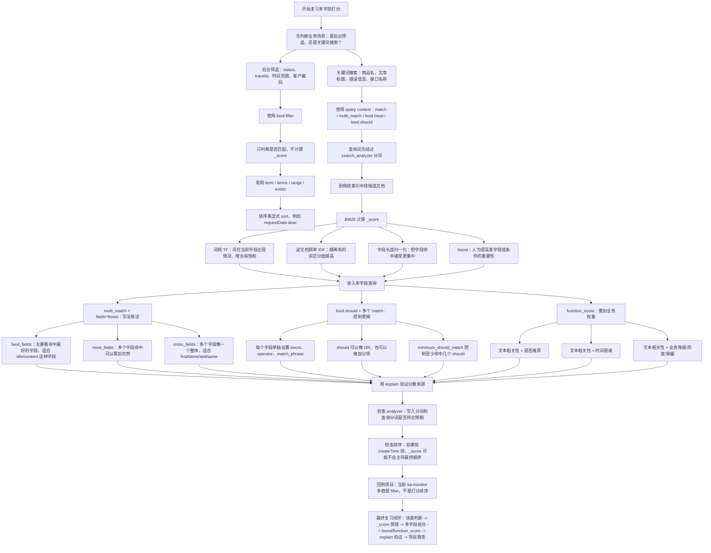
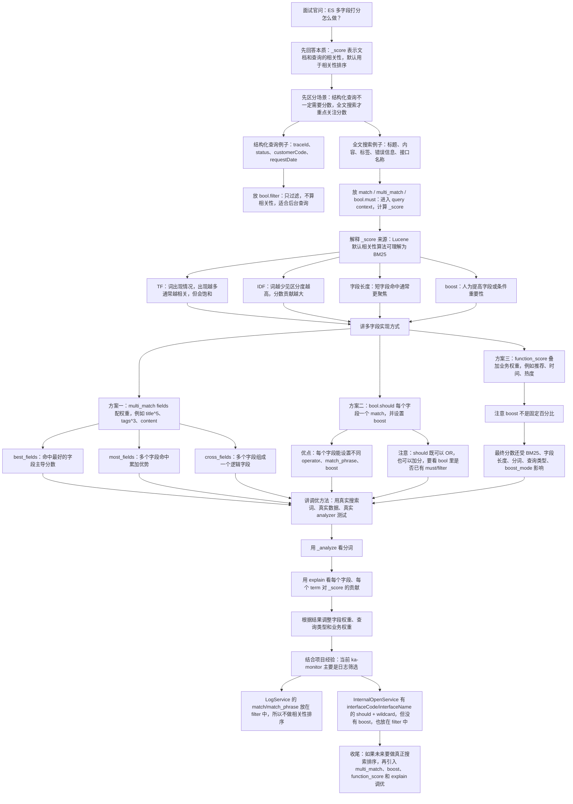

# Elasticsearch 多字段打分规则使用与原理

## 目录

- [1. 先记结论](#1-先记结论)
- [2. `_score` 是什么](#2-_score-是什么)
- [3. `_score` 的基础原理](#3-_score-的基础原理)
  - [3.1 词频](#31-词频)
  - [3.2 IDF](#32-idf)
  - [3.3 字段长度归一化](#33-字段长度归一化)
- [4. Query Context 和 Filter Context](#4-query-context-和-filter-context)
  - [4.1 Query Context](#41-query-context)
  - [4.2 Filter Context](#42-filter-context)
- [5. 多字段搜索的基本方式：multi_match](#5-多字段搜索的基本方式multi_match)
- [6. Boost 不是百分比](#6-boost-不是百分比)
- [7. multi_match 的常见 type](#7-multi_match-的常见-type)
- [8. best_fields](#8-best_fields)
  - [8.1 tie_breaker](#81-tie_breaker)
- [9. most_fields](#9-most_fields)
- [10. cross_fields](#10-cross_fields)
- [11. 更可控的写法：bool.should](#11-更可控的写法boolshould)
- [12. 精确字段也可以参与加分](#12-精确字段也可以参与加分)
- [13. function_score](#13-function_score)
  - [13.1 score_mode](#131-score_mode)
  - [13.2 boost_mode](#132-boost_mode)
- [14. 多字段分词器和打分](#14-多字段分词器和打分)
- [15. 多字段打分调优流程](#15-多字段打分调优流程)
- [16. 常见业务模板](#16-常见业务模板)
  - [16.1 商品搜索](#161-商品搜索)
  - [16.2 文章搜索](#162-文章搜索)
  - [16.3 订单 / 运单后台查询](#163-订单-运单后台查询)
  - [16.4 requestData 低权重搜索](#164-requestdata-低权重搜索)
- [17. explain 调试打分](#17-explain-调试打分)
- [18. 你的 explain 结果怎么读](#18-你的-explain-结果怎么读)
- [19. 常见坑](#19-常见坑)
  - [19.1 把 boost 当百分比](#191-把-boost-当百分比)
  - [19.2 用 filter 做加分](#192-用-filter-做加分)
  - [19.3 对 text 字段使用 term 查询](#193-对-text-字段使用-term-查询)
  - [19.4 原始报文字段参与全文打分](#194-原始报文字段参与全文打分)
  - [19.5 多字段过多](#195-多字段过多)
  - [19.6 忽略 analyzer 差异](#196-忽略-analyzer-差异)
  - [19.7 排序覆盖相关性](#197-排序覆盖相关性)
- [20. 面试常问](#20-面试常问)
  - [20.1 多字段搜索怎么控制字段权重？](#201-多字段搜索怎么控制字段权重)
  - [20.2 boost 是百分比吗？](#202-boost-是百分比吗)
  - [20.3 best_fields 和 most_fields 区别？](#203-best_fields-和-most_fields-区别)
  - [20.4 should 一定会扩大结果集吗？](#204-should-一定会扩大结果集吗)
  - [20.5 filter 为什么更适合后台查询？](#205-filter-为什么更适合后台查询)
  - [20.6 function_score 解决什么问题？](#206-function_score-解决什么问题)
- [21. 一句话总结](#21-一句话总结)
- [22. 当前项目使用情况](#22-当前项目使用情况)
  - [22.1 结论先记](#221-结论先记)
  - [22.2 项目里最接近“多字段匹配”的地方](#222-项目里最接近多字段匹配的地方)
  - [22.3 match / match_phrase 也主要用于过滤](#223-match-match_phrase-也主要用于过滤)
  - [22.4 大量查询是结构化条件，不需要 Score](#224-大量查询是结构化条件不需要-score)
  - [22.5 如果后续要做真正的多字段打分，可以怎么落地](#225-如果后续要做真正的多字段打分可以怎么落地)
  - [22.6 当前项目复习重点](#226-当前项目复习重点)
- [23. 复习与面试讲解流程图](#23-复习与面试讲解流程图)
  - [23.1 复习思路流程图](#231-复习思路流程图)
  - [23.2 面试讲解思路流程图](#232-面试讲解思路流程图)
- [24. 参考来源](#24-参考来源)
  - [24.1 本次输入背景](#241-本次输入背景)
  - [24.2 Elastic 官方文档](#242-elastic-官方文档)

## 1. 先记结论

ES 多字段打分的核心不是“字段 A 占 50%、字段 B 占 30%”这种固定百分比，而是：

```text
字段自身相关性分数
  -> 乘以字段 boost 权重
  -> 根据 multi_match / bool / dis_max / function_score 的组合规则合成最终 _score
```

常见使用方式：

```text
简单多字段搜索
  -> multi_match + fields^boost

需要每个字段不同规则
  -> bool.should + 每个 match/term 单独 boost

需要业务权重，比如热度、状态、时间、推荐
  -> function_score

只做过滤，不需要相关性
  -> bool.filter
```

## 2. `_score` 是什么

`_score` 表示当前文档和查询条件的相关性分数。

默认情况下，ES 会按 `_score` 从高到低排序。

它主要用于全文检索，例如：

```text
商品搜索
文章搜索
日志全文检索
备注内容搜索
```

结构化查询通常不需要 `_score`，例如：

```text
status = 1
waybillNumber = "SF123"
createTime >= "2026-08-01"
platformCode = "SF"
```

这类条件更适合放在 `filter` 里，只判断匹不匹配。

## 3. `_score` 的基础原理

现代 Elasticsearch 默认使用 BM25 作为相关性算法。

不用死背公式，先记三个核心因素：

```text
1. 词是否匹配
2. 词是否稀有
3. 当前字段长度是否更聚焦
```

### 3.1 词频

同一个词在字段中出现次数会影响分数。

但 BM25 有饱和机制，不会让一个词重复出现 100 次就简单变成 100 倍。

### 3.2 IDF

一个词在全体文档中越少见，区分能力越强，通常分数贡献越高。

例如搜索：

```text
Java ConcurrentHashMap
```

`ConcurrentHashMap` 比 `Java` 更有区分能力。

### 3.3 字段长度归一化

如果一个很短的字段命中了搜索词，通常说明这个字段更聚焦。

例如搜索：

```text
Elasticsearch
```

字段 A：

```text
Elasticsearch 入门
```

字段 B：

```text
一篇很长的文章，其中某处提到 Elasticsearch
```

字段 A 往往更相关。

## 4. Query Context 和 Filter Context

这是理解打分的第一分水岭。

### 4.1 Query Context

Query Context 会回答：

```text
是否匹配？
匹配程度有多高？
```

会计算 `_score`。

常见位置：

- `bool.must`
- `bool.should`
- `match`
- `multi_match`

### 4.2 Filter Context

Filter Context 只回答：

```text
是否匹配？
```

不计算相关性分数。

常见位置：

- `bool.filter`
- `bool.must_not`

示例：

```json
GET product/product_info/_search
{
  "query": {
    "bool": {
      "must": [
        {
          "match": {
            "name": "苹果手机"
          }
        }
      ],
      "filter": [
        {
          "term": {
            "status": 1
          }
        }
      ]
    }
  }
}
```

含义：

```text
name 匹配“苹果手机”
  -> 参与打分

status = 1
  -> 只过滤，不参与打分
```

## 5. 多字段搜索的基本方式：multi_match

如果一个搜索词要同时查多个字段，最常用的是 `multi_match`。

例如搜索文章：

```text
title    标题
tags     标签
content  正文
```

新版本无 type 写法：

```json
GET article/_search
{
  "query": {
    "multi_match": {
      "query": "Elasticsearch 写入",
      "fields": [
        "title^5",
        "tags^3",
        "content"
      ]
    }
  }
}
```

ES 5.x / 6.x 带 type 写法：

```json
GET article/article/_search
{
  "query": {
    "multi_match": {
      "query": "Elasticsearch 写入",
      "fields": [
        "title^5",
        "tags^3",
        "content"
      ]
    }
  }
}
```

这里：

```text
title^5
  -> title 字段权重是 5

tags^3
  -> tags 字段权重是 3

content
  -> content 字段权重默认是 1
```

注意：`^5` 不是固定 50%，而是把该字段的相关性分数提高到更重要的位置。

## 6. Boost 不是百分比

假设原始 BM25 得分：

```text
title   = 2
tags    = 3
content = 8
```

配置：

```text
title^5
tags^3
content^1
```

可以粗略理解成：

```text
title   -> 2 * 5 = 10
tags    -> 3 * 3 = 9
content -> 8 * 1 = 8
```

但最终还要看 `multi_match` 的 `type` 如何组合分数。

所以不要说：

```text
title 占 50%
tags 占 30%
content 占 20%
```

更准确的说法是：

```text
title 比 content 更重要，权重倾向是 5:1
tags 比 content 更重要，权重倾向是 3:1
```

## 7. multi_match 的常见 type

`multi_match` 的 `type` 决定多个字段的分数如何组合。

最常用：

- `best_fields`
- `most_fields`
- `cross_fields`
- `phrase`
- `phrase_prefix`
- `bool_prefix`

日常后端开发重点掌握前三个。

## 8. best_fields

`best_fields` 是 `multi_match` 默认常见模式。

核心思想：

```text
多个字段里，哪个字段匹配最好，主要采用哪个字段的分数
```

示例：

```json
GET article/article/_search
{
  "query": {
    "multi_match": {
      "query": "Elasticsearch 写入",
      "type": "best_fields",
      "fields": [
        "title^5",
        "content"
      ]
    }
  }
}
```

适合场景：

```text
标题、摘要、正文都可能包含搜索词
但命中某一个强字段就足够说明相关
```

例如：

```text
Doc A
title: Elasticsearch 写入原理
content: ...

Doc B
title: Java 后端总结
content: 长正文里提到 Elasticsearch 写入
```

因为 `title^5`，Doc A 通常应该排在前面。

### 8.1 tie_breaker

`best_fields` 底层类似 `dis_max` 查询。

默认更看重最佳字段。

如果希望其他字段命中也提供少量加分，可以设置 `tie_breaker`：

```json
GET article/article/_search
{
  "query": {
    "multi_match": {
      "query": "Elasticsearch 写入",
      "type": "best_fields",
      "fields": [
        "title^5",
        "content"
      ],
      "tie_breaker": 0.3
    }
  }
}
```

粗略理解：

```text
最终分数
  = 最佳字段分数
  + 其他匹配字段分数 * tie_breaker
```

## 9. most_fields

`most_fields` 的核心思想：

```text
多个字段都匹配时，可以累加优势
```

示例：

```json
GET article/article/_search
{
  "query": {
    "multi_match": {
      "query": "Elasticsearch 写入",
      "type": "most_fields",
      "fields": [
        "title^5",
        "tags^3",
        "content"
      ]
    }
  }
}
```

适合场景：

```text
同一个内容在多个字段都命中，说明文档更相关
```

例如：

```text
Doc A
title 命中
tags 命中
content 命中

Doc B
只有 content 命中
```

`most_fields` 会更倾向于奖励 Doc A。

## 10. cross_fields

`cross_fields` 的核心思想：

```text
把多个字段当成一个逻辑整体来查
```

典型场景：

```text
firstName = 张
lastName  = 三

用户搜索：张三
```

示例：

```json
GET user/user_info/_search
{
  "query": {
    "multi_match": {
      "query": "张三",
      "type": "cross_fields",
      "fields": [
        "firstName",
        "lastName"
      ],
      "operator": "and"
    }
  }
}
```

适合：

```text
多个字段共同组成一个逻辑字段
```

不太适合：

```text
title + tags + content
```

因为标题、标签、正文通常不是同一个逻辑字段。

注意：`cross_fields` 对 analyzer、字段长度、词频统计比较敏感，调试解释起来比普通模式更复杂。

## 11. 更可控的写法：bool.should

如果你希望每个字段有自己的查询规则，推荐使用 `bool.should`。

示例：

```json
GET article/article/_search
{
  "query": {
    "bool": {
      "should": [
        {
          "match": {
            "title": {
              "query": "Elasticsearch 写入",
              "operator": "and",
              "boost": 5
            }
          }
        },
        {
          "match": {
            "tags": {
              "query": "Elasticsearch 写入",
              "boost": 3
            }
          }
        },
        {
          "match": {
            "content": {
              "query": "Elasticsearch 写入",
              "operator": "or",
              "boost": 1
            }
          }
        }
      ],
      "minimum_should_match": 1
    }
  }
}
```

含义：

```text
title
  -> 权重高，并且要求更严格

tags
  -> 权重中等

content
  -> 权重低，允许更宽松匹配

minimum_should_match = 1
  -> 至少命中一个 should 条件
```

这种写法比 `multi_match` 更啰嗦，但控制能力更强。

## 12. 精确字段也可以参与加分

并不是只有 `text` 字段才能影响分数。

只要放在 Query Context，比如 `should`，`term` 查询也可以参与加分。

示例：

```json
GET product/product_info/_search
{
  "query": {
    "bool": {
      "must": [
        {
          "match": {
            "name": "苹果手机"
          }
        }
      ],
      "should": [
        {
          "term": {
            "brand": {
              "value": "Apple",
              "boost": 3
            }
          }
        },
        {
          "term": {
            "isRecommended": {
              "value": true,
              "boost": 2
            }
          }
        }
      ],
      "filter": [
        {
          "term": {
            "status": 1
          }
        }
      ]
    }
  }
}
```

含义：

```text
name 匹配苹果手机
  -> 必须匹配并参与基础打分

brand = Apple
  -> 命中则加分

isRecommended = true
  -> 命中则加分

status = 1
  -> 只过滤，不加分
```

## 13. function_score

当业务排名不仅依赖文本相关性，还要考虑业务因素时，可以用 `function_score`。

常见业务因素：

- 是否推荐
- 商品销量
- 点击量
- 发布时间
- 权重等级
- 客户等级
- 是否命中特定业务状态

示例：

```json
GET product/product_info/_search
{
  "query": {
    "function_score": {
      "query": {
        "multi_match": {
          "query": "苹果手机",
          "fields": [
            "name^5",
            "description"
          ]
        }
      },
      "functions": [
        {
          "filter": {
            "term": {
              "isRecommended": true
            }
          },
          "weight": 2
        },
        {
          "field_value_factor": {
            "field": "salesCount",
            "factor": 0.01,
            "modifier": "log1p",
            "missing": 0
          }
        }
      ],
      "score_mode": "sum",
      "boost_mode": "sum"
    }
  }
}
```

可以理解为：

```text
文本相关性分数
  + 推荐权重
  + 销量权重
  = 最终排名分数
```

### 13.1 score_mode

`score_mode` 控制多个 function 的分数怎么合并。

常见值：

| score_mode | 含义 |
| --- | --- |
| `multiply` | 相乘，默认 |
| `sum` | 相加 |
| `avg` | 平均 |
| `max` | 取最大 |
| `min` | 取最小 |
| `first` | 取第一个匹配函数 |

### 13.2 boost_mode

`boost_mode` 控制 function 分数和原始 query `_score` 怎么合并。

常见值：

| boost_mode | 含义 |
| --- | --- |
| `multiply` | 相乘，默认 |
| `sum` | 相加 |
| `avg` | 平均 |
| `max` | 取最大 |
| `min` | 取最小 |
| `replace` | 用 function 分数替换原始 query 分数 |

如果希望保留文本相关性，并叠加业务权重，常用：

```json
{
  "score_mode": "sum",
  "boost_mode": "sum"
}
```

如果希望完全由业务分决定排序，可以使用：

```json
{
  "boost_mode": "replace"
}
```

但这会忽略原始文本相关性，要谨慎。

## 14. 多字段分词器和打分

每个字段可以有自己的 analyzer。

例如：

```json
PUT article
{
  "mappings": {
    "article": {
      "properties": {
        "title": {
          "type": "text",
          "analyzer": "ik_max_word",
          "search_analyzer": "ik_smart"
        },
        "content": {
          "type": "text",
          "analyzer": "ik_max_word",
          "search_analyzer": "ik_smart"
        },
        "tags": {
          "type": "text",
          "analyzer": "ik_smart"
        },
        "waybillNumber": {
          "type": "keyword"
        }
      }
    }
  }
}
```

注意：

```text
字段怎么分词
  -> 决定倒排索引里有哪些 term

查询怎么分词
  -> 决定拿哪些 term 去查

term 的分布
  -> 影响 BM25 的 IDF、TFNorm 和最终 _score
```

所以调 boost 前，先确认分词是否合理。

排查命令：

```json
GET _analyze
{
  "analyzer": "ik_smart",
  "text": "深圳顺丰速运有限公司"
}
```

## 15. 多字段打分调优流程

建议按这条线调：

```text
1. 明确字段类型
   keyword / text / date / number

2. 明确字段用途
   精确过滤 / 全文搜索 / 排序 / 聚合 / 业务加权

3. 检查 analyzer
   用 _analyze 看真实 token

4. 先写基础查询
   multi_match 或 bool.should

5. 配置初始 boost
   标题 > 标签 > 正文 > 原始报文

6. 用 explain 看分数来源
   观察每个字段贡献

7. 根据真实搜索样本调权重
   不要只凭感觉调

8. 加入业务权重
   function_score

9. 做性能验证
   避免复杂脚本、过多字段、过大 should
```

## 16. 常见业务模板

### 16.1 商品搜索

```json
GET product/product_info/_search
{
  "query": {
    "bool": {
      "must": [
        {
          "multi_match": {
            "query": "苹果手机",
            "type": "best_fields",
            "fields": [
              "name^5",
              "brandName^3",
              "description"
            ],
            "tie_breaker": 0.2
          }
        }
      ],
      "filter": [
        {
          "term": {
            "status": 1
          }
        }
      ],
      "should": [
        {
          "term": {
            "isRecommended": {
              "value": true,
              "boost": 2
            }
          }
        }
      ]
    }
  }
}
```

### 16.2 文章搜索

```json
GET article/article/_search
{
  "query": {
    "multi_match": {
      "query": "ES 多字段打分",
      "type": "most_fields",
      "fields": [
        "title^5",
        "summary^3",
        "tags^3",
        "content"
      ]
    }
  }
}
```

### 16.3 订单 / 运单后台查询

后台结构化查询通常不需要相关性排序。

```json
GET waybill/waybill_info/_search
{
  "query": {
    "bool": {
      "filter": [
        {
          "term": {
            "waybillNumber": "SF123456"
          }
        },
        {
          "term": {
            "status": 1
          }
        },
        {
          "range": {
            "createTime": {
              "gte": "2026-08-01 00:00:00"
            }
          }
        }
      ]
    }
  },
  "sort": [
    {
      "createTime": {
        "order": "desc"
      }
    }
  ]
}
```

这种场景重点是：

```text
keyword + term
date + range
bool.filter
明确 sort
```

不是 `_score`。

### 16.4 requestData 低权重搜索

如果 `requestData` 确实要参与搜索，但它只是兜底字段，建议降低权重。

```json
GET ka_receipt_subscribe_push_202405/ka_receipt_subscribe_push/_search
{
  "query": {
    "bool": {
      "should": [
        {
          "match": {
            "waybillNumber": {
              "query": "顺丰签收",
              "boost": 10
            }
          }
        },
        {
          "match": {
            "customerName": {
              "query": "顺丰签收",
              "boost": 5
            }
          }
        },
        {
          "match": {
            "remark": {
              "query": "顺丰签收",
              "boost": 3
            }
          }
        },
        {
          "match": {
            "requestData": {
              "query": "顺丰签收",
              "boost": 0.3
            }
          }
        }
      ],
      "minimum_should_match": 1
    }
  }
}
```

如果 `requestData` 只是保存原始请求报文，不用于搜索，更推荐：

```json
{
  "requestData": {
    "type": "text",
    "index": false
  }
}
```

然后把真正要搜的字段单独拆出来。

## 17. explain 调试打分

单文档 explain 用于分析某个文档为什么匹配，以及分数怎么来的。

新版本无 type 写法：

```json
GET product/_explain/10001
{
  "query": {
    "match": {
      "name": "苹果手机"
    }
  }
}
```

ES 5.x / 6.x 带 type 写法：

```json
GET product/product_info/10001/_explain
{
  "query": {
    "match": {
      "name": "苹果手机"
    }
  }
}
```

注意：

- `_explain` 是单文档解释，通常要求明确具体 index。
- 如果 alias 指向多个 index，不能直接对这个 alias 做单文档 `_explain`。
- 可以先通过 `_search` 找到 `_index`，再对具体 index 做 `_explain`。

如果想直接看搜索结果中每条文档的解释：

```json
GET product/product_info/_search
{
  "explain": true,
  "query": {
    "match": {
      "name": "苹果手机"
    }
  }
}
```

注意：`explain=true` 输出很大，只适合调试，不要在线上常规查询中长期打开。

## 18. 你的 explain 结果怎么读

你前面看到过类似结果：

```text
requestData:和
score = 8.00704
idf = 4.797442
tfNorm = 1.6690228
docFreq = 2
docCount = 302
termFreq = 1
avgFieldLength = 1488.7053
fieldLength = 30
```

可以理解为：

```text
最终分数
  = idf * tfNorm
  = 4.797442 * 1.6690228
  ≈ 8.00704
```

高分原因：

- `和` 在当前统计范围里很少见，302 个文档只有 2 个包含，所以 IDF 高。
- 当前文档 `requestData` 字段很短，长度 30，远小于平均长度 1488.7，所以长度归一化加分明显。

这个案例最值得关注的不是 `8.00704` 本身，而是：

```text
为什么 requestData 里的“和”会进入倒排索引并参与打分？
```

如果 `requestData` 是原始 JSON 报文，通常要重新评估是否应该全文索引。

## 19. 常见坑

### 19.1 把 boost 当百分比

错误理解：

```text
title^5 = title 占 50%
```

正确理解：

```text
title 字段的相关性更重要，权重倾向提高
```

### 19.2 用 filter 做加分

`filter` 不参与打分。

如果想让某个条件命中后排名更靠前，要放在 `should`，或者使用 `function_score`。

### 19.3 对 text 字段使用 term 查询

如果字段写入时分成了：

```text
苹果
手机
```

你用：

```json
{
  "term": {
    "name": "苹果手机"
  }
}
```

可能搜不到，因为倒排索引里不一定有完整 term `苹果手机`。

### 19.4 原始报文字段参与全文打分

`requestData`、`responseData` 这类字段如果全文索引，可能产生大量无业务价值 term，导致：

- 索引膨胀
- 查询噪声
- score 异常
- merge 压力增加

### 19.5 多字段过多

`multi_match` 搜索过多字段，可能产生大量查询子句。

字段数乘以分词后的 term 数会增加查询复杂度。

### 19.6 忽略 analyzer 差异

字段 A 和字段 B 使用不同 analyzer 时，term 统计和匹配行为可能完全不同。

调 boost 前要先用 `_analyze` 看真实分词。

### 19.7 排序覆盖相关性

如果指定：

```json
{
  "sort": [
    {
      "createTime": "desc"
    }
  ]
}
```

最终排序主要按时间，不再默认按 `_score`。

如果希望相关性优先：

```json
{
  "sort": [
    {
      "_score": "desc"
    },
    {
      "createTime": "desc"
    }
  ]
}
```

## 20. 面试常问

### 20.1 多字段搜索怎么控制字段权重？

可以使用 `multi_match` 的 `fields` 配置，例如：

```json
{
  "fields": [
    "title^5",
    "tags^3",
    "content"
  ]
}
```

也可以使用 `bool.should`，给每个字段单独写 `match` 并配置 `boost`。

### 20.2 boost 是百分比吗？

不是。

Boost 是相关性权重倍数或倾向，不是固定占比。

最终分数还会受 BM25、字段长度、词频、IDF、multi_match type、业务函数等影响。

### 20.3 best_fields 和 most_fields 区别？

`best_fields` 更看重单个最佳匹配字段。

`most_fields` 会组合多个字段的匹配分数，更奖励多个字段同时命中。

### 20.4 should 一定会扩大结果集吗？

不一定。

如果 `bool` 中已经有 `must` 或 `filter`，`should` 默认更多是加分项。

如果只有 `should`，通常至少要匹配一个 `should`。

可以用 `minimum_should_match` 明确控制。

### 20.5 filter 为什么更适合后台查询？

后台查询很多是结构化条件，只关心是否匹配，不关心相关性。

`filter` 不计算 `_score`，更符合业务语义，也有利于缓存。

### 20.6 function_score 解决什么问题？

解决文本相关性之外的业务排序问题。

例如：

```text
文本相关性
+ 推荐权重
+ 销量
+ 发布时间
+ 客户等级
```

## 21. 一句话总结

ES 多字段打分可以这样记：

```text
match / multi_match 负责文本相关性
boost 负责字段重要程度
bool.should 负责命中加分
bool.filter 负责无打分过滤
function_score 负责叠加业务排序
explain 负责拆解每个分数来源
```

真正调优时不要追求固定百分比，而是基于真实搜索样本、真实 analyzer、真实 explain 结果，逐步调整字段权重和业务权重。

## 22. 当前项目使用情况

扫描目录：`D:\ai-work-project`

扫描时间：`2026-08-13`

### 22.1 结论先记

当前项目里没有明显使用搜索引擎式的“多字段相关性打分调优”。扫描 Java 代码时，未发现这些典型写法：

```text
multiMatchQuery
multi_match
FunctionScoreQueryBuilder
function_score
boost(...)
setBoost(...)
setExplain(...)
minimumShouldMatch(...)
disMaxQuery
```

也就是说，项目目前更多是：

```text
后台日志 / 监控 / 业务记录查询
  -> 精确条件过滤
  -> 时间范围过滤
  -> 聚合统计
  -> 显式排序
```

不是：

```text
用户搜索关键词
  -> 多字段 BM25 打分
  -> boost 调权
  -> function_score 叠加业务权重
  -> 按 _score 排名
```

### 22.2 项目里最接近“多字段匹配”的地方

`D:\ai-work-project\ka-monitor\ka-monitor-provider\src\main\java\com\kyexpress\ka\monitor\provider\service\monitor\InternalOpenService.java`

代码中对接口编码/接口名称做了 OR 查询：

```java
BoolQueryBuilder group1 = QueryBuilders.boolQuery()
        .should(QueryBuilders.wildcardQuery("interfaceCode", "*" + query.getInterfaceCode().trim() + "*"))
        .should(QueryBuilders.wildcardQuery("interfaceName", "*" + query.getInterfaceCode().trim() + "*"));
outerBool.filter(group1);
```

这属于“多个字段同时参与匹配”，但不是本笔记里讲的典型多字段打分：

- 使用的是 `wildcardQuery`，不是 `multi_match`。
- 没有配置 `interfaceCode^5`、`interfaceName^2` 这种字段权重。
- 整个 `group1` 被放进 `outerBool.filter(...)`，业务语义更像“interfaceCode 或 interfaceName 包含关键字即可”，不是“哪个字段命中更重要”。
- 外层还有 `env`、`requestDate`、`traceId`、`appKey` 等 filter 条件，最终排序使用显式字段排序，不依赖 `_score`。

所以这里适合复习：

```text
bool.should
  -> 表达 OR 条件

filter
  -> 只过滤，不做相关性排名

wildcard
  -> 支持包含式模糊匹配，但前置 * 有性能风险
```

### 22.3 match / match_phrase 也主要用于过滤

`D:\ai-work-project\ka-monitor\ka-monitor-provider\src\main\java\com\kyexpress\ka\monitor\provider\service\monitor\LogService.java`

日志查询中能看到：

```java
boolQuery.filter(QueryBuilders.matchQuery("returnMsg", returnMsg).operator(Operator.AND));
boolQuery.filter(QueryBuilders.matchPhraseQuery("requestArgs", requestArgs));
boolQuery.filter(QueryBuilders.matchPhraseQuery("responseArgs", responseArgs));
```

这些字段看起来具备全文检索特征：

- `returnMsg`
- `requestArgs`
- `responseArgs`

但代码把它们放到了 `filter` 里，所以当前业务并不使用它们计算 `_score`。这里要重点区分：

```text
match 放在 query/must 中
  -> 会参与相关性打分

match 放在 filter 中
  -> 只判断是否匹配，不参与 _score
```

项目当前意图是日志筛选，而不是搜索排序。因此这类写法和“多字段打分规则”不是一回事。

### 22.4 大量查询是结构化条件，不需要 Score

`D:\ai-work-project\ka-monitor\ka-monitor-provider\src\main\java\com\kyexpress\ka\monitor\provider\service\monitor\RouteMonitorLogService.java`

`D:\ai-work-project\ka-monitor\ka-monitor-provider\src\main\java\com\kyexpress\ka\monitor\provider\service\monitor\MergeRecordService.java`

`D:\ai-work-project\ka-monitor\ka-monitor-provider\src\main\java\com\kyexpress\ka\monitor\provider\service\monitor\BizMonitorLogService.java`

这些类更多使用：

```text
termQuery
termsQuery
rangeQuery
field sort
terms aggregation
```

例如 `MergeRecordService` 使用：

```java
QueryBuilders.termQuery("logId.keyword", mergeLogId)
QueryBuilders.termQuery("waybillNumber.keyword", waybillNumber)
```

这类查询只关心“是不是同一个 ID / 运单号 / 编码”，不需要 `_score`。这也说明当前项目里 ES 更多承担“高性能筛选 + 聚合 + 日志检索”的角色。

### 22.5 如果后续要做真正的多字段打分，可以怎么落地

如果未来要把 `interfaceCode`、`interfaceName`、`returnMsg`、`requestArgs`、`responseArgs` 做成真正的相关性搜索，可以从当前代码演进为下面两种方式。

第一种：`multi_match + fields^boost`

```json
{
  "query": {
    "bool": {
      "filter": [
        {
          "range": {
            "requestDate": {
              "gte": 1714492800000,
              "lte": 1717171199000
            }
          }
        }
      ],
      "must": [
        {
          "multi_match": {
            "query": "接口超时",
            "fields": [
              "interfaceCode^5",
              "interfaceName^3",
              "returnMsg^2",
              "requestArgs^0.5",
              "responseArgs^0.5"
            ],
            "type": "best_fields"
          }
        }
      ]
    }
  }
}
```

第二种：`bool.should + 每个字段单独 boost`

```json
{
  "query": {
    "bool": {
      "filter": [
        {
          "term": {
            "env": "prod"
          }
        }
      ],
      "should": [
        {
          "match": {
            "interfaceCode": {
              "query": "createOrder",
              "boost": 5
            }
          }
        },
        {
          "match": {
            "interfaceName": {
              "query": "下单",
              "boost": 3
            }
          }
        },
        {
          "match": {
            "returnMsg": {
              "query": "超时",
              "boost": 2
            }
          }
        },
        {
          "match_phrase": {
            "requestArgs": {
              "query": "customerCode",
              "boost": 0.5
            }
          }
        }
      ],
      "minimum_should_match": 1
    }
  }
}
```

这两种方式都要注意：

- 精确标识字段优先用 `keyword` 或 `.keyword`。
- `requestArgs`、`responseArgs`、`requestData` 这类原始报文字段内容很大、噪声多，权重通常不宜太高。
- 如果只是排查日志，不需要相关性排序，继续放在 `filter` 更合适。
- 如果使用 `_score` 排名，排序里不要只按时间排，否则 `_score` 的效果会被显式排序覆盖。

### 22.6 当前项目复习重点

结合当前代码，这份“多字段打分”笔记在项目里最有用的地方是帮你区分：

- `bool.should` 可以表达 OR，也可以表达加分项，但放在 `filter` 里时主要还是过滤语义。
- `match` 不等于一定按 `_score` 排序，关键看它处在 query context 还是 filter context。
- 当前项目没有显式字段权重，说明没有真正做搜索相关性调优。
- 日志查询更常见的是 `filter + sort`，商品/文章/知识库搜索才更常见 `multi_match + boost + function_score`。
- `explain` 适合排查“为什么这个结果分数高”，但项目代码中没有长期打开 explain，这符合生产实践。

一句话记：

```text
当前项目 ES 多字段查询偏过滤，不偏打分；
如果以后要做搜索排序，再引入 multi_match、boost、function_score 和 explain 调优。
```

## 23. 复习与面试讲解流程图

### 23.1 复习思路流程图

多字段打分复习时，不要先背 `boost`。更顺的顺序是：先分清“是否需要分数”，再理解 `_score` 来源，最后再看多字段怎么组合。



复习时可以按这几个问题自测：

```text
1. 这个查询到底需不需要 _score？
2. match 放在 filter 里还会不会参与相关性排序？
3. boost 是百分比吗？
4. multi_match 的 best_fields、most_fields、cross_fields 分别适合什么场景？
5. bool.should 在只有 should 和已有 must/filter 时语义有什么不同？
6. requestArgs / responseArgs 这种大字段为什么不适合给太高权重？
7. 当前项目为什么大多数 ES 查询更适合 filter + sort？
```

### 23.2 面试讲解思路流程图

面试讲多字段打分时，核心是把 `_score`、`query/filter context`、`multi_match/boost`、`function_score` 的边界讲清楚。



面试可以压缩成一段话：

```text
ES 多字段打分我会先区分 query context 和 filter context。
如果是 traceId、状态、时间范围这种后台筛选，我会放到 bool.filter，因为只关心是否命中，不需要 _score。
如果是标题、内容、标签这种全文搜索，我会用 multi_match 或 bool.should 让多个字段参与打分。multi_match 可以通过 fields 里的 title^5、tags^3、content 控制字段重要性，但 boost 不是百分比，只是相关性权重倾向，最终分数还会受 BM25 的词频、IDF、字段长度、分词结果影响。
如果还要叠加业务因素，比如是否推荐、时间热度、客户等级，可以用 function_score。调优时我会用 _analyze 看分词，用 explain 看每个 term 和字段对 _score 的贡献。
当前项目 ka-monitor 里多数查询是日志筛选，所以更多用 filter + sort，而不是多字段打分排序。
```

## 24. 参考来源

### 24.1 本次输入背景

- ChatGPT 对话：`ES类型和常用命令`
  - 用作本笔记的问题背景，重点参考其中关于 `_score`、分词器、多字段权重、`_explain` 的讨论。

### 24.2 Elastic 官方文档

- Multi-match query
  - https://www.elastic.co/docs/reference/query-languages/query-dsl/query-dsl-multi-match-query
- Boolean query
  - https://www.elastic.co/docs/reference/query-languages/query-dsl/query-dsl-bool-query
- Function score query
  - https://www.elastic.co/docs/reference/query-languages/query-dsl/query-dsl-function-score-query
- Similarity settings
  - https://www.elastic.co/docs/reference/elasticsearch/index-settings/similarity
- Explain API
  - https://www.elastic.co/docs/api/doc/elasticsearch/v8/operation/operation-explain
- Ranking and reranking
  - https://www.elastic.co/docs/solutions/search/ranking

PUT /es_research
{
  "mappings": {
    "properties": {
      "reportId": {
        "type": "text",
        "fields": {
          "keyword": {
            "type": "keyword",
            "ignore_above": 256
          }
        },
        "meta": {
          "description": "第三方研报业务ID，用于数据同步、更新和关联；不是ES文档_id"
        }
      },
      "title": {
        "type": "text",
        "fields": {
          "keyword": {
            "type": "keyword",
            "ignore_above": 256
          }
        },
        "meta": {
          "description": "研报标题，是关键词检索的核心字段，支持搜索结果高亮"
        }
      },
      "releaseTime": {
        "type": "long",
        "meta": {
          "description": "研报发布时间，单位为毫秒时间戳；用于时间范围过滤、排序和时间衰减评分"
        }
      },
      "typeId": {
        "type": "integer",
        "meta": {
          "description": "研报类型ID，关联研报类型或标签表，用于按研报类型过滤"
        }
      },
      "typeName": {
        "type": "text",
        "fields": {
          "keyword": {
            "type": "keyword",
            "ignore_above": 256
          }
        },
        "meta": {
          "description": "研报类型名称，是typeId对应名称的冗余展示字段"
        }
      },
      "status": {
        "type": "integer",
        "meta": {
          "description": "上下架状态：0上架、1下架；正常搜索固定过滤status=0"
        }
      },
      "isDel": {
        "type": "integer",
        "meta": {
          "description": "逻辑删除状态：0未删除、1已删除；正常搜索固定过滤isDel=0"
        }
      },
      "source": {
        "type": "integer",
        "meta": {
          "description": "研报业务来源编码，复制自Research.source；0未知、1浙商，其他值以来源字典为准；不是originSource"
        }
      },
      "ossUrl": {
        "type": "text",
        "fields": {
          "keyword": {
            "type": "keyword",
            "ignore_above": 256
          }
        },
        "meta": {
          "description": "研报PDF在OSS中的访问地址；当前研报写入ES时要求该字段非空"
        }
      },
      "pdfNum": {
        "type": "integer",
        "meta": {
          "description": "研报PDF页数，用于页数筛选和搜索结果展示"
        }
      },
      "authorNames": {
        "type": "text",
        "fields": {
          "keyword": {
            "type": "keyword",
            "ignore_above": 256
          }
        },
        "meta": {
          "description": "研报作者或分析师名称集合，用于作者名称关键词检索"
        }
      },
      "investmentIds": {
        "type": "text",
        "fields": {
          "keyword": {
            "type": "keyword",
            "ignore_above": 256
          }
        },
        "meta": {
          "description": "作者关联的投资主体或注册主体ID集合，来源于作者registerId，用于按用户或投资主体过滤"
        }
      },
      "investmentType": {
        "type": "text",
        "fields": {
          "keyword": {
            "type": "keyword",
            "ignore_above": 256
          }
        },
        "meta": {
          "description": "作者关联主体类型集合，来源于registerType；代码中存在按类型0进行筛选的逻辑"
        }
      },
      "newFortuneAwards": {
        "type": "text",
        "fields": {
          "keyword": {
            "type": "keyword",
            "ignore_above": 256
          }
        },
        "meta": {
          "description": "作者是否获得新财富奖项的状态集合：0否、1是；用于筛选新财富作者研报"
        }
      },
      "industryIds": {
        "type": "text",
        "fields": {
          "keyword": {
            "type": "keyword",
            "ignore_above": 256
          }
        },
        "meta": {
          "description": "研报关联行业ID集合，用于行业条件过滤"
        }
      },
      "industryNames": {
        "type": "text",
        "fields": {
          "keyword": {
            "type": "keyword",
            "ignore_above": 256
          }
        },
        "meta": {
          "description": "研报关联行业名称集合，用于行业名称检索和结果展示"
        }
      },
      "fullCodes": {
        "type": "text",
        "fields": {
          "keyword": {
            "type": "keyword",
            "ignore_above": 256
          }
        },
        "meta": {
          "description": "研报关联证券完整代码集合，通常包含交易所后缀，用于精确筛选证券"
        }
      },
      "companyNames": {
        "type": "text",
        "fields": {
          "keyword": {
            "type": "keyword",
            "ignore_above": 256
          }
        },
        "meta": {
          "description": "研报关联公司名称集合，是关键词搜索的主要匹配字段之一"
        }
      },
      "stockCodes": {
        "type": "text",
        "fields": {
          "keyword": {
            "type": "keyword",
            "ignore_above": 256
          }
        },
        "meta": {
          "description": "研报关联证券普通股票代码集合，不包含或不强调交易所后缀"
        }
      },
      "organizationNames": {
        "type": "text",
        "fields": {
          "keyword": {
            "type": "keyword",
            "ignore_above": 256
          }
        },
        "meta": {
          "description": "研报发布机构名称集合，用于机构名称检索和结果展示"
        }
      },
      "organizationIds": {
        "type": "text",
        "fields": {
          "keyword": {
            "type": "keyword",
            "ignore_above": 256
          }
        },
        "meta": {
          "description": "研报发布机构ID集合，用于机构过滤；当前研报写入和搜索时要求该字段存在"
        }
      },
      "labelIds": {
        "type": "text",
        "fields": {
          "keyword": {
            "type": "keyword",
            "ignore_above": 256
          }
        },
        "meta": {
          "description": "研报标签ID集合，用于标签过滤；主研报同步中的标签处理目前被注释，主要由独立标签同步维护"
        }
      },
      "labelNames": {
        "type": "text",
        "fields": {
          "keyword": {
            "type": "keyword",
            "ignore_above": 256
          }
        },
        "meta": {
          "description": "研报标签名称集合，用于搜索结果展示"
        }
      },
      "summary": {
        "type": "text",
        "fields": {
          "keyword": {
            "type": "keyword",
            "ignore_above": 256
          }
        },
        "meta": {
          "description": "研报概要内容，参与关键词全文检索"
        }
      },
      "summaryPoint": {
        "type": "text",
        "fields": {
          "keyword": {
            "type": "keyword",
            "ignore_above": 256
          }
        },
        "meta": {
          "description": "研报核心观点或观点摘要，用于观点检索和结果展示"
        }
      },
      "currentRatingIds": {
        "type": "text",
        "fields": {
          "keyword": {
            "type": "keyword",
            "ignore_above": 256
          }
        },
        "meta": {
          "description": "当前评级编码集合，由公司和行业本期评级数据汇总；1卖出、2买入、3减持、4增持、5中性"
        }
      }
    }
  }
}
