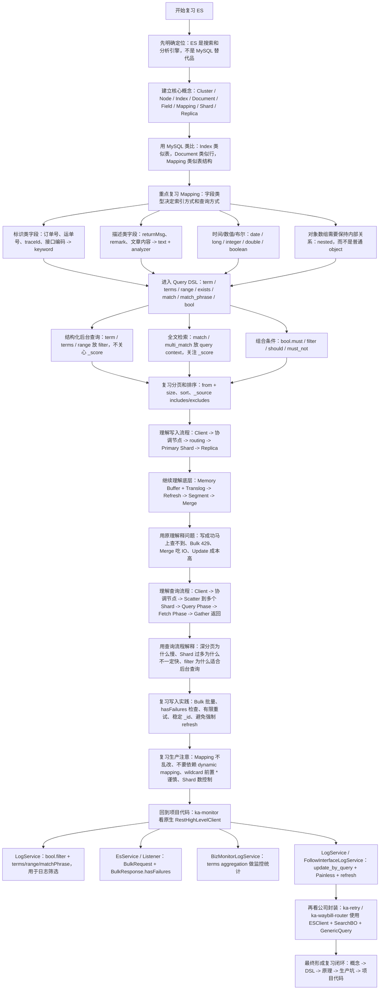
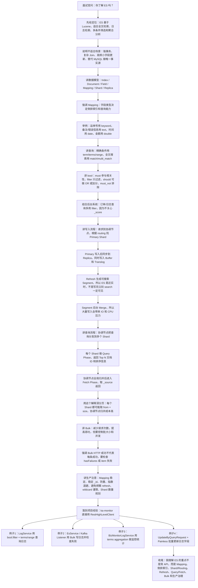

# Elasticsearch 类型、常用命令与核心原理总结

## 目录

- [1. 学习主线](#1-学习主线)
- [2. 核心概念](#2-核心概念)
- [3. 常见字段类型](#3-常见字段类型)
  - [3.1 keyword](#31-keyword)
  - [3.2 text](#32-text)
  - [3.3 text + keyword 双字段](#33-text-keyword-双字段)
  - [3.4 数字类型](#34-数字类型)
  - [3.5 date](#35-date)
  - [3.6 boolean](#36-boolean)
  - [3.7 object](#37-object)
  - [3.8 nested](#38-nested)
  - [3.9 其他常见类型](#39-其他常见类型)
- [4. 常用索引命令](#4-常用索引命令)
  - [4.1 查看所有索引](#41-查看所有索引)
  - [4.2 查看索引详情](#42-查看索引详情)
  - [4.3 查看 Mapping](#43-查看-mapping)
  - [4.4 查看 Settings](#44-查看-settings)
  - [4.5 创建索引](#45-创建索引)
  - [4.6 删除索引](#46-删除索引)
- [5. Document CRUD](#5-document-crud)
  - [5.1 新增或全量覆盖](#51-新增或全量覆盖)
  - [5.2 查询单条文档](#52-查询单条文档)
  - [5.3 局部更新](#53-局部更新)
  - [5.4 删除文档](#54-删除文档)
- [6. 常用查询 DSL](#6-常用查询-dsl)
  - [6.1 term](#61-term)
  - [6.2 terms](#62-terms)
  - [6.3 match](#63-match)
  - [6.4 range](#64-range)
  - [6.5 exists](#65-exists)
  - [6.6 bool](#66-bool)
- [7. 排序、分页和聚合](#7-排序分页和聚合)
  - [7.1 排序](#71-排序)
  - [7.2 普通分页](#72-普通分页)
  - [7.3 深分页](#73-深分页)
  - [7.4 聚合](#74-聚合)
- [8. Bulk 批量写入](#8-bulk-批量写入)
  - [8.1 Bulk 和 Shard 的关系](#81-bulk-和-shard-的关系)
  - [8.2 Bulk 返回 200 不代表每条都成功](#82-bulk-返回-200-不代表每条都成功)
  - [8.3 Bulk 大小和并发](#83-bulk-大小和并发)
- [9. 写入流程](#9-写入流程)
  - [9.1 Routing](#91-routing)
  - [9.2 Primary 和 Replica](#92-primary-和-replica)
  - [9.3 Translog](#93-translog)
  - [9.4 Refresh](#94-refresh)
  - [9.5 Segment 和 Merge](#95-segment-和-merge)
  - [9.6 Update 为什么贵](#96-update-为什么贵)
- [10. 查询流程](#10-查询流程)
  - [10.1 Query Phase](#101-query-phase)
  - [10.2 Fetch Phase](#102-fetch-phase)
  - [10.3 倒排索引](#103-倒排索引)
  - [10.4 text 和 keyword 的本质区别](#104-text-和-keyword-的本质区别)
- [11. 生产注意事项](#11-生产注意事项)
  - [11.1 Mapping 要提前设计](#111-mapping-要提前设计)
  - [11.2 Mapping 不能随意改](#112-mapping-不能随意改)
  - [11.3 `_id` 要稳定](#113-_id-要稳定)
  - [11.4 避免强制 refresh](#114-避免强制-refresh)
  - [11.5 控制 Bulk 失败重试](#115-控制-bulk-失败重试)
  - [11.6 避免热点 Shard](#116-避免热点-shard)
  - [11.7 Shard 不是越多越好](#117-shard-不是越多越好)
  - [11.8 深分页要规避](#118-深分页要规避)
  - [11.9 wildcard 前缀模糊要谨慎](#119-wildcard-前缀模糊要谨慎)
  - [11.10 `index:false` 要理解](#1110-indexfalse-要理解)
- [12. 常用排查命令](#12-常用排查命令)
  - [12.1 集群健康](#121-集群健康)
  - [12.2 节点](#122-节点)
  - [12.3 索引](#123-索引)
  - [12.4 分片](#124-分片)
  - [12.5 Alias](#125-alias)
  - [12.6 Template](#126-template)
  - [12.7 写入和查询压力排查](#127-写入和查询压力排查)
- [13. 面试和工作中最重要的问题](#13-面试和工作中最重要的问题)
  - [13.1 text 和 keyword 区别](#131-text-和-keyword-区别)
  - [13.2 term 和 match 区别](#132-term-和-match-区别)
  - [13.3 为什么写成功后马上查不到？](#133-为什么写成功后马上查不到)
  - [13.4 Bulk 是否会把数据写到一个 Shard？](#134-bulk-是否会把数据写到一个-shard)
  - [13.5 大量写入会不会把 ES 打挂？](#135-大量写入会不会把-es-打挂)
  - [13.6 为什么深分页慢？](#136-为什么深分页慢)
  - [13.7 ES 为什么搜索快？](#137-es-为什么搜索快)
  - [13.8 Shard 和 Replica 的作用](#138-shard-和-replica-的作用)
  - [13.9 ES 适合什么场景？](#139-es-适合什么场景)
- [14. 一句话总复习](#14-一句话总复习)
- [15. 当前项目使用情况](#15-当前项目使用情况)
  - [15.1 总体分布](#151-总体分布)
  - [15.2 原生 RestHighLevelClient 接入](#152-原生-resthighlevelclient-接入)
  - [15.3 Bool 查询、Filter、Term、Terms、Range](#153-bool-查询filtertermtermsrange)
  - [15.4 text、keyword 和精确匹配](#154-textkeyword-和精确匹配)
  - [15.5 分页、排序和多索引查询](#155-分页排序和多索引查询)
  - [15.6 Bulk 批量写入](#156-bulk-批量写入)
  - [15.7 Update By Query 和 Refresh](#157-update-by-query-和-refresh)
  - [15.8 聚合 Aggregation](#158-聚合-aggregation)
  - [15.9 Wildcard 查询风险](#159-wildcard-查询风险)
  - [15.10 公司 es-client 封装使用](#1510-公司-es-client-封装使用)
  - [15.11 本项目复习重点](#1511-本项目复习重点)
- [16. 复习与面试讲解流程图](#16-复习与面试讲解流程图)
  - [16.1 复习思路流程图](#161-复习思路流程图)
  - [16.2 面试讲解思路流程图](#162-面试讲解思路流程图)
- [17. 参考来源](#17-参考来源)
  - [17.1 本次输入背景](#171-本次输入背景)
  - [17.2 Elastic 官方文档](#172-elastic-官方文档)
  - [17.3 JavaGuide 相关资料](#173-javaguide-相关资料)

## 1. 学习主线

Elasticsearch 不建议只背 API。后端开发更适合按这条线理解：

```text
核心概念
  -> Mapping 和字段类型
  -> 文档 CRUD
  -> Query DSL
  -> Bulk 写入
  -> 写入流程
  -> 查询流程
  -> 生产注意事项
```

一句话总结：

`Elasticsearch` 是面向搜索和分析的分布式文档存储系统，核心能力来自分片、副本、倒排索引、近实时搜索、Query DSL、聚合分析和批量写入。

## 2. 核心概念

可以用 MySQL 做类比，但不要完全等同：

| Elasticsearch | 类比 MySQL | 说明 |
| --- | --- | --- |
| Index | 表 / 库 | ES 的数据组织单位 |
| Document | 行 | 一条 JSON 文档 |
| Field | 列 | 文档字段 |
| Mapping | 表结构 | 字段类型、是否索引、分词规则等 |
| `_id` | 主键 | 文档唯一标识 |
| Shard | 分片 | Index 拆分后的 Lucene 索引 |
| Primary Shard | 主分片 | 写入入口 |
| Replica Shard | 副本分片 | 高可用和查询扩展 |
| Node | 实例 | ES 集群中的节点 |
| Cluster | 集群 | 多个节点组成 |

需要注意：

- 一条 Document 只会路由到某一个 Primary Shard。
- Replica 不提升写入吞吐，反而会增加复制成本。
- Replica 主要提供高可用，并能提升一定查询吞吐。
- 新版本 Elasticsearch 已经移除 Mapping Type；老版本 ES 5.x 仍可能看到 type 层级。

## 3. 常见字段类型

Elasticsearch 的字段类型决定两件事：

- 数据如何被索引
- 后续适合怎么查询、排序、聚合

### 3.1 keyword

`keyword` 用于结构化字符串，默认不分词，适合精确匹配、过滤、排序和聚合。

适合字段：

- 订单号
- 运单号
- 用户 ID
- 客户编码
- 手机号
- 枚举值
- 状态码
- 平台编码

示例：

```json
{
  "waybillNumber": {
    "type": "keyword"
  }
}
```

查询：

```json
GET order_index/_search
{
  "query": {
    "term": {
      "waybillNumber": "SF123456"
    }
  }
}
```

### 3.2 text

`text` 用于全文搜索，会经过 analyzer 分词。

适合字段：

- 商品名称
- 文章内容
- 备注
- 描述
- 评论

示例：

```json
{
  "remark": {
    "type": "text"
  }
}
```

查询：

```json
GET order_index/_search
{
  "query": {
    "match": {
      "remark": "用户签收"
    }
  }
}
```

注意：

- `text` 适合全文检索。
- `text` 默认不适合排序和聚合。
- 不要随便给 `text` 开启 `fielddata=true`，可能消耗大量 JVM Heap。

### 3.3 text + keyword 双字段

生产环境最常见的字符串设计：

```json
{
  "name": {
    "type": "text",
    "fields": {
      "keyword": {
        "type": "keyword"
      }
    }
  }
}
```

这样可以同时支持：

```text
name          -> match 全文搜索
name.keyword  -> term 精确查询 / sort 排序 / terms 聚合
```

### 3.4 数字类型

常见数字类型：

| ES 类型 | Java 类型 | 说明 |
| --- | --- | --- |
| `byte` | byte | 8 位整数 |
| `short` | short | 16 位整数 |
| `integer` | int | 32 位整数 |
| `long` | long | 64 位整数 |
| `float` | float | 单精度 |
| `double` | double | 双精度 |

常见设计：

```json
{
  "status": {
    "type": "integer"
  },
  "id": {
    "type": "long"
  },
  "amount": {
    "type": "double"
  }
}
```

注意：订单号、运单号、手机号虽然可能全是数字，但本质是标识，通常应使用 `keyword`，不要用 `long`。

### 3.5 date

日期类型适合创建时间、更新时间、签收时间、支付时间等。

```json
{
  "createTime": {
    "type": "date",
    "format": "yyyy-MM-dd HH:mm:ss||epoch_millis"
  }
}
```

范围查询：

```json
GET order_index/_search
{
  "query": {
    "range": {
      "createTime": {
        "gte": "2026-08-01 00:00:00",
        "lte": "2026-08-13 23:59:59"
      }
    }
  }
}
```

### 3.6 boolean

```json
{
  "isDeleted": {
    "type": "boolean"
  }
}
```

适合是否删除、是否有效、是否成功等字段。

### 3.7 object

`object` 用于普通 JSON 对象。

```json
{
  "user": {
    "properties": {
      "id": {
        "type": "long"
      },
      "name": {
        "type": "keyword"
      }
    }
  }
}
```

适合普通嵌套结构，但如果是对象数组且查询时要保持同一个对象内部字段关系，就要考虑 `nested`。

### 3.8 nested

`nested` 用于对象数组，并且需要保持数组中每个对象的字段关联关系。

例如：

```json
{
  "items": [
    {
      "name": "苹果",
      "price": 10
    },
    {
      "name": "香蕉",
      "price": 20
    }
  ]
}
```

如果要查询“同一个 item 里 name=苹果 且 price=10”，应使用 `nested`。

Mapping：

```json
{
  "items": {
    "type": "nested",
    "properties": {
      "name": {
        "type": "keyword"
      },
      "price": {
        "type": "double"
      }
    }
  }
}
```

查询：

```json
GET order_index/_search
{
  "query": {
    "nested": {
      "path": "items",
      "query": {
        "bool": {
          "filter": [
            {
              "term": {
                "items.name": "苹果"
              }
            },
            {
              "term": {
                "items.price": 10
              }
            }
          ]
        }
      }
    }
  }
}
```

### 3.9 其他常见类型

| 类型 | 场景 |
| --- | --- |
| `ip` | IPv4 / IPv6 |
| `geo_point` | 经纬度点 |
| `geo_shape` | 地理形状 |
| `binary` | Base64 二进制 |
| `flattened` | 不固定结构的 JSON 对象 |
| `wildcard` | 面向通配符查询优化的 keyword 家族字段 |
| `dense_vector` / `sparse_vector` | 向量检索 |
| `semantic_text` | 新版本语义搜索场景 |

Java 后端日常最常用的还是：

```text
keyword / text / integer / long / double / boolean / date / object / nested
```

## 4. 常用索引命令

### 4.1 查看所有索引

```http
GET _cat/indices?v
```

按名称过滤：

```http
GET _cat/indices/order_*?v
```

### 4.2 查看索引详情

```http
GET order_index
```

### 4.3 查看 Mapping

```http
GET order_index/_mapping
```

### 4.4 查看 Settings

```http
GET order_index/_settings
```

### 4.5 创建索引

```json
PUT order_index
{
  "settings": {
    "number_of_shards": 3,
    "number_of_replicas": 1
  },
  "mappings": {
    "properties": {
      "id": {
        "type": "long"
      },
      "waybillNumber": {
        "type": "keyword"
      },
      "remark": {
        "type": "text"
      },
      "status": {
        "type": "integer"
      },
      "createTime": {
        "type": "date",
        "format": "yyyy-MM-dd HH:mm:ss||epoch_millis"
      }
    }
  }
}
```

### 4.6 删除索引

```http
DELETE order_index
```

生产环境禁止随手执行：

```http
DELETE *
```

## 5. Document CRUD

### 5.1 新增或全量覆盖

```json
PUT order_index/_doc/10001
{
  "waybillNumber": "SF123456",
  "status": 1,
  "remark": "用户已签收"
}
```

### 5.2 查询单条文档

```http
GET order_index/_doc/10001
```

### 5.3 局部更新

```json
POST order_index/_update/10001
{
  "doc": {
    "status": 2
  }
}
```

注意：ES 更新不是传统数据库那种原地修改。可以粗略理解成旧文档标记删除，新文档重新写入索引。

### 5.4 删除文档

```http
DELETE order_index/_doc/10001
```

## 6. 常用查询 DSL

### 6.1 term

精确匹配，适合 `keyword`、数字、布尔值。

```json
GET order_index/_search
{
  "query": {
    "term": {
      "status": 1
    }
  }
}
```

### 6.2 terms

类似 SQL 的 `IN`。

```json
GET order_index/_search
{
  "query": {
    "terms": {
      "status": [1, 2, 3]
    }
  }
}
```

### 6.3 match

全文搜索，适合 `text`。

```json
GET order_index/_search
{
  "query": {
    "match": {
      "remark": "用户签收"
    }
  }
}
```

### 6.4 range

范围查询。

```json
GET order_index/_search
{
  "query": {
    "range": {
      "amount": {
        "gte": 100,
        "lte": 500
      }
    }
  }
}
```

常用操作符：

```text
gt  >
gte >=
lt  <
lte <=
```

### 6.5 exists

字段存在查询。

```json
GET order_index/_search
{
  "query": {
    "exists": {
      "field": "waybillNumber"
    }
  }
}
```

注意：`exists` 不能完全等同 SQL 的 `IS NOT NULL`，要结合字段是否被索引、空数组、null 等写入行为理解。

### 6.6 bool

业务系统最常用查询。

```json
GET order_index/_search
{
  "query": {
    "bool": {
      "must": [
        {
          "match": {
            "remark": "签收"
          }
        }
      ],
      "filter": [
        {
          "term": {
            "status": 1
          }
        },
        {
          "range": {
            "createTime": {
              "gte": "2026-08-01 00:00:00"
            }
          }
        }
      ],
      "must_not": [
        {
          "term": {
            "isDeleted": true
          }
        }
      ]
    }
  }
}
```

| bool 子句 | 含义 | 是否关注评分 |
| --- | --- | --- |
| `must` | 必须匹配 | 通常影响 `_score` |
| `filter` | 必须匹配 | 不计算相关性评分 |
| `should` | 可选匹配 | 可用于 OR 或提升相关性 |
| `must_not` | 必须不匹配 | 不计算相关性评分 |

后台管理、订单、运单、状态查询这类结构化查询，能用 `filter` 的地方优先用 `filter`。

## 7. 排序、分页和聚合

### 7.1 排序

```json
GET order_index/_search
{
  "sort": [
    {
      "createTime": {
        "order": "desc"
      }
    }
  ]
}
```

注意：

- `keyword`、数字、日期适合排序。
- `text` 不适合直接排序。
- 如果字段是 `text + keyword`，排序通常使用 `name.keyword`。

### 7.2 普通分页

```json
GET order_index/_search
{
  "from": 0,
  "size": 20,
  "query": {
    "match_all": {}
  }
}
```

### 7.3 深分页

不要在大数据量下使用很深的：

```json
{
  "from": 100000,
  "size": 20
}
```

原因：

```text
每个 Shard 都可能要取 from + size 个候选结果
  -> 协调节点归并排序
  -> 丢弃前 from 条
  -> 返回 size 条
```

深分页优先考虑：

- `search_after`
- PIT + `search_after`
- 老版本批量导出可能使用 `scroll`

### 7.4 聚合

类似 SQL 的 `GROUP BY`。

```json
GET order_index/_search
{
  "size": 0,
  "aggs": {
    "status_count": {
      "terms": {
        "field": "status"
      }
    }
  }
}
```

常见聚合：

- `terms`
- `avg`
- `sum`
- `min`
- `max`
- `cardinality`
- `date_histogram`

## 8. Bulk 批量写入

Bulk 用来批量执行 index、create、update、delete。

示例：

```http
POST _bulk
{ "index": { "_index": "order_index", "_id": "10001" } }
{ "waybillNumber": "SF123456", "status": 1 }
{ "index": { "_index": "order_index", "_id": "10002" } }
{ "waybillNumber": "SF123457", "status": 1 }
```

### 8.1 Bulk 和 Shard 的关系

Bulk 只是批量提交，不代表一批数据落到同一个 Shard。

ES 会对 Bulk 中每条文档分别计算 routing：

```text
Bulk 1000 条
  -> doc1 根据 routing 到 shard 0
  -> doc2 根据 routing 到 shard 2
  -> doc3 根据 routing 到 shard 1
```

如果显式指定相同 routing，大量文档可能落到同一个 Shard，造成热点。

### 8.2 Bulk 返回 200 不代表每条都成功

Bulk 响应中有整体状态，也有每个 item 的状态。

必须检查：

```json
{
  "errors": true,
  "items": []
}
```

处理原则：

- 成功的不要重复写。
- 临时失败，例如 429，可以退避重试。
- Mapping 冲突、字段格式错误等永久失败，不要无限重试。
- 失败数据要记录日志、落库或进入死信队列。

### 8.3 Bulk 大小和并发

Bulk 不是越大越好。

需要控制：

- 单批文档数
- 单批字节大小
- 并发 Bulk 数
- 失败重试节奏
- Kafka Consumer 消费速度

对于 `MySQL -> Canal -> Kafka -> ES` 场景：

```text
Kafka 积压不一定是故障
它也可能是在保护下游 ES
```

不要只看 Kafka lag 就无限增加 Consumer。要同时看 ES CPU、Heap、GC、磁盘 IO、写线程池、429、Merge 压力。

## 9. 写入流程

完整写入链路可以这样记：

```text
Java Client
  -> Coordinating Node
  -> Routing
  -> Primary Shard
  -> Replica Shard
  -> Memory Buffer
  -> Translog
  -> Refresh
  -> Segment
  -> Merge
```

### 9.1 Routing

写入时，ES 根据 routing 决定文档进入哪个 Primary Shard。

默认一般和 `_id` 有关。

自定义 routing 要谨慎，因为相同 routing 会把数据固定到同一个 Shard，可能形成写热点。

### 9.2 Primary 和 Replica

写入先到 Primary Shard，再复制到 Replica。

这能保证同一个 Shard 上写入顺序和一致性控制。

### 9.3 Translog

Translog 是写入恢复日志。

它解决的问题是：数据已经写入内存缓冲但还没有完全落成最终 Lucene Segment 时，如果节点异常，仍然可以通过日志恢复。

### 9.4 Refresh

写入成功不等于立刻可以被 search 搜到。

ES 是近实时搜索：

```text
写入成功
  -> Memory Buffer
  -> refresh
  -> 生成可搜索 Segment
  -> search 可见
```

不要频繁使用 `refresh=true`，它会产生更多小 Segment，增加写入、查询和 Merge 成本。

### 9.5 Segment 和 Merge

Lucene 底层由多个不可变 Segment 组成。

写入和 refresh 会产生新 Segment。

Segment 太多会增加查询和资源管理成本，所以后台会 Merge：

```text
小 Segment
  -> 合并
  -> 大 Segment
```

大量写入时，Merge 会消耗 CPU 和磁盘 IO，这也是 ES 写入压力过大时容易变慢甚至 429 的重要原因。

### 9.6 Update 为什么贵

ES 文档更新不是原地修改，可以粗略理解为：

```text
旧文档标记删除
  + 新文档重新写入
```

所以 ES 不适合超高频局部字段更新。

## 10. 查询流程

查询流程可以这样记：

```text
Java Client
  -> Coordinating Node
  -> Scatter 到多个 Shard
  -> 每个 Shard 查询倒排索引
  -> 每个 Shard 返回 Top N
  -> Coordinating Node 全局归并排序
  -> Fetch 文档内容
  -> 返回结果
```

### 10.1 Query Phase

每个 Shard 先执行查询，返回候选文档 ID、排序值、评分等轻量结果。

协调节点负责做全局排序，确定最终需要哪些文档。

### 10.2 Fetch Phase

协调节点根据 Query Phase 确定的文档 ID，到对应 Shard 拉取 `_source` 或指定字段。

### 10.3 倒排索引

倒排索引可以理解为：

```text
词项 -> 包含这个词项的文档列表
```

例如：

```text
苹果 -> doc1, doc2
手机 -> doc1, doc3
```

这就是 ES 能快速做全文检索的核心结构。

### 10.4 text 和 keyword 的本质区别

`text`：

```text
原始文本
  -> analyzer 分词
  -> 多个 term
  -> 倒排索引
```

`keyword`：

```text
整个字段值
  -> 一个 term
  -> 倒排索引
```

所以：

- `match` 更适合 `text`
- `term` 更适合 `keyword`
- 排序和聚合优先用 `keyword` 或数字、日期字段

## 11. 生产注意事项

### 11.1 Mapping 要提前设计

核心业务索引不要完全依赖 Dynamic Mapping。

风险示例：

```text
第一次写入 orderNo = 123456
  -> ES 推断为 long
后续写入 orderNo = "SF123456"
  -> 类型冲突
```

### 11.2 Mapping 不能随意改

字段类型一旦建立，很多参数不能直接修改。

常见变更流程：

```text
创建新索引
  -> 设置新 Mapping
  -> Reindex 或重新同步
  -> 切换 Alias
  -> 删除旧索引
```

### 11.3 `_id` 要稳定

数据同步场景推荐使用数据库主键或业务唯一键作为 ES `_id`。

这样 Kafka 重复消费时可以覆盖同一文档，减少重复数据。

### 11.4 避免强制 refresh

默认写入后等待自动 refresh 即可。

如果业务必须写后立即查，可以考虑：

- `refresh=wait_for`
- 查询主库或业务库
- 业务上做最终一致性设计

不要把 `refresh=true` 当成默认写入参数。

### 11.5 控制 Bulk 失败重试

重试要分类：

- 429、临时网络异常：可指数退避重试
- Mapping 冲突、字段格式错误：记录失败，不要无限重试

### 11.6 避免热点 Shard

热点来源：

- 自定义 routing 过于集中
- 时间类索引写入全部打到同一时间窗口
- Shard 数设计不合理
- Bulk 并发过高

### 11.7 Shard 不是越多越好

Shard 太少会限制并行能力。

Shard 太多会增加：

- 集群状态管理成本
- 文件句柄
- Heap 压力
- 查询 fan-out 成本
- 结果归并成本

### 11.8 深分页要规避

后台导出、大批量滚动处理，不要使用很大的 `from + size`。

优先考虑：

- `search_after`
- PIT
- scroll，主要用于老场景或批处理

### 11.9 wildcard 前缀模糊要谨慎

类似：

```json
{
  "wildcard": {
    "waybillNumber": "*123*"
  }
}
```

这种类似 SQL 的 `LIKE '%123%'`，数据量大时很容易慢。

### 11.10 `index:false` 要理解

字段设置：

```json
{
  "fileInfo": {
    "type": "text",
    "index": false
  }
}
```

表示：

```text
_source 中保存
但不建立可搜索索引
所以不能正常按该字段搜索
```

存储不等于可搜索。

## 12. 常用排查命令

### 12.1 集群健康

```http
GET _cluster/health
```

状态：

```text
green  -> 主分片和副本都正常
yellow -> 主分片正常，部分副本未分配
red    -> 存在主分片异常
```

### 12.2 节点

```http
GET _cat/nodes?v
```

### 12.3 索引

```http
GET _cat/indices?v
```

### 12.4 分片

```http
GET _cat/shards?v
```

### 12.5 Alias

```http
GET _cat/aliases?v
```

### 12.6 Template

新版本：

```http
GET _index_template
```

老版本：

```http
GET _template
```

### 12.7 写入和查询压力排查

```http
GET _cat/thread_pool/write?v

GET _nodes/stats/jvm,thread_pool,fs,indices
```

大量写入重点看：

- CPU
- JVM Heap
- GC
- 磁盘 IO
- write thread pool
- 429 / rejected
- refresh
- merge
- segment 数
- shard 分布
- Kafka lag

## 13. 面试和工作中最重要的问题

### 13.1 text 和 keyword 区别

`text` 会分词，适合全文检索。

`keyword` 不分词，适合精确匹配、过滤、排序、聚合。

### 13.2 term 和 match 区别

`term` 是精确项查询，适合 `keyword`、数字、布尔。

`match` 会对查询文本做分析，适合 `text` 全文检索。

### 13.3 为什么写成功后马上查不到？

因为 ES 是近实时搜索。写入成功后，需要 refresh 生成可搜索 Segment，普通 search 才能看到。

### 13.4 Bulk 是否会把数据写到一个 Shard？

不一定。Bulk 中每条文档都会单独计算 routing。

只有显式使用相同 routing 或 `_id` 分布极端不均时，才可能集中到少数 Shard。

### 13.5 大量写入会不会把 ES 打挂？

会。准确说是写入速度持续超过 ES 处理能力时，会导致 CPU、Heap、磁盘 IO、Merge、线程池队列压力上升，最终出现 429、超时、GC 或节点异常。

### 13.6 为什么深分页慢？

分布式查询下，每个 Shard 都可能要返回 `from + size` 个候选结果，协调节点再归并排序并丢弃前 `from` 条。

### 13.7 ES 为什么搜索快？

核心是倒排索引。

它不是按文档逐条扫描，而是通过“词项 -> 文档列表”的结构快速定位候选文档。

### 13.8 Shard 和 Replica 的作用

Shard 负责水平拆分数据。

Replica 负责高可用和提升查询能力。

Replica 不提升写入吞吐。

### 13.9 ES 适合什么场景？

适合：

- 全文检索
- 日志检索
- 多条件筛选
- 聚合分析
- 读多写少或追加型写入
- 后台搜索、订单/运单检索

不适合：

- 强事务
- 复杂 Join
- 高频小字段更新
- 替代 MySQL 作为唯一事实源

## 14. 一句话总复习

ES 的核心是：

```text
Mapping 决定字段怎么索引
倒排索引决定为什么查得快
Routing 决定文档写到哪个 Shard
Primary/Replica 决定写入和高可用
Refresh 决定写后何时可见
Segment/Merge 决定写入和查询成本
Query/Fetch 决定分布式查询流程
Bulk 提高吞吐但必须控制大小、并发和失败重试
```

## 15. 当前项目使用情况

扫描目录：`D:\ai-work-project`

扫描时间：`2026-08-13`

### 15.1 总体分布

当前项目里 ES 主要有两类使用方式：

- `ka-monitor`：直接使用原生 `RestHighLevelClient`，代码里能看到 `SearchRequest`、`SearchSourceBuilder`、`BoolQueryBuilder`、`QueryBuilders`、`BulkRequest`、`UpdateByQueryRequest`、`AggregationBuilders` 等，属于最适合结合本笔记复习的项目。
- `ka-retry`、`ka-waybill-router`、`ka-operation`：启用了公司封装的 `es-client`，通过 `@EnableESClient`、`ESClient`、`SearchBO`、`GenericQuery`、`IndexParameter`、`IndexQueryParam` 操作 ES。

可以把它理解成：

```text
ka-monitor
  -> 原生 ES Java API，用于日志写入、日志查询、聚合统计、按条件更新

ka-retry / ka-waybill-router / ka-operation
  -> 公司 es-client 封装，用于按业务字段查询、按日期索引写入/更新
```

### 15.2 原生 RestHighLevelClient 接入

`D:\ai-work-project\ka-monitor\ka-monitor-provider\src\main\java\com\kyexpress\ka\monitor\provider\config\ElasticsearchConfig.java`

项目中通过 `RestClient.builder(...)` 创建 `RestHighLevelClient`，并配置：

- ES 节点地址：`elasticsearch.clusterNodes`
- 账号密码：`elasticsearch.username` / `elasticsearch.password`
- 连接超时、读超时、连接申请超时
- 最大连接数、每路由最大连接数
- KeepAlive 策略

这部分对应本笔记里的“Java 客户端接入”和“生产连接配置”。日志监控这种高频查询/写入场景，连接池和超时配置会直接影响稳定性。

### 15.3 Bool 查询、Filter、Term、Terms、Range

`D:\ai-work-project\ka-monitor\ka-monitor-provider\src\main\java\com\kyexpress\ka\monitor\provider\service\monitor\LogService.java`

该类是 ES 查询最典型的落地点。代码中通过 `SearchRequest`、`SearchSourceBuilder`、`BoolQueryBuilder` 和 `QueryBuilders` 构造日志查询。

实际字段包括：

```text
monitorStatisticId
requestDate
interfaceCode
customerCode
platformFlag
appKey
traceId
successFlag
riskLevel
returnCode
returnMsg
requestArgs
responseArgs
workOrderNumber
```

项目里大多数条件都放在 `boolQuery.filter(...)` 里，说明业务主要是后台日志筛选，不关心 `_score` 相关性排序。这和笔记里的结论一致：

```text
结构化业务条件
  -> term / terms / range
  -> bool.filter
  -> 只判断匹配，不计算相关性
```

`RouteMonitorLogService.java` 也有类似模式，使用 `createTime` 范围查询，以及 `platformFlag`、`customerCode`、`appKey`、`interfaceCode`、`waybillNumber`、`requestIp`、`traceId` 等精确过滤字段。

### 15.4 text、keyword 和精确匹配

`D:\ai-work-project\ka-monitor\ka-monitor-provider\src\main\java\com\kyexpress\ka\monitor\provider\service\monitor\MergeRecordService.java`

该类能看到：

```java
QueryBuilders.termQuery("logId.keyword", mergeLogId)
QueryBuilders.termQuery("waybillNumber.keyword", waybillNumber)
QueryBuilders.termQuery("id.keyword", mergeLogId)
```

这正好对应笔记里的 `text + keyword` 双字段设计：

```text
字段本身
  -> text，可用于全文检索

字段.keyword
  -> keyword，可用于精确匹配、排序、聚合
```

在项目里，`logId`、`waybillNumber`、`id` 这类字段本质是标识，不应该按自然语言分词，所以查询 `.keyword` 是合理的。

### 15.5 分页、排序和多索引查询

`LogService.java`、`InternalOpenService.java`、`FollowInfoService.java` 等类都使用：

```java
sourceBuilder.from((pageNum - 1) * pageSize);
sourceBuilder.size(pageSize);
sourceBuilder.sort(...);
```

这对应普通 `from + size` 分页。项目中的日志查询大多是后台页面查询，页数可控时问题不大；如果后续出现大页码导出或深分页，应优先考虑 `search_after`、`scroll` 或公司 `es-client` 封装的 `queryByScroll` / `searchAfter`。

项目还大量存在按日期或按月索引查询，例如先根据时间范围获取实际索引，再执行 `SearchRequest(indexList)`。这和你之前遇到的多索引 alias 报错也能串起来：

- `_search` 可以跨多个索引或 alias。
- `_explain`、单文档 `get/update/delete` 这类单索引操作，要明确具体 index。

### 15.6 Bulk 批量写入

项目中多个位置使用 Bulk：

- `D:\ai-work-project\ka-monitor\ka-monitor-provider\src\main\java\com\kyexpress\ka\monitor\provider\service\monitor\EsService.java`
- `D:\ai-work-project\ka-monitor\ka-monitor-provider\src\main\java\com\kyexpress\ka\monitor\provider\listener\monitor\kafka\ExternalLogAsyncListener.java`
- `D:\ai-work-project\ka-monitor\ka-monitor-provider\src\main\java\com\kyexpress\ka\monitor\provider\listener\monitor\rocket\StandardLogRetryRocketMQListener.java`
- `D:\ai-work-project\ka-monitor\ka-monitor-provider\src\main\java\com\kyexpress\ka\monitor\provider\runner\EsSummaryRunner.java`

典型逻辑是：

```java
BulkRequest request = new BulkRequest();
request.add(new IndexRequest(...).source(...));
BulkResponse bulkResponse = restHighLevelClient.bulk(request, RequestOptions.DEFAULT);
if (bulkResponse.hasFailures()) {
    log.warn(...);
}
```

这对应笔记里的 Bulk 注意点：

- Bulk 是减少请求次数，不是一次越大越好。
- Bulk 返回成功后仍要检查 `hasFailures()`。
- 出现部分失败时，要记录失败原因，必要时重试或补偿。
- `EsService.callEsBulk(...)` 使用 `@Retryable(maxAttempts = 5, backoff = @Backoff(delay = 2000, multiplier = 2))`，对应“有限次数 + 退避重试”的生产实践。

### 15.7 Update By Query 和 Refresh

`D:\ai-work-project\ka-monitor\ka-monitor-provider\src\main\java\com\kyexpress\ka\monitor\provider\service\monitor\LogService.java`

`D:\ai-work-project\ka-monitor\ka-monitor-provider\src\main\java\com\kyexpress\ka\monitor\provider\service\notify\workorder\FollowInterfaceLogService.java`

项目中使用 `UpdateByQueryRequest` 按条件批量更新日志字段，能看到：

```java
updateByQuery.setSlices(2);
updateByQuery.setConflicts("proceed");
updateByQuery.setRefresh(true);
updateByQuery.setQuery(boolQueryBuilder);
updateByQuery.setScript(new Script(ScriptType.INLINE, "painless", builder.toString(), params));
```

这里对应几个知识点：

- `update_by_query` 本质是先查出匹配文档，再批量更新。
- `Painless Script` 用于修改 `_source` 字段。
- `setConflicts("proceed")` 表示遇到版本冲突继续执行。
- `setRefresh(true)` 会让更新后更快可搜索，但也会增加刷新成本，不适合高频滥用。
- `setSlices(2)` 用于分片并行执行，提高批量更新效率。

### 15.8 聚合 Aggregation

`D:\ai-work-project\ka-monitor\ka-monitor-provider\src\main\java\com\kyexpress\ka\monitor\provider\service\monitor\BizMonitorLogService.java`

项目中使用：

```java
TermsAggregationBuilder bizGroup = AggregationBuilders.terms("bizGroup").field(groupField).size(AGGREGATION_SIZE);
TermsAggregationBuilder appNameGroup = AggregationBuilders.terms("appNameGroup").field(FieldKeyConstant.APPNAME).size(AGGREGATION_SIZE);
bizGroup.subAggregation(appNameGroup);
sourceBuilder.aggregation(aggregationBuilder);
```

这对应笔记中的 `terms` 聚合和子聚合，实际用于按客户、应用、平台、风险等级等维度做监控统计。

### 15.9 Wildcard 查询风险

`D:\ai-work-project\ka-monitor\ka-monitor-provider\src\main\java\com\kyexpress\ka\monitor\provider\service\monitor\InternalOpenService.java`

项目中存在：

```java
QueryBuilders.wildcardQuery("interfaceCode", "*" + keyword + "*")
QueryBuilders.wildcardQuery("interfaceName", "*" + keyword + "*")
```

这正好对应笔记里的生产注意事项：前置 `*` 的 wildcard 类似 SQL 的 `LIKE '%xxx%'`，数据量大时可能比较重。当前代码外层还有时间范围、环境、`appKey` 等 filter 条件，可以减少扫描范围；如果后续性能压力明显，应考虑改造为更适合搜索的字段设计或分词方案。

### 15.10 公司 es-client 封装使用

`D:\ai-work-project\ka-retry\ka-retry-provider\src\main\java\com\kyexpress\ka\retry\provider\service\KaRetryPushRecordEsService.java`

`D:\ai-work-project\ka-waybil-router\ka-waybill-router-provider\src\main\java\com\kyexpress\ka\waybill\router\provider\service\es\TmsRouteDataESService.java`

`D:\ai-work-project\ka-waybil-router\ka-waybill-router-provider\src\main\java\com\kyexpress\ka\waybill\router\provider\service\es\RoutePushRecordEsService.java`

这些类使用公司 `ESClient`，典型对象是：

```text
SearchBO
GenericBO
GenericQuery
Pagination
IndexParameter
IndexQueryParam
```

实际场景包括：

- 根据 `bizId`、`bizCode` 查询重试推送记录。
- 根据 `routeMd5`、`waybillNumber`、`enabledFlag` 查询路由数据。
- 根据运单号、平台标识、节点、`routeMd5` 查询路由推送记录。
- 根据业务日期通过 `getIndexsByParam(...)` 找到实际分区索引。
- 使用 `insertSelective(...)`、`update(...)`、`updateSelective(...)` 写入或更新 ES 文档。

这说明项目里既有原生 DSL 写法，也有公司封装写法。复习时可以这样对应：

```text
原生 ES API
  -> 看 ka-monitor

公司 es-client 封装
  -> 看 ka-retry / ka-waybill-router / ka-operation
```

### 15.11 本项目复习重点

结合当前项目，ES 这份笔记最应该重点复习：

- `keyword` 与 `text` 的区别，特别是 `.keyword` 精确查询。
- `term` / `terms` / `range` / `match` / `match_phrase` 的适用场景。
- `bool.filter` 适合后台结构化查询，不关心 `_score`。
- `from + size` 普通分页和深分页风险。
- 多索引、按月索引、alias 查询和单索引操作的区别。
- Bulk 批量写入必须检查 `hasFailures()`。
- `update_by_query`、`Painless`、`refresh`、版本冲突处理。
- `terms` 聚合和子聚合。
- wildcard 前置模糊查询的性能风险。

## 16. 复习与面试讲解流程图

### 16.1 复习思路流程图

这份笔记复习时不要从命令开始背，建议按“业务为什么用 ES -> 数据怎么建模 -> 写入怎么落盘 -> 查询怎么执行 -> 生产怎么避坑 -> 项目代码怎么对应”的顺序走。



复习时可以按这个节奏给自己提问：

```text
1. 这个字段为什么用 keyword，而不是 text？
2. 这个查询为什么放 filter，而不是 must？
3. 这次写入为什么要 Bulk？
4. Bulk 成功返回后为什么还要看 hasFailures？
5. 写成功后马上查不到，和 refresh 有什么关系？
6. from 很大为什么慢？
7. 这个项目里哪个类能对应这个知识点？
```

### 16.2 面试讲解思路流程图

面试讲 ES 时，建议不要一上来背命令。更顺的讲法是：先讲“为什么用”，再讲“怎么存、怎么写、怎么查”，最后讲“生产怎么用稳”。



面试可以压缩成一段话：

```text
我一般从三个层面理解 ES。
第一是数据建模，Mapping 决定字段怎么被索引，比如运单号、traceId 这种标识字段要用 keyword，错误信息、备注这种全文内容才用 text。
第二是执行流程，写入会根据 routing 找到 Primary Shard，再复制到 Replica，并经过 translog、refresh、segment、merge；查询则是协调节点 scatter 到多个 shard，query phase 找 TopN，再 fetch source。
第三是生产使用，后台结构化查询尽量用 bool.filter，Bulk 要控制批大小和并发并检查 hasFailures，深分页、前置 wildcard、频繁 refresh、Mapping 变更都要谨慎。
项目里 ka-monitor 就有这些实践，比如 LogService 的 filter 查询、EsService 的 Bulk 写入、BizMonitorLogService 的 terms 聚合、LogService 的 update_by_query。
```

## 17. 参考来源

### 17.1 本次输入背景

- ChatGPT 对话：`ES类型和常用命令`
  - 用作本笔记的主题背景和问题清单。
  - 事实结论以 Elastic 官方文档为主。

### 17.2 Elastic 官方文档

- Field data types
  - https://www.elastic.co/docs/reference/elasticsearch/mapping-reference/mapping-types
- Text field type
  - https://www.elastic.co/docs/reference/elasticsearch/mapping-reference/text
- Keyword field type
  - https://www.elastic.co/docs/reference/elasticsearch/mapping-reference/keyword
- Nested field type
  - https://www.elastic.co/docs/reference/elasticsearch/mapping-reference/nested
- Bulk API
  - https://www.elastic.co/guide/en/elasticsearch/reference/8.19/docs-bulk.html
- Refresh parameter
  - https://www.elastic.co/docs/reference/elasticsearch/rest-apis/refresh-parameter
- Near real-time search
  - https://www.elastic.co/docs/manage-data/data-store/near-real-time-search
- Reading and writing documents
  - https://www.elastic.co/docs/deploy-manage/distributed-architecture/reading-and-writing-documents
- Translog settings
  - https://www.elastic.co/docs/reference/elasticsearch/index-settings/translog
- Search shard routing
  - https://www.elastic.co/docs/reference/elasticsearch/rest-apis/search-shard-routing
- Paginate search results
  - https://www.elastic.co/docs/reference/elasticsearch/rest-apis/paginate-search-results
- Sort search results
  - https://www.elastic.co/docs/reference/elasticsearch/rest-apis/sort-search-results
- Optimistic concurrency control
  - https://www.elastic.co/docs/reference/elasticsearch/rest-apis/optimistic-concurrency-control

### 17.3 JavaGuide 相关资料

- JavaGuide 数据库知识体系
  - https://javaguide.cn/database/
- JavaGuide Elasticsearch 标签页
  - https://javaguide.cn/tag/elasticsearch/
- JavaGuide GitHub 仓库
  - https://github.com/Snailclimb/JavaGuide
- JavaGuide ES 公开页说明
  - https://raw.githubusercontent.com/Snailclimb/JavaGuide/main/docs/database/elasticsearch/elasticsearch-questions-01.md

JavaGuide 开源页目前对 Elasticsearch 的公开内容主要是目录和付费专题入口，能确认其学习重点包括 ES 核心概念、倒排索引、分片副本、查询 DSL、聚合分析和集群调优。本笔记具体技术细节以 Elastic 官方文档为准。
