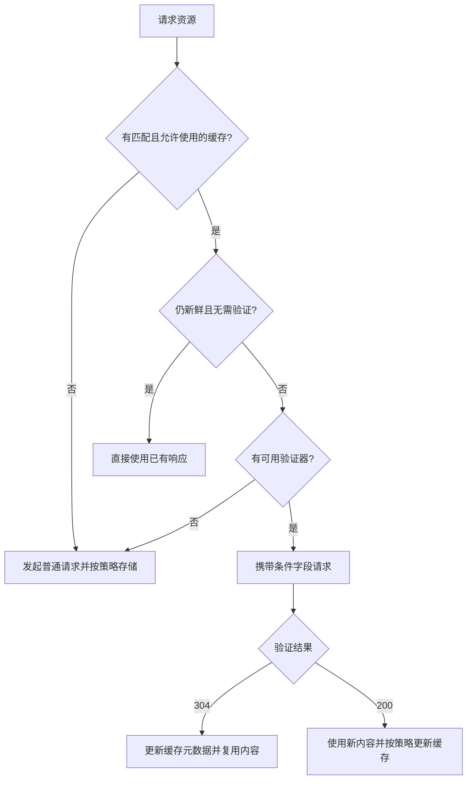

# 连接管理与缓存（08—11）

[返回网络知识导航](./README.md)

## 08. 长连接和短连接有什么区别？HTTP Keep-Alive 与 TCP Keepalive 有何区别？

### 是什么

短连接在一次交互后关闭；持久连接允许后续请求复用连接。HTTP/1.1 默认支持持久连接，但实际能否复用还取决于消息边界、双方行为和代理配置。

HTTP Keep-Alive 讨论“连接能否用于后续 HTTP 请求”；TCP Keepalive 是空闲 TCP 连接的存活探测机制，不能检测业务线程是否健康，也不能代替请求超时。

### 为什么

复用连接可以减少 TCP、TLS 握手及连接创建开销。但空闲连接占资源，并可能被服务器、负载均衡或 NAT 提前回收，需要合理的空闲过期和失效处理策略。

### 实际场景怎么用或排查

偶发出现“闲置一段时间后第一次调用失败”，检查各层 idle timeout 是否不一致，以及客户端是否复用了已失效连接。高并发下观察新建连接速率和连接池等待，而不是只看线程数量。

**易错点：** HTTP/1.1 不必每次显式发送 `Connection: keep-alive`；HTTP/2、HTTP/3 不使用这组 HTTP/1.x 连接管理字段；保持连接不意味着服务器必然持续推送数据。参考 [HTTP/1.x 连接管理](https://developer.mozilla.org/en-US/docs/Web/HTTP/Guides/Connection_management_in_HTTP_1.x)和 [TCP Keepalive](https://www.rfc-editor.org/rfc/rfc9293.html#section-3.8.4)。

## 09. 强缓存和协商缓存分别如何工作？

### 是什么

“强缓存”通常指缓存条目仍新鲜且满足复用条件，直接使用已有响应；“协商缓存”指向服务器或上游缓存发条件请求，验证已有表示是否仍可使用。

该图展示常规成功路径；错误、stale 策略及请求自身的缓存指令还需另外考虑。

### 为什么

直接复用节省网络往返和服务端处理；条件验证保留一次往返，但资源未变时可减少响应体传输。新鲜度、是否允许存储、是否允许复用是不同问题。

### 实际场景怎么用或排查

带内容版本的静态资源适合长时间缓存；变化频繁的页面可要求验证；敏感个人数据需明确 private/no-store 等策略。页面未更新时，分别检查浏览器缓存、CDN、反向代理、Service Worker 以及源站版本。

排查时查看 Cache-Control、Age、ETag、Vary 和浏览器“来自磁盘/内存缓存”的标记；本地缓存面板显示 200，不证明发生了网络传输。机制参考 [HTTP 缓存](https://developer.mozilla.org/zh-CN/docs/Web/HTTP/Guides/Caching)。

## 10. max-age、no-cache、no-store 有什么区别？

### 是什么

| 指令 | 典型响应语义 |
|---|---|
| max-age=60 | 新鲜度寿命为 60 秒，复用时还需考虑当前年龄与其他指令 |
| no-cache | 可以存储，但再次使用前必须成功验证 |
| no-store | 要求缓存不要存储此请求/响应相关内容 |
| private | 允许私有缓存存储，禁止共享缓存存储 |
| public | 明确允许共享缓存，仍需遵守其他规则 |
| s-maxage | 为共享缓存指定新鲜度寿命 |

### 为什么

“是否存储”“多久算新鲜”“复用前是否验证”需要独立控制。no-cache 适合保留验证能力，no-store 适合不希望缓存保存内容的情况。

### 实际场景怎么用或排查

带内容哈希的公开脚本可设置较长 max-age；个人资料页可按敏感性设置 private、no-cache 或 no-store。不能给所有已登录用户共用的 URL 随意标 public，否则可能让共享缓存复用错误用户的数据。

**易错点：** max-age 从响应年龄计算，不是每次读取都重新计时；no-store 不是清理历史缓存的万能指令；max-age=0 与 no-cache 的规范含义并不完全相同。细节参考 [Cache-Control](https://developer.mozilla.org/zh-CN/docs/Web/HTTP/Reference/Headers/Cache-Control)。

## 11. ETag、Last-Modified 和 304 如何配合完成缓存验证？

### 是什么

ETag 是服务端为选定表示生成的版本验证器，客户端把它作为不透明值使用，不要求一定是文件 MD5。Last-Modified 是表示的最后修改时间，HTTP 日期通常只有秒级精度。

| 响应验证器 | 常见条件请求字段 | 用法 |
|---|---|---|
| ETag | If-None-Match | GET/HEAD 验证已有缓存 |
| Last-Modified | If-Modified-Since | GET/HEAD 按修改时间验证 |
| 强 ETag | If-Match | 修改前校验版本，防止覆盖他人更新 |

### 为什么

一秒内多次修改、文件时间变化但内容未变等情况，会让修改时间的区分能力不足。ETag 可以按业务版本生成；强、弱 ETag 表达的相等强度不同，不能随意互换。

### 实际场景怎么用或排查

304 只用于符合条件的 GET/HEAD 验证结果，没有消息体。缓存接收方更新相关元数据并复用已保存的内容，因此会产生一次到验证方的请求，与直接使用新鲜缓存不同。

首次 GET 返回 `ETag: "v7"`，后续携带 `If-None-Match: "v7"`，未变化可返回 304。编辑资源时携带强 ETag 的 If-Match，版本不一致返回 412，并提示重新读取后再决定修改。

**易错点：** 同时有 If-None-Match 和 If-Modified-Since 时，前者优先；压缩格式等不同表示的验证器设计也要一致。数据库版本检查必须与实际更新原子结合，不能只在控制层提前查一下。参考 [HTTP 条件请求](https://developer.mozilla.org/en-US/docs/Web/HTTP/Guides/Conditional_requests)。

---

[返回导航与复习清单](./README.md)
