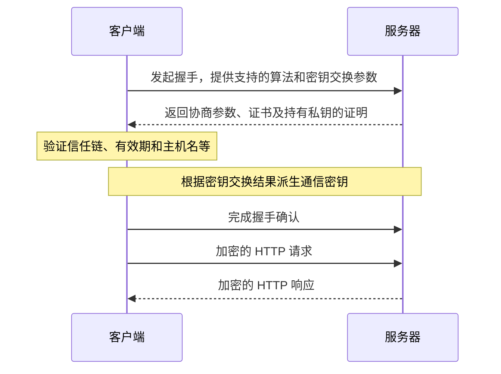

# HTTPS 与协议演进（12—13）

[返回网络知识导航](./README.md)

## 12. HTTPS 如何保证安全？握手和证书验证做了什么？

### 是什么

HTTPS 使用 TLS 保护 HTTP，主要提供机密性、完整性和服务器身份验证。HTTP 默认端口是 80，HTTPS 默认端口是 443，但端口可以自行配置。

握手要完成四件事：协商协议与算法、验证身份、协商并派生通信密钥、确认握手未被篡改。后续应用数据使用对称加密高效传输。

以常见的证书认证和临时密钥交换为例：

该图描述核心逻辑，实际消息顺序随 TLS 版本及恢复方式变化；不能把所有 TLS 都说成“用 RSA 加密并发送对称密钥”。

### 为什么

加密防止旁路窃听，完整性保护帮助检测修改，身份验证防止与冒充服务器的中间人建立连接。只有加密、没有身份验证，中间人仍可能分别与双方建立加密通道。

客户端通常检查证书链能否到达受信任的根、签名和约束是否有效、证书有效期，以及访问主机名是否匹配证书身份。服务器还必须证明持有对应私钥。

### 实际场景怎么用或排查

Java 调用证书报错，检查返回的完整证书链、JDK 信任库、URL 主机名和系统时间。浏览器可用但 Java 失败，不代表证书一定正常，两者的信任库、代理与 TLS 能力可能不同。

HTTPS 在网关终止时，要分别确认客户端到网关、网关到应用的保护方式。首次调用慢时拆解 DNS、建连、TLS 和响应阶段，观察连接复用能否减少握手开销。

**易错点：** 不要关闭证书或主机名校验来修复握手失败；HTTPS 也不会自动消除 XSS、CSRF 和越权。

参考 [TLS 说明](https://developer.mozilla.org/zh-CN/docs/Web/Security/Defenses/Transport_Layer_Security)、[TLS 1.3 标准](https://www.rfc-editor.org/rfc/rfc8446.html)和 [TLS 身份验证](https://www.rfc-editor.org/rfc/rfc9525.html)。

## 13. HTTP/1.1、HTTP/2、HTTP/3 有什么区别？

### 是什么

三者共享 HTTP 方法、状态码等核心语义，主要区别在消息编码、连接并发和底层传输。

| 版本 | 重点记忆 |
|---|---|
| HTTP/1.1 | 默认支持持久连接；常用多条连接并发请求；流水线存在响应排序限制 |
| HTTP/2 | 二进制帧、多路复用、头部压缩；多个请求在同一 TCP 连接中交错传输 |
| HTTP/3 | 使用基于 UDP 的 QUIC，支持多个独立有序流，传输层实现可靠交付 |

### 为什么

HTTP/2 改善同一连接中请求和响应的并发，但多个流仍共用 TCP 字节序列。发生丢包时，TCP 等待缺失字节，可能让同连接的其他流一起等待。

HTTP/3 通过 QUIC 按流维护交付顺序，减少这种跨流阻塞；同一流仍有有序性要求，各流也共享连接级拥塞控制，因此不能说完全没有阻塞。

### 实际场景怎么用或排查

分别检查浏览器到网关、网关到 Java 服务使用的实际协议，不能看到 HTTPS 就认定是 HTTP/2。结合连接数、实际并发、丢包和尾延迟评估协议效果。

如果瓶颈是业务锁等待或慢 SQL，单纯升级 HTTP 版本通常解决不了。面试能说明“多路复用解决了什么、为什么 HTTP/2 仍受 TCP 阻塞影响”即可，无需先展开 QUIC 帧细节。

参考 [HTTP 演进](https://developer.mozilla.org/en-US/docs/Web/HTTP/Guides/Evolution_of_HTTP)、[HTTP/2 标准](https://www.rfc-editor.org/rfc/rfc9113.html#section-2)和 [HTTP/3 标准](https://www.rfc-editor.org/rfc/rfc9114.html)。

---

[返回导航与复习清单](./README.md)
