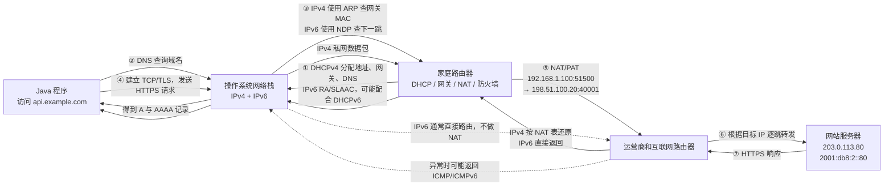

# 从连接 Wi-Fi 到 Java HTTPS 请求：DHCP、ARP、ICMP、IPv4、IPv6 与 NAT

[返回网络知识导航](./README.md)

本文用一个完整场景串联基础网络协议：笔记本连接家庭 Wi-Fi 后，Java 程序访问 `https://api.example.com/orders`。

> 说明：常见名称是 **ICMP**，不是 IMCP；这里将“NET”按网络场景中常见的 **NAT** 理解。示例使用 RFC 规定的文档地址，不代表真实公网服务。

## 1. 场景与地址

| 对象 | IPv4 | IPv6 | MAC 地址 |
|---|---|---|---|
| 笔记本 | `192.168.1.100/24` | `2001:db8:1::100/64` | `AA:AA:AA:AA:AA:AA` |
| 家庭路由器内网接口 | `192.168.1.1` | `2001:db8:1::1` | `BB:BB:BB:BB:BB:BB` |
| 家庭路由器公网接口 | `198.51.100.20` | `2001:db8:10::20` | 当前链路决定 |
| 网站服务器 | `203.0.113.80` | `2001:db8:2::80` | 最后一段链路决定 |

## 2. 完整通信过程



这条链路中，Java 主要负责应用层调用；操作系统负责 DNS、TCP、IP 和网卡发送，路由器负责跨网段转发、防火墙检查以及常见的 IPv4 NAT。

## 3. DHCP：设备先获得网络配置

设备刚接入 Wi-Fi 时只有 MAC 地址，还不知道自己的 IPv4 地址、子网掩码、默认网关和 DNS。DHCPv4 通过 DORA 四步完成配置：

```text
客户端                                           DHCP 服务器
  │ DHCP Discover：寻找 DHCP 服务器                  │
  ├────────────────────────────────────────────────>│
  │ DHCP Offer：提供 192.168.1.100                   │
  │<────────────────────────────────────────────────┤
  │ DHCP Request：请求使用该地址                      │
  ├────────────────────────────────────────────────>│
  │ DHCP ACK：确认地址、网关、DNS 和租期               │
  │<────────────────────────────────────────────────┤
```

初始 Discover 通常从 UDP `0.0.0.0:68` 发往 `255.255.255.255:67`。最终得到的配置可能是：

```text
IPv4 地址：192.168.1.100
子网掩码：255.255.255.0
默认网关：192.168.1.1
DNS：192.168.1.1
租期：24 小时
```

Java 程序通常不实现 DHCP 客户端。系统联网后，Java 通过操作系统提供的网络配置使用这些结果。

## 4. IPv6：RA、SLAAC 与 DHCPv6

IPv6 不一定依靠 DHCPv6 分配地址。路由器可以发送 ICMPv6 Router Advertisement（RA），公布网络前缀和默认路由器；主机再通过 SLAAC 自动生成 IPv6 地址。DHCPv6 可以补充地址或其他配置，具体取决于网络部署。

```text
路由器发送 RA：前缀 2001:db8:1::/64
主机形成地址：2001:db8:1::100/64
默认路由器：2001:db8:1::1
```

因此不能简单套用“IPv4 和 IPv6 都必须通过 DHCP 获得地址”。

## 5. DNS：Java 使用域名，系统找到 IP

Java 请求中的 URL 是域名。真正发送 IP 数据包前，需要先获得地址：

```text
api.example.com.  A     203.0.113.80
api.example.com.  AAAA  2001:db8:2::80
```

Java 可以通过 `InetAddress` 观察解析结果：

```java
InetAddress[] addresses = InetAddress.getAllByName("api.example.com");
for (InetAddress address : addresses) {
    String version = address instanceof Inet4Address ? "IPv4" : "IPv6";
    System.out.println(version + ": " + address.getHostAddress());
}
```

代码只获得候选地址。最终使用 IPv4 还是 IPv6，受 DNS 结果、JDK、操作系统配置和网络可达性影响，不能仅凭存在 AAAA 记录就断定一定走 IPv6。

## 6. ARP 与 NDP：找到当前链路的下一跳

笔记本根据目标 IP 和子网前缀判断服务器不在本地网段，因此把数据交给默认网关，而不是直接寻找公网服务器的 MAC 地址。

IPv4 使用 ARP：

```text
谁拥有 192.168.1.1？
192.168.1.1 回复：我的 MAC 是 BB:BB:BB:BB:BB:BB。
```

随后第一段链路中的数据包含：

```text
目标 MAC：BB:BB:BB:BB:BB:BB       当前下一跳
目标 IP：203.0.113.80              最终服务器
```

每经过一个路由器，二层 MAC 头会按新链路重新生成；在没有 NAT 的情况下，源和目标 IP 通常保持不变。ARP 只在本地 IPv4 广播域内工作，不会跨越互联网。

IPv6 不使用 ARP，而使用基于 ICMPv6 的 Neighbor Discovery Protocol（NDP），通过 Neighbor Solicitation 和 Neighbor Advertisement 等消息发现邻居和下一跳。

## 7. IPv4 与 NAT：私网地址共享公网地址

`192.168.1.100` 是私网 IPv4，不能直接在公网路由。家庭路由器通常执行带端口转换的 NAT/PAT：

```text
转换前：192.168.1.100:51500 → 203.0.113.80:443
转换后：198.51.100.20:40001 → 203.0.113.80:443
```

路由器记录映射关系：

| 内网连接 | 公网连接 |
|---|---|
| `192.168.1.100:51500` | `198.51.100.20:40001` |

服务器把响应发往 `198.51.100.20:40001`，路由器查询状态表并还原为 `192.168.1.100:51500`。NAT 改写地址或端口，但它不是 DNS，也不是用于选择互联网路径的路由协议。

## 8. IPv6：通常直接路由

IPv6 地址空间足够大，常见设计不需要用 NAT 解决地址不足：

```text
[2001:db8:1::100]:51500 → [2001:db8:2::80]:443
```

家庭路由器仍然进行路由和有状态防火墙检查。“没有 NAT”不等于“没有安全控制”，外部主动连接能否进入取决于防火墙策略。

## 9. ICMP：诊断、报错和网络控制

执行 `ping` 时，主机发送 ICMP Echo Request，对端可以返回 Echo Reply。实际业务流量不是通过 `ping` 传输，但数据包转发失败时可能收到 ICMP 错误，例如：

| 消息 | 作用 |
|---|---|
| Echo Request / Reply | 测试基本可达性和往返时延 |
| Destination Unreachable | 报告目标、网络、端口等不可达 |
| Time Exceeded | TTL/Hop Limit 耗尽，`traceroute` 可利用它观察路径 |
| Packet Too Big | 支持路径 MTU 发现，IPv6 尤其依赖它 |

ICMPv6 还承载 RA 和 NDP 等 IPv6 基础能力。防火墙应按需要放行必要类型，不能把 ICMPv6 全部视为可有可无的 `ping`。

## 10. Java 发起 HTTPS 请求时发生了什么

下面是兼容 JDK 8 的简化调用：

```java
URL url = new URL("https://api.example.com/orders");
HttpsURLConnection connection = (HttpsURLConnection) url.openConnection();
connection.setConnectTimeout(3000);
connection.setReadTimeout(5000);
connection.setRequestMethod("GET");

int status = connection.getResponseCode();
System.out.println("HTTP status: " + status);
connection.disconnect();
```

一行 `getResponseCode()` 背后可能依次发生：

```text
Java URL/HTTPS API
  → DNS 获取 A/AAAA 地址
  → 系统选择可达的 IPv4 或 IPv6 地址
  → ARP 或 NDP 找到本地下一跳
  → IP 路由转发，IPv4 可能经过 NAT
  → TCP 三次握手
  → TLS 握手与证书校验
  → HTTP 请求和响应
  → 异常时可能收到 ICMP，但 Java 常看到的是超时或 Socket 异常
```

Java 标准 API 通常看不到家庭路由器的 NAT 表，也不直接控制 ARP、NDP 或 DHCP。排障时要结合 Java 异常、系统路由和邻居表、DNS 结果、抓包以及路由器日志，避免把所有失败都归结为“HTTP 接口异常”。

## 11. Java 排障时如何分层

| 现象 | 优先检查 | 相关知识 |
|---|---|---|
| `UnknownHostException` | 域名、DNS 配置、DNS 响应 | DHCP、DNS、IPv4/IPv6 |
| `NoRouteToHostException` | 本机路由、默认网关、网络可达性 | DHCP、RA、IP 路由、ICMP |
| 连接超时 | 地址选择、路由、防火墙、服务端监听 | ARP/NDP、NAT、IPv4/IPv6、TCP |
| 连接被拒绝 | 目标地址可达，但端口未监听或被明确拒绝 | IP、TCP、ICMP |
| TLS 握手失败 | 证书、域名、协议版本、密码套件 | TLS，通常已越过基础 IP 寻址阶段 |
| 收到 HTTP 4xx/5xx | HTTP 网关或服务已经处理请求 | HTTP，不再是单纯的 ARP/DNS 问题 |

## 12. 核心知识点速记

| 协议或机制 | 回答的问题 | Java 的关系 |
|---|---|---|
| DHCPv4 | 我的 IPv4、网关和 DNS 是什么？ | 通常由操作系统完成，Java 使用结果 |
| RA/SLAAC/DHCPv6 | 我的 IPv6 前缀、地址和网关是什么？ | 通常由操作系统完成 |
| DNS | 域名对应哪些 IPv4/IPv6 地址？ | `InetAddress` 或客户端间接调用 |
| ARP | 本地 IPv4 下一跳对应哪个 MAC？ | 操作系统处理，Java 一般不直接操作 |
| NDP/ICMPv6 | IPv6 邻居和路由器在哪里？ | IPv6 正常工作的基础能力 |
| IPv4/IPv6 | 数据包的源和最终目标是谁？ | Socket 和 HTTP 请求建立在 IP 之上 |
| NAT/PAT | 私网 IPv4 如何共享公网 IPv4？ | 路由器透明执行，Java 通常无感知 |
| ICMP/ICMPv6 | 网络是否可达、哪里失败？ | 常间接表现为 Java 网络异常或超时 |

记忆主线：

```text
DHCP/RA 获得网络配置
→ DNS 将域名解析为 IPv4/IPv6
→ ARP/NDP 找到当前链路的下一跳
→ IP 和路由器逐跳转发
→ IPv4 私网流量通常经过 NAT
→ TCP/TLS/HTTP 完成 Java 业务通信
→ ICMP/ICMPv6 提供报错、诊断和部分基础控制
```

---

[返回导航与复习清单](./README.md)
