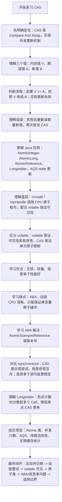
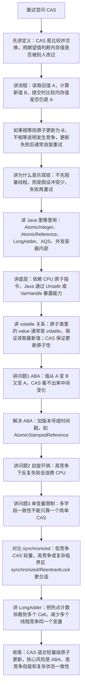

# CAS 知识总结

## 1. 它是什么

`CAS` 全称是 `Compare And Swap`，中文常叫比较并交换。

它是一种无锁并发操作思想。

CAS 的核心逻辑是：

```text
如果当前值 == 预期值，就把当前值更新为新值；
否则更新失败。
```

可以抽象成：

```text
CAS(memory, expectedValue, newValue)
```

含义：

```text
如果 memory 中的值等于 expectedValue，
就把 memory 更新为 newValue；
否则不更新。
```

## 2. 基本示例

Java 中常见的 CAS 使用入口是原子类。

```java
AtomicInteger count = new AtomicInteger(0);

boolean success = count.compareAndSet(0, 1);
```

含义：

```text
如果 count 当前值是 0，就更新为 1，并返回 true；
如果 count 当前值不是 0，就更新失败，并返回 false。
```

自增示例：

```java
AtomicInteger count = new AtomicInteger(0);

count.incrementAndGet();
```

`incrementAndGet()` 底层也是基于 CAS 重试实现的。

## 3. CAS 的核心特点

### 3.1 原子性

比较和更新是一个不可分割的原子操作。

不会出现两个线程同时比较成功并覆盖彼此结果的问题。

### 3.2 无锁

CAS 不需要像 `synchronized` 那样先阻塞线程。

线程更新失败后，可以重新读取最新值并再次尝试。

### 3.3 乐观并发

CAS 是典型的乐观锁思想。

它假设冲突不会太多，先尝试更新。

如果发现值已经被别人改了，再重试或放弃。

## 4. CAS 自旋流程

以自增为例：

```java
public final int incrementAndGet() {
    int prev;
    int next;
    do {
        prev = get();
        next = prev + 1;
    } while (!compareAndSet(prev, next));
    return next;
}
```

简化流程：

```text
1. 读取当前值 prev
2. 计算新值 next
3. CAS 尝试把 prev 更新为 next
4. 如果成功，返回
5. 如果失败，说明期间被别的线程改过，重新读取再试
```

这种不断尝试的过程叫自旋。

## 5. Java 中哪些类使用 CAS

常见原子类：

- `AtomicInteger`
- `AtomicLong`
- `AtomicBoolean`
- `AtomicReference`
- `AtomicStampedReference`
- `AtomicMarkableReference`
- `AtomicIntegerArray`
- `AtomicLongArray`
- `LongAdder`
- `LongAccumulator`

并发包中也大量使用 CAS，例如：

- `AQS` 修改 `state`
- `ConcurrentHashMap` 部分节点更新
- `ThreadPoolExecutor` 修改工作线程数量和运行状态
- `FutureTask` 修改任务状态

## 6. CAS 底层依赖什么

CAS 最终依赖 CPU 提供的原子指令能力。

在 Java 层面，不同 JDK 版本实现有所变化：

- 早期常通过 `Unsafe` 调用底层 CAS 能力
- 新版本中很多原子操作与 `VarHandle` 内存语义关联更明显

以 `AtomicInteger.compareAndSet` 为例，它的语义是：当当前值等于预期值时，原子地更新为新值，并具备对应的内存效果。

面试中不需要死背底层指令名，重点知道 CAS 是硬件原子操作能力在 Java 并发包中的封装。

## 7. CAS 和 volatile 的关系

`volatile` 可以保证可见性和一定的有序性，但不能保证复合操作的原子性。

例如：

```java
volatile int count = 0;

count++;
```

`count++` 实际包含：

```text
读取 count
计算 count + 1
写回 count
```

这不是一个原子操作。

CAS 可以保证“比较并更新”这个复合动作的原子性。

原子类通常会结合可见性语义和 CAS 原子更新来保证并发安全。

## 8. CAS 的优点

- 不需要阻塞线程
- 避免线程挂起和唤醒开销
- 低竞争场景下性能较好
- 适合实现计数器、状态流转、无锁数据结构
- 是很多 JUC 组件的底层基础

## 9. CAS 的缺点

### 9.1 ABA 问题

CAS 只关心当前值是否等于预期值。

如果一个值从 A 变成 B，又变回 A，CAS 会认为它没有变过。

示例：

```text
线程 1 读取值 A
线程 2 把 A 改成 B
线程 2 又把 B 改回 A
线程 1 执行 CAS，发现还是 A，于是更新成功
```

但实际上这个值中间已经发生过变化。

解决方式：

- 使用版本号
- 使用时间戳
- 使用 `AtomicStampedReference`
- 使用 `AtomicMarkableReference`

`AtomicStampedReference` 会同时比较引用和值对应的版本号。

### 9.2 自旋开销

CAS 失败后通常会重试。

如果竞争非常激烈，线程可能一直自旋，消耗 CPU。

低竞争时 CAS 性能好，高竞争时不一定比锁更好。

### 9.3 只能保证单个变量的原子操作

CAS 天然适合单个变量的更新。

如果需要同时保证多个变量的一致性，处理会复杂很多。

可选方案：

- 使用锁
- 使用 `AtomicReference` 封装不可变对象
- 使用更高层的并发工具

## 10. ABA 问题示例

```java
AtomicReference<String> ref = new AtomicReference<>("A");

// 线程 1
String oldValue = ref.get();

// 线程 2
ref.compareAndSet("A", "B");
ref.compareAndSet("B", "A");

// 线程 1
boolean success = ref.compareAndSet(oldValue, "C");
```

线程 1 的 CAS 可能成功，因为它看到的还是 `"A"`。

如果业务关心中间是否发生过变化，这就有问题。

使用 `AtomicStampedReference`：

```java
AtomicStampedReference<String> ref =
        new AtomicStampedReference<>("A", 1);

int[] stampHolder = new int[1];
String oldValue = ref.get(stampHolder);
int oldStamp = stampHolder[0];

boolean success = ref.compareAndSet(
        oldValue,
        "C",
        oldStamp,
        oldStamp + 1
);
```

这样不仅比较值，还比较版本号。

## 11. CAS 和 synchronized 的区别

### 11.1 CAS

CAS 是乐观并发。

特点：

- 不阻塞线程
- 更新失败后重试
- 适合冲突较少、操作简单的场景
- 高竞争下可能自旋浪费 CPU

### 11.2 synchronized

`synchronized` 是悲观并发。

特点：

- 竞争失败的线程会阻塞
- 适合临界区较复杂或竞争较激烈的场景
- 使用更简单，语义更直观
- JVM 对锁已经有偏向锁、轻量级锁、重量级锁等优化机制

简单理解：

```text
CAS：先试试，失败再重试
synchronized：先加锁，再操作
```

## 12. AtomicInteger 和 LongAdder 的区别

`AtomicInteger` 或 `AtomicLong` 在高并发下，多个线程会竞争同一个变量，CAS 失败重试可能很多。

`LongAdder` 会把热点值分散到多个槽中，不同线程尽量更新不同槽，最后求和。

适合场景：

- `AtomicLong`：需要精确即时值，竞争不太激烈
- `LongAdder`：高并发计数，读精确实时值要求不高

例如统计接口调用次数、埋点计数，`LongAdder` 通常更合适。

## 13. 使用注意事项

- CAS 更新函数不要带副作用，因为失败后可能被重复执行
- 高竞争场景下要警惕自旋消耗 CPU
- 关注 ABA 问题，必要时加版本号
- 多变量一致性不要硬凑 CAS，复杂临界区用锁更清晰
- 原子类适合简单状态变更，不适合承载复杂业务流程

## 14. 面试常问

### 14.1 CAS 是什么？

CAS 是比较并交换。

它会比较内存中的当前值和预期值，如果相等，就原子地更新为新值；如果不相等，就更新失败。

### 14.2 CAS 为什么是乐观锁？

因为 CAS 不会先阻塞线程。

它是假设冲突较少，先尝试更新，失败后再重试或放弃。

### 14.3 CAS 有哪些问题？

主要有三个：

- ABA 问题
- 高竞争下自旋消耗 CPU
- 只能比较方便地保证单个变量的原子更新

### 14.4 ABA 问题如何解决？

可以给变量增加版本号。

Java 中可以使用 `AtomicStampedReference`，它会同时比较引用和值对应的版本号。

### 14.5 CAS 和 volatile 有什么区别？

`volatile` 保证可见性和有序性，但不能保证复合操作原子性。

CAS 可以保证比较并更新这个复合动作的原子性。

### 14.6 CAS 和 synchronized 怎么选？

低竞争、简单变量更新，可以考虑 CAS 或原子类。

临界区复杂、竞争激烈、需要维护多个变量一致性时，使用锁通常更清晰。

## 15. 一句话总结

CAS 是一种基于比较并交换的无锁并发机制，适合简单状态的乐观更新；重点掌握 compareAndSet、自旋重试、ABA 问题、高竞争开销，以及它和 volatile、synchronized 的区别。

## 16. 参考来源

- Oracle Java API：`AtomicInteger`
  - https://docs.oracle.com/en/java/javase/24/docs/api/java.base/java/util/concurrent/atomic/AtomicInteger.html
- Oracle Java API：`AtomicStampedReference`
  - https://docs.oracle.com/en/java/javase/24/docs/api/java.base/java/util/concurrent/atomic/AtomicStampedReference.html
- Oracle Java API：`VarHandle`
  - https://docs.oracle.com/en/java/javase/24/docs/api/java.base/java/lang/invoke/VarHandle.html
- OpenJDK 源码：`AtomicInteger`
  - https://github.com/openjdk/jdk/blob/master/src/java.base/share/classes/java/util/concurrent/atomic/AtomicInteger.java

## 17. 当前项目使用情况

扫描目录：`D:\ai-work-project`。

### 17.1 使用分布

当前项目没有扫描到直接调用 `compareAndSet`，也没有发现 `AtomicStampedReference`、`AtomicReference` 等 ABA 相关用法。

项目中 CAS 的实际落点主要是原子类：

- `ka-solution`：约 9 个 Java 文件命中
- `ka-order`：约 4 个 Java 文件命中
- `ka-common`：约 1 个 Java 文件命中

主要使用类型：

- `AtomicInteger`
- `AtomicLong`

### 17.2 代表代码位置

- `D:\ai-work-project\ka-common\ka-common\src\main\java\com\kyexpress\ka\common\util\PartitionExecutorUtil.java`
  - 使用 `AtomicInteger batch = new AtomicInteger(0)`。
  - 在 Lambda 中通过 `batch.incrementAndGet()` 记录当前异步分批执行批次。
  - 这里既利用了原子递增，也绕开了 Lambda 只能捕获 effectively final 局部变量的限制。

- `D:\ai-work-project\ka-order\ka-order-provider\src\main\java\com\kyexpress\ka\order\provider\service\common\order\component\address\AddressService.java`
  - 使用 `AtomicInteger idAtomic` 为批量同城校验请求生成递增 id。
  - 在 `stream().map(...)` 中调用 `idAtomic.incrementAndGet()`。

- `D:\ai-work-project\ka-solution\ka-solution-provider\src\main\java\com\kyexpress\ka\solution\provider\service\legacy\LegacyWaybillService.java`
  - 使用 `AtomicInteger successCount`，通过 `addAndGet(1)` 为地址请求生成 id。

- `D:\ai-work-project\ka-solution\ka-solution-provider\src\main\java\com\kyexpress\ka\solution\provider\service\common\ecsign\impl\tencent\TencentRequestHelper.java`
  - 使用 `AtomicInteger index` 在 Stream 中生成腾讯电子签合同流程名后缀。
  - 体现了原子类在 Lambda 场景下做可变计数器的用法。

- `D:\ai-work-project\ka-solution\ka-solution-provider\src\main\java\com\kyexpress\ka\solution\provider\service\common\ecsign\impl\tencent\TencentSignService.java`
  - 使用 `AtomicInteger noAtomic` 配合 `PartitionExecutorUtil.invokeAll` 给批量调用生成序号 key。

- `D:\ai-work-project\ka-order\ka-order-provider\src\main\java\com\kyexpress\ka\order\provider\service\customeize\legacy\waybillprint\WoDaWaybillPrintMultiService.java`
  - 使用 `AtomicLong idGenerator`，通过 `getAndIncrement()` 生成分单地址 id。

### 17.3 项目里用到的知识点

- 原子递增：`incrementAndGet`、`getAndIncrement`、`addAndGet`。
- Lambda 中可变计数：用 `AtomicInteger` 作为可变 holder。
- 批量请求序号生成：分批调用、电子签合同、分单地址、同城校验请求等场景。
- 间接 CAS：虽然没有直接写 `compareAndSet`，但 `AtomicInteger`、`AtomicLong` 底层依赖 CAS 或等价的原子更新能力。

### 17.4 当前项目未明显使用的点

- 未发现直接 `compareAndSet`。
- 未发现 `AtomicStampedReference` 处理 ABA。
- 未发现 `LongAdder` 高并发热点计数。
- 未发现自定义无锁数据结构。

### 17.5 复习时结合项目记忆

项目里 CAS 不是以底层 API 形式出现，而是以 `AtomicInteger` / `AtomicLong` 的形式出现。

复习时可以这样联系项目：

- 理论：CAS 是原子类底层实现思想。
- 项目：原子类主要用于批量处理中的安全递增和 Lambda 可变计数。
- 面试：如果被问“项目里哪里用到了 CAS”，可以回答没有直接调用 `compareAndSet`，但使用了 `AtomicInteger`、`AtomicLong`，它们底层依赖 CAS 原子更新。
## 18. 复习与面试讲解流程图

### 18.1 复习思路流程图



### 18.2 面试讲解思路流程图


