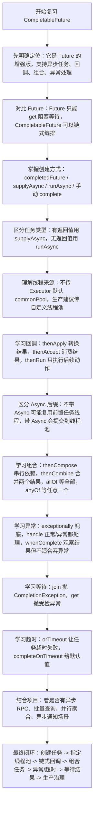
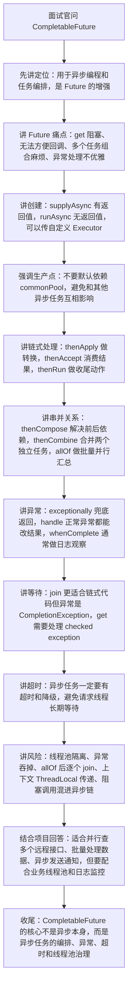

# CompletableFuture 知识总结

## 1. 它是什么

`CompletableFuture` 是 Java 8 引入的异步编程工具，位于 `java.util.concurrent` 包下。

它可以理解为：

- `Future` 的增强版
- 一个可以手动完成的异步任务结果容器
- 一个支持链式编排、组合、异常处理的异步任务框架

普通 `Future` 的问题是：只能阻塞式获取结果，不能方便地做任务编排。

```java
Future<String> future = executor.submit(() -> "result");
String result = future.get(); // 阻塞等待
```

`CompletableFuture` 可以把异步任务像流水线一样串起来：

```java
CompletableFuture
        .supplyAsync(() -> "Java")
        .thenApply(name -> name + " Guide")
        .thenAccept(System.out::println);
```

## 2. 核心创建方式

### 2.1 runAsync：没有返回值

适合只执行动作，不关心结果的异步任务。

```java
CompletableFuture<Void> future = CompletableFuture.runAsync(() -> {
    System.out.println("异步执行任务");
});
```

### 2.2 supplyAsync：有返回值

适合异步计算并返回结果。

```java
CompletableFuture<String> future = CompletableFuture.supplyAsync(() -> {
    return "hello";
});
```

### 2.3 指定线程池

不指定线程池时，默认使用 `ForkJoinPool.commonPool()`。

生产环境更推荐显式传入自定义线程池，避免公共线程池被阻塞任务拖垮。

```java
ExecutorService executor = Executors.newFixedThreadPool(10);

CompletableFuture<String> future = CompletableFuture.supplyAsync(() -> {
    return "result";
}, executor);
```

## 3. 常见回调方法

### 3.1 thenApply：转换结果

有入参，有返回值。

```java
CompletableFuture<Integer> future = CompletableFuture
        .supplyAsync(() -> "100")
        .thenApply(Integer::parseInt);
```

### 3.2 thenAccept：消费结果

有入参，没有返回值。

```java
CompletableFuture<Void> future = CompletableFuture
        .supplyAsync(() -> "hello")
        .thenAccept(System.out::println);
```

### 3.3 thenRun：继续执行动作

没有入参，没有返回值。

```java
CompletableFuture<Void> future = CompletableFuture
        .supplyAsync(() -> "hello")
        .thenRun(() -> System.out.println("任务完成"));
```

## 4. Async 后缀的区别

很多方法都有普通版和 `Async` 版，例如：

- `thenApply`
- `thenApplyAsync`
- `thenAccept`
- `thenAcceptAsync`

区别在于后续任务由哪个线程执行。

普通方法：

```java
future.thenApply(result -> result + "!");
```

后续任务可能由完成上一个阶段的线程继续执行。

`Async` 方法：

```java
future.thenApplyAsync(result -> result + "!");
```

后续任务会提交到线程池执行。

如果没有指定线程池，通常使用 `ForkJoinPool.commonPool()`。

生产建议：涉及 IO、RPC、数据库、耗时计算时，显式指定业务线程池。

```java
future.thenApplyAsync(result -> result + "!", executor);
```

## 5. 多任务组合

### 5.1 thenCompose：依赖上一个任务，再发起新异步任务

适合两个任务有前后依赖关系。

```java
CompletableFuture<String> future = CompletableFuture
        .supplyAsync(() -> "userId")
        .thenCompose(userId -> CompletableFuture.supplyAsync(() -> {
            return "userInfo: " + userId;
        }));
```

它会把嵌套的 `CompletableFuture<CompletableFuture<T>>` 展平成 `CompletableFuture<T>`。

### 5.2 thenCombine：两个任务都完成后合并结果

适合两个任务可以并行执行，最后合并结果。

```java
CompletableFuture<String> userFuture = CompletableFuture.supplyAsync(() -> "user");
CompletableFuture<String> orderFuture = CompletableFuture.supplyAsync(() -> "order");

CompletableFuture<String> result = userFuture.thenCombine(orderFuture,
        (user, order) -> user + " - " + order);
```

### 5.3 allOf：等待所有任务完成

适合批量并行任务。

```java
CompletableFuture<String> f1 = CompletableFuture.supplyAsync(() -> "A");
CompletableFuture<String> f2 = CompletableFuture.supplyAsync(() -> "B");
CompletableFuture<String> f3 = CompletableFuture.supplyAsync(() -> "C");

CompletableFuture<Void> all = CompletableFuture.allOf(f1, f2, f3);

all.join();

List<String> result = Arrays.asList(f1.join(), f2.join(), f3.join());
```

注意：`allOf` 返回的是 `CompletableFuture<Void>`，不会直接返回所有任务的结果，需要自己再从每个 future 里取。

### 5.4 anyOf：任意一个任务完成即可

```java
CompletableFuture<Object> fastest = CompletableFuture.anyOf(f1, f2, f3);
Object result = fastest.join();
```

适合竞速查询、多个数据源谁先返回用谁。

## 6. 异常处理

### 6.1 exceptionally：异常兜底

只在异常时触发，可以返回默认值。

```java
CompletableFuture<String> future = CompletableFuture
        .supplyAsync(() -> {
            int i = 1 / 0;
            return "success";
        })
        .exceptionally(ex -> "default");
```

### 6.2 handle：成功或失败都会执行

可以同时处理正常结果和异常。

```java
CompletableFuture<String> future = CompletableFuture
        .supplyAsync(() -> "success")
        .handle((result, ex) -> {
            if (ex != null) {
                return "default";
            }
            return result;
        });
```

### 6.3 whenComplete：观察结果，不改变返回值

适合记录日志、打点、清理资源。

```java
CompletableFuture<String> future = CompletableFuture
        .supplyAsync(() -> "success")
        .whenComplete((result, ex) -> {
            if (ex != null) {
                System.out.println("任务失败：" + ex.getMessage());
            }
        });
```

`whenComplete` 主要用于旁路处理，一般不用于恢复异常。

## 7. get 和 join 的区别

两者都会等待异步任务完成并获取结果。

### get

```java
String result = future.get();
```

特点：

- 会抛出受检异常：`InterruptedException`、`ExecutionException`
- 可以设置超时时间：`get(timeout, unit)`

### join

```java
String result = future.join();
```

特点：

- 抛出运行时异常：`CompletionException`
- 写链式异步代码时更简洁

生产环境中，如果在接口线程里等待异步结果，建议使用带超时的 `get` 或 Java 9+ 的 `orTimeout`，避免无限等待。

## 8. 超时控制

Java 9 后提供：

```java
future.orTimeout(3, TimeUnit.SECONDS);
```

超过指定时间后，future 会以异常完成。

```java
future.completeOnTimeout("default", 3, TimeUnit.SECONDS);
```

超过指定时间后，返回默认值。

## 9. 常见使用场景

### 9.1 聚合多个远程接口

例如用户详情页需要同时查询：

- 用户基础信息
- 订单信息
- 优惠券信息
- 风控信息

这些任务互不依赖，可以并行执行，最后组装结果。

```java
CompletableFuture<User> userFuture = CompletableFuture.supplyAsync(this::queryUser, executor);
CompletableFuture<List<Order>> orderFuture = CompletableFuture.supplyAsync(this::queryOrders, executor);
CompletableFuture<List<Coupon>> couponFuture = CompletableFuture.supplyAsync(this::queryCoupons, executor);

CompletableFuture.allOf(userFuture, orderFuture, couponFuture).join();

User user = userFuture.join();
List<Order> orders = orderFuture.join();
List<Coupon> coupons = couponFuture.join();
```

### 9.2 异步执行非核心逻辑

比如接口主流程完成后，异步记录日志、发送通知、刷新缓存。

```java
CompletableFuture.runAsync(() -> recordLog(), executor);
```

### 9.3 串行依赖任务

先查用户，再根据用户查订单。

```java
CompletableFuture<List<Order>> future = CompletableFuture
        .supplyAsync(this::queryUser, executor)
        .thenCompose(user -> CompletableFuture.supplyAsync(() -> queryOrders(user), executor));
```

## 10. 使用注意事项

### 10.1 不要滥用默认线程池

默认线程池是 `ForkJoinPool.commonPool()`，多个业务可能共享。

如果任务中有数据库、Redis、HTTP、RPC 等阻塞 IO，建议使用自定义线程池。

### 10.2 注意线程池隔离

不同类型任务最好使用不同线程池：

- CPU 密集型任务：线程数接近 CPU 核数
- IO 密集型任务：线程数可以适当更大
- 核心链路任务和非核心任务要隔离

### 10.3 注意异常吞掉问题

异步任务内部异常不会直接抛到主线程。

如果没有 `join/get` 或异常回调，异常可能不容易被发现。

建议对关键异步任务增加日志和异常处理。

### 10.4 注意上下文丢失

异步切换线程后，`ThreadLocal`、MDC 日志上下文、登录态上下文、traceId 等可能丢失。

需要通过上下文传递工具或任务包装器显式传递。

### 10.5 注意事务边界

`CompletableFuture` 会切换线程，Spring 的声明式事务通常基于当前线程。

不要默认认为异步任务能继承调用方事务。

## 11. 面试常问

### 11.1 CompletableFuture 相比 Future 的优势是什么？

`Future` 只能阻塞获取结果，缺少回调、组合、异常处理能力。

`CompletableFuture` 支持链式调用、异步回调、任务组合、异常恢复、手动完成，适合复杂异步编排。

### 11.2 thenApply 和 thenCompose 的区别？

`thenApply` 用于同步转换结果，返回普通值。

`thenCompose` 用于依赖上一步结果后继续发起异步任务，会把嵌套 future 展平。

### 11.3 thenCombine 和 allOf 的区别？

`thenCombine` 用于两个任务完成后合并结果。

`allOf` 用于等待多个任务全部完成，但返回值是 `Void`，需要自己提取每个任务的结果。

### 11.4 exceptionally、handle、whenComplete 的区别？

`exceptionally` 只在异常时执行，常用于返回兜底值。

`handle` 成功失败都会执行，可以改变返回结果。

`whenComplete` 成功失败都会执行，但更适合记录日志、观察结果，不适合做异常恢复。

### 11.5 为什么生产环境建议指定线程池？

默认线程池是公共池，多个业务共享。

如果异步任务中存在阻塞 IO，可能导致公共池线程被占满，影响其他业务。

自定义线程池可以控制线程数、队列、拒绝策略和业务隔离。

## 12. 一句话总结

`CompletableFuture` 是 Java 里用于异步任务编排的核心工具，重点掌握创建任务、链式回调、多任务组合、异常处理、线程池隔离和超时控制。

## 13. 参考来源

- Oracle Java API：`CompletableFuture` 官方文档
  - https://docs.oracle.com/en/java/javase/24/docs/api/java.base/java/util/concurrent/CompletableFuture.html
- OpenJDK 源码：`CompletableFuture` 实现
  - https://github.com/openjdk/jdk/blob/master/src/java.base/share/classes/java/util/concurrent/CompletableFuture.java

## 14. 当前项目使用情况

扫描目录：`D:\ai-work-project`。

### 14.1 使用分布

当前项目中 `CompletableFuture` 主要集中在：

- `ka-order`：约 13 个 Java 文件命中
- `ka-solution`：约 11 个 Java 文件命中
- `ka-common`：公共分片异步工具
- `ka-monitor`、`openapi-adapter`、`ka-waybil-router`、`ka-operation`：少量异步任务使用

### 14.2 代表代码位置

- `D:\ai-work-project\ka-common\ka-common\src\main\java\com\kyexpress\ka\common\util\PartitionExecutorUtil.java`
  - 使用 `CompletableFuture.supplyAsync` 对分片任务并行调用。
  - 使用 `exceptionally` 收集异步异常。
  - 使用 `CompletableFuture.allOf(...).get(10, TimeUnit.SECONDS)` 等待全部分片完成，并设置超时。
  - 使用 `CompletableFuture::join` 汇总每个 future 的结果。

- `D:\ai-work-project\ka-order\ka-order-provider\src\main\java\com\kyexpress\ka\order\provider\util\InvokerUtil.java`
  - 封装统一的 `async`、`get`、`allOf` 方法。
  - 异步任务统一走 `PartitionExecutorUtil.getAsyncExecutor()`。
  - `get` 和 `allOf` 都使用 10 秒超时，避免无限等待。
  - 使用 `SofaTracerSupplier` 包装异步任务，说明项目关注异步链路中的 trace 上下文传递。

- `D:\ai-work-project\ka-order\ka-order-provider\src\main\java\com\kyexpress\ka\order\provider\service\customeize\baili\invoker\BaiLiCustomizedParameterInvoker.java`
  - 对多个报价详情请求使用 `supplyAsync` 并行调用 CRM。
  - 使用 `allOf` 等待全部报价返回。
  - 使用 `join` 提取每个异步任务结果。

- `D:\ai-work-project\ka-solution\ka-solution-provider\src\main\java\com\kyexpress\ka\solution\provider\service\customized\aecainiao\AeCainiaoService.java`
  - 使用 `runAsync` 做非核心异步回传。
  - 使用两个 `supplyAsync` 并行获取运单号和三段码。
  - 使用 `exceptionally` 做异常兜底日志。
  - 使用 `thenCombine` 合并两个异步结果。

- `D:\ai-work-project\ka-solution\ka-solution-provider\src\main\java\com\kyexpress\ka\solution\provider\service\customized\poizon\PoizonService.java`
  - 使用 `supplyAsync` 并行查询分单、超区、服务方式、时效等外部数据。
  - 使用 `applyToEither` 获取两个异步查询中先返回的结果，属于竞速查询场景。
  - 使用 `allOf(...).get(10, TimeUnit.SECONDS)` 控制聚合等待时间。

### 14.3 项目里用到的知识点

- `supplyAsync`：用于并行远程调用、分片批量调用。
- `runAsync`：用于异步通知、异步回传、异步日志类非核心动作。
- 自定义线程池：多数业务异步任务显式传入 `Executor`，没有完全依赖默认公共池。
- `allOf`：用于等待多个并行任务完成。
- `join`：用于在 `allOf` 完成后提取各个 future 的结果。
- `get(timeout, unit)`：用于接口链路超时保护。
- `exceptionally`：用于异步异常日志和默认值兜底。
- `thenCombine`：用于两个异步任务完成后合并结果。
- `applyToEither`：用于多个来源谁先返回用谁。

### 14.4 复习时结合项目记忆

项目中的 `CompletableFuture` 不是单纯演示语法，而是服务于“订单、运单、报价、分单、三段码”等远程调用聚合场景。

复习时重点看三类代码：

- 公共封装：`PartitionExecutorUtil`、`InvokerUtil`
- 并行聚合：`BaiLiCustomizedParameterInvoker`、`AeCainiaoService`、`PoizonService`
- 线程池配合：`BusinessCommonConfiguration`、`OrderConfiguration`、`SolutionConfiguration`
## 15. 复习与面试讲解流程图

### 15.1 复习思路流程图



### 15.2 面试讲解思路流程图


