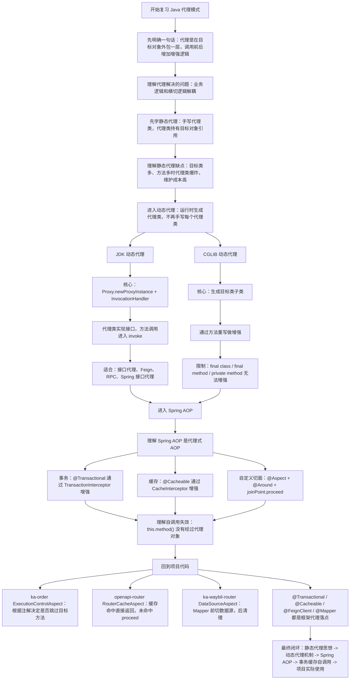
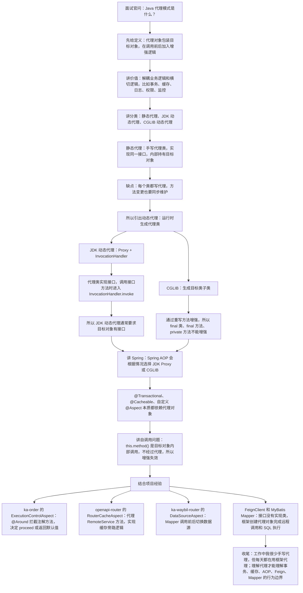

# Java 代理模式知识总结

## 1. 它是什么

代理模式的核心是：

> 不直接调用目标对象，而是通过一个代理对象间接调用目标对象，并在调用前后加入额外逻辑。

可以简单理解成：

```text
调用方
  ↓
代理对象 Proxy
  ↓  调用前增强：日志、权限、事务、缓存、限流、监控
目标对象 Target
  ↓
代理对象 Proxy
  ↓  调用后增强：提交事务、记录耗时、写缓存、异常处理
返回调用方
```

它解决的不是某一个业务问题，而是解决“业务逻辑”和“横切逻辑”的解耦。

典型横切逻辑：

- 日志记录
- 事务控制
- 缓存处理
- 权限校验
- 限流降级
- 调用链监控
- 方法耗时统计
- 远程调用封装
- 数据源切换

## 2. 为什么需要代理

假设有一个订单服务：

```java
public class OrderService {

    public void createOrder() {
        // 创建订单
    }
}
```

如果直接把事务、日志、缓存都写进业务方法：

```java
public void createOrder() {
    // 开启事务
    // 打印日志
    // 创建订单
    // 提交事务
    // 记录耗时
}
```

问题是：

- 业务代码被非业务逻辑污染。
- 每个方法都要重复写日志、事务、监控。
- 统一调整横切逻辑时改动范围很大。
- 业务方法越多，维护成本越高。

代理的价值就是把这些公共逻辑放到外层：

```text
Controller
  ↓
OrderServiceProxy
  ├─ 开启事务
  ├─ 记录日志
  ├─ 调用目标方法
  ├─ 提交/回滚事务
  └─ 记录耗时
  ↓
OrderService
```

## 3. Java 中常见代理类型

| 类型 | 实现方式 | 是否运行期生成 | 典型场景 |
|---|---|---:|---|
| 静态代理 | 手写代理类 | 否 | 少量固定对象增强 |
| JDK 动态代理 | `Proxy + InvocationHandler` | 是 | 接口代理、Feign、RPC、Spring AOP 接口代理 |
| CGLIB 动态代理 | 生成目标类子类 | 是 | 无接口类的 Spring AOP 代理 |

实际开发中最重要的是：

```text
静态代理
  -> 理解思想

JDK 动态代理 / CGLIB
  -> 理解 Spring AOP、事务、缓存、Feign、Mapper 等框架机制
```

## 4. 静态代理

接口：

```java
public interface PaymentService {
    void pay();
}
```

目标类：

```java
public class PaymentServiceImpl implements PaymentService {
    @Override
    public void pay() {
        System.out.println("执行支付");
    }
}
```

代理类：

```java
public class PaymentServiceProxy implements PaymentService {

    private final PaymentService target;

    public PaymentServiceProxy(PaymentService target) {
        this.target = target;
    }

    @Override
    public void pay() {
        System.out.println("支付前：记录日志");
        target.pay();
        System.out.println("支付后：记录日志");
    }
}
```

调用链：

```text
paymentServiceProxy.pay()
  ↓
代理对象打印日志
  ↓
target.pay()
  ↓
PaymentServiceImpl.pay()
  ↓
代理对象执行收尾逻辑
```

静态代理优点是简单直观，缺点是每个接口/类都要写代理类，方法一多维护成本很高。

## 5. JDK 动态代理

JDK 动态代理的核心类：

```java
java.lang.reflect.Proxy
java.lang.reflect.InvocationHandler
```

示例：

```java
PaymentService target = new PaymentServiceImpl();

PaymentService proxy = (PaymentService) Proxy.newProxyInstance(
        target.getClass().getClassLoader(),
        target.getClass().getInterfaces(),
        (Object proxyObj, Method method, Object[] args) -> {
            System.out.println("方法执行前");
            Object result = method.invoke(target, args);
            System.out.println("方法执行后");
            return result;
        }
);

proxy.pay();
```

调用链：

```text
proxy.pay()
  ↓
$Proxy0.pay()
  ↓
InvocationHandler.invoke(proxy, method, args)
  ↓
增强逻辑：日志、事务、缓存等
  ↓
method.invoke(target, args)
  ↓
PaymentServiceImpl.pay()
  ↓
返回 invoke
  ↓
增强逻辑：提交事务、记录耗时等
  ↓
返回调用方
```

`Proxy.newProxyInstance(...)` 三个参数：

| 参数 | 作用 |
|---|---|
| `ClassLoader loader` | 用哪个类加载器加载生成的代理类 |
| `Class<?>[] interfaces` | 代理对象要实现哪些接口 |
| `InvocationHandler h` | 代理方法被调用时交给谁处理 |

JDK 动态代理的重点：

- 运行期生成代理类。
- 代理类实现目标对象的接口。
- 代理对象不是目标实现类的子类。
- 方法调用会进入 `InvocationHandler.invoke(...)`。
- 适合接口代理。

## 6. CGLIB 动态代理

CGLIB 的思路是：

> 运行时生成目标类的子类，通过方法重写做增强。

概念上类似：

```java
public class UserServiceProxy extends UserService {

    @Override
    public void save() {
        System.out.println("方法执行前");
        super.save();
        System.out.println("方法执行后");
    }
}
```

调用链：

```text
proxy.save()
  ↓
UserService$$EnhancerByCGLIB.save()
  ↓
增强逻辑
  ↓
super.save()
  ↓
UserService.save()
  ↓
增强逻辑
```

CGLIB 的限制来自继承：

- `final class` 不能被继承，所以不能被 CGLIB 代理。
- `final method` 不能被重写，所以不能被增强。
- `private method` 不能被子类重写，所以不能被增强。

## 7. JDK 动态代理和 CGLIB 对比

| 对比点 | JDK 动态代理 | CGLIB |
|---|---|---|
| 实现机制 | 生成接口实现类 | 生成目标类子类 |
| 是否需要接口 | 需要接口更自然 | 不需要接口 |
| 代理对象类型 | 接口类型 | 目标类子类 |
| 方法拦截入口 | `InvocationHandler.invoke` | `MethodInterceptor.intercept` |
| final 类影响 | 不靠继承目标类 | final 类不能代理 |
| final 方法影响 | 接口方法调用不受这种方式限制 | final 方法不能增强 |
| Spring AOP 使用 | 有接口时常见 | 无接口或强制类代理时常见 |

一句话记：

```text
JDK 动态代理靠接口。
CGLIB 靠继承。
Spring AOP 是基于代理的，底层会在二者之间选择。
```

## 8. Spring AOP 和代理

Spring AOP 本质是代理机制。

例如：

```java
@Service
public class OrderService {

    @Transactional
    public void createOrder() {
        // 创建订单
    }
}
```

实际调用不是简单的：

```text
Controller -> OrderService.createOrder()
```

而是：

```text
Controller
  ↓
OrderService Proxy
  ↓
TransactionInterceptor 开启事务
  ↓
OrderService.createOrder()
  ↓
TransactionInterceptor 提交/回滚事务
  ↓
Controller
```

所以：

```text
@Transactional
@Cacheable
@Async
@Around
@Before
@After
```

这些能力能生效，关键不是“注解本身有魔法”，而是调用经过了 Spring 创建的代理对象。

## 9. `@Transactional` 自调用为什么会失效

示例：

```java
@Service
public class UserService {

    public void methodA() {
        methodB();
    }

    @Transactional
    public void methodB() {
        // 数据库操作
    }
}
```

外部调用：

```java
userService.methodA();
```

真实链路：

```text
外部调用
  ↓
UserServiceProxy.methodA()
  ↓
UserService.methodA()
  ↓
this.methodB()
  ↓
UserService.methodB()
```

问题在：

```text
this.methodB()
```

它是目标对象内部调用，没有重新经过代理对象，所以 `methodB` 上的事务增强可能不会执行。

正确理解：

```text
代理增强是否生效
  ↓
不是只看有没有注解
  ↓
而是看调用有没有经过代理对象
```

常见处理方式：

- 拆到另一个 Spring Bean 中，让外部 Bean 调用。
- 自注入当前 Bean 的代理对象，再通过代理对象调用。
- 使用 `AopContext.currentProxy()`，但这会让业务代码耦合 Spring AOP，一般不优先推荐。

## 10. 实际工作中的常见代理

### 10.1 事务代理

```java
@Transactional(rollbackFor = Exception.class)
public void saveOrder() {
    // DB 操作
}
```

Spring 创建代理，在方法前后加入事务逻辑：

```text
代理方法
  ↓
开启事务
  ↓
目标方法
  ↓
正常返回 -> commit
异常抛出 -> rollback
```

### 10.2 缓存代理

```java
@Cacheable(value = "CACHE_DAY", key = "#lookupCode")
public List<SystemLookupResponse> getSystemLookupValues(String lookupCode) {
    // 查询远程字典
}
```

调用链：

```text
调用缓存方法
  ↓
CacheInterceptor
  ↓
根据 key 查缓存
  ↓
命中 -> 直接返回
未命中 -> 调目标方法
  ↓
写入缓存
  ↓
返回
```

### 10.3 Feign Client 代理

Feign 接口：

```java
@FeignClient(name = "xxx-service", fallback = XxxFallback.class)
public interface XxxClient {
    ResponseData<?> query(...);
}
```

调用时注入的是接口类型，但接口没有实现类。Feign 会为接口生成代理对象：

```text
业务代码调用 Feign 接口
  ↓
Feign 代理对象
  ↓
编码请求参数
  ↓
发起 HTTP/RPC 调用
  ↓
解码响应
  ↓
异常时进入 fallback
```

### 10.4 MyBatis Mapper 代理

Mapper 接口：

```java
@Mapper
public interface OrderMapper {
    OrderDO selectById(Long id);
}
```

Mapper 本身通常没有手写实现类。MyBatis 会为 Mapper 接口创建代理：

```text
orderMapper.selectById(id)
  ↓
Mapper 代理对象
  ↓
根据接口方法定位 MappedStatement
  ↓
执行 SQL
  ↓
映射结果
```

### 10.5 AOP 切面代理

```java
@Aspect
@Component
public class SomeAspect {

    @Around("@annotation(annotation)")
    public Object around(ProceedingJoinPoint joinPoint, SomeAnnotation annotation) throws Throwable {
        // 前置逻辑
        Object result = joinPoint.proceed();
        // 后置逻辑
        return result;
    }
}
```

这里 `joinPoint.proceed()` 就是继续调用目标方法。

## 11. 当前项目使用情况

扫描目录：`D:\ai-work-project`

扫描时间：`2026-08-13`

### 11.1 总体结论

项目里没有明显手写原生动态代理代码。

扫描未发现明显使用：

```text
Proxy.newProxyInstance
InvocationHandler
MethodInterceptor
Enhancer
```

但是项目里大量使用了框架代理：

- Spring AOP：自定义切面。
- Spring 事务：`@Transactional`。
- Spring Cache：`@Cacheable`。
- Feign：`@FeignClient` 接口代理。
- MyBatis：`@Mapper` / `@MapperScan` 接口代理。
- Spring Bean 后处理：处理可能被代理过的 Bean。

所以复习代理模式时，要重点联系项目里的框架代理，而不是只停留在手写 JDK Proxy 示例。

### 11.2 Spring AOP：自定义切面

#### ExecutionControlAspect

位置：

`D:\ai-work-project\ka-order\ka-order-provider\src\main\java\com\kyexpress\ka\order\provider\aspect\ExecutionControlAspect.java`

关键代码：

```java
@Aspect
@Component
public class ExecutionControlAspect {

    @Around("@annotation(annotation)")
    public Object controlExecution(ProceedingJoinPoint joinPoint,
                                   ConditionalExecution annotation) throws Throwable {
        // 根据 InvokerResult 判断是否跳过目标方法
        return joinPoint.proceed();
    }
}
```

实际业务含义：

- 拦截带 `@ConditionalExecution` 的方法。
- 在目标方法执行前，根据 `InvokerResult` 判断是否应该跳过。
- 如果需要跳过，直接返回默认值。
- 否则执行 `joinPoint.proceed()` 调用目标方法。

这就是非常典型的代理增强：

```text
调用方
  ↓
Spring AOP 代理对象
  ↓
ExecutionControlAspect.around()
  ↓
判断是否跳过
  ├─ 跳过：返回默认值
  └─ 不跳过：joinPoint.proceed()
        ↓
      目标方法
```

#### RouterCacheAspect / ServiceCacheAspect

位置：

`D:\ai-work-project\openapi-router\openapi-router-provider\src\main\java\com\kyexpress\openapi\router\provider\aspect\RouterCacheAspect.java`

`D:\ai-work-project\gateway-server\src\main\java\com\kyexpress\platform\edge\cache\ServiceCacheAspect.java`

关键逻辑：

- 使用 `@Aspect` + `@Around`。
- 拦截 `RemoteService` 的 public 方法。
- 根据类名、方法名、参数生成缓存 key。
- 先读缓存。
- 缓存命中直接返回。
- 缓存未命中再 `joinPoint.proceed()` 调目标方法。
- 将结果写入缓存。

调用链：

```text
调用 RemoteService 方法
  ↓
RouterCacheAspect 代理增强
  ↓
生成 cacheKey
  ↓
读取缓存
  ├─ 命中：直接返回
  └─ 未命中：joinPoint.proceed()
        ↓
      目标方法查询数据
        ↓
      写缓存
        ↓
      返回
```

#### DataSourceAspect

位置：

`D:\ai-work-project\ka-waybil-router\ka-waybill-router-provider\src\main\java\com\kyexpress\ka\waybill\router\provider\config\DataSourceAspect.java`

关键逻辑：

- `@Before` Mapper 方法执行前设置数据源。
- `@After` Mapper 方法执行后清理数据源。
- 数据源信息放入 `DynamicDataSourceHolder`，底层通常依赖 `ThreadLocal`。

调用链：

```text
调用 Mapper 方法
  ↓
DataSourceAspect.beforeXxx()
  ↓
设置当前线程数据源
  ↓
Mapper 代理执行 SQL
  ↓
DataSourceAspect.afterXxx()
  ↓
清理当前线程数据源
```

这个例子可以和 `ThreadLocal` 知识点一起复习。

### 11.3 Spring 事务代理

位置示例：

`D:\ai-work-project\ka-order\ka-order-provider\src\main\java\com\kyexpress\ka\order\provider\service\common\order\PersistenceSyncOrderService.java`

代码中有：

```java
@Transactional(propagation = Propagation.REQUIRED, rollbackFor = Throwable.class)
public void saveBaseInfos(InvokerResult result) {
    this.doSaveBaseInfo(result);
    // 其他保存逻辑
}
```

项目里还存在：

- `ka-monitor`：`FollowInterfaceLogService`、`WorkOrderInfoService` 使用 `@Transactional(..., propagation = Propagation.REQUIRES_NEW)`。
- `ka-operation`：多个 Service 使用 `@Transactional(propagation = Propagation.REQUIRED)`。
- `ka-solution`：`WaybillService`、`OpenWaybillTemporaryInfoService` 等使用 `@Transactional(rollbackFor = Exception.class)`。

实际工作中要记住：

```text
@Transactional 生效
  ↓
依赖 Spring 事务代理
  ↓
调用必须经过代理对象
  ↓
目标方法异常符合 rollback 规则才回滚
```

特别注意：

- 同类内部 `this.xxx()` 调用可能绕过代理。
- `private` 方法无法被 Spring AOP 代理增强。
- 异步线程中的事务不会自动继承当前线程事务。
- `rollbackFor` 决定哪些异常触发回滚。

### 11.4 Spring Cache 代理

位置示例：

`D:\ai-work-project\ka-order\ka-order-provider\src\main\java\com\kyexpress\ka\order\provider\service\common\order\OpenDictionaryCacheService.java`

代码中有：

```java
@Cacheable(value = "CACHE_DAY", key = "#lookupCode", unless = "#result?.size() == 0")
public List<SystemLookupResponse> getSystemLookupValues(String lookupCode) {
    // 查询数据字典
}
```

项目配置中也能看到：

- `ka-order`：`OrderConfiguration` 使用 `@EnableCaching`。
- `ka-monitor`：`MonitorConfiguration` 使用 `@EnableCaching`。
- `ka-solution`：`SolutionConfiguration` 使用 `@EnableCaching`。
- `ka-query`：`CacheConfiguration` 使用 `@EnableCaching`。

还有一个特别贴近代理模式的注释：

`D:\ai-work-project\ka-order\ka-order-provider\src\main\java\com\kyexpress\ka\order\provider\service\common\order\component\fee\AddedFeeService.java`

注释写到：

```text
通过 Spring 代理调用确保 @Cacheable 切面生效
```

这说明项目里已经意识到：

```text
缓存注解能否生效
  ↓
取决于是否通过 Spring 代理调用
```

这和 `@Transactional` 自调用失效是同一类问题。

### 11.5 Feign Client 代理

位置示例：

`D:\ai-work-project\ka-solution\ka-solution-client\src\main\java\com\kyexpress\ka\solution\client\common\PlatformFlagClientService.java`

代码中有：

```java
@FeignClient(name = ConstantInterface.SERVICE_NAME,
        fallback = PlatformFlagClientService.HystrixClientFallback.class)
public interface PlatformFlagClientService extends PlatformFlagRemoteService {
}
```

项目中大量模块启用：

```java
@EnableFeignClients
```

例如：

- `ka-order`
- `ka-solution`
- `ka-query`
- `ka-monitor`
- `ka-operation`
- `ka-waybil-router`
- `openapi-router`
- `gateway-server`

Feign 代理的实际意义：

```text
业务代码注入 Feign 接口
  ↓
接口没有手写实现类
  ↓
Spring / Feign 创建代理对象
  ↓
方法调用被代理转换成远程调用
  ↓
失败时走 fallback
```

所以，看到 `@FeignClient interface`，就要想到“这是接口代理”。

### 11.6 MyBatis Mapper 代理

位置示例：

`D:\ai-work-project\ka-query\ka-query-provider\src\main\java\com\kyexpress\ka\query\provider\config\datasource\BizDataSourceConfig.java`

代码中有：

```java
@MapperScan(basePackages = {BizDataSourceConfig.BASE_PACKAGE, RATE_LIMIT_BASE_PACKAGE},
        sqlSessionFactoryRef = BizDataSourceConfig.BEAN_PREFIX + "SqlSessionFactory")
public class BizDataSourceConfig extends AbstractDataSourceConfig {
}
```

项目中大量 Mapper 接口使用：

```java
@Mapper
public interface XxxMapper {
}
```

这些 Mapper 通常没有手写实现类。调用 Mapper 方法时，实际调用的是 MyBatis 创建的代理对象。

调用链：

```text
service 调 mapper.selectXxx()
  ↓
Mapper 代理对象
  ↓
根据接口方法找到 SQL 映射
  ↓
SqlSession 执行 SQL
  ↓
ResultMap / TypeHandler 映射结果
  ↓
返回 Service
```

### 11.7 BeanPostProcessor 处理代理 Bean

位置：

`D:\ai-work-project\ka-common\ka-common\src\main\java\com\kyexpress\ka\common\rabbitmq\RabbitQueueInitialization.java`

代码中有：

```java
public class RabbitQueueInitialization implements BeanPostProcessor, Ordered, SmartInitializingSingleton {

    @Override
    public Object postProcessAfterInitialization(Object bean, String beanName) {
        Class<?> targetClass = AopUtils.getTargetClass(bean);
        // 扫描 RabbitListener
        return bean;
    }
}
```

这里使用 `AopUtils.getTargetClass(bean)` 很关键。

原因是 Spring 容器里的 Bean 可能已经是代理对象，如果直接拿 `bean.getClass()`，拿到的可能是代理类，而不是业务目标类。项目这里通过 `AopUtils.getTargetClass(...)` 获取真实目标类，再扫描注解。

这个点非常适合用来理解：

```text
Spring 容器中注入到的对象
  ↓
可能不是原始对象
  ↓
可能是代理对象
```

### 11.8 项目复习重点

结合当前项目，代理模式最应该重点复习：

- Spring AOP 是基于代理的，`@Around` 里通过 `joinPoint.proceed()` 调目标方法。
- `@Transactional`、`@Cacheable` 都依赖代理调用，内部自调用容易失效。
- Feign Client 是接口代理，没有手写实现类也能发远程调用。
- MyBatis Mapper 是接口代理，没有实现类也能执行 SQL。
- `AopUtils.getTargetClass(bean)` 用于从代理对象中拿真实目标类。
- 项目里基本没有手写 JDK Proxy/CGLIB，但框架代理随处可见。

## 12. 复习思路流程图



复习时建议按下面的问题串：

```text
1. 为什么要用代理，而不是直接改目标类？
2. 静态代理为什么维护成本高？
3. JDK 动态代理为什么需要接口？
4. CGLIB 为什么怕 final？
5. Spring AOP 为什么说是基于代理的？
6. @Transactional 自调用为什么失效？
7. Feign 和 MyBatis Mapper 为什么没有实现类也能调用？
8. 当前项目里哪些类最能体现代理？
```

## 13. 面试讲解思路流程图



面试可以压缩成一段话：

```text
代理模式就是在目标对象外面包一层代理对象，调用目标方法前后增加日志、事务、缓存、权限、监控等横切逻辑，从而避免污染业务代码。
Java 里常见代理有三种：静态代理、JDK 动态代理、CGLIB。静态代理是手写代理类，简单但维护成本高；JDK 动态代理通过 Proxy 和 InvocationHandler 在运行时生成接口实现类，所以通常要求接口；CGLIB 通过生成目标类子类来代理，所以不需要接口，但 final 类、final 方法、private 方法不能增强。
Spring AOP、@Transactional、@Cacheable 都是基于代理的，所以调用必须经过代理对象，this 自调用会绕过代理导致增强失效。
项目里也有很多例子，比如 ka-order 的 ExecutionControlAspect、openapi-router 的 RouterCacheAspect、ka-waybil-router 的 DataSourceAspect，以及大量 FeignClient 和 MyBatis Mapper 接口代理。
```

## 14. 一句话总结

```text
代理模式的核心是：不改目标对象，在目标对象外面包一层代理，把事务、缓存、日志、权限、远程调用、SQL 执行等横切能力放到代理层完成。
```

真正工作里要记住：

```text
有没有注解
  ↓
不等于一定生效

是否经过代理对象调用
  ↓
才是 Spring AOP / 事务 / 缓存能否生效的关键
```

## 15. 参考来源

- JavaGuide：Java 代理模式详解
  - https://javaguide.cn/java/basis/proxy.html
- Oracle Java API：`InvocationHandler`
  - https://docs.oracle.com/en/java/javase/26/docs/api/java.base/java/lang/reflect/InvocationHandler.html
- Spring Framework：Proxying Mechanisms
  - https://docs.spring.io/spring-framework/reference/core/aop/proxying.html
- Spring Framework：AOP Proxies
  - https://docs.spring.io/spring-framework/reference/core/aop/introduction-proxies.html
- Spring Framework：Declarative Transaction Implementation
  - https://docs.spring.io/spring-framework/reference/data-access/transaction/declarative/tx-decl-explained.html
