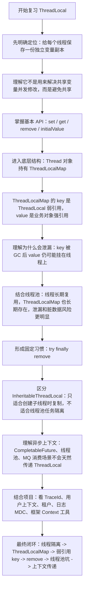
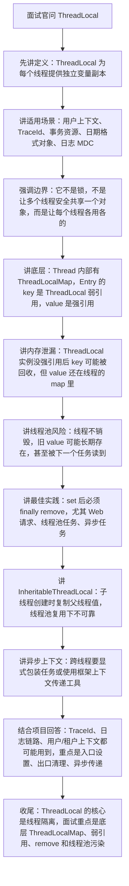

# ThreadLocal 知识总结

## 1. 它是什么

`ThreadLocal` 是 Java 提供的线程本地变量工具，位于 `java.lang` 包下。

它的核心作用是：让每个线程都拥有一份独立的变量副本，线程之间互不影响。

普通变量是多个线程共享的：

```java
private static String value;
```

`ThreadLocal` 保存的变量是线程隔离的：

```java
private static final ThreadLocal<String> LOCAL = new ThreadLocal<>();
```

每个线程调用 `set`、`get` 时，操作的是当前线程自己的那份数据。

## 2. 基本用法

```java
private static final ThreadLocal<String> USER_ID = new ThreadLocal<>();

public void process() {
    try {
        USER_ID.set("1001");

        String userId = USER_ID.get();
        System.out.println(userId);
    } finally {
        USER_ID.remove();
    }
}
```

常用方法：

- `set(T value)`：给当前线程设置变量
- `get()`：获取当前线程变量
- `remove()`：删除当前线程变量
- `withInitial(Supplier)`：设置初始值

```java
private static final ThreadLocal<Integer> COUNT =
        ThreadLocal.withInitial(() -> 0);
```

## 3. ThreadLocal 解决什么问题

### 3.1 线程隔离

每个线程维护自己的变量副本，不需要加锁。

典型例子：

```java
private static final ThreadLocal<SimpleDateFormat> FORMATTER =
        ThreadLocal.withInitial(() -> new SimpleDateFormat("yyyy-MM-dd"));
```

`SimpleDateFormat` 不是线程安全的，如果多个线程共享同一个实例，可能出现并发问题。

使用 `ThreadLocal` 后，每个线程都有自己的 `SimpleDateFormat`，避免线程安全问题。

### 3.2 在线程调用链中传递上下文

例如：

- 用户 ID
- 租户 ID
- traceId
- 请求上下文
- 数据源标识
- 权限上下文

```java
public class RequestContext {
    private static final ThreadLocal<String> TRACE_ID = new ThreadLocal<>();

    public static void setTraceId(String traceId) {
        TRACE_ID.set(traceId);
    }

    public static String getTraceId() {
        return TRACE_ID.get();
    }

    public static void clear() {
        TRACE_ID.remove();
    }
}
```

在一次请求处理过程中，同一个线程上的不同方法都可以获取到上下文信息。

## 4. 底层原理

`ThreadLocal` 的数据不是存放在 `ThreadLocal` 对象本身里面，而是存放在当前线程对象 `Thread` 里面。

大致结构：

```text
Thread
  -> ThreadLocalMap
      -> Entry(ThreadLocal key, Object value)
```

也就是说：

- 每个 `Thread` 对象内部都有一个 `ThreadLocalMap`
- `ThreadLocalMap` 的 key 是 `ThreadLocal` 对象
- `ThreadLocalMap` 的 value 是当前线程保存的变量值

调用逻辑可以理解为：

```java
threadLocal.set(value);
```

实际是：

```text
当前线程.threadLocalMap.put(threadLocal, value)
```

获取时：

```text
当前线程.threadLocalMap.get(threadLocal)
```

所以 `ThreadLocal` 实现线程隔离的关键不是变量复制，而是每个线程内部各自维护了一张 map。

## 5. 为什么会内存泄漏

`ThreadLocalMap` 中的 `Entry` 结构比较特殊：

```text
key   -> ThreadLocal，弱引用
value -> 业务对象，强引用
```

key 是弱引用，如果外部没有强引用指向 `ThreadLocal`，GC 后 key 可能变成 `null`。

但 value 仍然被当前线程强引用着：

```text
Thread -> ThreadLocalMap -> Entry -> value
```

如果这个线程一直不销毁，value 就可能一直无法释放。

在线程池场景中问题更明显，因为线程会被复用，不会随着一次请求结束就销毁。

## 6. 为什么必须 remove

线程池里的线程会长期存在。

如果一次请求设置了 `ThreadLocal`，但是没有清理，下一个请求复用同一个线程时，可能读到上一次请求遗留的数据。

错误示例：

```java
USER_ID.set("1001");
doSomething();
```

正确示例：

```java
try {
    USER_ID.set("1001");
    doSomething();
} finally {
    USER_ID.remove();
}
```

记住：只要用了 `ThreadLocal.set()`，就要在 `finally` 中 `remove()`。

## 7. 在线程池中的坑

线程池会复用线程。

假设请求 A 和请求 B 都使用同一个线程：

```text
请求 A -> 设置 userId=1001 -> 没有 remove
请求 B -> 复用同一个线程 -> 可能读到 userId=1001
```

这会导致：

- 用户身份串号
- 日志 traceId 混乱
- 权限判断错误
- 数据源路由错误
- 内存无法及时释放

所以在线程池、Web 容器、异步任务中使用 `ThreadLocal` 时，清理动作非常关键。

## 8. InheritableThreadLocal

`InheritableThreadLocal` 可以让子线程获取父线程中的变量。

```java
private static final InheritableThreadLocal<String> LOCAL =
        new InheritableThreadLocal<>();
```

普通新建线程时，子线程可以继承父线程变量。

但是在线程池中，它并不能很好地解决上下文传递问题。

原因是线程池中的线程通常早已创建好，不是每次提交任务时新建子线程，所以拿不到提交任务时的最新上下文。

## 9. 异步场景中的上下文传递

`ThreadLocal` 只在当前线程有效。

如果代码切换线程，例如：

- `CompletableFuture`
- `@Async`
- 线程池
- MQ 消费线程
- 定时任务线程

原线程里的 `ThreadLocal` 默认不会自动传过去。

```java
RequestContext.setTraceId("trace-001");

CompletableFuture.runAsync(() -> {
    // 这里通常拿不到主线程设置的 traceId
    System.out.println(RequestContext.getTraceId());
});
```

如果确实需要跨线程传递上下文，可以考虑：

- 手动读取并传入任务
- 包装 `Runnable`、`Callable`
- 使用框架提供的上下文传播能力
- 使用阿里的 `TransmittableThreadLocal`

## 10. 常见使用场景

### 10.1 保存请求上下文

```java
public class UserContext {
    private static final ThreadLocal<Long> USER_ID = new ThreadLocal<>();

    public static void setUserId(Long userId) {
        USER_ID.set(userId);
    }

    public static Long getUserId() {
        return USER_ID.get();
    }

    public static void clear() {
        USER_ID.remove();
    }
}
```

一般在过滤器、拦截器中设置和清理。

```java
try {
    UserContext.setUserId(userId);
    chain.doFilter(request, response);
} finally {
    UserContext.clear();
}
```

### 10.2 日志链路追踪

MDC 底层通常也依赖类似 `ThreadLocal` 的机制。

```java
MDC.put("traceId", traceId);

try {
    doBusiness();
} finally {
    MDC.clear();
}
```

### 10.3 动态数据源

根据当前请求设置数据源标识。

```java
DataSourceContext.set("slave");

try {
    query();
} finally {
    DataSourceContext.clear();
}
```

## 11. ThreadLocal 和 synchronized 的区别

`synchronized` 是让多个线程排队访问共享变量，解决共享资源并发修改问题。

`ThreadLocal` 是让每个线程拥有自己的变量副本，从源头上避免共享。

简单理解：

- `synchronized`：共享变量 + 加锁
- `ThreadLocal`：不共享变量 + 线程隔离

它们解决的问题不同，不能简单互相替代。

## 12. 面试常问

### 12.1 ThreadLocal 的作用是什么？

`ThreadLocal` 用于保存线程本地变量，让每个线程都有自己独立的一份数据，避免多个线程之间互相影响。

常用于请求上下文、用户信息、traceId、动态数据源、非线程安全工具类隔离等场景。

### 12.2 ThreadLocal 的底层原理是什么？

每个 `Thread` 内部都有一个 `ThreadLocalMap`。

`ThreadLocalMap` 的 key 是 `ThreadLocal` 对象，value 是当前线程保存的变量值。

调用 `set/get/remove` 时，实际操作的是当前线程自己的 `ThreadLocalMap`。

### 12.3 ThreadLocal 为什么会内存泄漏？

`ThreadLocalMap.Entry` 的 key 是弱引用，value 是强引用。

如果 `ThreadLocal` 对象被回收，key 会变成 `null`，但 value 仍然可能被线程强引用。

在线程池场景下，线程长期存活，value 可能无法释放，所以会造成内存泄漏风险。

### 12.4 如何避免 ThreadLocal 内存泄漏？

使用完后必须调用 `remove()`。

推荐写法：

```java
try {
    threadLocal.set(value);
    doSomething();
} finally {
    threadLocal.remove();
}
```

### 12.5 ThreadLocal 能不能解决所有线程安全问题？

不能。

它只适合变量可以按线程隔离的场景。

如果多个线程必须操作同一个共享资源，仍然需要锁、并发容器、CAS、队列等并发控制手段。

### 12.6 InheritableThreadLocal 在线程池中有什么问题？

`InheritableThreadLocal` 只在创建子线程时复制父线程变量。

线程池中的线程通常提前创建并复用，不会在每次提交任务时重新复制上下文，所以可能拿不到正确上下文，甚至拿到旧上下文。

## 13. 一句话总结

`ThreadLocal` 的本质是把变量绑定到当前线程，适合保存线程级上下文；使用时一定要注意线程池复用带来的数据污染和内存泄漏问题，用完必须 `remove()`。

## 14. 参考来源

- Oracle Java API：`ThreadLocal` 官方文档
  - https://docs.oracle.com/en/java/javase/24/docs/api/java.base/java/lang/ThreadLocal.html
- OpenJDK 源码：`ThreadLocal`、`ThreadLocalMap`、`Entry extends WeakReference`
  - https://github.com/openjdk/jdk/blob/master/src/java.base/share/classes/java/lang/ThreadLocal.java
- Oracle Java API：`Executors` 线程池复用说明
  - https://docs.oracle.com/en/java/javase/24/docs/api/java.base/java/util/concurrent/Executors.html

## 15. 当前项目使用情况

扫描目录：`D:\ai-work-project`。

### 15.1 使用分布

当前项目中 `ThreadLocal` 相关使用主要分布在：

- `openapi-adapter`：约 4 个 Java 文件命中
- `ka-waybil-router`：约 2 个 Java 文件命中
- `ka-solution`：约 2 个 Java 文件命中
- `ka-order`：约 2 个 Java 文件命中
- `openapi-router`、`ka-common`、`ka-operation`、`gateway-server`：少量 `ThreadLocalRandom` 或上下文使用

### 15.2 代表代码位置

- `D:\ai-work-project\ka-waybil-router\ka-waybill-router-provider\src\main\java\com\kyexpress\ka\waybill\router\provider\config\DynamicDataSourceHolder.java`
  - 使用 `ThreadLocal<String>` 保存当前线程的数据源标识。
  - `putDataSource` 设置当前线程数据源。
  - `getDataSource` 获取当前线程数据源。
  - `removeDataSource` 清理当前线程数据源。

- `D:\ai-work-project\ka-waybil-router\ka-waybill-router-provider\src\main\java\com\kyexpress\ka\waybill\router\provider\config\DataSourceAspect.java`
  - 在 AOP 前置通知中设置数据源。
  - 在 AOP 后置通知中调用 `removeDataSource()` 清理。
  - 这是 `ThreadLocal` 用完必须清理的正例。

- `D:\ai-work-project\ka-order\ka-order-provider\src\main\java\com\kyexpress\ka\order\provider\service\common\order\invoker\request\CustomizedParamterInvoker.java`
  - 使用多个 `ThreadLocal` 保存订单处理链路中的 `OrderInfoItem`、寄件客户信息、收件客户信息。
  - 在 `finally` 中统一调用 `remove()`，避免订单线程复用导致数据串号。

- `D:\ai-work-project\openapi-router\openapi-router-provider\src\main\java\com\kyexpress\openapi\router\provider\utils\MyContextUtils.java`
  - 使用 `InheritableThreadLocal<Context>` 保存请求上下文。
  - 用于补充或同步 `ContextUtils` 中的用户上下文。
  - 需要注意：`InheritableThreadLocal` 在线程池中不一定能正确传递提交任务时的上下文。

- `D:\ai-work-project\openapi-adapter\openapi-adapter-router-core\src\main\java\com\kyexpress\openapi\adapter\router\utils\DateUtils.java`
  - 使用 `ThreadLocal<Map<String, SimpleDateFormat>>` 缓存每个线程自己的日期格式化器。
  - 解决 `SimpleDateFormat` 非线程安全问题。

- `D:\ai-work-project\openapi-adapter\openapi-adapter-router-core\src\main\java\com\kyexpress\openapi\adapter\router\inside\adapter\DidiAuthInvokerAdapter.java`
  - 使用 `NamedThreadLocal<Boolean>` 保存当前线程是否已经重试过。
  - 在 `execute` 方法 `finally` 中调用 `retryFlag.remove()`。
  - 用来控制 401 场景下同一次调用链只重试一次。

- `D:\ai-work-project\ka-solution\ka-solution-provider\src\main\java\com\kyexpress\ka\solution\provider\service\common\ecsign\impl\tencent\TencentRequestHelper.java`
  - 使用 `TransmittableThreadLocal<Map<String, Object>>` 保存电子签请求日志上下文。
  - 支持异步线程中的上下文传递。
  - `logEnd()` 中会调用 `remove()` 清理上下文。

### 15.3 项目里用到的知识点

- 线程隔离：订单上下文、动态数据源、重试标识都绑定到当前线程。
- `remove()` 清理：动态数据源、订单上下文、滴滴认证重试标识、腾讯电子签日志上下文都有清理动作。
- 非线程安全对象隔离：`DateUtils` 用 `ThreadLocal` 包装 `SimpleDateFormat`。
- 上下文传递：`MyContextUtils` 使用 `InheritableThreadLocal`，`TencentRequestHelper` 使用 `TransmittableThreadLocal`。
- 线程池风险：项目中大量使用线程池和异步任务，所以 `ThreadLocal` 清理和跨线程上下文传递尤其重要。

### 15.4 复习时结合项目记忆

项目里的 `ThreadLocal` 主要不是为了“缓存变量”，而是为了解决三类实际问题：

- 当前线程上下文：用户上下文、订单上下文、日志上下文。
- 当前线程路由：动态数据源标识。
- 当前线程工具对象：`SimpleDateFormat` 隔离。

复习时要重点记住：凡是 Web 请求线程、线程池线程、异步任务线程中使用 `ThreadLocal.set()`，都必须关注 `finally remove()`。
## 16. 复习与面试讲解流程图

### 16.1 复习思路流程图



### 16.2 面试讲解思路流程图


