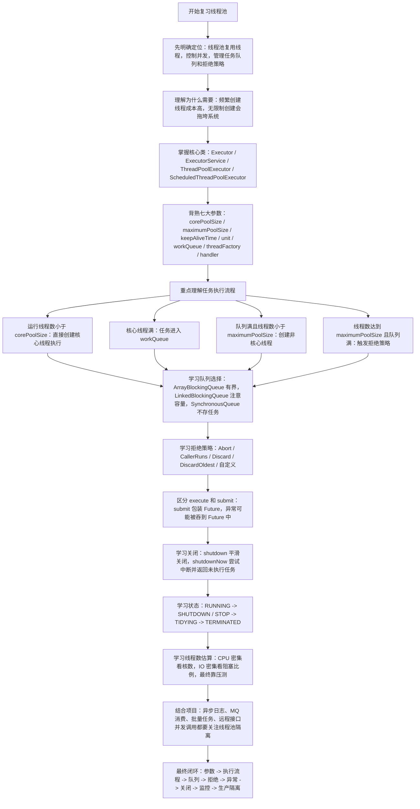
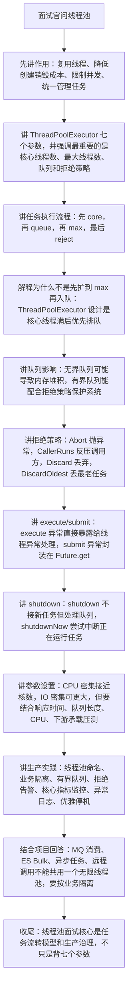

# 线程池知识总结

## 1. 它是什么

线程池是一种复用线程的并发工具。

它的核心思想是：提前或按需创建一批工作线程，任务来了以后不再频繁创建新线程，而是把任务提交给线程池，由池中的线程执行。

Java 中线程池的核心类是：

```java
java.util.concurrent.ThreadPoolExecutor
```

常见使用方式：

```java
ExecutorService executor = new ThreadPoolExecutor(
        5,
        10,
        60L,
        TimeUnit.SECONDS,
        new ArrayBlockingQueue<>(100),
        Executors.defaultThreadFactory(),
        new ThreadPoolExecutor.CallerRunsPolicy()
);
```

## 2. 为什么需要线程池

如果每来一个任务就创建一个线程，会有几个问题：

- 创建和销毁线程有开销
- 线程太多会导致 CPU 频繁上下文切换
- 线程数量不可控，可能耗尽系统资源
- 缺少统一的任务排队、拒绝、监控和关闭机制

线程池解决的是资源复用和资源管控问题。

主要优点：

- 降低线程创建和销毁成本
- 提高任务响应速度
- 控制并发线程数量
- 统一管理任务队列、拒绝策略、线程工厂和生命周期

## 3. 核心接口和类

### 3.1 Executor

`Executor` 是最基础的任务执行接口。

```java
public interface Executor {
    void execute(Runnable command);
}
```

它只关心任务提交，不关心返回值和生命周期管理。

### 3.2 ExecutorService

`ExecutorService` 扩展了 `Executor`，增加了：

- `submit`
- `shutdown`
- `shutdownNow`
- `invokeAll`
- `invokeAny`
- `awaitTermination`

它支持任务返回结果和线程池关闭。

### 3.3 ThreadPoolExecutor

`ThreadPoolExecutor` 是最核心的线程池实现类。

生产环境中更推荐直接使用 `ThreadPoolExecutor` 明确配置参数，而不是盲目使用 `Executors` 的快捷工厂方法。

## 4. 七大核心参数

`ThreadPoolExecutor` 最完整的构造方法：

```java
public ThreadPoolExecutor(
        int corePoolSize,
        int maximumPoolSize,
        long keepAliveTime,
        TimeUnit unit,
        BlockingQueue<Runnable> workQueue,
        ThreadFactory threadFactory,
        RejectedExecutionHandler handler)
```

### 4.1 corePoolSize

核心线程数。

当线程池中运行线程数小于 `corePoolSize` 时，新任务提交后会优先创建核心线程执行，即使其他线程可能处于空闲状态。

### 4.2 maximumPoolSize

最大线程数。

当核心线程都忙，并且任务队列满了以后，线程池会继续创建非核心线程，直到线程数达到 `maximumPoolSize`。

### 4.3 keepAliveTime

非核心线程空闲后的存活时间。

超过这个时间还没有新任务，非核心线程会被回收。

如果设置了 `allowCoreThreadTimeOut(true)`，核心线程也会受这个超时时间影响。

### 4.4 unit

`keepAliveTime` 的时间单位。

例如：

```java
TimeUnit.SECONDS
```

### 4.5 workQueue

任务队列。

当核心线程都在忙时，新任务会先进入队列等待。

常见队列：

- `ArrayBlockingQueue`：有界数组阻塞队列
- `LinkedBlockingQueue`：链表阻塞队列，可以有界也可以无界
- `SynchronousQueue`：不存储任务，任务必须直接交给线程
- `PriorityBlockingQueue`：支持优先级的无界阻塞队列
- `DelayQueue`：延迟队列，常用于定时任务

### 4.6 threadFactory

线程工厂，用来创建线程。

生产环境建议自定义线程名称，方便排查问题。

```java
ThreadFactory threadFactory = runnable -> {
    Thread thread = new Thread(runnable);
    thread.setName("order-worker-" + thread.getId());
    return thread;
};
```

### 4.7 handler

拒绝策略。

当线程数达到最大值，并且队列也满了，新任务无法接收，就会触发拒绝策略。

## 5. 任务执行流程

调用 `execute` 提交任务后，线程池大致按以下流程处理：

```text
1. 如果运行线程数 < corePoolSize，创建核心线程执行任务
2. 否则，尝试把任务放入 workQueue
3. 如果队列没满，任务等待执行
4. 如果队列满了，并且运行线程数 < maximumPoolSize，创建非核心线程执行任务
5. 如果运行线程数已达到 maximumPoolSize，执行拒绝策略
```

简化记忆：

```text
核心线程 -> 队列 -> 最大线程 -> 拒绝策略
```

## 6. 常见拒绝策略

`ThreadPoolExecutor` 内置 4 种拒绝策略。

### 6.1 AbortPolicy

默认策略。

直接抛出 `RejectedExecutionException`。

```java
new ThreadPoolExecutor.AbortPolicy()
```

适合希望快速发现问题的场景。

### 6.2 CallerRunsPolicy

由提交任务的线程自己执行这个任务。

```java
new ThreadPoolExecutor.CallerRunsPolicy()
```

这种策略可以降低任务提交速度，形成一定的反压效果。

### 6.3 DiscardPolicy

直接丢弃新任务，不抛异常。

```java
new ThreadPoolExecutor.DiscardPolicy()
```

风险较高，除非明确允许任务丢失，否则不建议使用。

### 6.4 DiscardOldestPolicy

丢弃队列中最老的任务，然后尝试提交新任务。

```java
new ThreadPoolExecutor.DiscardOldestPolicy()
```

也有任务丢失风险，使用前要确认业务能接受。

## 7. execute 和 submit 的区别

### 7.1 execute

```java
executor.execute(() -> doSomething());
```

特点：

- 只能提交 `Runnable`
- 没有返回值
- 任务异常通常会直接暴露到线程的异常处理逻辑中

### 7.2 submit

```java
Future<String> future = executor.submit(() -> "result");
```

特点：

- 可以提交 `Runnable` 或 `Callable`
- 有返回值，返回 `Future`
- 任务异常会被封装到 `Future` 中，调用 `get()` 时才抛出

注意：如果使用 `submit` 后不调用 `Future.get()`，任务异常可能不明显。

## 8. shutdown 和 shutdownNow

### 8.1 shutdown

```java
executor.shutdown();
```

含义：

- 不再接收新任务
- 已提交任务会继续执行
- 不会立即中断正在执行的任务

### 8.2 shutdownNow

```java
List<Runnable> tasks = executor.shutdownNow();
```

含义：

- 尝试停止正在执行的任务
- 返回尚未执行的任务列表
- 通过中断线程的方式尝试停止任务，但不保证一定能停止

通常还会配合：

```java
executor.awaitTermination(10, TimeUnit.SECONDS);
```

等待线程池终止。

## 9. 线程池状态

`ThreadPoolExecutor` 内部使用一个 `ctl` 变量同时记录线程池运行状态和工作线程数量。

常见状态：

- `RUNNING`：接收新任务，也处理队列中的任务
- `SHUTDOWN`：不接收新任务，但处理队列中的任务
- `STOP`：不接收新任务，也不处理队列任务，并尝试中断正在执行的任务
- `TIDYING`：所有任务结束，工作线程数为 0，即将执行 terminated 钩子
- `TERMINATED`：线程池完全终止

状态流转大致是：

```text
RUNNING -> SHUTDOWN -> TIDYING -> TERMINATED
RUNNING -> STOP -> TIDYING -> TERMINATED
```

## 10. Executors 快捷方法的注意点

`Executors` 提供了很多快捷创建方式：

- `newFixedThreadPool`
- `newCachedThreadPool`
- `newSingleThreadExecutor`
- `newScheduledThreadPool`

它们使用方便，但生产环境要谨慎。

常见风险：

- `newFixedThreadPool` 使用无界队列，任务堆积可能导致内存压力
- `newSingleThreadExecutor` 也使用无界队列，任务堆积风险类似
- `newCachedThreadPool` 最大线程数很大，高并发下可能创建大量线程
- `newScheduledThreadPool` 的任务队列也可能堆积

生产环境更推荐显式使用 `ThreadPoolExecutor`，明确配置线程数、队列长度、线程名和拒绝策略。

## 11. 线程数如何设置

线程数没有万能公式，要结合业务压测、机器资源和任务类型调整。

常见经验：

### 11.1 CPU 密集型任务

任务主要消耗 CPU，例如计算、加解密、压缩。

线程数可以接近 CPU 核数：

```text
线程数 ≈ CPU 核数 或 CPU 核数 + 1
```

### 11.2 IO 密集型任务

任务经常等待数据库、RPC、HTTP、Redis、文件 IO。

线程数可以适当大于 CPU 核数。

常见估算：

```text
线程数 ≈ CPU 核数 * (1 + 等待时间 / 计算时间)
```

最终还是要以监控和压测结果为准。

## 12. 生产使用建议

- 使用自定义线程池，不盲目使用 `Executors` 快捷方法
- 使用有界队列，避免任务无限堆积
- 自定义线程名称，方便日志和问题排查
- 合理设置拒绝策略，关键任务不要静默丢弃
- 区分核心任务和非核心任务，使用不同线程池隔离
- 给异步任务补充异常日志
- 配合监控关注活跃线程数、队列长度、拒绝次数、任务耗时
- 应用关闭时优雅关闭线程池

## 13. 面试常问

### 13.1 线程池的核心参数有哪些？

核心参数有 7 个：

- `corePoolSize`
- `maximumPoolSize`
- `keepAliveTime`
- `unit`
- `workQueue`
- `threadFactory`
- `handler`

重点要能说明每个参数的作用，以及任务提交后的执行流程。

### 13.2 线程池提交任务后的执行流程是什么？

先看核心线程数是否满。

如果未满，创建核心线程执行。

如果已满，任务进入队列。

如果队列也满了，并且线程数小于最大线程数，创建非核心线程执行。

如果线程数达到最大线程数，执行拒绝策略。

### 13.3 为什么不建议直接使用 Executors？

因为部分快捷方法隐藏了队列长度或最大线程数配置。

例如固定线程池通常使用无界队列，任务过多时可能导致内存压力。

生产环境更推荐直接使用 `ThreadPoolExecutor` 显式配置参数。

### 13.4 execute 和 submit 有什么区别？

`execute` 没有返回值，只能提交 `Runnable`。

`submit` 有返回值，返回 `Future`，可以提交 `Runnable` 或 `Callable`。

异常方面，`submit` 会把异常封装进 `Future`，通常调用 `get()` 时才抛出。

### 13.5 线程池如何优雅关闭？

一般先调用 `shutdown()` 停止接收新任务，再用 `awaitTermination()` 等待任务结束。

如果超时仍未结束，可以考虑 `shutdownNow()` 尝试中断。

## 14. 一句话总结

线程池的本质是复用和管理线程资源；重点掌握七大参数、任务执行流程、拒绝策略、关闭方式、异常处理和生产环境下的隔离与监控。

## 15. 参考来源

- Oracle Java API：`ThreadPoolExecutor`
  - https://docs.oracle.com/en/java/javase/24/docs/api/java.base/java/util/concurrent/ThreadPoolExecutor.html
- Oracle Java API：`Executor`
  - https://docs.oracle.com/en/java/javase/24/docs/api/java.base/java/util/concurrent/Executor.html
- Oracle Java API：`Executors`
  - https://docs.oracle.com/en/java/javase/24/docs/api/java.base/java/util/concurrent/Executors.html
- OpenJDK 源码：`ThreadPoolExecutor`
  - https://github.com/openjdk/jdk/blob/master/src/java.base/share/classes/java/util/concurrent/ThreadPoolExecutor.java

## 16. 当前项目使用情况

扫描目录：`D:\ai-work-project`。

### 16.1 使用分布

当前项目中线程池相关代码主要分布在：

- `ka-solution`：约 3 个 Java 文件命中
- `openapi-router`：约 3 个 Java 文件命中
- `ka-order`：约 2 个 Java 文件命中
- `ka-operation`：约 2 个 Java 文件命中
- `ka-common`、`ka-monitor`、`ka-waybil-router`、`gateway-server`：少量使用

项目主要通过 Spring 的 `ThreadPoolTaskExecutor` 配置线程池，底层委托 JDK `ThreadPoolExecutor`。

### 16.2 代表代码位置

- `D:\ai-work-project\ka-common\ka-common\src\main\java\com\kyexpress\ka\common\config\BusinessCommonConfiguration.java`
  - 定义公共分片异步线程池 `commonAsyncRequestExecutor`。
  - 核心线程数 10，最大线程数 128，队列容量 0。
  - 线程名前缀 `Partition-Request-Executor-`。
  - 拒绝策略 `CallerRunsPolicy`。

- `D:\ai-work-project\ka-order\ka-order-provider\src\main\java\com\kyexpress\ka\order\provider\config\OrderConfiguration.java`
  - 定义多个业务隔离线程池。
  - 例如 `asyncKangZhanExecutor`、`asyncHuaYiExecutor`、`pddGetFenDanExecutor`、`px4Executor`、`cacheSendExecutor`。
  - 大多数使用 `CallerRunsPolicy`，其中 `cacheSendExecutor` 使用 `DiscardPolicy`，说明缓存发送类任务允许一定程度丢弃。

- `D:\ai-work-project\ka-solution\ka-solution-provider\src\main\java\com\kyexpress\ka\solution\provider\config\AsyncRequestExecutor.java`
  - 定义 `asyncRequestOpenApiExecutor`。
  - 核心线程数 10，最大线程数 128，队列容量 0。
  - 用于开放平台异步请求。

- `D:\ai-work-project\ka-solution\ka-solution-provider\src\main\java\com\kyexpress\ka\solution\provider\config\SolutionConfiguration.java`
  - 定义电子签、回单查询、批量取消、批量更新、文件导入等业务线程池。
  - 体现了不同业务场景线程池隔离。

- `D:\ai-work-project\ka-monitor\ka-monitor-provider\src\main\java\com\kyexpress\ka\monitor\provider\config\AsyncRequestExecutor.java`
  - 定义监控模块异步请求线程池。
  - 核心线程数 6，最大线程数 128，队列容量 0。

- `D:\ai-work-project\openapi-router\openapi-router-provider\src\main\java\com\kyexpress\openapi\router\provider\config\RouterConfiguare.java`
  - 定义 `threadPoolTaskExecutor`。
  - 注释说明用于解决 `@Async` 创建线程过高的问题。
  - 核心线程数 2，最大线程数 5，队列容量 50。

- `D:\ai-work-project\ka-operation\ka-operation-provider\src\main\java\com\kyexpress\provider\config\KaOperationConfig.java`
  - 定义 `threadPoolTaskExecutor`。
  - 核心线程数 4，最大线程数 32，队列容量 8192。
  - 拒绝策略 `CallerRunsPolicy`。

### 16.3 项目里用到的知识点

- 自定义线程池：项目没有只依赖 `Executors` 快捷方法，而是显式配置 `ThreadPoolTaskExecutor`。
- 核心线程数、最大线程数：不同业务场景配置不同线程规模。
- 队列容量：很多远程调用线程池设置 `queueCapacity=0`，倾向于减少任务堆积。
- 线程名前缀：各业务线程池都设置了 `threadNamePrefix`，方便日志排查。
- 拒绝策略：大量使用 `CallerRunsPolicy` 做反压，少数非核心任务使用 `DiscardPolicy`。
- 业务隔离：订单、方案、监控、路由、运营导入都有独立线程池。
- `@Async`：`gateway-server`、`openapi-router` 中存在异步方法，依赖 Spring 异步线程池执行。
- 文件导入：`WaybillImportUpdateService` 和 `KaCustomerMappingService` 会把 `ThreadPoolTaskExecutor` 设置到 Excel 导入上下文中。

### 16.4 复习时结合项目记忆

项目里的线程池重点不是“怎么 new 一个线程池”，而是：

- 不同业务使用不同线程池隔离风险。
- 队列容量和拒绝策略直接影响流量高峰时的系统行为。
- `CallerRunsPolicy` 可以让提交线程自己执行任务，形成反压。
- `DiscardPolicy` 只能用于允许丢弃的非核心任务。
- 异步任务和 `CompletableFuture` 通常要搭配明确的业务线程池。
## 17. 复习与面试讲解流程图

### 17.1 复习思路流程图



### 17.2 面试讲解思路流程图


