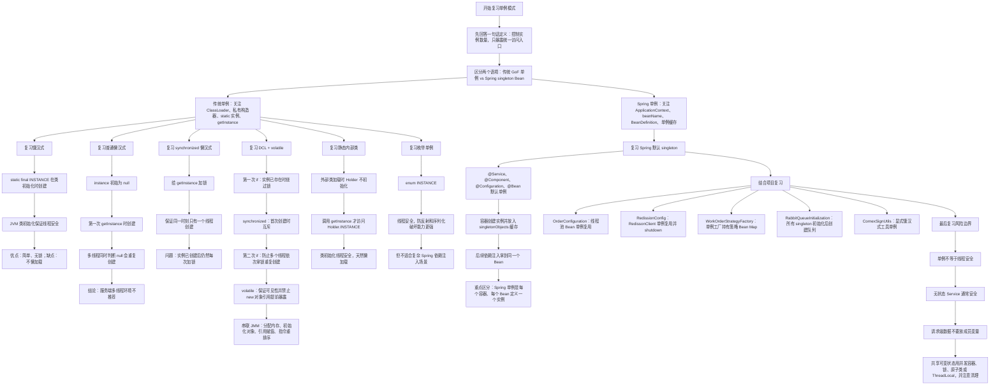
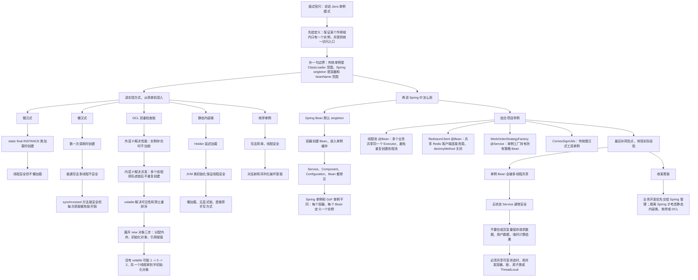

# Java 单例模式知识总结

## 1. 它是什么
单例模式的核心目标是：

> 保证一个类在某个作用域内只有一个实例，并提供统一访问入口。

传统 GoF 单例通常强调：

```text
一个 ClassLoader
  -> 一个类
  -> 一个实例
  -> 全局入口 getInstance()
```

Spring 中的单例要单独理解：

```text
一个 Spring IoC 容器
  -> 一个 beanName / beanDefinition
  -> 一个 Bean 实例
  -> 后续依赖注入或 getBean() 都返回同一个对象
```

所以二者不是完全等价：

| 对比 | 传统单例 | Spring singleton Bean |
|---|---|---|
| 控制方 | 类自己控制实例创建 | Spring 容器控制实例创建 |
| 唯一范围 | 通常是每个 ClassLoader 一个实例 | 每个 IoC 容器、每个 Bean 定义一个实例 |
| 访问方式 | `Singleton.getInstance()` | `@Autowired` / 构造器注入 / `getBean()` |
| 生命周期 | 类自己维护 | Spring 负责创建、依赖注入、初始化、销毁 |
| 适合场景 | 工具类、框架底层、无需 DI 的对象 | 业务 Service、配置 Bean、客户端、线程池、缓存组件 |

实际 Java 后端项目里，优先使用 Spring 容器管理单例；只有脱离 Spring、框架底层工具类、或者确实需要静态访问入口时，才考虑手写单例。

## 2. 为什么需要单例
单例主要解决三个问题：

- 控制实例数量，避免重量级对象重复创建，比如线程池、连接客户端、缓存管理器。
- 统一共享状态或能力，比如配置中心客户端、策略工厂、工具入口。
- 让对象生命周期可控，尤其在 Spring 中可以配合初始化和销毁方法。

但单例不是为了“少写 new”。

如果对象保存的是一次请求、一位用户、一次计算过程中的状态，就不适合做成共享单例。单例对象会被多个线程同时访问，最怕把请求级变量放到成员字段里。

## 3. 饿汉式
饿汉式是在类加载时直接创建实例。

```java
public class Singleton {

    private static final Singleton INSTANCE = new Singleton();

    private Singleton() {
    }

    public static Singleton getInstance() {
        return INSTANCE;
    }
}
```

执行流程：

```text
JVM 加载 Singleton 类
  -> 初始化 static final INSTANCE
  -> 构造唯一对象
  -> 外部调用 getInstance()
  -> 直接返回 INSTANCE
```

优点：

- 写法简单。
- JVM 类初始化天然线程安全。
- 获取实例没有锁开销。

缺点：

- 不支持真正懒加载。
- 对象很重、且可能永远不用时，会提前占用资源。

适合：

- 创建成本低。
- 一定会使用。
- 不依赖复杂外部资源。

## 4. 普通懒汉式
懒汉式希望第一次使用时再创建。

```java
public class Singleton {

    private static Singleton instance;

    private Singleton() {
    }

    public static Singleton getInstance() {
        if (instance == null) {
            instance = new Singleton();
        }
        return instance;
    }
}
```

问题是线程不安全：

```text
线程 A 进入 getInstance()
  -> 判断 instance == null
  -> 准备 new

线程 B 进入 getInstance()
  -> 也判断 instance == null
  -> 也 new

结果：
  -> 可能创建两个对象
```

普通懒汉式在单线程里能工作，但在服务端多线程环境下不应该使用。

## 5. synchronized 懒汉式
最直接的线程安全改法是给方法加锁。

```java
public class Singleton {

    private static Singleton instance;

    private Singleton() {
    }

    public static synchronized Singleton getInstance() {
        if (instance == null) {
            instance = new Singleton();
        }
        return instance;
    }
}
```

流程：

```text
多个线程同时调用 getInstance()
  -> 竞争 Singleton.class 对应的锁
  -> 只有一个线程进入方法
  -> 首次创建 instance
  -> 其他线程等待后再进入
  -> 发现 instance 已存在
  -> 返回同一个对象
```

优点是安全，缺点是每次获取都加锁。实例创建完成后，其实只需要读引用，不需要继续同步，所以性能上不够优雅。

## 6. DCL 双重检查锁
DCL 是 Double-Checked Locking，核心是“先无锁判断，再加锁创建，锁内再判断一次”。

```java
public class Singleton {

    private static volatile Singleton instance;

    private Singleton() {
    }

    public static Singleton getInstance() {
        if (instance == null) {
            synchronized (Singleton.class) {
                if (instance == null) {
                    instance = new Singleton();
                }
            }
        }
        return instance;
    }
}
```

两次判断分别解决不同问题：

```text
第一次 if
  -> 实例已创建时直接返回
  -> 避免每次调用都进入 synchronized

第二次 if
  -> 多线程同时通过第一次 if 后
  -> 只有抢到锁的线程真正创建
  -> 后续线程进入锁后再次检查
  -> 避免重复创建
```

为什么必须加 `volatile`：

```text
instance = new Singleton()
  -> 1. 分配内存
  -> 2. 初始化对象
  -> 3. instance 指向内存地址
```

在没有 `volatile` 时，JVM 或 CPU 可能为了优化发生重排序：

```text
1. 分配内存
  -> 3. instance 指向内存地址
  -> 2. 初始化对象
```

这时另一个线程可能看到：

```text
instance != null
  -> 直接返回
  -> 拿到一个还没初始化完成的对象
```

`volatile` 在这里提供两个关键能力：

- 可见性：一个线程写入 `instance` 后，其他线程能及时看到。
- 禁止关键重排序：避免引用先暴露、对象还没初始化完成。

DCL 是面试最常考写法，但业务代码里如果已经使用 Spring，一般不需要自己写 DCL。

## 7. 静态内部类
静态内部类是更推荐的手写单例方式之一。

```java
public class Singleton {

    private Singleton() {
    }

    private static class SingletonHolder {
        private static final Singleton INSTANCE = new Singleton();
    }

    public static Singleton getInstance() {
        return SingletonHolder.INSTANCE;
    }
}
```

流程：

```text
加载 Singleton 外部类
  -> 不会立即初始化 SingletonHolder
  -> 不会创建 INSTANCE

第一次调用 getInstance()
  -> 访问 SingletonHolder.INSTANCE
  -> 触发 SingletonHolder 类初始化
  -> JVM 保证类初始化线程安全
  -> 创建唯一 INSTANCE
  -> 返回实例

后续调用 getInstance()
  -> 直接返回已创建的 INSTANCE
```

优点：

- 懒加载。
- 线程安全。
- 没有显式 synchronized。
- 代码比 DCL 更清晰。

## 8. 枚举单例
枚举单例写法：

```java
public enum Singleton {

    INSTANCE;

    public void doSomething() {
        // 业务逻辑
    }
}
```

优点：

- 写法简单。
- 天然线程安全。
- 对反射和序列化破坏单例有更强防护。

适合非常纯粹的单例对象，但在 Spring 业务系统中并不常见，因为它不适合承接复杂依赖注入。

## 9. Spring 单例 Bean
Spring 默认 Bean scope 是 `singleton`。

常见写法：

```java
@Service
public class OrderService {
}
```

```java
@Configuration
public class OrderConfiguration {

    @Bean
    public Executor orderExecutor() {
        return new ThreadPoolTaskExecutor();
    }
}
```

默认效果：

```text
Spring 容器启动
  -> 扫描 @Service / @Component / @Configuration / @Bean
  -> 创建 BeanDefinition
  -> 创建 singleton Bean
  -> 放入单例缓存
  -> 后续注入同一个 Bean 实例
```

注意：

- Spring 单例不是“一个 JVM 里这个类只能有一个对象”。
- 它是“一个容器里，一个 Bean 定义对应一个对象”。
- 同一个类如果注册成两个不同 beanName，理论上可以有两个单例 Bean。
- `@Scope("prototype")` 可以改成每次获取创建新实例。

## 10. 单例和线程安全
单例对象会被多个请求线程共享，但“单例”不等于“线程安全”。

安全的单例 Bean 通常是无状态的：

```java
@Service
public class OrderService {

    public void createOrder(CreateOrderRequest request) {
        String orderNo = request.getOrderNo();
        // 局部变量，每个线程独立栈帧，通常安全
    }
}
```

危险写法：

```java
@Service
public class OrderService {

    private String currentOrderNo;

    public void createOrder(CreateOrderRequest request) {
        this.currentOrderNo = request.getOrderNo();
        // 多个请求线程会互相覆盖
    }
}
```

判断原则：

```text
成员变量是只读依赖
  -> 通常安全，比如 mapper、client、template

成员变量是不可变常量
  -> 安全，比如 static final 配置常量

成员变量会被请求动态修改
  -> 高风险
  -> 改成局部变量、方法参数、并发容器、锁、原子类或 ThreadLocal
```

## 11. 几种实现方式对比
| 实现方式 | 线程安全 | 懒加载 | 获取性能 | 推荐程度 | 说明 |
|---|---:|---:|---:|---:|---|
| 饿汉式 | 是 | 否 | 高 | 中 | 简单，适合一定会用的轻量对象 |
| 普通懒汉式 | 否 | 是 | 高 | 不推荐 | 多线程可能创建多个实例 |
| synchronized 懒汉式 | 是 | 是 | 一般 | 低 | 每次获取都加锁 |
| DCL + volatile | 是 | 是 | 高 | 高 | 面试重点，写法要严谨 |
| 静态内部类 | 是 | 是 | 高 | 高 | 手写单例更推荐 |
| enum | 是 | 不完全传统懒加载 | 高 | 高 | 防反射、序列化能力好 |
| Spring singleton Bean | 由容器保证单例创建 | 取决于容器策略 | 高 | 业务开发首选 | 适合 Service、Client、Executor、Cache 等 |

## 12. 当前项目中哪里使用到了
本次在 `D:\ai-work-project` 下搜索了显式单例写法、DCL、`@Scope`、Spring 组件注解、`@Bean`、策略工厂等。结论是：

- 显式 `private static volatile instance` / DCL 写法没有匹配到明显业务使用。
- 显式 `SingletonHolder` 静态内部类单例没有匹配到明显业务使用。
- 未匹配到显式 `@Scope(...)`，说明当前项目大多沿用 Spring 默认 `singleton` scope。
- 实际项目大量依赖 Spring 容器单例 Bean，这才是当前代码里的主流单例使用方式。

### 12.1 显式饿汉式工具单例：`CornexSignUtils`
位置：

```text
D:\ai-work-project\ka-solution\ka-solution-provider\src\main\java\com\kyexpress\ka\solution\provider\util\CornexSignUtils.java
```

关键代码：

```java
private static final CornexSignUtils SIGN_UTILS = new CornexSignUtils();

private CornexSignUtils() {
}

public static CornexSignUtils getInstance() {
    return SIGN_UTILS;
}
```

这是典型饿汉式单例：

```text
类加载 CornexSignUtils
  -> 创建 SIGN_UTILS
  -> 私有构造器阻止外部 new
  -> getInstance() 返回同一个对象
```

实际工作含义：

- 用于楚能签名工具，提供 JSON 转 Map、签名生成等能力。
- 类中方法大多是 `static`，`getInstance()` 的实际使用价值不强，更像历史工具类风格。
- `ObjectMapper` 作为 `static final` 共享对象使用，通常适合复用，但不要在运行期动态修改它的配置。

建议理解：

```text
工具类无状态
  -> 可以 static 方法
  -> 或者 Spring Bean
  -> 不一定需要手写 getInstance()
```

### 12.2 Spring 单例配置 Bean：线程池统一复用
位置：

```text
D:\ai-work-project\ka-order\ka-order-provider\src\main\java\com\kyexpress\ka\order\provider\config\OrderConfiguration.java
D:\ai-work-project\ka-common\ka-common\src\main\java\com\kyexpress\ka\common\config\BusinessCommonConfiguration.java
```

典型代码：

```java
@Configuration
public class OrderConfiguration {

    @Bean(name = "asyncKangZhanExecutor")
    public Executor asyncKangZhanExecutor() {
        ThreadPoolTaskExecutor executor = new ThreadPoolTaskExecutor();
        executor.setCorePoolSize(6);
        executor.setMaxPoolSize(10);
        executor.initialize();
        return executor;
    }
}
```

实际工作含义：

```text
Spring 容器启动
  -> 调用 @Bean 方法创建线程池
  -> 默认注册为 singleton Bean
  -> 多个业务类按 beanName 注入同一个 Executor
  -> 统一承接异步任务
```

为什么适合单例：

- 线程池本来就应该被复用，不能每次业务请求都创建。
- 统一 Bean 方便配置核心线程数、最大线程数、队列、拒绝策略。
- 容器关闭时可以统一销毁资源。

需要注意：

- 单例线程池是共享资源，参数设置会影响整个应用。
- 不同业务流量差异大时，用不同名字的线程池 Bean 做隔离。
- 线程池里不要长期持有请求对象，避免内存泄漏和上下文污染。

### 12.3 Spring 单例客户端 Bean：`RedissonClient`
位置：

```text
D:\ai-work-project\ka-order\ka-order-provider\src\main\java\com\kyexpress\ka\order\provider\config\RedissionConfig.java
D:\ai-work-project\ka-common\ka-rate-limit\src\main\java\com\kyexpress\ka\autoconfigure\RedissionConfig.java
```

典型代码：

```java
@Configuration
public class RedissionConfig {

    @Bean(destroyMethod = "shutdown")
    public RedissonClient redisson() {
        Config config = new Config();
        return Redisson.create(config);
    }
}
```

实际工作含义：

```text
应用启动
  -> 根据 Redis 配置创建 RedissonClient
  -> 作为 singleton Bean 放入 Spring 容器
  -> 分布式锁、限流等组件复用同一个客户端
  -> 应用关闭时调用 shutdown()
```

为什么适合单例：

- Redis 客户端内部通常维护连接、线程、网络资源。
- 重复创建会浪费资源，甚至造成连接数膨胀。
- Spring 托管后可以用 `destroyMethod` 做资源释放。

### 12.4 Spring 单例策略工厂：`WorkOrderStrategyFactory`
位置：

```text
D:\ai-work-project\ka-monitor\ka-monitor-provider\src\main\java\com\kyexpress\ka\monitor\provider\service\workorder\alarm\WorkOrderStrategyFactory.java
D:\ai-work-project\ka-monitor\ka-monitor-provider\src\main\java\com\kyexpress\ka\monitor\provider\controller\work\AlarmFollowController.java
```

关键代码：

```java
@Service
public class WorkOrderStrategyFactory {

    @Autowired
    private Map<String, AbstractWorkOrderStrategyHandle> strategyMap;

    public AbstractWorkOrderStrategyHandle getByStrategyName(String strategyName) {
        return strategyMap.get(strategType);
    }
}
```

调用链：

```text
AlarmFollowController
  -> 注入 WorkOrderStrategyFactory
  -> 根据告警类型选择策略名
  -> getByStrategyName()
  -> 从 strategyMap 取出对应策略 Bean
  -> 调用 alarmNoty()
```

实际工作含义：

- `WorkOrderStrategyFactory` 是 Spring 默认单例 Service。
- `strategyMap` 中的策略实现类也是 Spring Bean，默认也是单例。
- 这是一种“单例 Bean + 策略模式”的组合：工厂本身只保存策略映射，不需要每次创建策略对象。

需要注意：

- 如果策略 Bean 内部没有请求级可变成员变量，默认单例是合适的。
- 如果策略处理过程需要临时状态，应放在方法局部变量中，而不是策略对象字段里。

### 12.5 Spring 生命周期钩子：`SmartInitializingSingleton`
位置：

```text
D:\ai-work-project\ka-common\ka-common\src\main\java\com\kyexpress\ka\common\rabbitmq\RabbitQueueInitialization.java
```

关键代码：

```java
@Component
public class RabbitQueueInitialization
        implements BeanPostProcessor, Ordered, SmartInitializingSingleton {

    private final ConcurrentMap<Class<?>, TypeMetadata> typeCache = new ConcurrentHashMap<>();
    private final ConcurrentMap<String, String> queuesCache = new ConcurrentHashMap<>();

    @Override
    public void afterSingletonsInstantiated() {
        queuesCache.keySet().forEach(RabbitProducer::createQueue);
        this.typeCache.clear();
        this.queuesCache.clear();
    }
}
```

实际工作含义：

```text
Spring 创建各类 singleton Bean
  -> BeanPostProcessor 扫描 RabbitListener
  -> 缓存监听队列元数据
  -> 所有单例 Bean 初始化完成
  -> afterSingletonsInstantiated()
  -> 创建 Rabbit 队列
  -> 清理临时缓存
```

这是理解 Spring 单例生命周期的好例子：

- 它不是手写单例模式。
- 它依赖 Spring “所有单例 Bean 初始化完成后”的回调。
- 内部用 `ConcurrentHashMap` 是因为 Bean 后处理阶段可能涉及多个 Bean 和并发安全要求。

### 12.6 Spring 单例工具 Bean：`KafkaUtil`、`RedisLockUtil`
位置：

```text
D:\ai-work-project\ka-common\ka-common\src\main\java\com\kyexpress\ka\common\util\KafkaUtil.java
D:\ai-work-project\ka-common\ka-common\src\main\java\com\kyexpress\ka\common\util\RedisLockUtil.java
```

实际工作含义：

- `KafkaUtil` 标注 `@Component`，但方法是 `static`，内部通过 `SpringUtils.getBean(KafkaTemplate.class)` 获取容器 Bean，属于历史工具类风格。
- `RedisLockUtil` 是标准 Spring 单例工具 Bean，注入 `StringRedisTemplate`，提供 Redis 加锁、解锁、查询能力。

建议理解：

```text
推荐：
  业务类通过依赖注入使用 KafkaProducer / RedisLockUtil

不太推荐：
  static 工具方法里再手动 SpringUtils.getBean()
```

因为依赖注入更利于测试、替换、生命周期管理，也更符合 Spring 的单例 Bean 使用方式。

## 13. 实际工作怎么判断是否该用单例
可以按这个顺序判断：

```text
对象是否保存请求级状态？
  -> 是：不要做共享单例
  -> 否：继续判断

对象是否创建成本高，或者内部维护连接、线程、缓存？
  -> 是：适合单例，比如 Executor、RedissonClient、CacheManager
  -> 否：继续判断

对象是否是普通业务 Service / Controller / Mapper / Factory？
  -> 是：交给 Spring 默认 singleton
  -> 否：继续判断

对象是否脱离 Spring，且需要全局唯一入口？
  -> 是：考虑静态内部类、枚举或饿汉式
  -> 否：普通对象即可
```

在当前项目里，最常见的选择是：

```text
业务组件
  -> @Service / @Component
  -> Spring 默认 singleton

基础设施组件
  -> @Bean
  -> Spring 默认 singleton
  -> 加 destroyMethod 管理销毁

无状态工具
  -> 优先考虑静态方法或 Spring Bean
  -> 少量历史代码使用 getInstance()
```

## 14. 复习的思路


## 15. 面试讲解思路


## 16. 面试时可以这样说
单例模式是为了保证一个类在某个作用域内只有一个实例，并提供统一访问入口。传统单例一般通过私有构造器、静态实例、`getInstance()` 实现；Spring 里的 singleton 更常见，它是每个容器、每个 Bean 定义一个实例。

实现上，饿汉式简单且线程安全，但不懒加载；普通懒汉式支持懒加载但线程不安全；`synchronized` 懒汉式安全但每次获取都有锁开销；DCL 通过两次判空和同步块兼顾性能与安全，但实例字段必须加 `volatile`，因为 `new` 对象可能发生“分配内存、引用赋值、初始化对象”的重排序，导致其他线程拿到半初始化对象。静态内部类利用 JVM 类初始化的线程安全机制，既懒加载又没有显式锁，是比较推荐的手写方式；枚举单例对反射和序列化破坏有更强防护。

实际项目里，我更常用 Spring 默认单例，比如 `@Service`、`@Component` 和 `@Bean`。像线程池、`RedissonClient`、策略工厂这类对象就适合容器单例复用，减少资源创建和方便生命周期管理。但单例不等于线程安全，单例 Bean 会被多个请求线程共享，所以业务 Service 要尽量无状态，请求级数据放局部变量，不要放成员字段。

## 17. 参考来源
- [Spring Framework - Bean Scopes](https://docs.spring.io/spring-framework/reference/core/beans/factory-scopes.html)
- [Spring Framework - Using the @Bean Annotation](https://docs.spring.io/spring-framework/reference/6.2/core/beans/java/bean-annotation.html)
- [JavaGuide - 设计模式常见面试题总结](https://interview.javaguide.cn/system-design/design-pattern.html)
- [JavaGuide - Spring 中的设计模式详解](https://javaguide.cn/system-design/framework/spring/spring-design-patterns-summary.html)
- [JavaGuide - Java 关键字总结：静态内部类实现单例](https://javaguide.cn/java/basis/java-keyword-summary.html)


* 单例模式解决什么问题？ 减少类创建、方便管理对象生命周期  
* 如何实现单例：饿汉式、懒汉式（DCL）、枚举类（类初始化机制、反序列化、防反射）  
* 在实际中，基于JVM实现的单例往往用的比较少，因为开发业务往往是结合spring框架，但是我们需要了解如何去防止反射和DCL的思想  
* 传统基于类加载器创建对应单例对象（保证一个类在JVM中只有一个实例）  
* spring框架是基于IOC容器创建单例对象  
* 场景：线程池、应用缓存  
* 注意事项：类中存在共享变量引发的并发问题
* 联想：有序性、可见性、原子性、synchronized、volatile、八大原子操作、MESI协议

