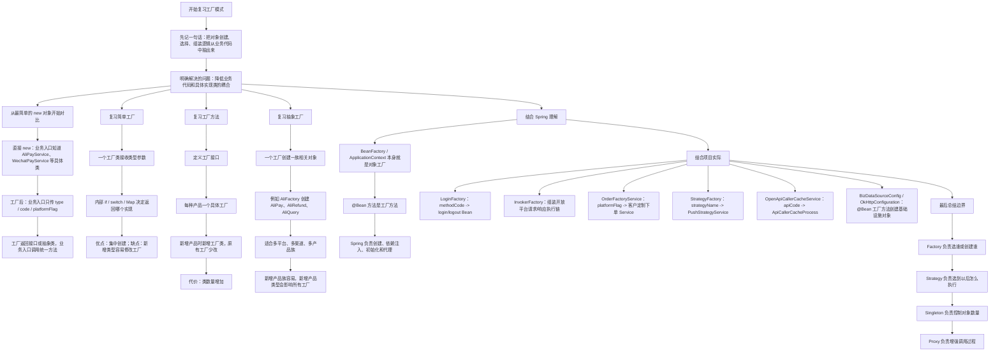
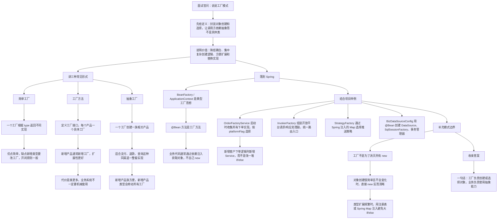

# Java 工厂模式知识总结

## 1. 它是什么
工厂模式的核心是：

> 把对象创建、对象选择、对象组装的逻辑从业务代码中抽出来，让调用方只关心“我要什么能力”，不关心“具体怎么 new、怎么初始化、怎么选择实现类”。

最直观的变化是：

```text
原来：
业务代码
  -> new 具体实现类
  -> 设置参数
  -> 调用方法

工厂模式：
业务代码
  -> 向工厂说明类型或条件
  -> 工厂返回接口或抽象类
  -> 业务代码调用统一能力
```

它解决的不只是“少写几个 new”，更重要的是控制依赖关系：

```text
业务层直接依赖具体类
  -> 改成依赖接口 / 抽象类
  -> 具体实现由工厂负责创建或选择
  -> 新增实现时尽量少改业务流程
```

## 2. 为什么需要工厂模式
假设下单系统需要根据客户、平台、接口类型选择不同处理逻辑。

不用工厂时，代码可能变成：

```java
if ("JD".equals(platformFlag)) {
    return new JdOrderService().execute(request);
}

if ("CAINIAO".equals(platformFlag)) {
    return new CainiaoOrderService().execute(request);
}

if ("PDD".equals(platformFlag)) {
    return new PddOrderService().execute(request);
}
```

问题是：

- 业务入口知道太多具体实现类。
- 每接一个客户或平台，都要改入口判断。
- 创建过程如果需要依赖注入、配置、初始化链路，会越来越乱。
- 不利于测试和扩展。

使用工厂后：

```text
业务入口
  -> platformFlag
  -> OrderFactory
  -> 找到对应 OrderService
  -> execute()
```

业务入口只关心“平台标识是什么”，不关心具体处理类怎么创建、从哪里来。

## 3. 简单工厂
简单工厂通常是一个工厂类根据参数返回不同产品。

```java
public class PayFactory {

    public static PayService create(String type) {
        if ("ali".equals(type)) {
            return new AliPayService();
        }
        if ("wechat".equals(type)) {
            return new WechatPayService();
        }
        throw new IllegalArgumentException("不支持的支付类型：" + type);
    }
}
```

调用方：

```java
PayService payService = PayFactory.create("ali");
payService.pay();
```

结构：

```text
Client
  -> PayFactory.create(type)
  -> AliPayService / WechatPayService
  -> PayService.pay()
```

优点：

- 简单直观。
- 把创建逻辑集中起来。
- 调用方不直接 `new` 具体实现。

缺点：

- 产品类型越多，`if/else` 或 `switch` 越大。
- 新增产品通常要修改工厂类。
- 工厂容易变成“上帝类”。

实际项目里，简单工厂常常会演化成“注册表工厂”：

```text
type -> class
type -> beanName
type -> strategy instance
```

这样可以减少大段分支判断。

## 4. 工厂方法
工厂方法模式把“创建产品”的职责交给多个具体工厂。

```java
public interface PayFactory {

    PayService createPayService();
}
```

```java
public class AliPayFactory implements PayFactory {

    @Override
    public PayService createPayService() {
        return new AliPayService();
    }
}
```

```java
public class WechatPayFactory implements PayFactory {

    @Override
    public PayService createPayService() {
        return new WechatPayService();
    }
}
```

结构：

```text
PayFactory
  -> AliPayFactory
      -> AliPayService
  -> WechatPayFactory
      -> WechatPayService
```

相比简单工厂：

| 对比 | 简单工厂 | 工厂方法 |
|---|---|---|
| 工厂数量 | 一个核心工厂 | 多个具体工厂 |
| 新增产品 | 通常修改原工厂 | 新增一个工厂类 |
| 扩展性 | 一般 | 更好 |
| 代码复杂度 | 低 | 更高 |
| 常见位置 | 业务代码、工具类 | 框架、组件化设计 |

工厂方法更符合开闭原则，但类数量会增加。业务开发中不一定要机械套用，很多时候 Spring 的 `Map<String, Bean>` 或 `getBeansOfType()` 更自然。

## 5. 抽象工厂
抽象工厂用于创建“一族相关对象”。

例如支付体系里不只有支付，还有退款、查询、回调解析：

```text
支付宝产品族：
  -> AliPayService
  -> AliRefundService
  -> AliQueryService

微信产品族：
  -> WechatPayService
  -> WechatRefundService
  -> WechatQueryService
```

抽象工厂：

```java
public interface PaymentFactory {

    PayService createPayService();

    RefundService createRefundService();

    QueryService createQueryService();
}
```

支付宝工厂：

```java
public class AliPaymentFactory implements PaymentFactory {

    public PayService createPayService() {
        return new AliPayService();
    }

    public RefundService createRefundService() {
        return new AliRefundService();
    }

    public QueryService createQueryService() {
        return new AliQueryService();
    }
}
```

抽象工厂的重点不是“创建多个对象”，而是保证一组对象属于同一套实现体系：

```text
AliFactory
  -> AliPay
  -> AliRefund
  -> AliQuery

WechatFactory
  -> WechatPay
  -> WechatRefund
  -> WechatQuery
```

适合：

- 多平台、多渠道、多产品族。
- 一次选择要影响后续多类对象。
- 需要保证一组对象风格一致、协议一致、配置一致。

缺点：

- 新增产品族容易。
- 新增产品类型比较麻烦，因为所有工厂接口都要加方法。

## 6. Spring 和工厂模式
Java 后端里最常见的工厂不是手写 `PayFactory`，而是 Spring 容器。

```text
业务代码
  -> @Autowired PayService
  -> 不关心 PayService 实现怎么 new

Spring 容器
  -> 扫描 BeanDefinition
  -> 创建对象
  -> 注入依赖
  -> 初始化
  -> 可能生成代理
  -> 返回最终 Bean
```

`BeanFactory` 和 `ApplicationContext` 都体现了工厂思想：

```java
PayService payService = applicationContext.getBean(PayService.class);
```

`@Bean` 方法也是一种工厂方法：

```java
@Configuration
public class ClientConfiguration {

    @Bean
    public OkHttpClient okHttpClient() {
        return new OkHttpClient.Builder()
                .connectTimeout(30, TimeUnit.SECONDS)
                .build();
    }
}
```

这里业务代码不直接 `new OkHttpClient.Builder()`，而是复用容器创建好的客户端 Bean。

## 7. 工厂模式和策略模式的关系
实际项目里，工厂模式经常和策略模式一起出现。

```text
工厂负责：
  根据 type / code / platformFlag 找到对象

策略负责：
  这个对象拿到请求后怎么执行业务
```

例如：

```text
platformFlag = JD
  -> OrderFactoryService 找到 JdOrderService
  -> JdOrderService.execute()
```

所以可以这样记：

```text
Factory = 选谁 / 创建谁
Strategy = 选到以后怎么执行
```

很多类名字叫 `StrategyFactory`，本质就是“工厂 + 策略”的组合。

## 8. 当前项目中哪里使用到了
本次在 `D:\ai-work-project` 下搜索了 `Factory`、`FactoryBean`、`BeanFactory`、`@Bean`、`getBeansOfType()`、`SpringUtils.getBean()`、策略工厂、订单工厂等关键词。当前项目里工厂模式主要有以下几类落点。

### 8.1 `LoginFactory`：简单工厂 + 注册表
位置：

```text
D:\ai-work-project\openapi-router\openapi-router-provider\src\main\java\com\kyexpress\openapi\router\provider\login\LoginFactory.java
D:\ai-work-project\openapi-router\openapi-router-provider\src\main\java\com\kyexpress\openapi\router\provider\invoker\request\RequestRemoteAfterInvoker.java
```

关键逻辑：

```java
private static Map<String, Class> codeEnemMap = new HashMap<>();

static {
    for (CodeEnem codeEnem : CodeEnem.values()) {
        codeEnemMap.put(codeEnem.getCode(), codeEnem.getClazz());
    }
}

public static String loginout(String code, HttpServletRequest request,
                              String requestContent, String responseResult) {
    Class actionClazz = codeEnemMap.get(code);
    Object loginout = SpringUtils.getBean(actionClazz);
    ...
}
```

实际工作含义：

```text
远程接口返回后
  -> RequestRemoteAfterInvoker
  -> LoginFactory.loginout(methodCode, request, requestData, responseData)
  -> methodCode 映射到 WmsLogin / WXSsoLogin / WXSsoLogout 等类
  -> 从 Spring 容器取出对应 Bean
  -> 执行 login 或 logout 后置处理
```

这是一个很典型的简单工厂：

- 输入：接口方法编码 `code`。
- 注册表：`CodeEnem` 维护 `code -> clazz`。
- 创建/获取：通过 `SpringUtils.getBean(actionClazz)` 获取处理对象。
- 输出：统一执行登录/退出处理。

这里的“创建”不是每次 `new`，而是从 Spring 容器拿 Bean。实际业务项目里，工厂经常是“对象选择器”。

### 8.2 `InvokerFactory`：工厂组装执行链
位置：

```text
D:\ai-work-project\openapi-router\openapi-router-provider\src\main\java\com\kyexpress\openapi\router\provider\invoker\InvokerFactory.java
D:\ai-work-project\openapi-router\openapi-router-provider\src\main\java\com\kyexpress\openapi\router\provider\controller\RouterV2Controller.java
```

关键逻辑：

```java
@Component
public class InvokerFactory {

    private static final List<InterfaceInvoker> requestInvokerList = new ArrayList<>();
    private static final List<InterfaceInvoker> responseInvokerList = new ArrayList<>();

    @PostConstruct
    private void init() {
        requestInvokerList.add(initRequestDataInvoker);
        requestInvokerList.add(checkRequestHeaderArgsInvoker);
        requestInvokerList.add(loadUserInfoInvoker);
        ...
        responseInvokerList.add(initResponseDataInvoker);
        responseInvokerList.add(formatResponseDataInvoker);
        responseInvokerList.add(writeResponseDataInvoker);
    }

    public static void invoke(HttpServletRequest request, HttpServletResponse response) {
        for (InterfaceInvoker interfaceInvoker : requestInvokerList) {
            interfaceInvoker.invoke(routerInfo, request, response);
        }
        for (InterfaceInvoker interfaceInvoker : responseInvokerList) {
            interfaceInvoker.invoke(routerInfo, request, response);
        }
    }
}
```

调用入口：

```java
@RequestMapping(value = "/rest", method = {RequestMethod.GET, RequestMethod.POST})
public void route(HttpServletRequest request, HttpServletResponse response) {
    InvokerFactory.invoke(request, response);
}
```

实际工作含义：

```text
HTTP 请求进入 RouterV2Controller
  -> InvokerFactory.invoke()
  -> 创建 RouterInfo 上下文
  -> 按固定顺序执行请求处理链
      -> 初始化请求数据
      -> 校验请求头
      -> 加载用户信息
      -> 验签
      -> 转换请求参数
      -> 远程调用
      -> 转换远程响应
  -> 按固定顺序执行响应处理链
      -> 初始化响应
      -> 用户自定义响应参数转换
      -> 格式化输出
      -> 保存日志
```

这个类名字叫 Factory，但它更像“执行链工厂/编排器”：

- 负责把很多 `InterfaceInvoker` 组织成一条稳定流程。
- 具体 Invoker 是 Spring Bean，不由工厂手动 new。
- 工厂负责“组装顺序”和“统一入口”。

这类写法在网关、路由、开放平台接口处理中心里很常见。

### 8.3 `OrderFactoryService`：按客户平台选择下单实现
位置：

```text
D:\ai-work-project\ka-order\ka-order-provider\src\main\java\com\kyexpress\ka\order\provider\service\common\order\OrderFactoryService.java
```

关键逻辑：

```java
public class OrderFactoryService implements ApplicationRunner {

    private final Map<String, SupportPartOrderAbstractService> customerBatchOrderServiceMap = Maps.newHashMap();
    private final Map<String, NoSupportPartAbstractService> customerPlanOrderServiceMap = Maps.newHashMap();

    @Override
    public void run(ApplicationArguments applicationArguments) {
        Map<String, NoSupportPartAbstractService> planOrderServiceMap =
                SpringUtils.getApplicationContext().getBeansOfType(NoSupportPartAbstractService.class);

        Map<String, SupportPartOrderAbstractService> batchOrderServiceMap =
                SpringUtils.getApplicationContext().getBeansOfType(SupportPartOrderAbstractService.class);

        planOrderServiceMap.values().stream()
                .filter(item -> item.platformFlag() != null)
                .forEach(orderService -> customerPlanOrderServiceMap.put(orderService.platformFlag(), orderService));

        batchOrderServiceMap.values().stream()
                .filter(item -> item.platformFlag() != null)
                .forEach(orderService -> customerBatchOrderServiceMap.put(orderService.platformFlag(), orderService));
    }
}
```

实际工作含义：

```text
应用启动
  -> Spring 创建所有下单 Service
  -> OrderFactoryService 扫描两类抽象服务的所有实现
  -> 读取每个实现的 platformFlag()
  -> 建立 platformFlag -> OrderService 的 Map

请求进入
  -> 读取 platformFlag
  -> customerBatchOrderServiceMap.get(platformFlag)
  -> 有定制实现：走客户定制下单逻辑
  -> 没有定制实现：走标准下单逻辑
```

这是当前项目中最贴近业务的工厂例子。

它把大量客户定制逻辑从统一入口中拆开：

- 客户定制服务各自实现自己的 `platformFlag()` 和 `execute()`。
- 工厂在启动时自动收集。
- 下单入口不需要写几十个客户 `if/else`。
- 新增客户时，只要新增一个实现类并声明平台标识，就能被收集进工厂。

这其实是：

```text
Spring Bean 扫描
  + 工厂注册表
  + 策略模式
  + 执行链初始化
```

的组合。

### 8.4 `StrategyFactory`：重试推送策略工厂
位置：

```text
D:\ai-work-project\ka-retry\ka-retry-provider\src\main\java\com\kyexpress\ka\retry\provider\service\strategy\StrategyFactory.java
D:\ai-work-project\ka-retry\ka-retry-provider\src\main\java\com\kyexpress\ka\retry\provider\listener\RetryKafkaListener.java
```

关键逻辑：

```java
@Component
public class StrategyFactory {

    @Autowired
    private Map<String, PushStrategyService> strategyMap;

    public PushStrategyService getByStrategyName(String strategyName) {
        String strategType = strategyMap.keySet()
                .stream()
                .filter(f -> f.toLowerCase().contains(strategyName.replace("-", "").toLowerCase()))
                .findFirst()
                .orElse("");
        return strategyMap.get(strategType);
    }
}
```

实际工作含义：

```text
Kafka 重试消息到达
  -> RetryKafkaListener
  -> 根据消息中的策略名选择处理方式
  -> StrategyFactory.getByStrategyName()
  -> 从 Spring 注入的 strategyMap 中找 PushStrategyService
  -> 执行具体推送 / 补偿 / 重试逻辑
```

这里不是创建新对象，而是从 Spring 已经创建好的策略 Bean 里选一个。

这种写法比手动维护 `if/else` 更适合扩展：

```text
新增一种推送策略
  -> 新增 PushStrategyService 实现
  -> 注册为 Spring Bean
  -> 工厂 Map 自动持有
```

### 8.5 `OpenApiCallerCacheService`：按 `apiCode` 查找缓存处理器
位置：

```text
D:\ai-work-project\ka-solution\ka-solution-provider\src\main\java\com\kyexpress\ka\solution\provider\service\common\OpenApiCallerCacheService.java
```

关键逻辑：

```java
private static ApiCallerCacheProcess getBean(String apiCode) {
    ApplicationContext cxt = SpringUtils.getApplicationContext();
    Map<String, ApiCallerCacheProcess> beansOfType = cxt.getBeansOfType(ApiCallerCacheProcess.class);
    for (Map.Entry<String, ApiCallerCacheProcess> entry : beansOfType.entrySet()) {
        if (StringUtils.equals(entry.getValue().apiCode(), apiCode)) {
            return entry.getValue();
        }
    }
    return null;
}
```

实际工作含义：

```text
内开接口缓存请求
  -> 传入 apiCode
  -> 查找所有 ApiCallerCacheProcess Bean
  -> 找到 apiCode 匹配的缓存处理器
  -> 执行缓存查询、保存、更新
```

它体现的是“基于业务标识选择实现类”的工厂思想。

可以优化的方向：

- 当前每次查找都会遍历 `getBeansOfType()` 结果。
- 如果调用频率高，可以在启动时构建 `apiCode -> ApiCallerCacheProcess` 缓存 Map。
- 这样更接近 `OrderFactoryService` 的注册表工厂写法。

### 8.6 `@Bean` 工厂方法：数据源、线程池、HTTP 客户端
典型位置：

```text
D:\ai-work-project\ka-query\ka-query-provider\src\main\java\com\kyexpress\ka\query\provider\config\datasource\BizDataSourceConfig.java
D:\ai-work-project\ka-query\ka-query-provider\src\main\java\com\kyexpress\ka\query\provider\config\datasource\AbstractDataSourceConfig.java
D:\ai-work-project\openapi-adapter\openapi-adapter-router-core\src\main\java\com\kyexpress\openapi\adapter\router\config\OkHttpConfiguration.java
D:\ai-work-project\ka-order\ka-order-provider\src\main\java\com\kyexpress\ka\order\provider\config\OrderConfiguration.java
```

`BizDataSourceConfig` 示例：

```java
@Bean(BEAN_PREFIX + "DataSource")
@ConfigurationProperties(PROPERTIES_PREFIX_HIKARI)
public DataSource dataSource(DataSourceProperties dataSourceProperties) {
    return dataSourceProperties.initializeDataSourceBuilder().build();
}

@Bean(name = BEAN_PREFIX + "SqlSessionFactory")
public SqlSessionFactory sqlSessionFactory(DataSource dataSource,
                                           MybatisProperties mybatisProperties) throws Exception {
    return super.getSqlSessionFactory(dataSource, mybatisProperties, keyGenMode);
}
```

`AbstractDataSourceConfig` 中使用框架工厂：

```java
SqlSessionFactoryBean factory = new SqlSessionFactoryBean();
factory.setDataSource(dataSource);
return factory.getObject();
```

实际工作含义：

```text
配置文件
  -> DataSourceProperties
  -> dataSource() 工厂方法创建 DataSource
  -> sqlSessionFactory() 工厂方法创建 SqlSessionFactory
  -> sqlSessionTemplate() 工厂方法创建 SqlSessionTemplate
  -> MapperScan 使用指定 SqlSessionFactory
```

`OkHttpConfiguration` 示例：

```java
@Bean
public OkHttpClient okHttpClient() {
    return new OkHttpClient.Builder()
            .sslSocketFactory(sslSocketFactory(), x509TrustManager())
            .connectionPool(pool())
            .connectTimeout(30, TimeUnit.SECONDS)
            .build();
}
```

这些都属于 Spring 中非常典型的工厂方法：

- 对象创建复杂。
- 需要绑定配置。
- 需要统一复用。
- 需要交给容器管理生命周期。

## 9. 实际工作中的使用建议
优先级可以这样判断：

```text
只是少量类型判断，创建逻辑简单
  -> 简单工厂可以接受

类型会持续扩展，不想改原工厂
  -> Spring Map 注入 / getBeansOfType 注册表

需要选择某个业务行为
  -> 工厂 + 策略

需要创建一组相关对象
  -> 抽象工厂

对象创建依赖配置和生命周期
  -> @Configuration + @Bean
```

不要滥用工厂：

- 如果对象就是一个普通 DTO，直接 `new` 更清晰。
- 如果工厂里只有一行 `return new Xxx()`，且没有隐藏复杂性，价值不大。
- 如果工厂变成几百行 `if/else`，应该考虑注册表、枚举映射、Spring `Map<String, Bean>` 或配置化。

## 10. 复习的思路


## 11. 面试讲解思路


## 12. 面试时可以这样说
工厂模式的核心是把对象创建和选择逻辑封装起来，让业务代码依赖接口或抽象类，而不是直接依赖具体实现。简单工厂是一个工厂根据类型参数返回不同对象，优点简单，缺点是类型多了以后工厂容易变成大量 `if/else`。工厂方法是每类产品对应自己的工厂，扩展性更好，但类数量会增加。抽象工厂用于创建一族相关对象，比如同一个支付渠道下的支付、退款、查询等一整套实现。

在 Spring 项目里，工厂思想非常常见。`ApplicationContext` 和 `BeanFactory` 本身就是对象工厂，`@Bean` 方法也是工厂方法。我们项目里的 `OrderFactoryService` 会在应用启动时收集不同客户下单服务，然后根据 `platformFlag` 选择对应实现；`StrategyFactory` 根据策略名选择推送策略；`InvokerFactory` 组装开放平台请求和响应处理链。这些都说明工厂模式在实际业务里更多是“选择合适的 Bean 并组织调用”，不一定是每次手动 `new` 对象。

## 13. 参考来源
- [Spring Framework - BeanFactory API](https://docs.spring.io/spring-framework/docs/current/javadoc-api/org/springframework/beans/factory/BeanFactory.html)
- [Spring Framework - ApplicationContext API](https://docs.spring.io/spring-framework/docs/current/javadoc-api/org/springframework/context/ApplicationContext.html)
- [Spring Framework - Using the @Bean Annotation](https://docs.spring.io/spring-framework/reference/core/beans/java/bean-annotation.html)
- [JavaGuide - 设计模式常见面试题总结](https://interview.javaguide.cn/system-design/design-pattern.html)
- [JavaGuide - Spring 中的设计模式详解](https://javaguide.cn/system-design/framework/spring/spring-design-patterns-summary.html)

* 工厂模式解决的问题  
* 简单工厂模式、方法工厂、抽象工厂  
* 简单工厂：多个对象的创建放在一个工厂中，用类型做区分 存在问题：开闭原则  
* 方法工厂：一个对象对应一个工厂，加对象时，加对应的工厂即可  存在问题：类太多  
* 抽象工厂模式：  
* 一类业务对象抽象成一个工厂接口（下单、支付、退款），具体创建对象的步骤放在具体实现，后续加对象时，只需要实现工厂接口即可(需要提前设计，熟悉业务)  
* 支付宝下单、支付、退款  
* 微信下单、支付、退款  
* 业务场景：beanFactory、下单工厂（支持全部成功下单、支持部分成功下单、支持同步、支持异常）

