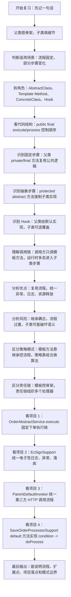
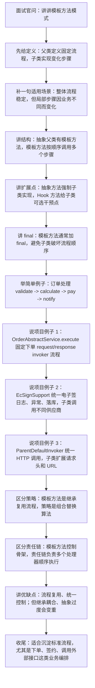

# Java 模板方法模式知识总结

## 1. 它是什么

模板方法模式的核心是：

> 父类定义一套固定流程，子类只实现流程中可变化的步骤。

一句话记忆：

```text
模板方法模式 = 父类搭骨架，子类填细节
```

它适合解决这类问题：

```text
整体流程基本稳定
  -> 某几个步骤在不同场景下不同
  -> 希望公共流程只写一份
  -> 希望子类不能随便破坏整体顺序
```

例如订单处理：

```text
校验订单
  -> 计算价格
  -> 风控检查
  -> 支付
  -> 通知
```

普通订单和 VIP 订单的大流程一样，但“计算价格”不同，这就适合模板方法。

## 2. 标准角色

| 角色 | 说明 | 示例 |
|---|---|---|
| AbstractClass | 抽象父类，定义模板流程 | `OrderProcessor` |
| Template Method | 模板方法，规定执行顺序 | `process()` |
| ConcreteClass | 具体子类，实现变化步骤 | `VipOrderProcessor` |
| Primitive Operation | 子类必须实现的步骤 | `calculatePrice()` |
| Hook Method | 钩子方法，子类可选择覆盖 | `needNotify()` |

标准结构：

```java
public abstract class AbstractTemplate {

    public final void execute() {
        step1();
        step2();
        if (needStep3()) {
            step3();
        }
        step4();
    }

    private void step1() {
        // 固定步骤
    }

    protected abstract void step2();

    protected boolean needStep3() {
        return true;
    }

    private void step3() {
        // 固定步骤
    }

    private void step4() {
        // 固定步骤
    }
}
```

重点看这三类方法：

| 方法类型 | 是否由父类实现 | 是否允许子类改 | 作用 |
|---|---:|---:|---|
| 模板方法 | 是 | 通常不允许，建议 `final` | 控制整体流程 |
| 抽象步骤 | 否 | 必须实现 | 留给子类完成差异逻辑 |
| Hook 钩子 | 是，默认实现 | 可选覆盖 | 子类按需影响流程 |
| 固定步骤 | 是 | 不建议覆盖 | 公共逻辑复用 |

## 3. 基础示例

抽象父类：

```java
public abstract class OrderProcessor {

    public final void process() {
        validate();
        calculatePrice();
        pay();
        if (needNotify()) {
            notifyUser();
        }
    }

    private void validate() {
        System.out.println("校验订单");
    }

    protected abstract void calculatePrice();

    private void pay() {
        System.out.println("支付订单");
    }

    protected boolean needNotify() {
        return true;
    }

    private void notifyUser() {
        System.out.println("发送通知");
    }
}
```

普通订单：

```java
public class NormalOrderProcessor extends OrderProcessor {

    @Override
    protected void calculatePrice() {
        System.out.println("普通订单按原价计算");
    }
}
```

VIP 订单：

```java
public class VipOrderProcessor extends OrderProcessor {

    @Override
    protected void calculatePrice() {
        System.out.println("VIP 订单按 8 折计算");
    }
}
```

调用方：

```java
OrderProcessor processor = new VipOrderProcessor();
processor.process();
```

调用方只调用 `process()`，流程顺序由父类控制，子类只负责差异步骤。

## 4. Hook 钩子方法

Hook 是模板方法模式里非常重要的扩展点。

```java
protected boolean needNotify() {
    return true;
}
```

父类提供默认行为：

```text
默认发送通知
```

某个子类可以覆盖：

```java
@Override
protected boolean needNotify() {
    return false;
}
```

流程就变成：

```text
校验订单
  -> 计算价格
  -> 支付
  -> needNotify() == false
  -> 不发送通知
```

Hook 的意义是：

> 父类仍然掌控主流程，但给子类留一个可选干预点。

## 5. 为什么不每个类自己写流程

如果不用模板方法，每个类都自己写：

```java
public void process() {
    validate();
    calculatePrice();
    pay();
    notifyUser();
}
```

多个类会重复：

```text
validate()
pay()
notifyUser()
异常处理
日志记录
耗时统计
资源释放
```

一旦公共流程变更，例如“支付前统一增加风控”，就要改很多地方。

模板方法把公共流程集中到父类：

```text
父类改一次
  -> 所有子类复用新流程
```

所以它复用的不是某个工具方法，而是：

```text
一整套业务流程
```

## 6. 和策略模式的区别

模板方法和策略模式很容易混。

| 对比 | 模板方法 | 策略模式 |
|---|---|---|
| 核心关系 | 继承 | 组合 |
| 谁控制流程 | 父类 | 调用方或上下文对象 |
| 子类变化范围 | 流程中的部分步骤 | 整个算法或行为可以替换 |
| 适用场景 | 流程固定，步骤变化 | 算法可替换，运行时切换 |

简单判断：

```text
流程必须统一，不能让实现方随便改顺序
  -> 模板方法

只是某个算法可以替换
  -> 策略模式
```

例如：

```text
下单流程：
参数转换 -> 校验 -> 加锁 -> 保存 -> 响应转换
```

如果所有客户都必须走这套流程，只是某些节点可以换实现，更像模板方法。

如果只是“价格计算方式”可以在运行时选择普通价、会员价、促销价，更像策略模式。

## 7. 和责任链模式的区别

模板方法和责任链也经常一起出现。

| 对比 | 模板方法 | 责任链 |
|---|---|---|
| 关注点 | 固定整体流程骨架 | 多个处理器按顺序处理请求 |
| 流程控制 | 父类或模板方法控制 | 链路配置控制 |
| 扩展点 | 子类重写步骤 | 新增处理器 |

项目里经常是组合使用：

```text
模板方法
  -> 控制整体执行流程
  -> 其中某一步执行一组责任链 Invoker
```

这种组合很常见，不冲突。

## 8. 当前项目中的使用匹配

### 8.1 ka-order：订单下单执行链

核心位置：

```text
D:\ai-work-project\ka-order\ka-order-provider\src\main\java\com\kyexpress\ka\order\provider\service\common\order\OrderAbstractService.java
D:\ai-work-project\ka-order\ka-order-provider\src\main\java\com\kyexpress\ka\order\provider\service\common\order\SupportPartOrderAbstractService.java
D:\ai-work-project\ka-order\ka-order-provider\src\main\java\com\kyexpress\ka\order\provider\service\common\order\NoSupportPartAbstractService.java
D:\ai-work-project\ka-order\ka-order-provider\src\main\java\com\kyexpress\ka\order\provider\service\customeize\babycare\BabyCareService.java
D:\ai-work-project\ka-order\ka-order-provider\src\main\java\com\kyexpress\ka\order\provider\service\common\order\OrderFactoryService.java
```

`OrderAbstractService` 是抽象父类：

```java
public abstract class OrderAbstractService {

    public abstract String platformFlag();

    public abstract void configInit();

    public SharedOrderResultDTO execute(InvokerResult result) {
        ...
    }
}
```

其中 `execute(InvokerResult result)` 就是非常明显的模板流程：

```text
execute(result)
  -> 初始化执行决策
  -> 遍历 RequestOrderInvoker
      -> 判断是否跳过非核心处理器
      -> 执行 handler.invoker(result)
      -> 记录耗时
  -> 捕获异常并转换为统一 InvalidResult
  -> 遍历 ResponseOrderInvoker
      -> 执行 handler.handle(result)
      -> 记录耗时
      -> 即使某个 response invoker 异常，也继续处理错误结果
  -> 返回 SharedOrderResultDTO
```

子类扩展点：

```text
platformFlag()
  -> 返回客户平台标识

configInit()
  -> 在标准执行链上替换或追加客户定制 Invoker
```

例如 `BabyCareService`：

```java
public class BabyCareService extends SupportPartOrderAbstractService
        implements SaveOrderProcessorSupport {

    @Override
    public String platformFlag() {
        return BABY_CARE_PLATFORM_FLAG;
    }

    @Override
    public void configInit() {
        Map<Class<? extends OrderInvoker>, OrderInvoker> invokers = getInvokerConfig();
        invokers.put(CustomizedParamterInvoker.class, babyCareCustomizedParamterInvoker);
        invokers.put(SupportPartResponseInvoker.class, babyCareCustomizedResponseInvoker);
        this.setInvokers(invokers);
    }
}
```

实际工作作用：

```text
OrderFactoryService 启动时收集各客户下单服务
  -> 根据 platformFlag 建立映射
  -> 给每个客户服务初始化标准 Invoker 链
  -> 子类 configInit 替换客户定制节点
  -> 下单时按 platformFlag 找到客户服务
  -> 调用父类 execute 统一执行下单流程
```

这里既有模板方法，也有责任链：

```text
模板方法：OrderAbstractService.execute 控制整体流程
责任链：RequestOrderInvoker / ResponseOrderInvoker 形成处理链
子类差异：configInit 替换客户自己的参数转换、响应转换等节点
```

注意：`execute()` 当前没有声明 `final`，所以它是“模板方法思想”的实现，不是最严格的教科书写法。如果业务要求所有客户都不能改主流程，可以考虑将模板方法收紧为 `final` 或通过规范禁止子类覆盖。

### 8.2 ka-order：保存订单前后处理的默认方法模板

核心位置：

```text
D:\ai-work-project\ka-order\ka-order-provider\src\main\java\com\kyexpress\ka\order\provider\service\common\order\save\SaveOrderProcessorSupport.java
D:\ai-work-project\ka-order\ka-order-provider\src\main\java\com\kyexpress\ka\order\provider\service\common\order\save\SaveOrderDelegate.java
```

`SaveOrderProcessorSupport` 是接口，但通过 Java 8 `default` 方法实现了模板方法思想：

```java
default void mergePostProcess(OpenWaybillBaseInfo baseInfo) {
    if (Boolean.TRUE.equals(mergePostProcessCondition(baseInfo))) {
        doMergePostProcess(baseInfo);
    }
}

default boolean mergePostProcessCondition(OpenWaybillBaseInfo baseInfo) {
    return false;
}

default void doMergePostProcess(OpenWaybillBaseInfo baseInfo) {
}
```

固定流程：

```text
mergePostProcess(baseInfo)
  -> 判断 mergePostProcessCondition(baseInfo)
  -> true 才执行 doMergePostProcess(baseInfo)
  -> false 直接跳过
```

前置处理也是同样结构：

```text
mergePreProcess(baseInfo)
  -> 判断 mergePreProcessCondition(baseInfo)
  -> true 才执行 doMergePreProcess(baseInfo)
```

实际工作作用：

```text
SaveOrderDelegate.mergePostProcess
  -> 保存附加服务
  -> 上传委托书
  -> 保存平台与客户绑定关系
  -> 遍历所有 SaveOrderProcessorSupport
      -> 统一调用 mergePostProcess
      -> 每个客户实现自己的 condition 和 do 逻辑
```

这属于“接口 default 方法版模板方法”：

```text
default 方法定义固定小流程
condition 是 Hook
doMergePostProcess 是扩展步骤
```

好处是客户服务不用每个都写：

```java
if (isMatch) {
    doSomething();
}
```

统一由接口模板控制。

### 8.3 ka-solution：电子签公共流程

核心位置：

```text
D:\ai-work-project\ka-solution\ka-solution-provider\src\main\java\com\kyexpress\ka\solution\provider\service\common\ecsign\EcSignSupport.java
D:\ai-work-project\ka-solution\ka-solution-provider\src\main\java\com\kyexpress\ka\solution\provider\service\common\ecsign\EcSignBaseAbility.java
D:\ai-work-project\ka-solution\ka-solution-provider\src\main\java\com\kyexpress\ka\solution\provider\service\common\ecsign\impl\tencent\TencentSignService.java
D:\ai-work-project\ka-solution\ka-solution-provider\src\main\java\com\kyexpress\ka\solution\provider\service\common\ecsign\impl\letsign\LetSignService.java
D:\ai-work-project\ka-solution\ka-solution-provider\src\main\java\com\kyexpress\ka\solution\provider\service\common\ecsign\EcSignService.java
```

`EcSignSupport` 统一了供应商电子签的公共流程：

```text
uploadFile(request)
  -> 初始化文件记录，默认失败状态
  -> 记录开始日志和耗时
  -> 调用 doUploadFile(request)
  -> 成功时设置文件 ID 和成功状态
  -> 捕获 ApplicationException 返回业务失败
  -> 捕获 Exception 返回未知失败
  -> finally 写入文件记录、系统日志
```

`getSignLink` 固定流程：

```text
getSignLink(candidateContractInfos, request)
  -> 初始化 url、状态、错误信息
  -> 记录开始日志和耗时
  -> 调用 doGetSignLink(...)
  -> 成功返回签署链接
  -> 失败统一转换 ResponseData
  -> finally 按运单写系统日志
```

`getReportFile` 固定流程：

```text
getReportFile(request)
  -> 记录开始日志
  -> 调用 doGetReportFile(request)
  -> 成功记录 taskCodes
  -> 失败统一转换 ResponseData
  -> finally 写系统日志
```

子类扩展点：

```text
supplierType()
doUploadFile()
doGetSignLink()
doGetReportFile()
```

Hook：

```java
public void createContractPostProcesses(CreateContractContextVO contextVO) {
    // For subclasses: do nothing by default.
}
```

实际工作作用：

```text
EcSignService 收集所有 EcSignSupport
  -> 按 supplierType 建立 Map
  -> 请求进来后按供应商类型选择 TencentSignService 或 LetSignService
  -> 公共方法负责日志、异常、落库、系统日志
  -> 供应商子类只实现腾讯签、放心签自己的 API 调用细节
```

这个是项目里最接近模板方法教科书思路的业务案例之一。

### 8.4 openapi-router：第三方接口默认调用流程

核心位置：

```text
D:\ai-work-project\openapi-router\openapi-router-provider\src\main\java\com\kyexpress\openapi\router\provider\handler\impl\ParentDefaultInvoker.java
D:\ai-work-project\openapi-router\openapi-router-provider\src\main\java\com\kyexpress\openapi\router\provider\handler\impl\DefaultInvoker.java
D:\ai-work-project\openapi-router\openapi-router-provider\src\main\java\com\kyexpress\openapi\router\provider\handler\impl\OpenapiInvokerHandler.java
D:\ai-work-project\openapi-router\openapi-router-provider\src\main\java\com\kyexpress\openapi\router\provider\handler\impl\KyeErpInvokerHander.java
```

`ParentDefaultInvoker` 定义了第三方 HTTP 调用的主流程：

```text
execute(ParameterRequestWrapper, reqForm, requestArgs, appInfo, interfaceInfo, thirdAppInfo)
  -> 获取 HttpClient
  -> 创建 HttpClientContext
  -> 根据接口配置生成 RequestConfig
  -> 解析 interfaceInfo.content
      -> requestMethod
      -> contentType
      -> url
  -> 根据 contentType 做 JSON/XML 转换
  -> 收集原始请求头
  -> 按 GET/POST/PUT/DELETE 分发
      -> doGet / doPost / doPut / doDelete
  -> 每种请求创建 HttpRequest
  -> 调用 execute(httpClient, request) 扩展点
  -> 执行 httpClient.execute(...)
  -> 读取响应字符串
  -> finally 关闭 response 和 httpClient
```

扩展点：

```java
public abstract void execute(CloseableHttpClient httpClient, HttpRequest request);
```

不同子类做不同增强：

```text
DefaultInvoker
  -> 默认不额外处理

OpenapiInvokerHandler
  -> 透传 x-forwarded-zuul 等请求头

KyeErpInvokerHander
  -> 设置 URL 拼接逻辑
  -> 透传用户上下文请求头
  -> 再调用 super.execute(...)
```

实际工作作用：

```text
大多数第三方 HTTP 调用流程相同
  -> 解析配置
  -> 构造请求
  -> 转换报文
  -> 发起 HTTP
  -> 读取响应
  -> 关闭资源

不同调用方只改：
  -> URL 参数拼接
  -> 请求头设置
  -> 用户上下文透传
```

这就是“固定主流程 + 子类扩展局部步骤”。

### 8.5 ka-monitor：工单告警统一异常包装

核心位置：

```text
D:\ai-work-project\ka-monitor\ka-monitor-provider\src\main\java\com\kyexpress\ka\monitor\provider\service\workorder\alarm\AbstractWorkOrderStrategyHandle.java
D:\ai-work-project\ka-monitor\ka-monitor-provider\src\main\java\com\kyexpress\ka\monitor\provider\service\workorder\alarm\BizTimeOutAlarmService.java
D:\ai-work-project\ka-monitor\ka-monitor-provider\src\main\java\com\kyexpress\ka\monitor\provider\service\workorder\alarm\FenDanErrorAlarmService.java
D:\ai-work-project\ka-monitor\ka-monitor-provider\src\main\java\com\kyexpress\ka\monitor\provider\controller\work\AlarmFollowController.java
```

抽象父类：

```java
public abstract class AbstractWorkOrderStrategyHandle {

    public ResponseData<Integer> alarmNoty(AlarmFollowNotifyVO alarmFollowNotifyVO) {
        try {
            return this.alarm(alarmFollowNotifyVO);
        } catch (Exception e) {
            log.error("处理预警告警", e);
            return ResponseData.failure(10002, "系统异常");
        }
    }

    abstract ResponseData<Integer> alarm(AlarmFollowNotifyVO alarmFollowNotifyVO);
}
```

固定流程：

```text
alarmNoty
  -> try 调用 alarm
  -> 子类实现具体告警逻辑
  -> catch 统一记录日志
  -> 返回统一失败响应
```

子类：

```text
BizTimeOutAlarmService
  -> 业务超时告警，构建 AlarmFollowBO 后发 Kafka

FenDanErrorAlarmService
  -> 分单地址异常，查历史工单，决定新增或累加工单次数
```

这个例子比较小，但很适合作为面试补充：

```text
父类统一 try-catch 和响应格式
子类只关心具体 alarm 业务
```

### 8.6 Spring Template 类在项目中的使用

项目中还能看到大量 Spring 的 `Template` 类：

```text
StringRedisTemplate
RedisTemplate
KafkaTemplate
RabbitTemplate
RestTemplate
OAuth2RestTemplate
```

示例位置：

```text
D:\ai-work-project\ka-common\ka-rate-limit\src\main\java\com\kyexpress\ka\service\RateLimiteService.java
D:\ai-work-project\ka-common\ka-common\src\main\java\com\kyexpress\ka\common\kafka\KafkaProducer.java
D:\ai-work-project\gateway-server\src\main\java\com\kyexpress\platform\edge\service\CasAuthenticationService.java
D:\ai-work-project\openapi-router\openapi-router-provider\src\main\java\com\kyexpress\openapi\router\provider\config\RouterConfiguare.java
```

这些类名里有 `Template`，体现的是 Spring 把底层重复流程封装起来：

```text
RedisTemplate
  -> 连接 Redis
  -> 序列化 key/value
  -> 执行命令
  -> 处理连接资源

KafkaTemplate
  -> 获取 producer
  -> 构造消息
  -> 发送
  -> 返回 Future / 处理回调

RestTemplate
  -> 构造 HTTP 请求
  -> 消息转换
  -> 执行 HTTP
  -> 转换响应
```

但要注意：

```text
不是所有名字叫 Template 的类都等于模板方法模式
```

Spring 的 `JdbcTemplate` 是更经典的模板/回调例子：框架控制 JDBC 固定流程，业务代码只提供 SQL 和结果映射。当前项目更多使用的是 `RedisTemplate`、`KafkaTemplate`、`RestTemplate` 这类框架模板工具，可以作为“模板思想”的项目使用补充，不作为本项目自定义模板方法主例。

### 8.7 容易误判的点

项目里还有很多业务名字带 `Template`，比如：

```text
RouteTemplate
ReceiptTemplate
RouteTemplateService
ReceiptTemplateService
```

这些是业务领域里的“模板配置”或“打印/路由模板”，不是设计模式里的模板方法模式。

判断是否是模板方法，不能只看名字，要看结构：

```text
是否有固定主流程？
是否有子类或实现类填充差异步骤？
是否由父类/默认方法控制步骤顺序？
```

## 9. 实际工作总结

当前项目里模板方法模式主要用于这些场景：

```text
1. 订单下单执行链
   -> 父类统一 request invoker + response invoker 执行顺序
   -> 客户子类只配置自己的 platformFlag 和定制 Invoker

2. 保存订单前后处理
   -> default 方法统一 condition -> doProcess 小流程
   -> 客户实现自己的条件和处理动作

3. 电子签供应商能力
   -> 父类统一日志、异常、落库、系统日志
   -> 腾讯签 / 放心签子类实现供应商 API 差异

4. OpenAPI 第三方调用
   -> 父类统一解析配置、构造请求、发送 HTTP、关闭资源
   -> 子类扩展请求头、URL 拼接、上下文透传

5. 工单告警
   -> 父类统一 try-catch 和失败响应
   -> 子类实现不同告警业务
```

项目经验可以压缩成一句话：

> 当你发现多个业务“流程顺序一样，只是其中几个节点不同”时，可以考虑模板方法；当不同节点还需要动态组合时，可以和责任链、策略模式一起使用。

## 10. 复习的思路



复习时建议按这个顺序：

```text
概念
  -> 适用场景
  -> 标准代码结构
  -> Hook
  -> 和策略、责任链区别
  -> 项目订单执行链
  -> 项目电子签流程
  -> 项目 OpenAPI 转发流程
  -> 使用风险
```

## 11. 面试讲解思路



可以这样回答：

```text
模板方法模式是一种行为型设计模式，核心是父类定义一套固定的算法骨架，子类只实现其中可变化的步骤。

比如订单处理流程固定是校验、计价、支付、通知，但不同订单计价方式不同，就可以把 process 定义在父类里，计价步骤留给子类实现。模板方法通常会加 final，防止子类破坏流程顺序。

模板方法里常见三类方法：模板方法控制流程，抽象方法强制子类实现差异步骤，Hook 方法提供默认实现，让子类可选地影响流程。

我们项目里也有类似场景。比如 ka-order 的 OrderAbstractService，execute 方法统一控制下单的 RequestInvoker、ResponseInvoker 执行顺序、异常转换和耗时日志；不同客户服务只实现 platformFlag 和 configInit，用来替换自己的参数转换、响应转换等节点。ka-solution 的 EcSignSupport 也类似，uploadFile、getSignLink、getReportFile 统一日志、异常、落库、系统日志，腾讯签和放心签子类只实现供应商 API 差异。

它和策略模式的区别是，模板方法基于继承，由父类控制流程；策略模式基于组合，用来替换某个算法。和责任链的区别是，模板方法定义整体骨架，责任链负责多个处理器顺序处理，实际项目里两者经常组合使用。
```

## 12. 面试常见追问

### 12.1 模板方法为什么建议加 final？

因为模板方法的价值就是控制流程顺序。

```java
public final void process() {
    validate();
    doBiz();
    save();
}
```

如果子类可以重写 `process()`，就可能绕过 `validate()` 或 `save()`，父类定义流程的意义就弱了。

不过实际项目里有些模板方法没有加 `final`，例如当前项目的 `OrderAbstractService.execute()`、`EcSignSupport.uploadFile()`。这不影响我们识别它们的模板方法思想，但从严格设计上看，如果主流程不希望被子类覆盖，可以考虑收紧。

### 12.2 Hook 和抽象方法有什么区别？

抽象方法：

```text
子类必须实现
```

Hook：

```text
父类有默认实现
子类可选覆盖
```

例如：

```java
protected boolean needNotify() {
    return true;
}
```

这就是 Hook。

### 12.3 模板方法是不是一定要用抽象类？

经典写法通常用抽象类。但 Java 8 之后，接口 `default` 方法也可以承载一部分模板思想。

项目里的 `SaveOrderProcessorSupport` 就是例子：

```text
mergePostProcess
  -> mergePostProcessCondition
  -> doMergePostProcess
```

它不是传统抽象父类，但流程由 default 方法控制，条件和具体处理留给实现类。

### 12.4 模板方法和策略模式怎么选？

可以这样判断：

```text
你想统一控制一整套流程
  -> 模板方法

你只想替换其中某个算法
  -> 策略模式
```

在订单业务里：

```text
统一下单流程
  -> 模板方法

不同客户的价格计算方式
  -> 策略模式
```

### 12.5 模板方法和责任链怎么组合？

项目里的 `OrderAbstractService.execute()` 就是好例子。

```text
模板方法负责：
  -> 先执行 request invoker
  -> 再执行 response invoker
  -> 统一异常处理
  -> 统一返回结果

责任链负责：
  -> 参数转换 Invoker
  -> 校验 Invoker
  -> 加锁 Invoker
  -> 保存 Invoker
  -> 响应转换 Invoker
```

也就是说：

```text
模板方法定骨架
责任链填一段可扩展链路
```

## 13. 使用建议

适合使用模板方法：

```text
1. 多个业务流程顺序基本一致
2. 公共步骤很多，重复代码明显
3. 需要统一日志、异常、事务、资源释放
4. 子类只应该改变局部步骤
5. 希望框架或父类掌控主流程
```

不适合过度使用：

```text
1. 流程本身经常变化
2. 子类差异太大，抽象后反而复杂
3. 需要运行时灵活组合多个行为
4. 继承层级已经很深
5. 只是一个简单 if-else，没必要上模式
```

在当前项目里，如果新增客户下单、电子签供应商或外部接口调用能力，可以优先看已有模板：

```text
新增客户下单
  -> 看 OrderAbstractService / configInit / Invoker 链

新增电子签供应商
  -> 看 EcSignSupport / supplierType / doUploadFile / doGetSignLink

新增 OpenAPI 调用方式
  -> 看 ParentDefaultInvoker / execute(HttpClient, HttpRequest)

新增保存订单前后处理
  -> 看 SaveOrderProcessorSupport 的 condition -> doProcess
```

## 14. 来源和参考

- JavaGuide：设计模式常见面试题总结，包含模板方法模式的定义和使用场景。https://interview.javaguide.cn/system-design/design-pattern.html
- Spring Framework：`JdbcTemplate` 官方 API，典型的模板/回调式框架封装示例。https://docs.spring.io/spring-framework/docs/current/javadoc-api/org/springframework/jdbc/core/JdbcTemplate.html
- Oracle JDK：`AbstractList` 中 `clear()` 调用 `removeRange()`，体现 JDK 抽象类中固定流程和可覆盖步骤的思想。https://docs.oracle.com/en/java/javase/17/docs/api/java.base/java/util/AbstractList.html
- 项目匹配来源：本地代码检索 `D:\ai-work-project` 下的 `ka-order`、`ka-solution`、`openapi-router`、`ka-monitor`、`ka-common`、`gateway-server` 等项目。
