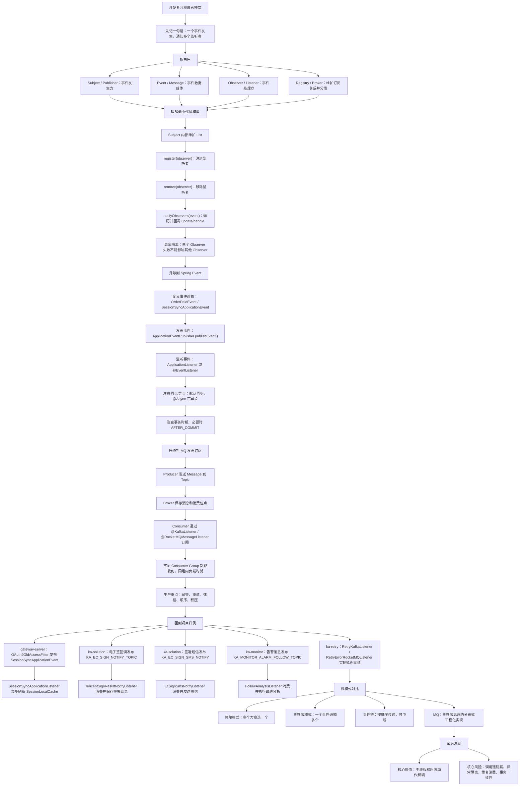
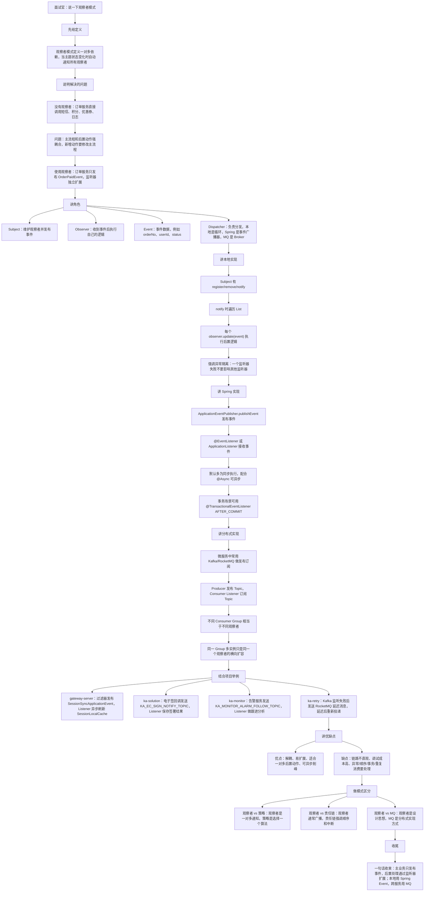

# Java 观察者模式知识总结

## 1. 它是什么

观察者模式的核心是：

> 一个对象发生变化时，自动通知依赖它的多个对象。

也可以换成 Java 后端更熟悉的表达：

```text
观察者模式 = 事件发布 + 事件监听 + 一对多通知
```

典型场景：

```text
订单支付成功
  -> 发短信
  -> 发优惠券
  -> 加积分
  -> 记录日志
  -> 通知外部系统
```

主流程只负责发布“支付成功”这个事件，后面的多个动作由不同监听器各自处理。这样支付逻辑不需要直接依赖短信、积分、优惠券等具体实现。

## 2. 标准角色

| 角色 | 说明 | Java/Spring 中的常见形态 |
|---|---|---|
| Subject / Observable | 被观察者、主题、事件源 | 事件发布器、业务服务、MQ Producer |
| Observer | 观察者、订阅者、监听器 | `ApplicationListener`、`@EventListener`、`@KafkaListener` |
| Event / Message | 被通知的数据载体 | `ApplicationEvent`、DTO、MQ 消息体 |
| Registry / Multicaster | 维护监听关系并负责分发 | Spring 事件广播器、Kafka/RocketMQ Broker |

标准关系：

```text
Observer 注册到 Subject
        ↓
Subject 状态变化
        ↓
Subject 创建 Event
        ↓
Subject 通知多个 Observer
        ↓
Observer 各自执行处理逻辑
```

## 3. 基础代码示例

```java
public interface Observer {
    void update(String message);
}
```

```java
public class UserObserver implements Observer {

    private final String name;

    public UserObserver(String name) {
        this.name = name;
    }

    @Override
    public void update(String message) {
        System.out.println(name + " 收到消息：" + message);
    }
}
```

```java
public class Subject {

    private final List<Observer> observers = new ArrayList<>();

    public void register(Observer observer) {
        observers.add(observer);
    }

    public void remove(Observer observer) {
        observers.remove(observer);
    }

    public void notifyObservers(String message) {
        for (Observer observer : observers) {
            try {
                observer.update(message);
            } catch (Exception e) {
                // 生产代码中不要让一个观察者失败影响后续观察者
                System.out.println("observer failed: " + e.getMessage());
            }
        }
    }
}
```

调用链：

```text
subject.register(userA)
subject.register(userB)
subject.register(userC)
        ↓
subject.notifyObservers("发布文章")
        ↓
userA.update()
userB.update()
userC.update()
```

## 4. 核心原理

观察者模式真正解耦的是“事件发生方”和“事件处理方”：

```text
没有观察者模式：

OrderService
  -> SmsService
  -> PointService
  -> CouponService
  -> LogService

问题：
新增一个后置动作，就要改 OrderService。
```

```text
使用观察者模式：

OrderService
  -> publish(OrderPaidEvent)

OrderPaidSmsListener
OrderPaidPointListener
OrderPaidCouponListener
OrderPaidLogListener

好处：
新增监听器，不需要改主业务流程。
```

所以它的本质不是“循环调用几个类”，而是：

```text
主流程只表达“发生了什么”
监听器自己决定“收到以后做什么”
```

## 5. JDK 自带 Observer 为什么不推荐

JDK 曾经提供过：

```java
java.util.Observer
java.util.Observable
```

但它们已经从 Java 9 开始被标记为废弃。实际项目里更常见的是：

```text
Spring ApplicationEvent
  -> 单体应用内部事件

@KafkaListener / @RocketMQMessageListener / @RabbitListener
  -> 分布式异步事件

自定义 Listener 接口
  -> 轻量本地扩展点
```

所以面试可以知道 JDK 有过这套 API，但不要把它作为现代 Java 项目的首选方案。

## 6. Spring Event 实现观察者模式

Spring 事件机制是观察者模式在 Spring 中的典型实现。

### 6.1 定义事件

```java
public class OrderPaidEvent {

    private final String orderNo;

    public OrderPaidEvent(String orderNo) {
        this.orderNo = orderNo;
    }

    public String getOrderNo() {
        return orderNo;
    }
}
```

### 6.2 发布事件

```java
@Service
public class OrderService {

    private final ApplicationEventPublisher publisher;

    public OrderService(ApplicationEventPublisher publisher) {
        this.publisher = publisher;
    }

    public void pay(String orderNo) {
        // 1. 支付主流程
        // 2. 发布支付成功事件
        publisher.publishEvent(new OrderPaidEvent(orderNo));
    }
}
```

### 6.3 监听事件

```java
@Component
public class SmsListener {

    @EventListener
    public void handle(OrderPaidEvent event) {
        // 发送短信
    }
}
```

也可以实现接口：

```java
@Component
public class SmsListener implements ApplicationListener<OrderPaidEvent> {

    @Override
    public void onApplicationEvent(OrderPaidEvent event) {
        // 发送短信
    }
}
```

Spring Event 调用链：

```text
业务方法执行成功
        ↓
ApplicationEventPublisher.publishEvent(event)
        ↓
Spring 找到匹配事件类型的 Listener
        ↓
调用 ApplicationListener.onApplicationEvent()
或 @EventListener 方法
        ↓
监听器执行后置业务
```

默认情况下，Spring 事件通常是同步调用；如果配合 `@Async` 或异步事件广播器，就可以变成异步执行。

## 7. MQ 实现分布式观察者模式

在微服务里，观察者模式经常不再是一个 JVM 内部的 `List<Observer>`，而是演化成：

```text
Producer 发布消息
        ↓
Kafka / RocketMQ / RabbitMQ
        ↓
Consumer 订阅 Topic
        ↓
消费者执行各自业务
```

它和本地观察者的对应关系：

| 观察者模式概念 | MQ 中的对应物 |
|---|---|
| Subject | Producer / 业务服务 |
| Event | Message / DTO |
| Observer | Consumer / Listener |
| Registry | Topic + Consumer Group |
| notifyObservers | Broker 投递消息 |

需要注意：

```text
同一个 Topic
  -> 不同 Consumer Group 通常都能收到消息
  -> 同一个 Consumer Group 内部通常是负载均衡消费
```

所以 MQ 是“观察者思想”的分布式实现，但它还额外带来了可靠投递、削峰、重试、消费位点、死信等工程问题。

## 8. 项目中哪里使用到了

本次在 `D:\ai-work-project` 下搜索了这些典型关键字：

```text
ApplicationEventPublisher
publishEvent
ApplicationListener
@EventListener
@KafkaListener
@RocketMQMessageListener
@RabbitListener
Observer / Observable
```

结论：项目里直接使用 `java.util.Observer` / `Observable` 的情况没有命中；观察者思想主要体现在 Spring 事件和 MQ Listener 中。

### 8.1 gateway-server：Spring 本地事件

命中位置：

```text
D:\ai-work-project\gateway-server\src\main\java\com\kyexpress\platform\edge\filter\OAuth2OldAccessFilter.java:105
D:\ai-work-project\gateway-server\src\main\java\com\kyexpress\platform\edge\event\SessionSyncApplicationEvent.java
D:\ai-work-project\gateway-server\src\main\java\com\kyexpress\platform\edge\event\SessionSyncApplicationListener.java:12
```

调用关系：

```text
OAuth2OldAccessFilter
  -> 校验 token / 解析 MyProfile
  -> 判断是 web 用户
  -> SpringUtils.publishEvent(new SessionSyncApplicationEvent(...))
  -> SessionSyncApplicationListener 监听事件
  -> @Async 异步执行 onApplicationEvent()
  -> SessionLocalCache.addProfileId(event.getSid())
```

这里是非常标准的 Spring 本地观察者模式：

| 角色 | 项目代码 |
|---|---|
| Subject / 发布方 | `OAuth2OldAccessFilter` |
| Event | `SessionSyncApplicationEvent` |
| Observer / 监听器 | `SessionSyncApplicationListener` |
| 后置动作 | 同步/刷新本地 Session 缓存 |

实际工作意义：

```text
过滤器主职责：
  认证、鉴权、设置上下文

Session 同步职责：
  交给事件监听器异步处理

好处：
  过滤器不需要直接依赖 SessionLocalCache 的同步细节
  主链路更轻
  后续如果增加其他登录后处理逻辑，可以继续增加 Listener
```

### 8.2 ka-solution：电子签回调通知

命中位置：

```text
D:\ai-work-project\ka-solution\ka-solution-provider\src\main\java\com\kyexpress\ka\solution\provider\service\common\ecsign\EcSignSupport.java:249
D:\ai-work-project\ka-solution\ka-solution-provider\src\main\java\com\kyexpress\ka\solution\provider\service\common\ecsign\impl\tencent\TencentSignService.java:337
D:\ai-work-project\ka-solution\ka-solution-provider\src\main\java\com\kyexpress\ka\solution\provider\service\common\ecsign\impl\letsign\LetSignService.java:396
D:\ai-work-project\ka-solution\ka-solution-provider\src\main\java\com\kyexpress\ka\solution\provider\listener\ecsign\TencentSignResultNotifyListener.java:61
```

调用关系：

```text
腾讯/法大大等电子签供应商回调
        ↓
TencentSignService / LetSignService 判断签署状态
        ↓
构造 EcSignNotifyData
        ↓
EcSignSupport.sendMessage()
        ↓
KafkaProducer.send(KA_EC_SIGN_NOTIFY_TOPIC, waybillNumber, message)
        ↓
TencentSignResultNotifyListener @KafkaListener
        ↓
根据 supplierType 找到对应 EcSignSupport
        ↓
supplierService.doSaveSignResult()
        ↓
必要时发送 KA_EC_SIGN_INFO_SYNC 同步消息
```

这里的观察者思想是：

```text
签署回调处理方只发布“签署完成/签署结果事件”
保存签署结果、同步签署信息由 Kafka Listener 异步消费
```

实际工作意义：

```text
供应商回调接口不被复杂后置处理拖慢
电子签结果保存逻辑可以集中在消费者中
多个供应商通过 supplierType 路由到不同 EcSignSupport 实现
失败时可以依靠 MQ 重试/补偿机制
```

### 8.3 ka-solution：电子签短信通知

命中位置：

```text
D:\ai-work-project\ka-solution\ka-solution-provider\src\main\java\com\kyexpress\ka\solution\provider\service\common\ecsign\EcSignSupport.java:319
D:\ai-work-project\ka-solution\ka-solution-provider\src\main\java\com\kyexpress\ka\solution\provider\listener\ecsign\EcSignSmsNotifyListener.java:53
```

调用关系：

```text
生成电子签链接
        ↓
EcSignSupport 组装 EcSignSmsNotifyData
        ↓
KafkaProducer.send(KA_EC_SIGN_SMS_NOTIFY, message)
        ↓
EcSignSmsNotifyListener @KafkaListener
        ↓
判断是否本人实名认证
        ↓
生成短链
        ↓
SysClient.sendSmsNotify()
        ↓
失败则调用 ecSignService.sendErrorNotify()
```

实际工作意义：

```text
生成签署链接和发送短信解耦
短信服务失败不会直接阻塞签署主流程
短信发送、短链生成、失败告警集中在 Listener 中
```

### 8.4 ka-solution：电子签报告文件延迟获取

命中位置：

```text
D:\ai-work-project\ka-solution\ka-solution-provider\src\main\java\com\kyexpress\ka\solution\provider\service\common\ecsign\impl\tencent\TencentSignService.java:958
D:\ai-work-project\ka-solution\ka-solution-provider\src\main\java\com\kyexpress\ka\solution\provider\listener\ecsign\TencentGetReportFileListener.java:49
```

调用关系：

```text
TencentSignService 创建出证报告任务
        ↓
构造 GetReportFileMessageDTO
        ↓
kyRocketMQProduceUtil.sendDelayMessage(EC_SIGN_REPORT_FILE_TAG, ...)
        ↓
TencentGetReportFileListener @RocketMQMessageListener
        ↓
调用 TencentSignClient.getReportFile()
        ↓
报告未生成：
  -> 未超时则继续发送延迟消息
  -> 超时则发送报告失败回调
报告已生成：
  -> ecSignService.uploadReportFile()
  -> 上传文件中心
  -> 发送报告成功/失败回调
```

这不是简单的同步观察者，而是“延迟消息 + 监听器 + 自我重投”的异步流程。

实际工作意义：

```text
第三方报告生成有延迟，不适合接口同步等待
用 RocketMQ 延迟消息轮询结果
Listener 既是观察者，也是补偿调度节点
需要重点关注总超时时间、幂等、重复上传、失败回调
```

### 8.5 ka-solution：网点信息监听

命中位置：

```text
D:\ai-work-project\ka-solution\ka-solution-provider\src\main\java\com\kyexpress\ka\solution\provider\controller\customized\cainiao\CaiNiaoController.java:72
D:\ai-work-project\ka-solution\ka-solution-provider\src\main\java\com\kyexpress\ka\solution\provider\listener\NodeInfoListener.java:58
```

调用关系：

```text
CaiNiaoController 接收网点信息请求
        ↓
KafkaProducer.sendMsg(KA_CONSUMER_NODE_INFO_TOPIC, messageId, request)
        ↓
NodeInfoListener @KafkaListener
        ↓
用 Redis 根据 messageId 做 10 分钟幂等
        ↓
push2SheIn()
        ↓
savePointInfo()
        ↓
保存符合条件的网点推送记录
```

实际工作意义：

```text
接口入口快速接收消息并返回
后置的客户侧推送和本地记录保存异步执行
Listener 中显式做了 messageId 幂等，说明 MQ 场景要默认考虑重复消费
```

### 8.6 ka-monitor：告警跟进和工单延迟上报

命中位置：

```text
D:\ai-work-project\ka-monitor\ka-monitor-provider\src\main\java\com\kyexpress\ka\monitor\provider\service\monitor\BizMonitorLogService.java:279
D:\ai-work-project\ka-monitor\ka-monitor-provider\src\main\java\com\kyexpress\ka\monitor\provider\service\workorder\alarm\FenDanErrorAlarmService.java:78
D:\ai-work-project\ka-monitor\ka-monitor-provider\src\main\java\com\kyexpress\ka\monitor\provider\listener\workorder\FollowAnalysisListener.java:55
D:\ai-work-project\ka-monitor\ka-monitor-provider\src\main\java\com\kyexpress\ka\monitor\provider\service\notify\workorder\FollowInfoService.java:237
D:\ai-work-project\ka-monitor\ka-monitor-provider\src\main\java\com\kyexpress\ka\monitor\provider\listener\workorder\DelayWorkOrderUploadMQListener.java:43
```

调用关系一：Kafka 告警跟进

```text
业务监控 / 分单异常 / 超时告警
        ↓
MonitorDefaultKafkaProducer.sendMsg(KA_MONITOR_ALARM_FOLLOW_TOPIC, key, message)
        ↓
FollowAnalysisListener @KafkaListener
        ↓
逐条调用 followInfoService.executeConsume(message)
        ↓
ack.acknowledge()
```

调用关系二：RocketMQ 延迟上报工单

```text
FollowInfoService 更新工单接口日志
        ↓
sendDelayMessage(KA_MONITOR_WORK_ORDER, KA_MONITOR_WORK_NUMBER_UPLOAD_TAG, ...)
        ↓
DelayWorkOrderUploadMQListener @RocketMQMessageListener
        ↓
反查 FollowInterfaceLog
        ↓
followInterfaceLogService.uploadWorkOrderMsg()
```

实际工作意义：

```text
监控告警产生方只负责发“告警/工单事件”
跟进分析、工单上报等动作由监听器消费
Kafka key 使用 bizCode + standardCode，代码注释说明是为了指定分区、防止并发乱序
RocketMQ 延迟消息用于稍后再上报，避免前置数据还没准备好
```

### 8.7 ka-retry：公共重试服务

命中位置：

```text
D:\ai-work-project\ka-retry\ka-retry-provider\src\main\java\com\kyexpress\ka\retry\provider\listener\RetryKafkaListener.java:81
D:\ai-work-project\ka-retry\ka-retry-provider\src\main\java\com\kyexpress\ka\retry\provider\listener\RetryKafkaListener.java:258
D:\ai-work-project\ka-retry\ka-retry-provider\src\main\java\com\kyexpress\ka\retry\provider\listener\RetryErrorRocketMQListener.java:39
```

调用关系：

```text
业务方发送 KA_RETRY_INFO_TOPIC
        ↓
RetryKafkaListener @KafkaListener
        ↓
解析 RetryMessageBO
        ↓
根据 bizCode 查询重试模板和配置
        ↓
StrategyFactory 选择推送策略
        ↓
执行 push()
        ↓
保存/更新 ES 重试记录
        ↓
失败则 sendDelayMessage(KA_RETRY_TOPIC, KA_RETRY_PUSH_TAG, ...)
        ↓
RetryErrorRocketMQListener @RocketMQMessageListener
        ↓
重新 KafkaProducer.send(message.getTopic(), message)
```

实际工作意义：

```text
这是一套“事件监听 + 策略模式 + 延迟重试”的组合
Kafka Listener 接收重试事件
RocketMQ Listener 负责延迟后重新投递
观察者模式解决解耦，策略模式解决不同目标类型怎么推送
```

### 8.8 ka-common：Rabbit Listener 基础设施

命中位置：

```text
D:\ai-work-project\ka-common\ka-common\src\main\java\com\kyexpress\ka\common\rabbitmq\RabbitQueueInitialization.java
```

它不是业务观察者，而是监听器基础设施：

```text
Spring Bean 初始化后
        ↓
RabbitQueueInitialization 扫描 Bean 上的 @RabbitListener / @RabbitListeners
        ↓
提取 queues
        ↓
afterSingletonsInstantiated()
        ↓
RabbitProducer.createQueue(queue)
```

实际工作意义：

```text
项目里如果新增 @RabbitListener 队列
这个组件会在容器启动后收集队列名并创建队列
它体现的是“监听器声明元数据扫描”，不是业务事件广播本身
```

### 8.9 需要避免误判的 Subscribe 命名

搜索中还出现了很多 `Subscribe` 相关类，例如路由订阅、回单订阅、接口订阅等。它们多数是业务领域名词：

```text
RouteSubscribe
ReceiptSubscribePush
InterfaceSubscribe
```

这些“订阅”不一定就是代码层面的观察者模式。判断是否属于观察者思想，关键看有没有：

```text
事件发布
  -> 订阅/监听注册
  -> 事件分发
  -> 多个处理方解耦执行
```

如果只是数据库里保存“客户订阅了某个物流轨迹推送”，那更像业务模型，不等同于设计模式里的 Observer。

## 9. 实际工作中怎么判断该不该用

适合使用观察者模式：

```text
一个业务动作完成后
  -> 后面有多个独立动作
  -> 这些动作可能不断新增
  -> 主流程不应该依赖所有后置服务
```

例如：

```text
支付成功后通知多个系统
电子签完成后保存结果、同步状态、发送通知
接口日志写入后做统计、告警、默认规则分析
网点信息变更后同步客户系统和本地表
```

不适合使用观察者模式：

```text
后置动作必须强一致成功
  -> 比如支付和扣库存必须在同一事务内严格成功

调用链必须非常直观
  -> 不希望隐藏执行逻辑

处理方之间有强顺序依赖
  -> A 必须完成后 B 才能执行，且失败要中断
```

这些场景可能更适合事务内直接调用、模板方法、责任链或显式工作流。

## 10. 生产注意事项

### 10.1 同步观察者异常隔离

本地同步通知时，不能让一个监听器失败影响后续监听器：

```java
for (Observer observer : observers) {
    try {
        observer.update(event);
    } catch (Exception e) {
        log.error("observer execute failed", e);
    }
}
```

### 10.2 异步事件要考虑事务时机

如果业务还没提交事务就发布事件，监听器可能读不到数据：

```text
事务中保存订单
        ↓
立刻发布事件
        ↓
监听器查询订单
        ↓
可能读不到未提交数据
```

解决思路：

```text
事务提交后发布
或使用 @TransactionalEventListener(phase = AFTER_COMMIT)
或通过 MQ 在事务后发送
```

### 10.3 MQ 监听要默认考虑重复消费

项目里的 `NodeInfoListener` 已经有类似处理：

```text
messageId
  -> Redis 查重
  -> 命中则直接 return
  -> 未命中则处理并写入短期缓存
```

MQ 观察者一定要考虑：

```text
幂等
重复消费
消费失败重试
死信/补偿
消息顺序
消息积压
消费组配置
```

### 10.4 Listener 里不要写无限重试

错误示例：

```text
消费失败
  -> 立即重试
  -> 失败
  -> 立即重试
  -> 打爆下游或 MQ
```

更好的方式：

```text
失败分类
  -> 临时异常：有限次数 + 延迟重试
  -> 参数错误：记录失败数据，不无限重试
  -> 下游不可用：告警 + 降速/熔断
```

### 10.5 Topic 和 Consumer Group 要设计清楚

```text
同一个 Topic + 不同 Group
  -> 多个业务方都能收到，相当于广播给多个观察者

同一个 Topic + 同一个 Group
  -> 多个实例分摊消费，相当于一个观察者的多实例扩容
```

不要把“多实例消费”误解成“多个观察者都执行”。

## 11. 和其他模式的区别

| 模式 | 核心目的 | 调用关系 |
|---|---|---|
| 观察者模式 | 一个事件通知多个处理方 | 一对多 |
| 策略模式 | 从多个算法中选择一个执行 | 一对一 |
| 责任链模式 | 请求沿链路逐个处理，可中断 | 链式传递 |
| 代理模式 | 控制访问或增强目标调用 | 通常一对一 |
| 模板方法 | 父类固定流程，子类实现变化步骤 | 继承复用流程 |

最容易混的是观察者和责任链：

```text
观察者：
事件发生
  -> Listener A
  -> Listener B
  -> Listener C

通常每个监听器相对独立。
```

```text
责任链：
请求
  -> Handler A
  -> Handler B
  -> Handler C

强调顺序、传递、中断。
```

## 12. 复习的思路



复习时可以按这条线走：

```text
一句话定义
  -> 四个角色
  -> 本地 List<Observer> 模型
  -> Spring Event
  -> Kafka/RocketMQ
  -> 项目代码落点
  -> 生产注意事项
  -> 和策略/责任链/MQ 区分
```

## 13. 面试讲解思路



面试回答模板：

```text
观察者模式是一种行为型设计模式，用来处理一个对象状态变化后通知多个依赖对象的场景。

它的核心角色有 Subject、Observer 和 Event。Subject 负责发布事件，Observer 负责监听事件并处理，Event 负责承载数据。

比如订单支付成功后，主流程不应该直接耦合短信、积分、优惠券、日志等服务，而是发布 OrderPaidEvent。短信监听器、积分监听器、优惠券监听器分别订阅这个事件并执行自己的逻辑。

在 Spring 中可以用 ApplicationEventPublisher 加 @EventListener 或 ApplicationListener 实现；在微服务中，Kafka、RocketMQ 这种 Topic + Consumer Group 的模型也可以看作观察者思想的分布式实现。

它的优点是解耦和易扩展，缺点是调用链不直观，并且异步/MQ 场景要考虑幂等、重复消费、异常重试、事务提交时机和消息积压。
```

结合当前项目可以这样说：

```text
我们项目里 gateway-server 的 OAuth2OldAccessFilter 在 web 用户请求通过后，会发布 SessionSyncApplicationEvent，SessionSyncApplicationListener 通过 ApplicationListener 异步刷新 SessionLocalCache，这是本地 Spring Event 的观察者实现。

另外 ka-solution、ka-monitor、ka-retry 里大量 @KafkaListener 和 @RocketMQMessageListener 是分布式观察者思想。比如电子签回调后，EcSignSupport 发送 KA_EC_SIGN_NOTIFY_TOPIC，TencentSignResultNotifyListener 消费后保存签署结果；这样供应商回调主流程和后置保存/同步逻辑解耦。
```

## 14. 一句话总结

```text
观察者模式 = 事件发生方只发布事件，多个监听方各自订阅并处理。
```

在实际 Java 后端里：

```text
单体内部：
  Spring ApplicationEvent / @EventListener

微服务之间：
  Kafka / RocketMQ / RabbitMQ

写代码时重点：
  解耦主流程和后置动作
  处理异常隔离、幂等、事务时机、重试补偿
```

## 15. 参考资料

- Oracle Java `Observer` API 文档：<https://docs.oracle.com/en/java/javase/26/docs/api/java.base/java/util/Observer.html>
- Oracle Java `Observable` API 文档：<https://docs.oracle.com/en/java/javase/24/docs/api/java.base/java/util/Observable.html>
- Spring Framework 官方文档：ApplicationContext events：<https://docs.spring.io/spring-framework/reference/core/beans/context-introduction.html>
- Spring `ApplicationEventPublisher` API：<https://docs.spring.io/spring-framework/docs/current/javadoc-api/org/springframework/context/ApplicationEventPublisher.html>
- JavaGuide 设计模式总结：<https://interview.javaguide.cn/system-design/design-pattern.html>
- JavaGuide IO 设计模式总结：<https://javaguide.cn/java/io/io-design-patterns.html>
