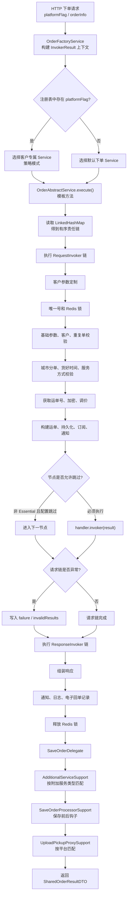
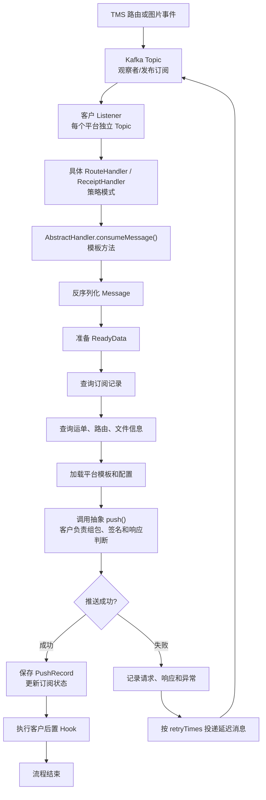
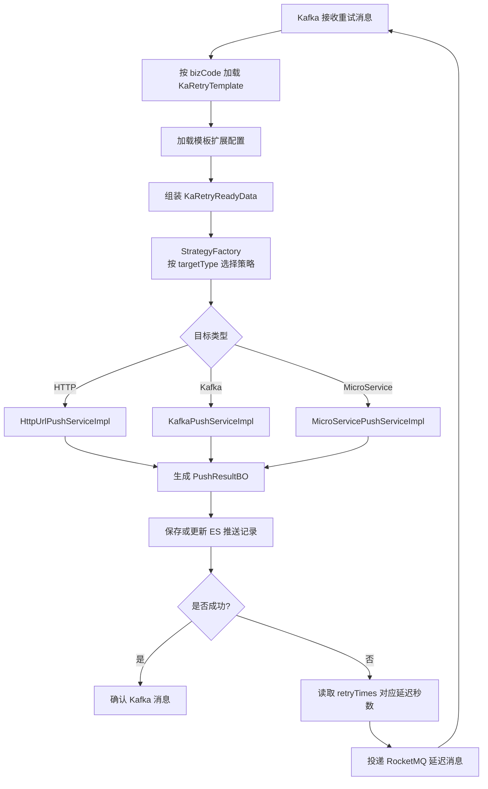
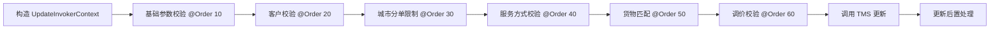
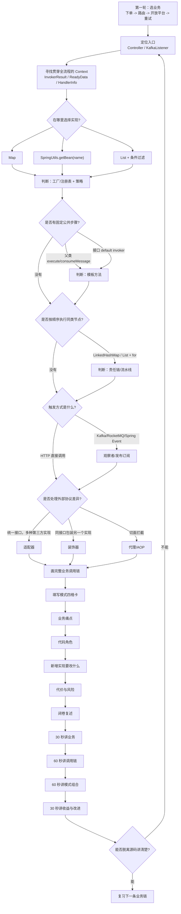

# Java 项目设计模式实战总结

> 分析范围：`D:\ai-work-project` 下 13 个 Java 项目，约 5,587 个 Java 文件。  
> 分析日期：2026-08-20。  
> 分析方法：从业务入口出发，沿“入口 → 上下文 → 实现选择 → 公共骨架 → 扩展点 → 异常与重试”调用链核验，避免仅凭类名判断设计模式。

## 1. 这篇笔记解决什么问题

单独记住工厂、策略、模板方法、责任链的定义并不困难，真正容易混淆的是：

```text
同一个业务为什么同时使用多个设计模式？
每个模式在调用链中分别解决什么问题？
面试时怎样从业务背景自然讲到设计模式，而不是堆概念？
```

这批项目最有代表性的组合是：

```text
工厂决定“选谁”
策略决定“怎么做”
模板方法决定“哪些步骤不能乱”
责任链决定“拆成哪些步骤做”
Context Object 决定“步骤之间怎样传数据”
观察者决定“什么时候异步触发”
适配器决定“如何兼容外部协议”
装饰器和 AOP 决定“如何无侵入增强”
```

相关基础笔记：

- [[Java工厂模式]]
- [[Java模板方法模式]]
- [[Java责任链模式]]
- [[Java适配器模式]]
- [[Java观察者模式]]
- [[Java装饰器模式]]
- [[Java代理模式]]
- [[Java单例模式]]

---

## 2. 总体模式清单

| 模式 | 主要项目 | 典型用途 |
|---|---|---|
| 策略模式 | ka-order、ka-retry、ka-monitor、ka-solution、ka-waybil-router、openapi-router | 按客户、平台、推送类型、签名方式选择实现 |
| 工厂/注册表 | ka-order、ka-retry、ka-monitor、openapi-router | 收集策略并按业务标识查找实现 |
| 模板方法 | ka-order、ka-waybil-router、openapi-router、openapi-adapter | 固定准备、执行、收尾流程，子类实现差异 |
| 责任链/流水线 | ka-order、ka-solution、openapi-router | 参数校验、数据加工、远程调用、响应处理 |
| 适配器 | openapi-adapter、openapi-router | 统一第三方参数、签名、协议和返回值 |
| 观察者/发布订阅 | gateway-server、ka-monitor、ka-order、ka-retry、ka-solution、ka-waybil-router | Spring Event、Kafka、RocketMQ 消费 |
| 装饰器 | openapi-router | 包装默认调用器，在委托前转换参数或行为 |
| 代理/AOP | gateway-server、ka-order、ka-solution、ka-waybil-router、openapi-router | 缓存、日志、执行控制、动态数据源 |
| Builder | ka-common、ka-order、ka-solution、ka-waybil-router 等 | 构造复杂上下文和 DTO |
| 单例 | ka-monitor、ka-solution | 无状态连接策略、签名工具 |
| 回调/命令式扩展点 | ka-common、ka-operation、ka-solution | QLExpress Operator、ExcelImportProcessor、JobHandler |
| Context Object | ka-order、ka-retry、openapi-router、ka-solution | 在流水线节点之间共享中间状态 |
| Delegate/插件集合 | ka-order | 分派保存后处理、附加服务等可选能力 |

### 2.1 容易误判的类名

| 类名或命名 | 实际结论 |
|---|---|
| `ResponseBuilder` | 静态工厂，不是逐步构造对象的经典 Builder |
| `BaiLiOrderConfig.getInstance()` | 每次返回 `new BaiLiOrderConfig()`，不是单例 |
| `ObjectFactory` | 多数是 JAXB/WebService 生成代码，不是手工业务工厂 |
| `*Template` 实体类 | 表示业务模板数据，不等于模板方法模式 |
| `WaybillCompositeResponse` | DTO 命名，不等于组合模式 |

暂未发现完整、明确的 State、Visitor、Mediator、Memento、Flyweight、Prototype 业务实现。状态字段、状态枚举和 `if/switch` 本身不能直接算状态模式。

---

## 3. 各项目模式覆盖

| 项目               | 识别出的模式                                                             |
| ---------------- | ------------------------------------------------------------------ |
| gateway-server   | AuthenticationProvider 策略、Spring Event 观察者、缓存 AOP 代理               |
| ka-basic         | Controller-Service-Mapper 分层、Repository/Mapper、依赖注入；未发现强业务型 GoF 组合 |
| ka-common        | Lombok Builder、Bean Validation 策略、QLExpress Operator 扩展、静态工厂       |
| ka-consumer      | MQ Listener 观察者/回调                                                 |
| ka-monitor       | MQ 观察者、工单策略+工厂、异常封装模板、连接策略单例                                       |
| ka-operation     | ExcelImportProcessor 回调、定时任务 Callback、MVC/Mapper                   |
| ka-order         | 工厂注册表、客户策略、模板方法、双向责任链、Context、Delegate、条件插件、Builder、MQ 观察者、AOP     |
| ka-query         | Validator 策略、公共查询基类、Builder、上下文校验                                  |
| ka-retry         | MQ 观察者、策略工厂、HTTP/Kafka/微服务策略、Retry、Context                         |
| ka-solution      | 延迟原因策略、运单更新责任链、默认方法模板、MQ 观察者、AOP、Builder、单例、Excel 回调               |
| ka-waybil-router | Kafka 观察者、客户路由/回单策略、模板方法、重试、节点分支策略、Builder、数据源 AOP                 |
| openapi-adapter  | 大规模适配器体系、模板方法、监控包装                                                 |
| openapi-router   | 请求/响应责任链、第三方适配器、签名策略、登录工厂、模板方法、装饰器、缓存 AOP                          |

---

## 4. 下单业务：最完整的模式组合

### 4.1 核心源码

- `ka-order-provider/.../order/OrderFactoryService.java`
- `ka-order-provider/.../order/OrderAbstractService.java`
- `ka-order-provider/.../order/invoker/OrderInvoker.java`
- `ka-order-provider/.../order/invoker/request/RequestOrderInvoker.java`
- `ka-order-provider/.../order/invoker/response/ResponseOrderInvoker.java`
- `ka-order-provider/.../order/save/SaveOrderDelegate.java`
- `ka-order-provider/.../order/save/SaveOrderProcessorSupport.java`
- `ka-order-provider/.../order/AdditionalServiceSupport.java`

### 4.2 模式角色映射

| 设计角色   | 项目实现                                                                              |
| ------ | --------------------------------------------------------------------------------- |
| 工厂/注册表 | `OrderFactoryService`                                                             |
| 策略抽象   | `SupportPartOrderAbstractService`、`NoSupportPartAbstractService`                  |
| 具体客户策略 | 各 `customeize/*/*Service`                                                         |
| 模板     | `OrderAbstractService.execute()`                                                  |
| 请求责任链  | `RequestOrderInvoker` 的 27 个直接实现                                                  |
| 响应责任链  | `ResponseOrderInvoker` 的 7 个直接实现                                                  |
| 上下文    | `InvokerResult`                                                                   |
| 条件插件   | `AdditionalServiceSupport`、`SaveOrderProcessorSupport`、`UploadPickupProxySupport` |
| 委托者    | `SaveOrderDelegate`                                                               |

### 4.3 启动阶段

`OrderFactoryService` 实现 `ApplicationRunner`，服务启动后主要完成两件事：

```text
第一件事：注册客户策略
Spring 容器
  -> getBeansOfType(NoSupportPartAbstractService)
  -> getBeansOfType(SupportPartOrderAbstractService)
  -> 调用每个 Service 的 platformFlag()
  -> 建立 platformFlag -> Service 注册表

第二件事：组装责任链
按固定顺序收集 OrderInvoker
  -> 放入 LinkedHashMap
  -> 注入每个客户 Service
  -> 客户 Service 在 configInit() 中增删或替换节点
```

这不是单纯的工厂，而是：

```text
策略注册表 + 默认责任链装配器 + 客户责任链配置入口
```

### 4.4 运行流程



### 4.5 为什么要组合这些模式

#### 工厂 + 策略

解决客户越来越多时的选择问题：

```text
不使用：Controller 中不断增加 if (JD) / else if (CAINIAO)
使用后：platformFlag -> 注册表 -> 客户 Service
```

#### 策略 + 模板方法

策略允许不同客户实现不同逻辑；模板方法保证所有客户都遵守：

```text
请求链
-> 统一异常转换
-> 响应链
-> 返回结果
```

客户不能随意漏掉公共收尾步骤。

#### 模板方法 + 责任链

模板方法负责“大流程”，责任链负责“小步骤”：

```text
模板方法：先请求链，再响应链
责任链：参数校验 -> 锁 -> 查重 -> 运单号 -> 保存 -> 通知
```

#### 责任链 + Context Object

所有节点读写同一个 `InvokerResult`：

```text
输入请求
校验结果
有效订单列表
运单信息
成功/失败结果
异常信息
```

避免把大量参数传给每一个 Invoker。

#### 插件集合 + Delegate

保存后的客户扩展不需要继续扩大主责任链：

```text
SaveOrderDelegate
  -> 遍历 SaveOrderProcessorSupport
  -> 插件自己判断 condition
  -> condition 为 true 才执行 hook
```

### 4.6 组合后的优点

1. 新增客户通常以新增策略类和少量链路配置为主。
2. 公共流程集中在模板中，客户代码只维护差异。
3. 每个责任链节点职责单一，易于单测和故障定位。
4. 可以按客户增删、替换 Invoker，不必复制完整下单流程。
5. 请求链失败后仍执行响应链，有利于统一响应、日志和解锁。
6. 插件异常可以局部捕获，减少对主下单结果的影响。

---

## 5. 路由与回单推送：观察者 + 策略 + 模板 + 重试

### 5.1 核心源码

- `ka-waybill-router-provider/.../handler/route/RouteHandler.java`
- `ka-waybill-router-provider/.../handler/route/AbstractRouteHandler.java`
- `ka-waybill-router-provider/.../handler/receipt/ReceiptHandler.java`
- `ka-waybill-router-provider/.../handler/receipt/AbstractReceiptHandler.java`
- 各客户 `*RouteHandler`、`*ReceiptHandler`

### 5.2 角色映射

| 设计角色 | 项目实现 |
|---|---|
| 事件源 | TMS 路由、回单、签收图片消息 |
| 观察者入口 | `@KafkaListener` |
| 策略抽象 | `RouteHandler`、`ReceiptHandler` |
| 模板方法 | `AbstractRouteHandler.consumeMessage()`、`AbstractReceiptHandler.consumeMessage()` |
| 具体策略 | 各客户 Handler 的 `push()` |
| Context | `RouteReadyData`、`ReceiptReadyData` |
| Retry | `TryAgainUtil` + 延迟消息 |

### 5.3 调用流程



### 5.4 组合优点

1. Kafka 将 TMS 主业务和客户推送速度解耦。
2. 每个客户 Handler 是独立策略，故障相互隔离。
3. 抽象基类统一数据准备、结果记录和失败重试。
4. 客户实现只关心参数、签名、URL 和成功条件。
5. 重试规则配置化，避免每个客户重复实现延迟队列。

---

## 6. 开放平台转发：责任链 + 适配器 + 模板 + 策略 + 装饰器

### 6.1 核心源码

- `openapi-router-provider/.../invoker/InvokerFactory.java`
- `openapi-router-provider/.../adapter/BaseInvokerHandler.java`
- `openapi-router-provider/.../handler/ThirdInvokerHandler.java`
- `openapi-router-provider/.../signhandler/ISignHander.java`
- `openapi-adapter-router-core/.../inside/adapter/*`
- `openapi-adapter-router-core/.../outside/adapter/*`

### 6.2 模式角色

| 设计角色 | 项目实现 |
|---|---|
| 请求责任链 | `requestInvokerList` |
| 响应责任链 | `responseInvokerList` |
| 上下文 | `RouterInfo`、`HandlerInfo` |
| 适配器抽象 | `InvokerHandler`、`ThirdInvokerHandler` |
| 模板方法 | `BaseInvokerHandler.execute()` |
| 前置 Hook | `beforeExecute()` |
| 公共远程调用 | `executeRemoteRequest()` |
| 后置 Hook | `afterExecute()` |
| 签名策略 | `ISignHander` 的具体实现 |
| 装饰器 | 包装 `DefaultInvoker` 的 Handler |

### 6.3 调用流程

```mermaid
flowchart LR
    A["外部 API 请求"] --> B["RequestInvoker 责任链"]
    B --> B1["初始化上下文"]
    B1 --> B2["校验请求头、加载用户"]
    B2 --> B3["选择 ISignHander 签名策略"]
    B3 --> B4["参数转换和校验"]

    B4 --> C["根据接口配置的 Bean 名称<br/>选择第三方适配器"]
    C --> D["BaseInvokerHandler.execute()<br/>模板方法"]

    D --> D1["initHandlerInfo"]
    D1 --> D2["beforeExecute<br/>请求参数和签名适配"]
    D2 --> D3["executeRemoteRequest<br/>统一 HTTP 调用"]
    D3 --> D4["afterExecute<br/>第三方响应适配"]

    D4 --> E["ResponseInvoker 责任链"]
    E --> E1["响应字段转换"]
    E1 --> E2["统一响应格式"]
    E2 --> E3["写回客户端"]
    E3 --> E4["保存调用日志"]

    C -. "部分旧实现" .-> F["装饰 DefaultInvoker<br/>修改参数后继续委托"]
```



### 6.4 组合优点

1. 责任链处理网关公共步骤，适配器处理外部协议差异。
2. 模板方法统一适配器生命周期，避免遗漏公共远程调用。
3. 签名策略与调用适配器分离，可以独立组合和测试。
4. 装饰器只改变局部参数或 URL，不必复制默认 HTTP 调用器。
5. 新接第三方系统时，核心路由过程保持稳定。

---

## 7. 公共重试：观察者 + 工厂 + 策略 + Retry

### 7.1 角色映射

| 设计角色 | 项目实现 |
|---|---|
| 观察者 | `RetryKafkaListener` |
| Context | `KaRetryReadyData` |
| 工厂 | `StrategyFactory` |
| 策略抽象 | `PushStrategyService` |
| 具体策略 | HTTP、Kafka、MicroService 三种实现 |
| Retry | `retryTimes` + RocketMQ 延迟消息 |

### 7.2 调用流程



### 7.3 组合优点

1. 重试调度与具体推送方式解耦。
2. 新增推送介质只需新增 `PushStrategyService` 实现。
3. 重试次数、退避时间和业务编码通过模板配置。
4. 统一记录请求、响应、异常、耗时和重试次数。

---

## 8. 运单更新：有序责任链 + 节点模板

### 8.1 核心角色

| 设计角色 | 项目实现 |
|---|---|
| 链执行器 | `WaybillUpdateService.updateYdByCondition()` |
| Handler | `UpdateValidInvoker` |
| Context | `UpdateInvokerContext` |
| 节点模板 | `UpdateValidInvoker.invoker()` 默认方法 |
| 顺序 | `@Order(10)` 到 `@Order(60)` |

### 8.2 流程



每个节点内部遵循：

```text
invoker(context)
  -> validate(context)
  -> 校验失败：返回 InvalidResult，责任链短路
  -> 校验成功：afterBizHandle(context)
  -> 返回 null，继续下一个节点
```

这里的接口默认方法相当于一个轻量级模板方法。

---

## 9. 监控工单：工厂 + 策略 + 异常模板

```text
AlarmFollowController
  -> 根据告警类型确定策略名
  -> WorkOrderStrategyFactory.getByStrategyName()
  -> AbstractWorkOrderStrategyHandle.alarmNoty()
  -> 统一 try/catch 和失败 ResponseData
  -> 具体策略 alarm()
```

目前主要有：

- `BizTimeOutAlarmService`
- `FenDanErrorAlarmService`

这组代码较小，但很适合说明“工厂负责查找策略，抽象父类负责统一异常边界”。

---

## 10. 其他模式证据

### 10.1 观察者模式

典型实现：

```text
SessionSyncApplicationListener
  implements ApplicationListener<SessionSyncApplicationEvent>
  -> 收到事件后更新 SessionLocalCache
```

Kafka、RocketMQ Listener 属于工程化的发布订阅/观察者形式：

```text
生产方只关心 Topic
消费者只关心自己订阅的事件
生产方和消费者不直接依赖
```

### 10.2 AOP 代理模式

扫描到的主要切面包括：

- `ServiceCacheAspect`：缓存查询结果。
- `ExecutionControlAspect`：下单组件执行控制。
- `CustomLogAspect`：统一日志。
- `DataSourceAspect`：动态数据源切换。
- `RouterCacheAspect`：路由缓存。

AOP 的本质流程：

```text
调用代理对象
  -> Around Advice
  -> 执行缓存/日志/数据源逻辑
  -> joinPoint.proceed()
  -> 返回原方法结果
```

### 10.3 单例模式

明确的单例包括：

```text
CustomConnectionKeepAliveStrategy.INSTANCE
CornexSignUtils.SIGN_UTILS + getInstance()
```

它们都是无状态或近似无状态工具，避免重复创建对象。

### 10.4 Builder 模式

项目中大量使用 Lombok `@Builder`，常用于：

```text
InvokerResult.builder()
PushResult.builder()
InvalidResult.builder()
```

适合字段多、可选字段多、构造过程需要可读性的对象。

### 10.5 Operator 和回调扩展点

`ka-common` 中的 QLExpress Operator，例如：

- `EqualsOperator`
- `BetweenOperator`
- `PlusDaysOperator`
- `MinusHoursOperator`

它们属于命令/策略式扩展点：表达式引擎在运行期选择 Operator，并调用统一的 `executeInner()`。

`ExcelImportProcessor`、`JobHandler` 更接近框架回调：框架控制流程，业务类只实现回调方法。

---

## 11. 模式组合的统一理解

| 变化维度 | 对应模式 | 项目示例 |
|---|---|---|
| 根据条件选择一个实现 | 工厂 + 策略 | platformFlag 选择客户 Service |
| 主流程稳定、部分步骤变化 | 模板方法 | 下单、路由、回单推送 |
| 处理步骤数量和顺序变化 | 责任链 | 下单 Invoker、运单更新 Validator |
| 外部接口协议变化 | 适配器 | openapi-adapter |
| 触发时机和消费者变化 | 观察者 | Kafka/RocketMQ/Spring Event |
| 在原实现外增加能力 | 装饰器/AOP | 参数包装、缓存、日志、监控 |
| 多节点共享中间状态 | Context Object | InvokerResult、ReadyData |
| 可选功能按条件参与 | 插件集合 | AdditionalServiceSupport |

### 11.1 最重要的组合原则

不要用一个模式解决所有变化。

```text
选择变化 -> 工厂/策略
步骤变化 -> 责任链
流程骨架变化 -> 模板方法
协议变化 -> 适配器
触发变化 -> 观察者
横切能力变化 -> 装饰器/AOP
```

这些变化维度相互独立，所以同一条业务链路同时出现多个模式是合理的。

---

## 12. 当前实现的风险与改进方向

### 12.1 字符串匹配策略 Bean

`StrategyFactory`、`WorkOrderStrategyFactory` 使用 Bean 名称 `contains` 匹配：

```text
风险：
strategyA 与 strategyAB 可能误匹配
策略不存在时可能返回 null
重命名类或 Bean 后运行期才报错
```

建议：

```java
public interface NamedStrategy {
    String strategyKey();
}
```

启动时建立精确映射，并校验 key 重复。

### 12.2 责任链顺序隐式

当前有两种顺序来源：

```text
ka-order：LinkedHashMap 手工装配
ka-solution：Spring List + @Order
```

建议增加：

1. 启动时打印完整链路。
2. 链路顺序单元测试。
3. 重复 Order 值校验。
4. 必须节点缺失校验。

### 12.3 插件自动注入的副作用

新增一个 Spring Bean 后可能自动进入 `List<Support>`，因此插件必须拥有明确的：

```text
support()
condition()
strategyKey()
platformFlag()
```

否则新 Bean 可能意外参与所有业务。

### 12.4 抽象基类过大

`AbstractRouteHandler`、`AbstractReceiptHandler` 同时承担：

```text
数据查询
上下文构建
客户推送
记录落库
Redis
ES
重试
```

可以进一步拆成：

```text
ReadyDataLoader
CustomerPusher
PushRecordRepository
RetryScheduler
PushLifecycleTemplate
```

### 12.5 Adapter 类数量膨胀

当适配器达到数百个时，应优先识别协议族：

```text
JSON + MD5
FORM + 时间戳签名
文件上传
OAuth
回调验签
```

把公共协议步骤组合成组件，客户适配器只提供配置和少量 Hook。

---

## 13. 复习流程

复习时不要先背 23 种模式，应该从一条真实业务链反推设计模式。



### 13.1 推荐复习顺序

1. `ka-order`：模式最完整，先掌握主案例。
2. `ka-waybil-router`：理解事件驱动、策略和模板。
3. `openapi-router/openapi-adapter`：理解责任链和适配器。
4. `ka-retry`：理解工厂、策略和延迟重试。
5. `ka-solution` 运单更新：理解有序责任链。
6. 最后补 AOP、Builder、单例和框架回调。

### 13.2 每个业务必须回答的问题

```text
1. 业务入口在哪里？
2. 谁保存上下文？
3. 谁选择具体实现？
4. 哪些步骤固定？
5. 哪些步骤可以插拔？
6. 异常在哪里统一处理？
7. 失败是否重试？
8. 新增一种客户或协议需要改哪里？
9. 当前设计的隐患是什么？
10. 如果重构，先改哪一点？
```

---

## 14. 面试讲解流程

```mermaid
flowchart TD
    A["0-20 秒：业务背景"] --> A1["KA 平台对接大量客户和第三方系统<br/>流程相似，参数、签名、校验和响应差异大"]

    A1 --> B["20-40 秒：核心矛盾"]
    B --> B1["不能在 Controller 堆客户 if/else"]
    B1 --> B2["公共流程必须保持一致"]
    B2 --> B3["新增客户不能影响存量客户"]

    B3 --> C["40-90 秒：先讲调用链"]
    C --> C1["工厂按 platformFlag 选择策略"]
    C1 --> C2["抽象 Service 执行固定模板"]
    C2 --> C3["RequestInvoker 责任链逐项处理"]
    C3 --> C4["ResponseInvoker 统一收尾"]
    C4 --> C5["Context 在节点之间传递状态"]

    C5 --> D["90-140 秒：再给模式命名"]
    D --> D1["工厂：管理和选择策略"]
    D1 --> D2["策略：隔离不同客户实现"]
    D2 --> D3["模板：固定主流程"]
    D3 --> D4["责任链：拆分校验、加工、保存和响应"]
    D4 --> D5["插件：处理可选附加能力"]

    D5 --> E["140-170 秒：讲收益"]
    E --> E1["新增客户以新增类和配置为主"]
    E1 --> E2["节点可独立测试、替换和跳过"]
    E2 --> E3["异常、日志、解锁和响应保持一致"]

    E3 --> F["170-200 秒：主动讲不足"]
    F --> F1["字符串 Bean 匹配脆弱"]
    F1 --> F2["责任链顺序需要测试"]
    F2 --> F3["抽象基类可能过大"]

    F3 --> G["200-230 秒：给出改进"]
    G --> G1["增加显式 strategyKey"]
    G1 --> G2["启动时校验 key 和链路顺序"]
    G2 --> G3["拆分准备、推送、记录和重试组件"]

    G3 --> H["结尾总结"]
    H --> H1["把选择、差异、流程、步骤和协议<br/>五个变化维度分别隔离"]
```



### 14.1 三分钟下单案例话术

> 我们的下单业务需要支持大量不同平台。整体下单步骤相似，但每个平台在参数处理、校验、保存和响应格式上都有差异。如果直接写在 Controller 中，会形成大量客户分支，而且新增客户时容易影响存量逻辑。
>
> 系统启动时，`OrderFactoryService` 会从 Spring 容器收集所有客户 Service，按 `platformFlag` 建立策略注册表，同时组装有序的 RequestInvoker 和 ResponseInvoker 链。请求到达后，工厂先选择客户策略，再进入 `OrderAbstractService.execute()` 这个模板方法。
>
> 模板内部先执行请求责任链，链路包含参数定制、加锁、客户校验、重复单校验、运单号获取、保存和通知等步骤，并使用 `InvokerResult` 在各节点间传递上下文。即使请求链异常，响应链仍会继续执行，用来完成统一响应、日志和解锁。保存阶段又通过插件集合处理附加服务和客户后置逻辑。
>
> 这里组合了工厂、策略、模板方法、责任链和 Context Object。它们分别解决实现选择、客户差异、流程约束、步骤拆分和状态传递问题。优点是新增客户通常只需要新增策略类和调整少量链路配置，不需要修改公共主流程。
>
> 当前不足是部分策略使用字符串 Bean 名匹配，责任链顺序也比较隐式。可以增加显式 `strategyKey`、启动期冲突校验和链路顺序测试，进一步降低运行时风险。

### 14.2 面试时不要这样讲

```text
错误方式：
我们用了工厂模式、策略模式、模板模式、责任链模式……

问题：
只报模式名称，没有业务痛点、调用链和代码角色。
```

正确顺序应该是：

```text
业务背景
-> 原始问题
-> 完整调用链
-> 每个模式对应哪个角色
-> 组合带来的收益
-> 当前不足
-> 可落地的改进
```

---

## 15. 一页速记

```text
下单：
OrderFactoryService
  -> platformFlag 策略注册表
  -> OrderAbstractService 模板
  -> RequestInvoker 责任链
  -> InvokerResult Context
  -> ResponseInvoker 责任链
  -> SaveOrderDelegate 插件

路由/回单：
Kafka 观察者
  -> 客户 Handler 策略
  -> AbstractHandler 模板
  -> ReadyData Context
  -> push() 客户适配
  -> 记录 + Retry

开放平台：
请求责任链
  -> 签名策略
  -> 第三方适配器
  -> before/remote/after 模板
  -> 响应责任链

重试：
Kafka Listener
  -> 加载重试模板
  -> StrategyFactory
  -> HTTP/Kafka/MicroService 策略
  -> 失败投递延迟消息

面试主线：
背景 -> 痛点 -> 调用链 -> 模式角色 -> 收益 -> 不足 -> 改进
```
